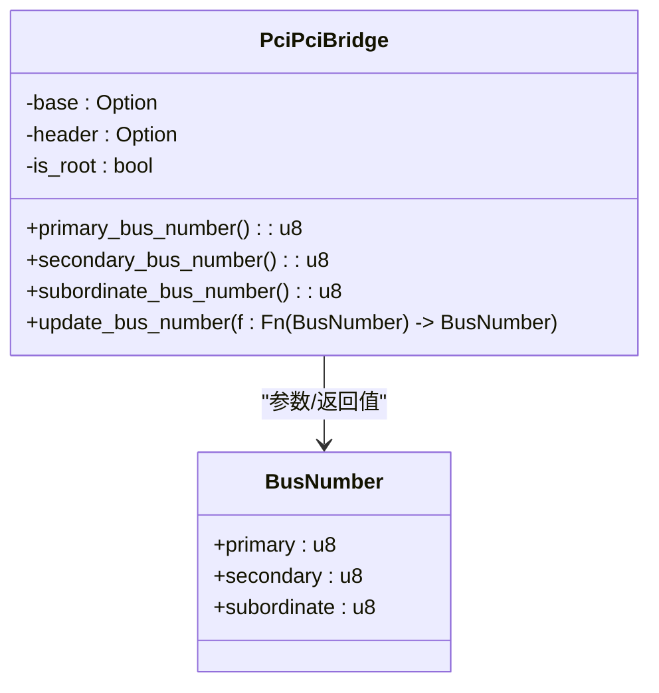
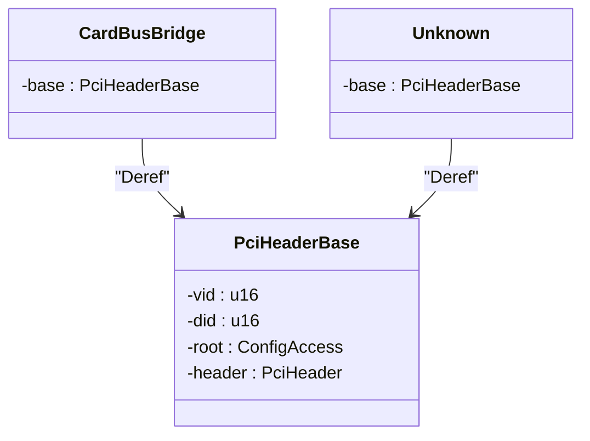

# config子模块详解

<cite>
**Referenced Files in This Document**
- [mod.rs](file://src/types/config/mod.rs)
- [endpoint.rs](file://src/types/config/endpoint.rs)
- [pci_bridge.rs](file://src/types/config/pci_bridge.rs)
- [card_bridge.rs](file://src/types/config/card_bridge.rs)
- [unknown.rs](file://src/types/config/unknown.rs)
</cite>

## 目录
1. [PciHeaderBase结构体与设备初始化](#pcihdrbase结构体与设备初始化)
2. [PciConfigSpace枚举与多态分发](#pciconfigspace枚举与多态分发)
3. [设备类型变体详解](#设备类型变体详解)
4. [RevisionAndClass辅助结构体](#revisionandclass辅助结构体)
5. [Deref/DerefMut在字段访问中的应用](#deref-derefmut在字段访问中的应用)
6. [Unknown类型的处理与调试指南](#unknown类型的处理与调试指南)
7. [Debug实现中的格式化输出技术](#debug实现中的格式化输出技术)

## PciHeaderBase结构体与设备初始化

`PciHeaderBase`是PCIe设备头部解析的核心基础结构体，封装了对PCI配置空间的底层访问。该结构体通过其`new`构造函数实现设备的初始化和有效性验证。

在初始化过程中，系统首先通过`PcieController`获取针对特定PCI地址的`ConfigAccess`访问代理实例，该代理提供了安全的寄存器读写接口。随后，系统创建`PciHeader`实例并读取设备的厂商ID（VID）和设备ID（DID）。关键的安全检查在于对VID值的验证：当VID为0xFFFF时，表明该PCI插槽为空或设备不可访问，此时构造函数返回`None`，有效过滤了无效设备，防止后续操作导致系统异常。

该结构体还封装了对标准PCI头部通用字段的访问方法，包括命令寄存器、状态寄存器、中断引脚等，并通过`update_command`高阶函数提供原子性的命令寄存器修改能力。

**Section sources**
- [mod.rs](file://src/types/config/mod.rs#L38-L116)

## PciConfigSpace枚举与多态分发

`PciConfigSpace`枚举是本模块实现类型安全设备分类的核心设计。它利用Rust的枚举特性，将PCI设备明确划分为四种类型：`PciPciBridge`（PCI-to-PCI桥接器）、`Endpoint`（终端设备）、`CardBusBridge`（CardBus桥接器）和`Unknown`（未知设备），实现了编译时的类型安全保障。

该设计采用了典型的"enum_dispatch"模式来实现多态行为分发。在`root.rs`文件中，系统根据从硬件读取的`header_type`字段，将`PciHeaderBase`实例转换为对应的设备类型变体。例如，当检测到`HeaderType::Endpoint`时，系统调用`Endpoint::new`构造函数创建`Endpoint`实例，并将其包装进`PciConfigSpace::Endpoint`变体中。这种模式确保了每个设备类型只能执行其语义上合法的操作，避免了面向对象继承体系中可能出现的误用问题。

**Section sources**
- [mod.rs](file://src/types/config/mod.rs#L15-L36)
- [root.rs](file://src/root.rs#L71-L105)

## 设备类型变体详解

### Endpoint变体

`Endpoint`结构体代表PCI终端设备，如网卡、显卡等。它包含一个`PciHeaderBase`字段和一个`EndpointHeader`字段，后者专门用于解析终端设备特有的配置头布局。`Endpoint`提供了访问中断引脚（interrupt pin）、中断线路（interrupt line）、子系统ID等终端设备特有字段的方法。

**Diagram sources**
- [endpoint.rs](file://src/types/config/endpoint.rs#L10-L237)

### PciPciBridge变体

`PciPciBridge`结构体专用于表示PCI桥接器设备，其配置头布局与终端设备有显著差异。桥接器特有的关键字段包括主总线号（primary bus number）、次级总线号（secondary bus number）和从属总线号（subordinate bus number），这些字段定义了桥接器连接的总线层级关系。

`PciPciBridge`的`update_bus_number`方法展示了如何安全地更新这三个总线号字段。该方法通过读取配置空间偏移量0x18处的32位数据，使用`bit_field`库精确地操作各个比特域，然后一次性写回，保证了总线号更新的原子性。



**Diagram sources**
- [pci_bridge.rs](file://src/types/config/pci_bridge.rs#L10-L110)

### CardBusBridge与Unknown变体

`CardBusBridge`和`Unknown`结构体设计极为简洁，它们仅包含一个`PciHeaderBase`字段并通过`Deref`特性将其暴露。这种设计体现了关注点分离的原则：对于尚未完全支持的设备类型，系统仍能保留基本的头部信息访问能力，同时避免了复杂的、可能不正确的解析逻辑。



**Diagram sources**
- [card_bridge.rs](file://src/types/config/card_bridge.rs#L7-L22)
- [unknown.rs](file://src/types/config/unknown.rs#L7-L22)

## RevisionAndClass辅助结构体

`RevisionAndClass`是一个轻量级的辅助结构体，用于解包和表示PCI配置头中的类别代码（Class Code）三元组。原始的类别代码由三个连续的字节组成：基类代码（base class）、子类代码（sub class）和编程接口（interface）。直接操作这些原始字节既不直观也容易出错。

`RevisionAndClass`结构体通过提供清晰命名的字段（`base_class`, `sub_class`, `interface`）和`revision_id`字段，极大地提高了代码的可读性和可维护性。用户可以通过`PciHeaderBase`的`revision_and_class()`方法轻松获取此结构体实例，进而进行设备识别和分类。例如，基类代码0x02通常代表网络控制器，结合子类代码可以进一步确定是千兆以太网还是无线网卡。

**Section sources**
- [mod.rs](file://src/types/config/mod.rs#L118-L131)

## Deref/DerefMut在字段访问中的应用

本模块广泛使用了Rust的`Deref`和`DerefMut`特性来简化嵌套字段的访问。`Endpoint`、`PciPciBridge`、`CardBusBridge`和`Unknown`等具体设备类型都实现了`Deref<Target = PciHeaderBase>`，这意味着这些类型的实例可以直接当作`PciHeaderBase`来使用。

例如，在`Endpoint`的实现中，当需要调用`vendor_id()`或`read()`等属于`PciHeaderBase`的方法时，编译器会自动插入`deref()`调用，无需显式地写成`self.base.vendor_id()`。这不仅减少了样板代码，还使得API更加流畅自然。`DerefMut`的实现则允许在可变上下文中同样便捷地访问和修改基础字段。

```rust
// 由于实现了 Deref，以下两种写法等价：
let vid1 = endpoint.vendor_id();
let vid2 = (&*endpoint).vendor_id(); // 显式 deref，通常不需要
```

**Section sources**
- [endpoint.rs](file://src/types/config/endpoint.rs#L178-L186)
- [pci_bridge.rs](file://src/types/config/pci_bridge.rs#L98-L102)

## Unknown类型的处理与调试指南

当系统遇到无法识别的`HeaderType`时，会创建`PciConfigSpace::Unknown`变体。出现`Unknown`类型可能有以下几种原因：

1.  **损坏的配置空间**：硬件故障或总线错误可能导致读取到无效的头部数据。
2.  **新型或罕见设备**：设备可能使用了尚未被`pci_types`库支持的、较新的头部类型。
3.  **固件Bug**：设备固件可能存在缺陷，报告了错误的头部类型。

对于调试人员，建议采取以下步骤：
- 首先，检查该设备的VID/DID是否合理（非0xFFFF）。
- 使用低级工具（如`lspci -xxxx`）直接dump该设备的完整配置空间，验证数据完整性。
- 比对dump出的数据与PCI规范，确认头部类型字段的真实值。
- 如果确认是新设备，需要扩展`pci_types`库以支持新的头部布局。

**Section sources**
- [mod.rs](file://src/types/config/mod.rs#L20)
- [unknown.rs](file://src/types/config/unknown.rs#L7-L22)

## Debug实现中的格式化输出技术

`PciHeaderBase`的`Debug`实现采用了`format_args!`宏进行紧凑的十六进制输出。这一技术考量主要基于以下几点：

1.  **性能优化**：`format_args!`在编译时处理格式字符串，生成高效的代码，避免了运行时解析格式字符串的开销，这对于频繁的日志输出至关重要。
2.  **内存效率**：它不会像`format!`那样在堆上分配`String`，而是直接生成一个实现了`Display` trait的匿名类型，可以直接传递给日志宏，减少了内存分配。
3.  **紧凑性**：使用`{:#06x}`格式化符可以确保VID和DID始终以6个字符（含`0x`前缀）的固定宽度显示，如`0x8086`，这使得日志输出整齐美观，便于快速扫描和比对。

这种实现方式在保持高性能的同时，提供了清晰、一致的调试信息输出。

```mermaid
flowchart TD
    A["Debug::fmt(&self, f)"] --> B["f.debug_struct(\"PciHeaderBase\")"]
    B --> C["field(\"address\", &self.address())"]
    C --> D["field(\"vid\", &format_args!(\"{:#06x}\", self.vid))"]
    D