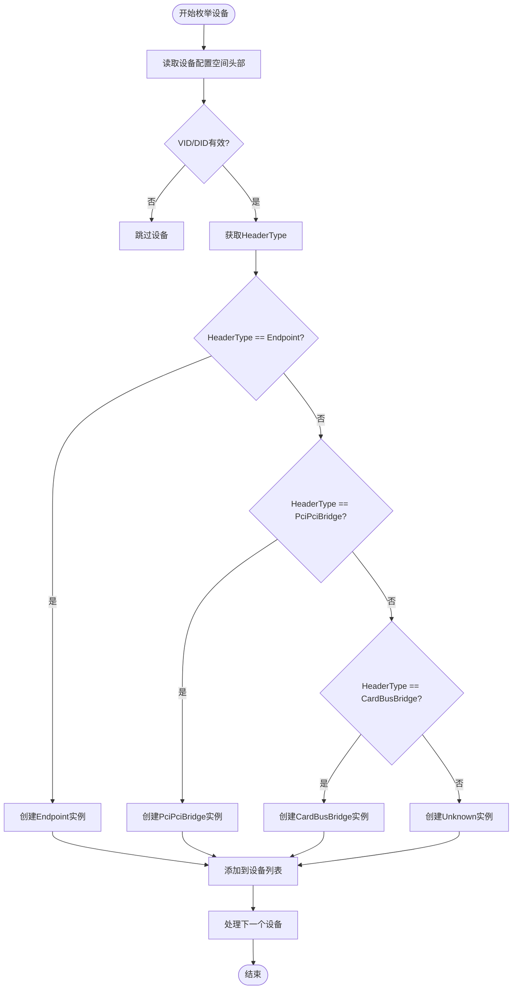
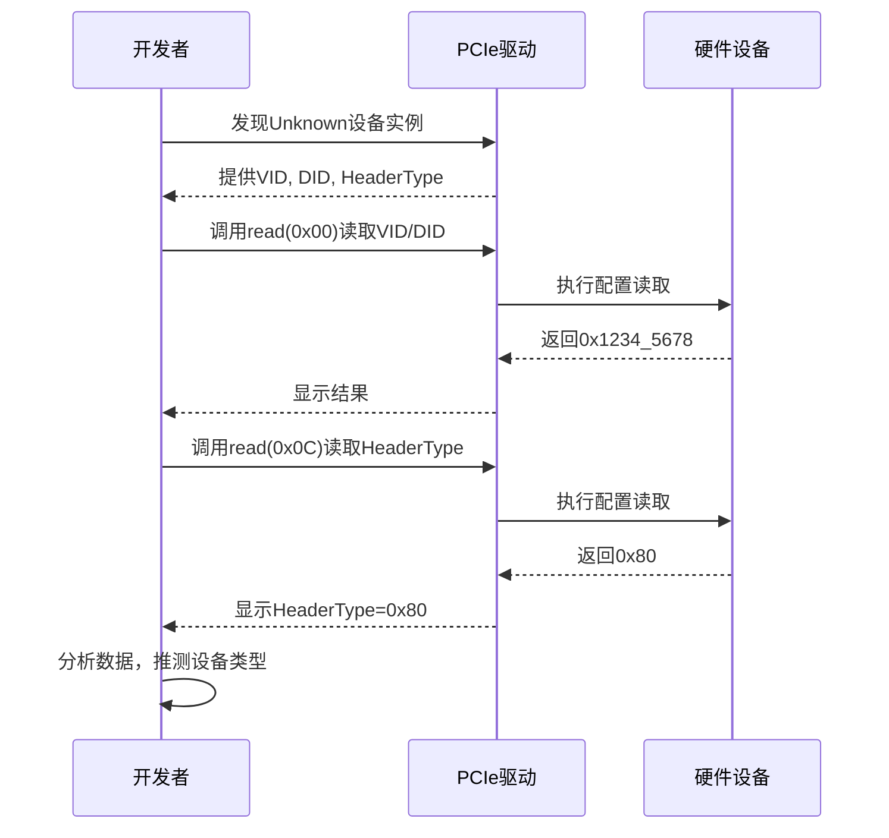

<cite>
**本文档引用的文件**
- [unknown.rs](file://src/types/config/unknown.rs)
- [mod.rs](file://src/types/config/mod.rs)
- [root.rs](file://src/root.rs)
- [endpoint.rs](file://src/types/config/endpoint.rs)
- [pci_bridge.rs](file://src/types/config/pci_bridge.rs)
</cite>

## 目录
1. [引言](#引言)
2. [Unknown结构体设计与实现](#unknown结构体设计与实现)
3. [在PCI配置空间枚举中的作用](#在pci配置空间枚举中的作用)
4. [调试指南与问题诊断](#调试指南与问题诊断)
5. [与其他设备类型的对比分析](#与其他设备类型的对比分析)
6. [总结](#总结)

## 引言

在PCIe设备枚举过程中，系统需要识别并解析各种标准设备头类型（如端点、桥接器等）。然而，在实际硬件环境中，可能存在非标准或尚未被驱动支持的新型设备。为保障系统健壮性，避免因无法识别设备头类型而导致枚举流程中断，`arceos_drivers/pcie` 驱动框架引入了 `Unknown` 结构体作为兜底机制。

该文档旨在详细阐述 `Unknown` 类型的设计原理、实现方式及其在设备枚举过程中的关键作用。通过分析其封装 `PciHeaderBase` 的策略，说明如何保留对设备基本配置空间的访问能力，并提供针对未知设备实例的调试建议和扩展基础。

## Unknown结构体设计与实现

`Unknown` 结构体是处理未识别PCI设备的核心组件，其实现位于 `src/types/config/unknown.rs` 文件中。其核心设计理念是：即使无法解析设备的具体功能类型，也必须保留对其PCI配置空间的基本访问能力，以便于后续调试和潜在的功能探测。

### 核心数据结构

`Unknown` 结构体本身非常简洁，仅包含一个字段：

```rust
pub struct Unknown {
    base: PciHeaderBase,
}
```

该字段封装了所有PCI设备共有的基础信息和操作接口，确保无论设备类型是否已知，都能进行统一的底层访问。

### 基类继承与透明访问

为了最大化代码复用性和接口一致性，`Unknown` 实现了 `Deref` 特性，使其能够透明地访问 `PciHeaderBase` 提供的所有方法：

```rust
impl Deref for Unknown {
    type Target = PciHeaderBase;

    fn deref(&self) -> &Self::Target {
        self.header()
    }
}
```

这一设计使得 `Unknown` 实例可以直接调用 `PciHeaderBase` 定义的通用方法，例如读取厂商ID（VID）、设备ID（DID）、命令寄存器、状态寄存器以及任意偏移量的原始寄存器数据。

### 功能封装

`Unknown` 通过私有方法 `header()` 提供对内部 `PciHeaderBase` 字段的安全访问，遵循了良好的封装原则。尽管当前实现没有添加额外的专用方法，但其通过基类继承的方式，已经具备了完整的PCI配置空间读写能力。

**Section sources**
- [unknown.rs](file://src/types/config/unknown.rs#L5-L22)

## 在PCI配置空间枚举中的作用

`Unknown` 类型在PCI设备枚举流程中扮演着至关重要的“安全网”角色，其必要性体现在防止枚举中断和保障系统健壮性两个方面。

### 枚举流程中的兜底机制

在 `src/root.rs` 中定义的 `enumerate_by_controller` 函数负责遍历总线上的所有设备。该函数通过 `PciHeaderBase::new` 创建基础头信息，并根据 `header_type()` 方法返回的值来决定创建何种具体类型的设备实例。

当检测到一个非标准或未被支持的 `HeaderType` 时（即既不是 `Endpoint` 也不是 `PciPciBridge`），系统会将其归类为 `PciConfigSpace::Unknown(Unknown)`。这确保了枚举循环不会因为遇到未知设备而崩溃或提前终止。

### 防止枚举中断

`PciConfigSpace` 枚举类型定义如下：

```rust
pub enum PciConfigSpace {
    PciPciBridge(PciPciBridge),
    Endpoint(Endpoint),
    CardBusBridge(CardBusBridge),
    Unknown(Unknown),
}
```

此设计的关键在于，它将所有可能的设备情况都纳入了考虑范围。即使驱动程序尚不理解某个设备的具体功能，也能将其作为一个 `Unknown` 实例安全地存储在枚举结果中，从而保证了整个设备树遍历的完整性。

### 保障系统健壮性

通过这种兜底设计，系统能够在面对未来可能出现的新设备类型或非标准实现时保持稳定运行。即使某些设备无法被完全利用，系统至少可以感知到它们的存在，并记录其基本信息（如VID/DID），为后续的驱动开发和问题排查提供了宝贵线索。



**Diagram sources**
- [mod.rs](file://src/types/config/mod.rs#L10-L14)
- [root.rs](file://src/root.rs#L78-L109)

**Section sources**
- [mod.rs](file://src/types/config/mod.rs#L10-L14)
- [root.rs](file://src/root.rs#L78-L109)

## 调试指南与问题诊断

当系统中出现 `Unknown` 实例时，表明遇到了一个驱动程序无法识别的设备。以下是针对此类情况的系统化调试指南。

### 检查VID/DID有效性

首先应确认该设备的厂商ID（VID）和设备ID（DID）是否有效且非全F（0xFFFF）。无效的VID/DID通常意味着设备不存在或通信失败。可通过 `vendor_id()` 和 `device_id()` 方法获取这些信息。

### 验证HeaderType合法性

检查设备的 `HeaderType` 是否为标准值（0x00 表示普通端点，0x01 表示PCI-to-PCI桥）。如果 `HeaderType` 是一个非标准值，则可能是新型设备或固件错误。可通过 `header_type()` 方法查询。

### 探测新型设备类型

若VID/DID有效且 `HeaderType` 非标准，很可能是一个尚未被驱动支持的新型设备。此时，开发者应：
1. 记录下该设备的VID/DID和 `HeaderType`。
2. 查询相关厂商的技术文档以了解其规范。
3. 考虑向驱动框架贡献新的设备类型支持。

### 手动探测配置空间

`Unknown` 结构体提供的 `read(offset)` 方法是诊断问题的强大工具。建议开发者手动探测配置空间的前64字节（标准头部区域），以获取更多关于设备结构的信息。例如，可以通过读取特定偏移量的数据来判断是否存在能力链表或其他自定义结构。



**Diagram sources**
- [unknown.rs](file://src/types/config/unknown.rs#L15-L22)
- [mod.rs](file://src/types/config/mod.rs#L70-L85)

**Section sources**
- [unknown.rs](file://src/types/config/unknown.rs#L15-L22)
- [mod.rs](file://src/types/config/mod.rs#L70-L85)

## 与其他设备类型的对比分析

`Unknown` 类型的设计体现了与 `Endpoint` 和 `PciPciBridge` 等具体设备类型不同的抽象层次。

### 与Endpoint的对比

`Endpoint` 结构体（位于 `endpoint.rs`）不仅继承了 `PciHeaderBase`，还包含了丰富的专用方法，如 `bars()`、`capabilities()`、`interrupt_pin()` 等，用于解析和操作端点设备特有的功能。相比之下，`Unknown` 不尝试解析任何高级功能，仅保留最基础的访问能力。

### 与PciPciBridge的对比

`PciPciBridge` 结构体（位于 `pci_bridge.rs`）同样继承自 `PciHeaderBase`，并实现了桥接器特有的 `update_bus_number` 等方法。`Unknown` 则不具备任何此类高层逻辑，其存在意义在于“存在”本身——确保系统不会因未知设备而崩溃。

### 设计哲学

这种分层设计体现了清晰的关注点分离：
- **具体类型**：负责解析和管理特定设备的功能。
- **Unknown类型**：负责系统的整体健壮性和可观察性。

两者共同构成了一个既能高效利用已知设备，又能安全处理未知情况的弹性系统。

**Section sources**
- [endpoint.rs](file://src/types/config/endpoint.rs#L10-L237)
- [pci_bridge.rs](file://src/types/config/pci_bridge.rs#L10-L110)

## 总结

`Unknown` 结构体是 `arceos_drivers/pcie` 框架中一项关键的健壮性设计。它通过简单而有效的封装，解决了设备枚举过程中最棘手的兼容性问题。其核心价值在于：

1. **防止中断**：作为兜底类型，确保设备枚举流程不会因未知设备而失败。
2. **保留访问**：通过继承 `PciHeaderBase`，保留了对设备配置空间的完整读写能力，为调试提供了坚实基础。
3. **便于诊断**：使开发者能够轻松地探测和分析未知设备，加速问题定位和新