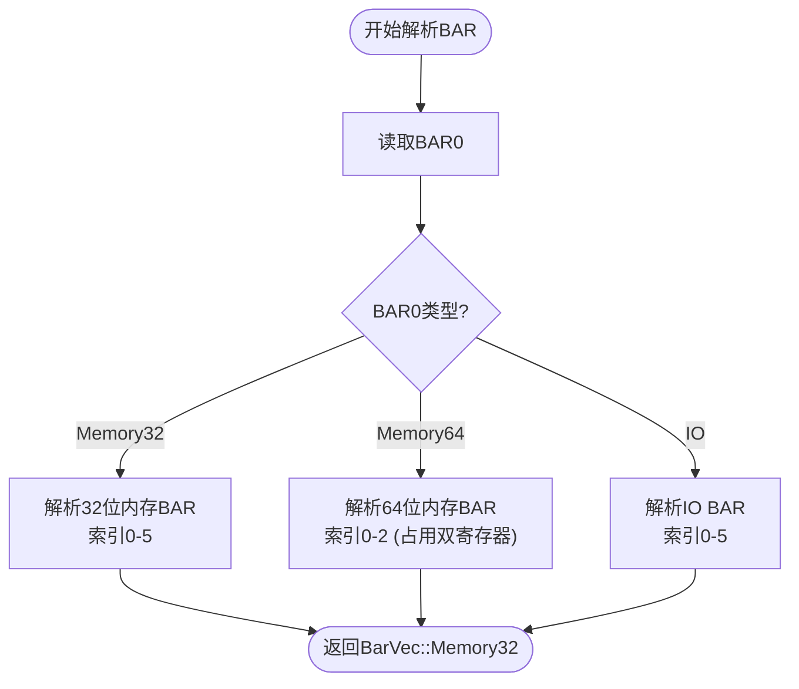
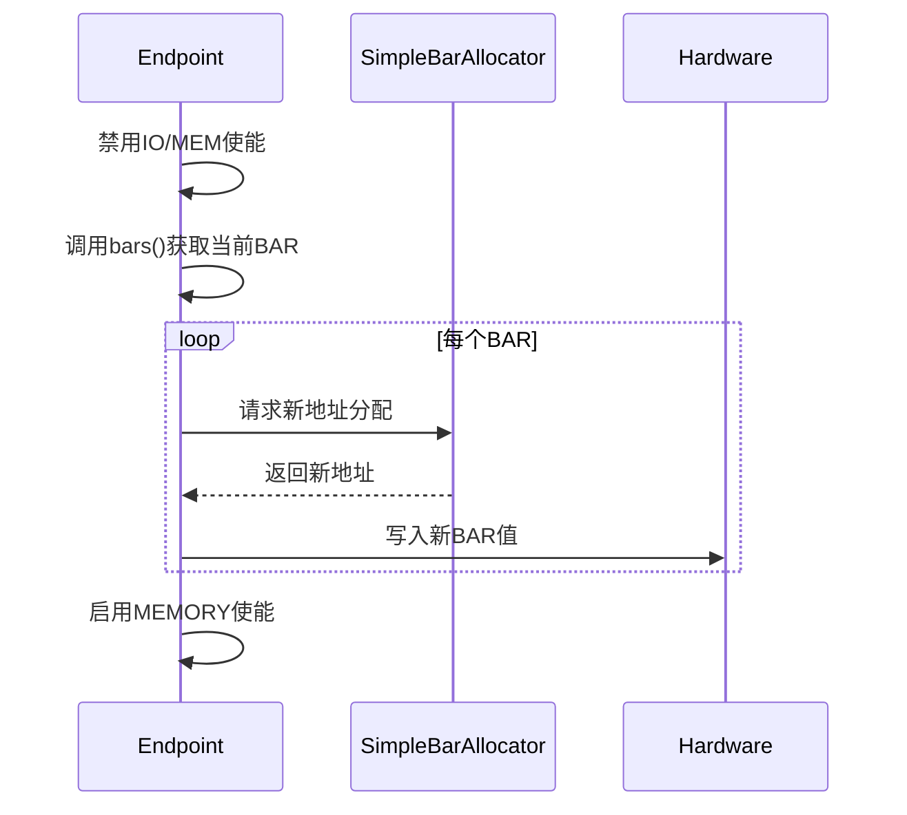
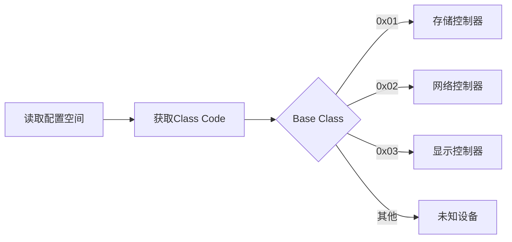

# 终端设备解析

<cite>
**本文档引用的文件**  
- [endpoint.rs](file://src/types/config/endpoint.rs)
- [bar.rs](file://src/types/bar.rs)
- [config/mod.rs](file://src/types/config/mod.rs)
- [bar_alloc.rs](file://src/bar_alloc.rs)
</cite>

## 目录
1. [简介](#简介)
2. [核心结构与继承机制](#核心结构与继承机制)
3. [BAR寄存器解析机制](#bar寄存器解析机制)
4. [资源重分配流程](#资源重分配流程)
5. [透明访问实现](#透明访问实现)
6. [设备属性读取](#设备属性读取)
7. [设备类型识别](#设备类型识别)
8. [格式化输出设计](#格式化输出设计)
9. [调试建议](#调试建议)

## 简介
`Endpoint`结构体是PCIe终端设备配置空间的核心抽象，封装了标准设备头部字段的解析与操作能力。该结构体通过组合`PciHeaderBase`和`EndpointHeader`实现对PCIe配置空间的完整访问，支持BAR寄存器解析、中断引脚读取、子系统ID获取等关键功能。本文档深入分析其设计原理与实现细节，为开发者提供全面的技术参考。

## 核心结构与继承机制
`Endpoint`结构体采用组合模式实现功能扩展，包含两个核心字段：
- `base`: 继承自`PciHeaderBase`，提供基础配置访问能力
- `header`: 类型为`EndpointHeader`，解析标准设备头部字段

通过`new`方法初始化时，首先从`base.header()`创建`PciHeader`实例，再通过`EndpointHeader::from_header`解析设备头部数据。若提供了`SimpleBarAllocator`，则自动调用`realloc_bar`进行资源重映射。

**Section sources**
- [endpoint.rs](file://src/types/config/endpoint.rs#L0-L36)

## BAR寄存器解析机制
`Endpoint`通过`bars()`与`bar()`方法实现对6个BAR寄存器的解析与内存映射构建。

### bars方法
`bars()`方法调用`EndpointHeader`的`parse_bar`实现寄存器解析，返回`BarVec`枚举类型。解析过程首先读取BAR0，根据其类型确定后续解析策略：
- **32位内存BAR**: 每个BAR占用一个32位寄存器
- **64位内存BAR**: 每个BAR占用两个连续的32位寄存器
- **IO BAR**: 使用IO地址空间



**Diagram sources**
- [bar.rs](file://src/types/bar.rs#L46-L88)
- [endpoint.rs](file://src/types/config/endpoint.rs#L72-L76)

### bar方法
`bar(index)`方法返回指定索引的内存映射范围，支持两种地址模式：
- **32位BAR**: 地址范围为`address..(address + size)`
- **64位BAR**: 支持更大的地址空间，范围计算方式相同

该方法通过`BarVecT::get`获取指定索引的BAR信息，并转换为`Range<usize>`类型返回。

**Section sources**
- [endpoint.rs](file://src/types/config/endpoint.rs#L38-L55)

## 资源重分配流程
`realloc_bar`方法实现BAR资源的动态重分配，确保设备内存映射的正确性。

### 执行流程
1. **禁用内存/IO使能位**: 通过`update_command`清除`IO_ENABLE`和`MEMORY_ENABLE`标志
2. **地址重映射**: 调用`SimpleBarAllocator`分配新地址
3. **写回新值**: 通过`BarVecT::set`安全写入新BAR值
4. **重新启用**: 设置`MEMORY_ENABLE`标志

### 32位与64位BAR处理差异
- **32位BAR**: 直接调用`alloc_memory32_with_pref`
- **64位BAR**: 根据地址范围智能选择分配器：
  - 地址在32位范围内：使用32位分配器
  - 地址超过32位：使用64位分配器



**Diagram sources**
- [endpoint.rs](file://src/types/config/endpoint.rs#L107-L172)

**Section sources**
- [endpoint.rs](file://src/types/config/endpoint.rs#L107-L172)
- [bar_alloc.rs](file://src/bar_alloc.rs#L0-L0)

## 透明访问实现
通过实现`Deref`和`DerefMut` trait，`Endpoint`实现了对`PciHeaderBase`的透明访问。

### Deref实现
```rust
impl Deref for Endpoint {
    type Target = PciHeaderBase;
    fn deref(&self) -> &Self::Target {
        &self.base
    }
}
```
此设计允许直接调用`PciHeaderBase`的公共方法，如`vendor_id()`、`device_id()`等，无需显式访问`base`字段。

### DerefMut实现
```rust
impl DerefMut for Endpoint {
    fn deref_mut(&mut self) -> &mut Self::Target {
        &mut self.base
    }
}
```
支持可变访问，允许修改基础配置字段。

**Section sources**
- [endpoint.rs](file://src/types/config/endpoint.rs#L174-L183)

## 设备属性读取
`Endpoint`提供多种方法读取设备特定属性：

### 中断引脚
`interrupt_pin()`和`interrupt_line()`方法通过`header.interrupt()`获取中断配置，返回`u8`类型值。

### 子系统标识
`subsystem_id()`和`subsystem_vendor_id()`通过`header.subsystem()`获取子系统信息，用于设备识别。

### 其他属性
- `capabilities_pointer()`: 获取能力链表指针
- `capabilities()`: 枚举所有PCIe能力
- `device_type()`: 基于类别码识别设备类型

**Section sources**
- [endpoint.rs](file://src/types/config/endpoint.rs#L58-L81)

## 设备类型识别
`device_type()`方法基于PCI标准的类别码（Class Code）自动识别设备类别。

### 逻辑流程
1. 调用`base.revision_and_class()`获取类别信息
2. 提取`base_class`和`sub_class`字段
3. 通过`DeviceType::from()`转换为枚举类型

支持的设备类型包括存储控制器、网络控制器、显示控制器等，便于高层软件进行设备分类管理。



**Section sources**
- [endpoint.rs](file://src/types/config/endpoint.rs#L36-L38)
- [config/mod.rs](file://src/types/config/mod.rs#L63-L75)

## 格式化输出设计
`Display` trait的实现考虑了日志输出的可读性与一致性。

### 字段对齐
使用`{:<24}`对设备类型名称进行左对齐填充，确保列对齐：
```
0000:00:01.0 NVMe Controller        1b36:000d (rev 02, prog-if 02)
```

### 十六进制显示
- 地址字段使用`{:04x}`格式化，确保4位十六进制显示
- 设备ID使用`{:04x}`，保持统一格式
- 版本号使用`{:02x}`，显示2位十六进制

此设计便于快速识别设备信息，提高调试效率。

**Section sources**
- [endpoint.rs](file://src/types/config/endpoint.rs#L216-L236)

## 调试建议
当BAR写入失败时，可能的原因包括：

### 硬件限制
- 设备不支持动态BAR重映射
- BAR寄存器被硬件锁定
- 地址空间冲突

### 分配器冲突
- `SimpleBarAllocator`地址池耗尽
- 分配策略与硬件要求不匹配
- 32位/64位地址模式选择错误

### 调试步骤
1. 检查`command`寄存器状态，确认IO/MEM使能已正确禁用
2. 验证分配器返回的地址是否符合设备要求
3. 检查`status`寄存器是否有配置错误标志
4. 确认设备是否支持BAR重编程功能

**Section sources**
- [endpoint.rs](file://src/types/config/endpoint.rs#L148-L155)
- [bar.rs](file://src/types/bar.rs#L169-L207)