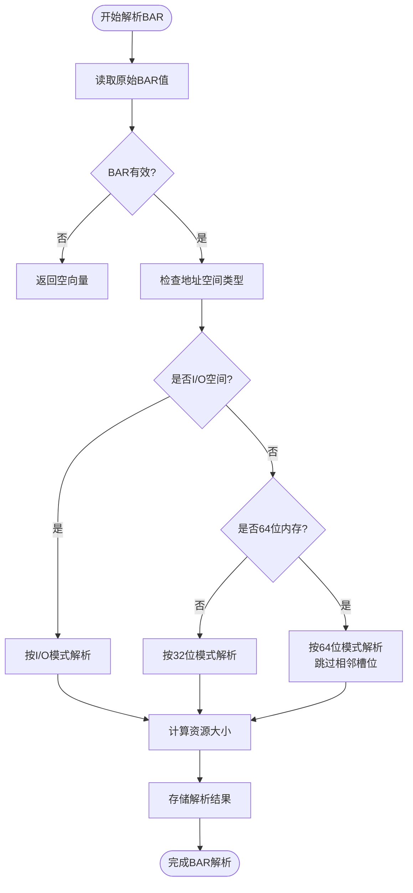
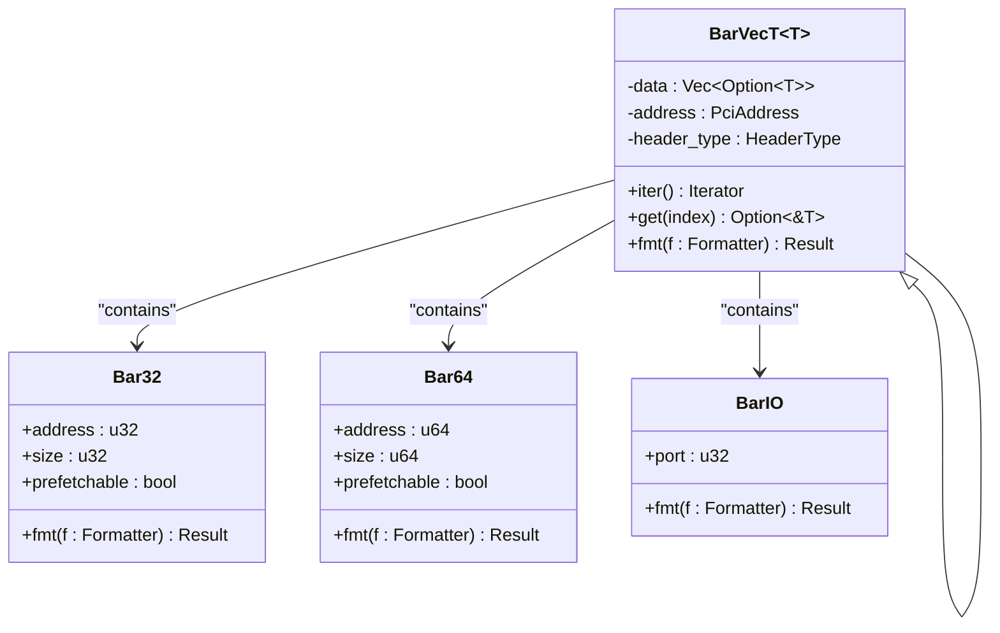

# types模块详解

<cite>
**Referenced Files in This Document **  
- [src/types/mod.rs](file://src/types/mod.rs)
- [src/types/bar.rs](file://src/types/bar.rs)
- [src/lib.rs](file://src/lib.rs)
- [src/types/config/mod.rs](file://src/types/config/mod.rs)
- [src/types/config/endpoint.rs](file://src/types/config/endpoint.rs)
</cite>

## 目录
1. [mod.rs：类型导出中枢](#modrs类型导出中枢)  
2. [BaseAddressRegister实现机制](#baseaddressregister实现机制)  
3. [BAR解码与资源分配](#bar解码与资源分配)  
4. [prefetchable位语义解析](#prefetchable位语义解析)  
5. [Debug格式化最佳实践](#debug格式化最佳实践)  
6. [类型安全性设计](#类型安全性设计)  
7. [扩展性架构分析](#扩展性架构分析)

## mod.rs：类型导出中枢

`types/mod.rs`作为公共类型的统一出口，承担着模块接口聚合的关键职责。该文件通过`mod bar;`和`mod config;`声明引入子模块，并利用`pub use`语法将内部类型向上层透明暴露。这种设计实现了三个核心目标：一是封装内部模块结构，对外提供扁平化API；二是集中管理类型可见性，确保仅导出稳定接口；三是建立清晰的依赖边界，使`lib.rs`可通过`pub use types::*;`一次性获取所有公共类型。

该文件还直接定义了`BusNumber`等跨设备通用结构体，体现了其作为基础类型容器的定位。通过整合`pci_types`库中的`PciAddress`、`CommandRegister`等基础类型，构建了完整的PCIe类型体系，为上层功能模块提供了统一的类型基础。

**Section sources**  
- [src/types/mod.rs](file://src/types/mod.rs#L1-L16)

## BaseAddressRegister实现机制

`bar.rs`文件中的地址寄存器建模采用分层枚举策略，精准映射PCI规范中的硬件语义。`BarVec`作为顶层容器，通过`Memory32`、`Memory64`和`Io`三个变体区分不同地址空间类型，这种设计避免了运行时类型检查开销，同时保证内存布局最优。

对于32位内存空间，`Bar32`结构体包含`address`、`size`和`prefetchable`字段，其中`address_mask`的处理逻辑隐含在`BarVecT`的解析过程中。当读取配置空间BAR寄存器时，系统会自动识别`mask & !1`模式来判断是否为64位BAR，并据此调整后续寄存器槽位占用。I/O空间由独立的`BarIO`类型表示，其`port`字段采用u32类型以兼容x86架构的I/O端口寻址需求。

**Section sources**  
- [src/types/bar.rs](file://src/types/bar.rs#L10-L249)

## BAR解码与资源分配

BAR大小计算采用经典的位运算公式`~(mask & !1) + 1`，该算法充分利用了硬件返回的地址掩码特性。具体而言，`mask & !1`操作清除最低位的类型标识（0表示内存，1表示I/O），保留地址有效位的连续低位零。取反后加一的操作等价于找到最低有效位的位置，从而精确计算出对齐后的资源尺寸。

此计算逻辑在`BarHeader::parse_bar`方法中实现，该方法根据首条BAR的类型动态确定后续解析策略。对于64位内存BAR，系统会跳过相邻槽位以符合双寄存器占用规范。计算得到的`size`值直接用于`SimpleBarAllocator`的资源分配决策，确保新分配的物理地址满足硬件对齐要求，避免出现部分映射或越界访问。

**Diagram sources **  
- [src/types/bar.rs](file://src/types/bar.rs#L50-L150)

**Section sources**  
- [src/types/bar.rs](file://src/types/bar.rs#L50-L150)

## prefetchable位语义解析

`prefetchable`标志位在DMA操作中具有关键意义，它指示内存区域是否支持预取优化。当该位被置位时，系统可安全地提前加载数据到CPU缓存，显著提升大块数据传输性能。此特性在显卡帧缓冲区、网络接收环等场景尤为重要。

在`Endpoint`设备的实际应用中，该位会影响内存分配策略。支持预取的区域通常会被映射到写合并（Write-Combining）内存类型，允许批量写入优化。而不可预取的BAR则需使用回写（Write-Back）或直写（Write-Through）策略，确保每个写操作立即生效。驱动程序可通过`bars()`方法获取此属性，并据此选择最优的数据访问模式。

**Section sources**  
- [src/types/bar.rs](file://src/types/bar.rs#L20-L30)
- [src/types/config/endpoint.rs](file://src/types/config/endpoint.rs#L50-L70)

## Debug格式化最佳实践

本模块的`Debug`实现遵循"信息完整且可解析"的设计原则。`Bar32`和`Bar64`的格式化输出采用`{:#p}`指针格式显示地址，既保持十六进制可读性又明确指示其为内存地址。`size`字段使用`{:#x}`格式确保大小以标准十六进制表示，便于与硬件文档对照。

特别值得注意的是`BarVecT<T>`的递归格式化设计，它通过为每个有效BAR生成独立行输出（`BAR{i}: {bar:?}`），实现了多BAR设备的清晰展示。这种层次化输出配合`PciHeaderBase`的结构化调试信息，使得整个PCI设备状态可被完整序列化，极大简化了内核调试过程。

**Diagram sources **  
- [src/types/bar.rs](file://src/types/bar.rs#L35-L45)
- [src/types/bar.rs](file://src/types/bar.rs#L150-L200)

**Section sources**  
- [src/types/bar.rs](file://src/types/bar.rs#L35-L45)
- [src/types/bar.rs](file://src/types/bar.rs#L150-L200)

## 类型安全性设计

模块通过多重机制防止非法BAR重映射操作。首先，`BarVecT`的`set`方法被标记为`pub(crate)`，限制其只能在当前crate内部调用，避免外部误用。其次，写入操作必须通过`ConfigRegionAccess`安全接口执行，确保所有寄存器访问都经过正确的内存屏障处理。

最关键的保护来自`header_type`匹配检查。在`set`实现中，系统会验证当前头类型是否为`Endpoint`，非终端设备的写入请求将触发panic。此外，64位BAR的写入会自动乘以2的索引偏移，防止因槽位计算错误导致的寄存器覆盖。这些编译期和运行期的双重防护，有效杜绝了可能导致系统崩溃的非法硬件操作。

**Section sources**  
- [src/types/bar.rs](file://src/types/bar.rs#L200-L249)

## 扩展性架构分析

为支持新型设备特定寄存器，开发者应遵循现有抽象模式进行扩展。建议在`config`子模块下创建新的设备类型文件（如`custom_device.rs`），实现`PciConfigSpace`枚举的新变体。新类型需实现`BarHeader` trait以集成BAR解析流程，并可通过泛型参数适配特殊BAR编码规则。

对于非标准BAR布局，可在`BarVec`基础上派生专用容器类型，复