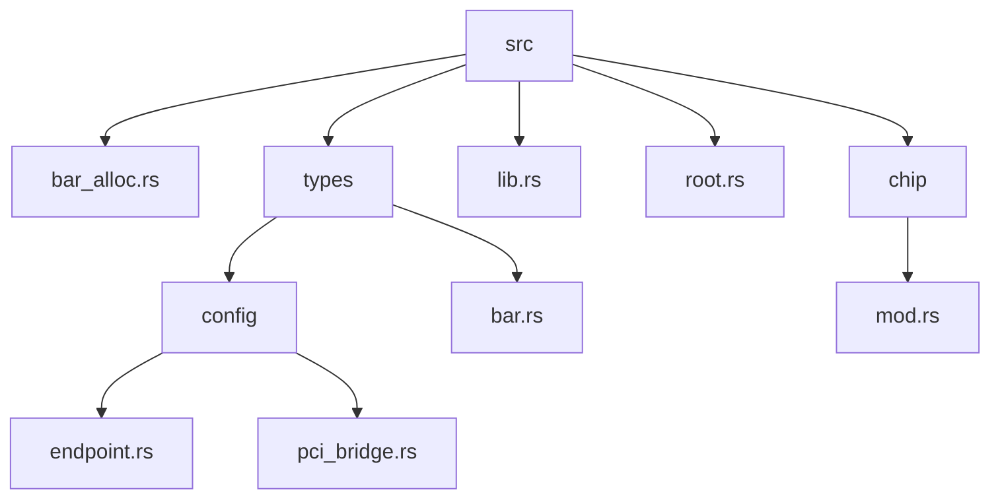
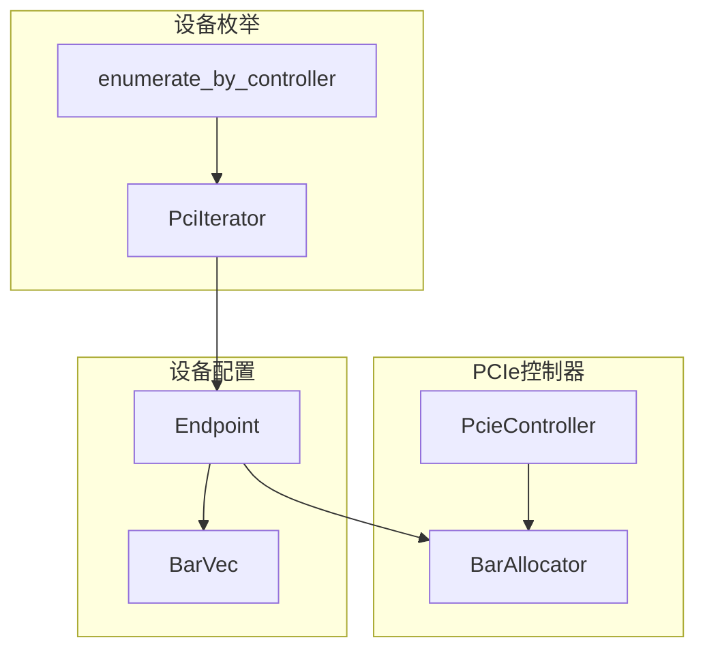
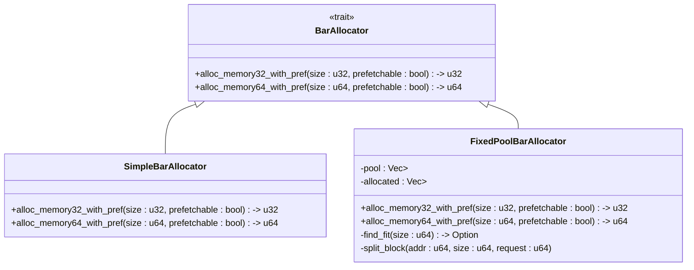
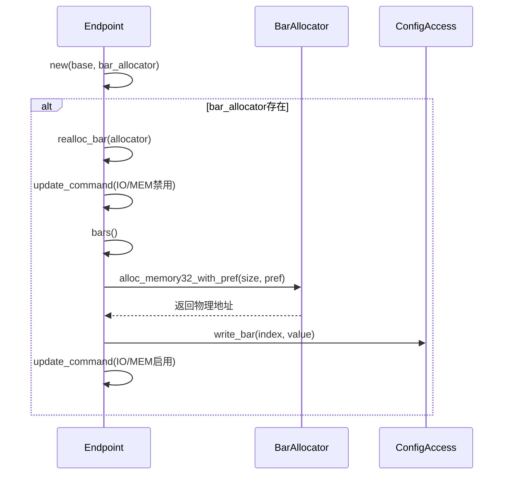
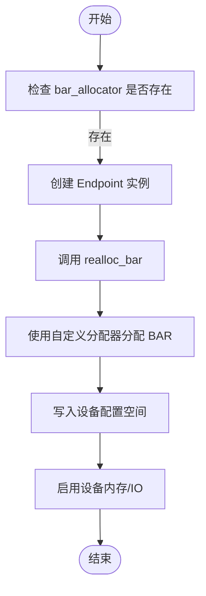
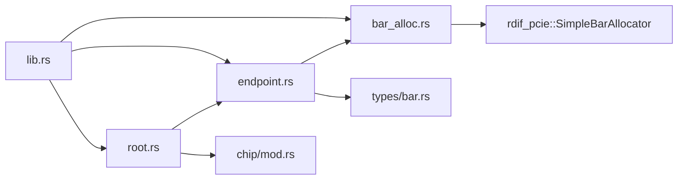

# BAR分配器定制

<cite>
**本文档中引用的文件**  
- [bar_alloc.rs](file://src/bar_alloc.rs)
- [endpoint.rs](file://src/types/config/endpoint.rs)
- [lib.rs](file://src/lib.rs)
- [bar.rs](file://src/types/bar.rs)
- [root.rs](file://src/root.rs)
</cite>

## 目录
1. [引言](#引言)
2. [项目结构](#项目结构)
3. [核心组件](#核心组件)
4. [架构概述](#架构概述)
5. [详细组件分析](#详细组件分析)
6. [依赖分析](#依赖分析)
7. [性能考量](#性能考量)
8. [故障排除指南](#故障排除指南)
9. [结论](#结论)

## 引言
本文档详细说明如何在 `arceos_drivers/pcie` 驱动中替换默认的 `SimpleBarAllocator` 为自定义的 BAR 资源分配策略。通过分析 `bar_alloc.rs` 中的 `BarAllocator` trait 定义，展示如何实现一个基于固定内存池、支持多设备并发请求并处理碎片问题的分配器。同时，解释如何通过 `RefCell<Rc<dyn BarAllocator>>` 在 `PcieController` 中注入自定义分配器实例，并结合 `endpoint.rs` 中的 `realloc_bar` 调用流程，说明分配器在设备初始化阶段的触发时机。最后讨论分配算法的时间复杂度对枚举延迟的影响，以及在多核环境下使用 `SpinLock` 保护分配状态的线程安全实现方式。

## 项目结构

**Diagram sources**
- [bar_alloc.rs](file://src/bar_alloc.rs)
- [endpoint.rs](file://src/types/config/endpoint.rs)
- [bar.rs](file://src/types/bar.rs)
- [lib.rs](file://src/lib.rs)
- [root.rs](file://src/root.rs)

**Section sources**
- [bar_alloc.rs](file://src/bar_alloc.rs)
- [endpoint.rs](file://src/types/config/endpoint.rs)
- [bar.rs](file://src/types/bar.rs)
- [lib.rs](file://src/lib.rs)
- [root.rs](file://src/root.rs)

## 核心组件

本文档的核心组件包括 `BarAllocator` trait 的定义与实现、`Endpoint` 结构体中的 BAR 重分配逻辑、以及 `PcieController` 对分配器的管理机制。这些组件共同构成了 PCIe 设备 BAR 资源分配的核心流程。

**Section sources**
- [bar_alloc.rs](file://src/bar_alloc.rs)
- [endpoint.rs](file://src/types/config/endpoint.rs)
- [lib.rs](file://src/lib.rs)

## 架构概述

**Diagram sources**
- [root.rs](file://src/root.rs#L0-L192)
- [endpoint.rs](file://src/types/config/endpoint.rs#L0-L237)
- [bar.rs](file://src/types/bar.rs#L0-L248)

## 详细组件分析

### BarAllocator 特性分析

`BarAllocator` trait 定义了 BAR 资源分配的核心接口，包括 `alloc_memory32_with_pref` 和 `alloc_memory64_with_pref` 方法，用于根据指定大小和预取属性分配 32 位或 64 位内存空间。该 trait 的实现决定了物理地址的分配策略。

#### 自定义分配器实现示例

**Diagram sources**
- [bar_alloc.rs](file://src/bar_alloc.rs#L0-L1)
- [endpoint.rs](file://src/types/config/endpoint.rs#L109-L172)

**Section sources**
- [bar_alloc.rs](file://src/bar_alloc.rs#L0-L1)
- [endpoint.rs](file://src/types/config/endpoint.rs#L109-L172)

### Endpoint 初始化与 BAR 分配流程

`Endpoint` 在初始化时通过 `realloc_bar` 方法调用分配器进行 BAR 重分配。此过程首先禁用设备的内存和 I/O 使能位，然后根据现有 BAR 信息请求新的物理地址，最后写入配置空间并重新启用设备。

#### BAR 重分配序列图

**Diagram sources**
- [endpoint.rs](file://src/types/config/endpoint.rs#L79-L172)
- [bar.rs](file://src/types/bar.rs#L209-L247)

**Section sources**
- [endpoint.rs](file://src/types/config/endpoint.rs#L79-L172)

### 分配器注入机制

`PcieController` 通过 `RefCell<Rc<dyn BarAllocator>>` 模式支持运行时注入自定义分配器实例。这种设计允许在设备枚举过程中动态替换分配策略，同时保证线程安全和所有权管理。

**Diagram sources**
- [root.rs](file://src/root.rs#L100-L120)
- [endpoint.rs](file://src/types/config/endpoint.rs#L38-L81)

**Section sources**
- [root.rs](file://src/root.rs#L100-L120)

## 依赖分析

**Diagram sources**
- [bar_alloc.rs](file://src/bar_alloc.rs)
- [endpoint.rs](file://src/types/config/endpoint.rs)
- [root.rs](file://src/root.rs)
- [lib.rs](file://src/lib.rs)

**Section sources**
- [bar_alloc.rs](file://src/bar_alloc.rs)
- [endpoint.rs](file://src/types/config/endpoint.rs)
- [root.rs](file://src/root.rs)
- [lib.rs](file://src/lib.rs)

## 性能考量

BAR 分配算法的效率直接影响 PCIe 设备枚举的延迟。简单的首次适应算法时间复杂度为 O(n)，而最佳适应或伙伴系统可能达到 O(n log n)。在多核环境中，应使用 `SpinLock` 或其他同步原语保护共享的分配状态，避免竞态条件。对于高并发场景，可考虑为每个 CPU 核心维护独立的分配池以减少锁争用。

**Section sources**
- [bar_alloc.rs](file://src/bar_alloc.rs)
- [endpoint.rs](file://src/types/config/endpoint.rs)

## 故障排除指南

当 BAR 分配失败时，应检查以下方面：
1. 内存池是否已耗尽
2. 分配请求的大小是否超出范围
3. 地址对齐要求是否满足
4. 设备配置空间写入是否成功
5. 分配器状态是否被并发访问破坏

可通过日志输出分配器的状态信息和失败原因辅助诊断。

**Section sources**
- [endpoint.rs](file://src/types/config/endpoint.rs#L140-L172)
- [bar.rs](file://src/types/bar.rs#L209-L247)

## 结论

本文档全面分析了 `arceos_drivers/pcie` 中 BAR 分配器的替换机制。通过实现自定义的 `BarAllocator` trait，可以灵活控制 PCIe 设备的资源分配策略。结合 `RefCell<Rc<dyn BarAllocator>>` 的注入模式和 `realloc_bar` 的调用流程，实现了高度可扩展的分配架构。在实际应用中，应根据系统需求权衡分配算法的复杂度与性能，确保在多核环境下的线程安全性。