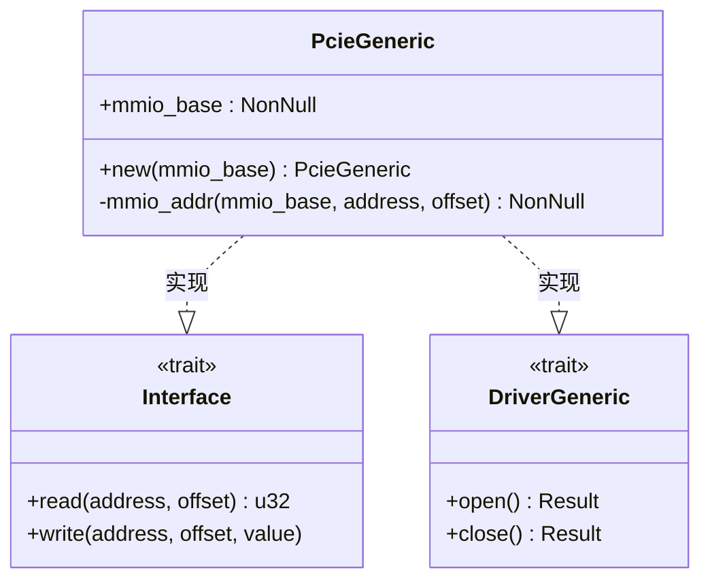
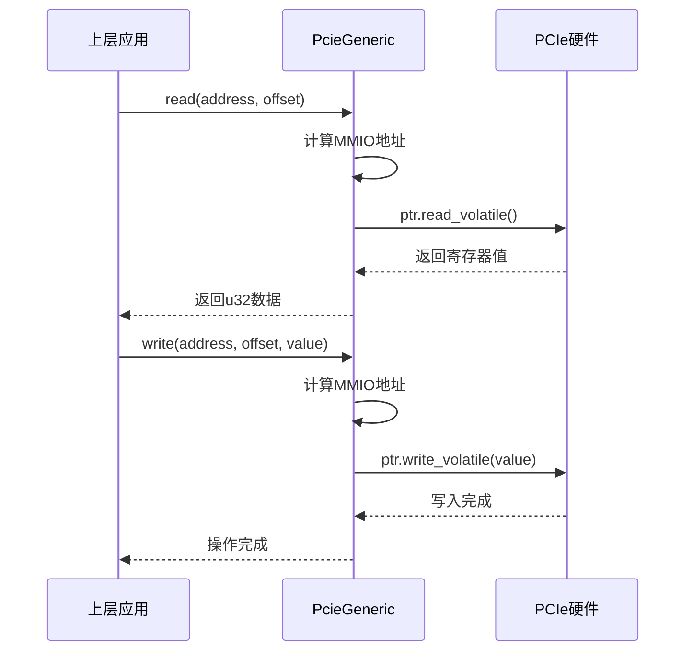
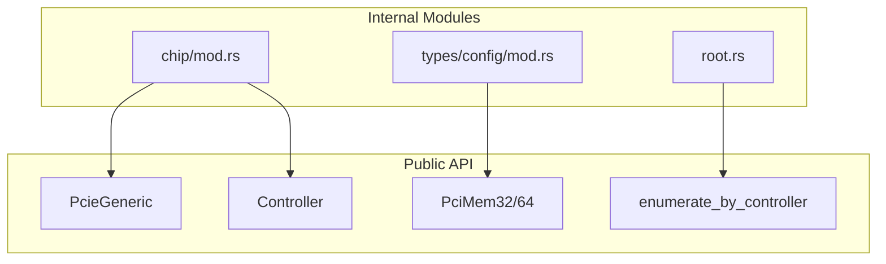

# 控制器适配

<cite>
**Referenced Files in This Document**   
- [lib.rs](file://src/lib.rs)
- [chip/mod.rs](file://src/chip/mod.rs)
- [types/config/mod.rs](file://src/types/config/mod.rs)
</cite>

## 目录
1. [引言](#引言)
2. [核心组件分析](#核心组件分析)
3. [接口实现详解](#接口实现详解)
4. [内存映射I/O访问机制](#内存映射io访问机制)
5. [生命周期与安全封装](#生命周期与安全封装)
6. [公共API导出机制](#公共api导出机制)
7. [调试与测试建议](#调试与测试建议)
8. [结论](#结论)

## 引言
本文档深入讲解如何通过实现 `rdif_pcie::Interface` trait 将本库适配到不同的 PCIe 控制器硬件。以 `chip/mod.rs` 中的 `PcieGeneric` 为参考实现，详细说明其 `read` 和 `write` 方法如何执行 MMIO（Memory-Mapped I/O）访问配置空间，并强调使用 volatile 读写的必要性以防止编译器优化导致的硬件访问失效。同时解释构造函数中 MMIO 基地址的映射机制，提供针对非标准地址布局的重写示例，并描述 trait 的生命周期管理及裸指针的安全封装方式。

## 核心组件分析

本节分析实现 PCIe 控制器适配的核心结构体 `PcieGeneric` 及其相关类型。



**Diagram sources**
- [chip/mod.rs](file://src/chip/mod.rs#L7-L51)

**Section sources**
- [chip/mod.rs](file://src/chip/mod.rs#L7-L51)

## 接口实现详解

### read 与 write 方法实现

`PcieGeneric` 结构体实现了 `rdif_pcie::Interface` trait，提供了对 PCIe 配置空间的读写能力。这两个方法是硬件抽象的关键部分。

#### volatile 读写的必要性

在实现 `read` 和 `write` 方法时，必须使用 `read_volatile` 和 `write_volatile` 而非普通指针操作。这是因为：

- **防止编译器优化**：普通读写可能被编译器视为可优化的操作（如缓存、去重），而硬件寄存器访问必须每次真实发生。
- **确保副作用执行**：PCIe 配置空间的写入操作通常具有副作用（如触发状态机转换），volatile 操作保证这些副作用不会被省略。
- **符合硬件协议要求**：某些 PCIe 寄存器需要精确的访问顺序和次数，volatile 操作维持了程序语义的完整性。



**Diagram sources**
- [chip/mod.rs](file://src/chip/mod.rs#L38-L45)

**Section sources**
- [chip/mod.rs](file://src/chip/mod.rs#L38-L45)

## 内存映射I/O访问机制

### MMIO基地址映射

`PcieGeneric` 的 `new` 构造函数接收一个 `NonNull<u8>` 类型的参数作为 MMIO 基地址。该地址通常由平台初始化阶段从设备树或ACPI表中获取并映射到虚拟内存空间。

#### 地址计算逻辑

`mmio_addr` 方法负责将 PCIe 设备地址（总线、设备、功能号）和寄存器偏移转换为实际的内存地址。其计算过程如下：

1. 将 BDF（Bus-Device-Function）编码为 32 位地址高段
2. 加上寄存器偏移
3. 按 4 字节对齐调整指针位置

此机制允许通过统一的内存访问接口操作所有 PCIe 设备的配置空间。

### 非标准地址布局适配

对于 SoC 专用寄存器或非标准布局的控制器，可通过重写 `mmio_addr` 方法进行适配。例如：

```rust
impl MyCustomPcieController {
    fn mmio_addr(&self, address: PciAddress, offset: u16) -> NonNull<u32> {
        // 自定义地址映射逻辑，如添加额外偏移、bank切换等
        let base = self.mmio_base.as_ptr() as usize;
        let custom_offset = self.calculate_custom_offset(address, offset);
        unsafe {
            NonNull::new_unchecked((base + custom_offset) as *mut u32)
        }
    }
}
```

**Section sources**
- [chip/mod.rs](file://src/chip/mod.rs#L19-L36)

## 生命周期与安全封装

### Send 安全性声明

`PcieGeneric` 显式标记为 `unsafe impl Send`，表明该类型可以在多线程间安全传递。这基于以下假设：

- 底层硬件支持并发访问或已通过外部同步机制保护
- MMIO 区域已被正确映射且不会被意外释放

开发者在实现自定义控制器时需谨慎评估是否满足 `Send` 条件。

### 裸指针访问封装

通过 `NonNull` 类型封装裸指针，避免空指针解引用风险。所有硬件访问均限定在 `unsafe` 块内，并严格遵循以下原则：

- 指针有效性由构造函数保证
- 访问范围受 BDF 和 offset 参数约束
- volatile 操作确保每次访问都直达硬件

**Section sources**
- [chip/mod.rs](file://src/chip/mod.rs#L10-L17)

## 公共API导出机制

### 模块层级导出策略

`lib.rs` 文件采用分层导出策略，将关键类型暴露给上层应用：

- `pub use chip::PcieGeneric;` —— 导出通用控制器实现
- `pub use rdif_pcie::Interface as Controller;` —— 提供 trait 别名便于引用
- `pub use rdif_pcie::{PciMem32, PciMem64, PcieController};` —— 导出内存类型和控制器抽象

这种设计既保持了接口稳定性，又允许内部模块重构而不影响外部使用者。



**Diagram sources**
- [lib.rs](file://src/lib.rs#L1-L22)

**Section sources**
- [lib.rs](file://src/lib.rs#L1-L22)

## 调试与测试建议

### 日志验证配置空间访问

建议在 `read` 和 `write` 方法中添加条件日志输出，用于验证硬件交互：

```rust
impl Interface for PcieGeneric {
    fn read(&mut self, address: PciAddress, offset: u16) -> u32 {
        let value = unsafe { self.mmio_addr(self.mmio_base, address, offset).as_ptr().read_volatile() };
        debug!("PCIe READ  B:{}, D:{}, F:{}, OFF:0x{:02x} = 0x{:08x}", 
               address.bus(), address.device(), address.function(), offset, value);
        value
    }
}
```

### 仿真环境测试

推荐使用 QEMU 或其他模拟器搭建测试环境，通过以下方式验证控制器逻辑：

- 注入异常地址测试边界处理
- 使用 MMIO trap 工具监控实际访问序列
- 对比不同编译优化级别下的行为一致性
- 验证多线程并发访问的稳定性

**Section sources**
- [chip/mod.rs](file://src/chip/mod.rs#L38-L45)
- [types/config/mod.rs](file://src/types/config/mod.rs#L118-L125)

## 结论

通过实现 `rdif_pcie::Interface` trait，可以灵活地将本库适配至各种 PCIe 控制器硬件。`PcieGeneric` 提供了一个安全、高效的参考实现，展示了如何正确使用 volatile MMIO 操作、封装裸指针以及管理生命周期。开发者应根据具体硬件特性重写地址映射逻辑，并利用日志和仿真工具充分验证驱动行为。公共 API 的清晰导出机制确保了上层应用能够