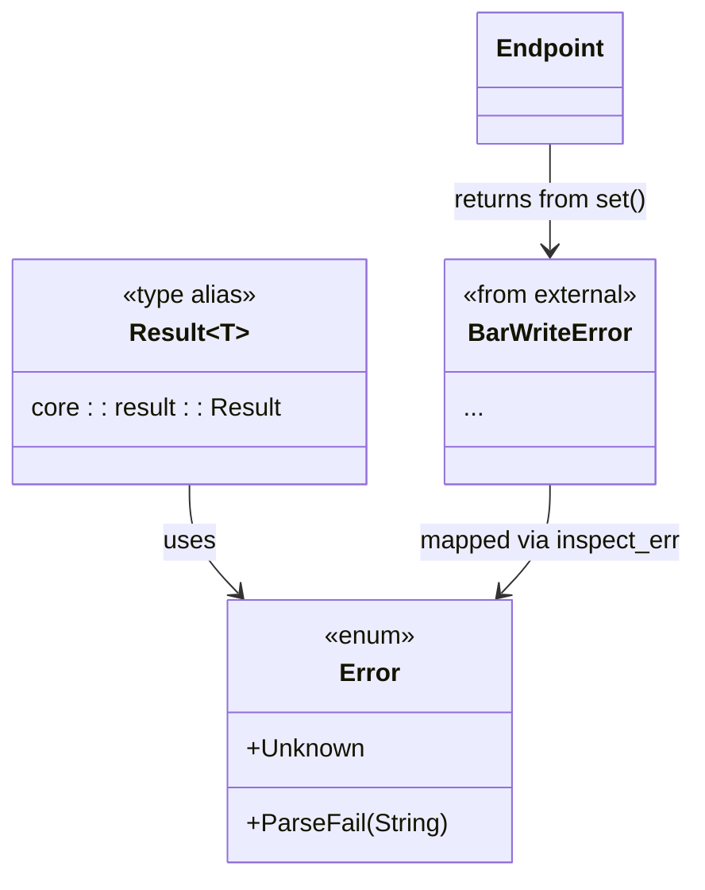

# 日志与错误集成

<cite>
**Referenced Files in This Document **  
- [lib.rs](file://src/lib.rs)
- [err.rs](file://src/err.rs)
- [root.rs](file://src/root.rs)
- [types/config/mod.rs](file://src/types/config/mod.rs)
- [types/config/endpoint.rs](file://src/types/config/endpoint.rs)
- [tests/test.rs](file://tests/test.rs)
</cite>

## 目录
1. [日志系统集成](#日志系统集成)  
2. [错误类型定义与处理](#错误类型定义与处理)  
3. [no-std环境下的错误处理最佳实践](#no-std环境下的错误处理最佳实践)  
4. [上下文信息增强与调试建议](#上下文信息增强与调试建议)  
5. [错误传播与兼容性设计](#错误传播与兼容性设计)

## 日志系统集成

本库通过 `log` 宏提供日志输出能力，已在 `lib.rs` 中声明为依赖。日志主要用于设备枚举、BAR重分配等关键流程的运行时状态追踪。

在设备枚举过程中，`root.rs` 模块中的 `PciIterator` 会遍历PCI总线上的所有设备。虽然当前代码中未直接使用 `info!` 或 `error!` 等宏记录枚举过程，但测试文件 `test.rs` 展示了如何结合 `env_logger` 初始化并输出初始化信息（如 `Init PCIE @{base_vaddr:?}`），表明该模式可用于生产环境。

此外，在 `types/config/endpoint.rs` 的 `realloc_bar` 方法中，当64位内存BAR写入失败时，使用 `error!("{e:?}")` 输出错误详情，这是目前唯一明确的错误日志点。

开发者可通过引入 `env_logger` 或适配内核日志系统的 `klog` crate 来绑定日志输出。例如，在支持 `std` 的环境中可调用 `env_logger::init()`；而在裸机或内核环境中，则需配置 `klog` 将日志定向至串口或其他调试接口。


**Diagram sources**  
- [lib.rs](file://src/lib.rs#L4)
- [tests/test.rs](file://tests/test.rs#L45)
- [types/config/endpoint.rs](file://src/types/config/endpoint.rs#L157)

**Section sources**  
- [lib.rs](file://src/lib.rs#L1-L22)
- [tests/test.rs](file://tests/test.rs#L0-L48)
- [types/config/endpoint.rs](file://src/types/config/endpoint.rs#L140-L165)

## 错误类型定义与处理

`err.rs` 文件定义了核心错误类型 `Error` 枚举及其别名 `Result<T>`。当前实现包含两个变体：

- `Unknown`: 表示未分类的通用错误，用于兜底场景。
- `ParseFail(String)`: 表示解析失败，并携带失败原因字符串。

尽管文档目标中提到了 `ConfigReadFailed` 和 `InvalidBarValue`，但在实际代码中并未定义这两个枚举变体。现有错误体系较为简化，主要依赖外部库（如 `pci_types::BarWriteError`）进行具体错误传递。

在 `Endpoint::realloc_bar` 方法中，对 `bar_vec.set` 调用的结果使用 `.inspect_err(|e| error!("{e:?}"))` 进行日志记录，体现了“失败即日志”的处理模式。此方法返回的是来自 `pci_types` 库的 `BarWriteError`，而非本库自定义错误，说明错误来源存在跨库边界的情况。



**Diagram sources**  
- [err.rs](file://src/err.rs#L2-L9)
- [types/config/endpoint.rs](file://src/types/config/endpoint.rs#L157)

**Section sources**  
- [err.rs](file://src/err.rs#L1-L10)
- [types/config/endpoint.rs](file://src/types/config/endpoint.rs#L140-L165)

## no-std环境下的错误处理最佳实践

项目已正确设置 `#![no_std]`，适用于嵌入式或操作系统开发场景。在此环境下，标准库不可用，因此不能依赖 `std::error::Error` trait，而应基于 `core::fmt::Debug` 实现错误诊断。

当前 `Error` 枚举已派生 `Debug`，确保可通过 `{:?}` 格式化输出错误内容，这是 `no-std` 下的基本要求。建议未来扩展错误类型时，为每个变体添加结构化字段以替代字符串消息，例如：

```rust
// 建议改进方向（非当前实现）
pub enum Error {
    ConfigReadFailed { address: PciAddress, cause: ReadError },
    InvalidBarValue { bar_index: usize, value: u64 },
}
```

对于平台特定错误码转换，应在驱动层出口处将 `Error` 映射为操作系统定义的错误编号（如Linux的 `-ENODEV`, `-EINVAL`）。这可通过实现一个转换函数完成：

```rust
impl From<Error> for i32 {
    fn from(err: Error) -> i32 {
        match err {
            Error::Unknown => -1,
            Error::ParseFail(_) => -22, // -EINVAL
        }
    }
}
```

此类转换逻辑应集中管理，避免分散在各处。

**Section sources**  
- [lib.rs](file://src/lib.rs#L1)
- [err.rs](file://src/err.rs#L2)

## 上下文信息增强与调试建议

当前日志输出缺乏足够的上下文信息。例如，在 `realloc_bar` 中打印的错误仅显示错误本身，未包含发生错误的设备地址（PCI Segment:Bus:Device.Function）。

强烈建议在所有日志语句中加入设备标识信息。由于 `Endpoint` 类型持有 `PciHeaderBase`，可通过 `self.base.address()` 获取完整PCI地址。改进后的日志应类似：

```rust
.error!("BAR write failed at {}: {:?}", self.base.address(), e);
```

同样，在枚举开始前可添加 `info!("Starting enumeration on bus {}", bus_start);`，帮助定位问题发生的范围。

此外，`Display` 实现已在 `Endpoint` 中提供格式化输出功能，可直接用于日志记录。推荐统一使用 `{}` 而非 `{:?}` 以获得更清晰的人类可读输出。

**Section sources**  
- [types/config/endpoint.rs](file://src/types/config/endpoint.rs#L210-L236)
- [types/config/mod.rs](file://src/types/config/mod.rs#L110-L131)

## 错误传播与兼容性设计

当前错误传播机制较为基础：内部操作使用外部错误类型（如 `BarWriteError`），并通过 `inspect_err` 记录后 `.unwrap()` 强行解包。这种模式不利于错误追溯和上层处理。

建议采用 `thiserror` 派生以提升错误类型的表达能力和互操作性。即使在 `no-std` 环境下，也可选择支持 `no-std` 的错误库（如 `snafu` 或启用 `thiserror` 的 `alloc` 特性）。

通过 `#[from]` 属性可自动实现外部错误到内部错误的转换，形成统一的错误层次结构。例如：

```rust
#[derive(thiserror::Error, Debug)]
pub enum Error {
    #[error("failed to parse config space")]
    ParseFail(#[from] ParseError),

    #[error("BAR programming failed")]
    BarWriteFailed(#[from] BarWriteError),
}
```

此举不仅能保持错误链完整性，还能生成符合惯例的错误消息，便于工具解析和用户理解。

虽然当前代码尚未使用 `thiserror`，但其设计原则仍应作为未来演进的指导方针，确保错误系统具备良好的扩展性和兼容性。

**Section sources**  
- [err.rs](file://src/err.rs#L2)
- [types/config/endpoint.rs](file://src/types/config/endpoint.rs#L157)