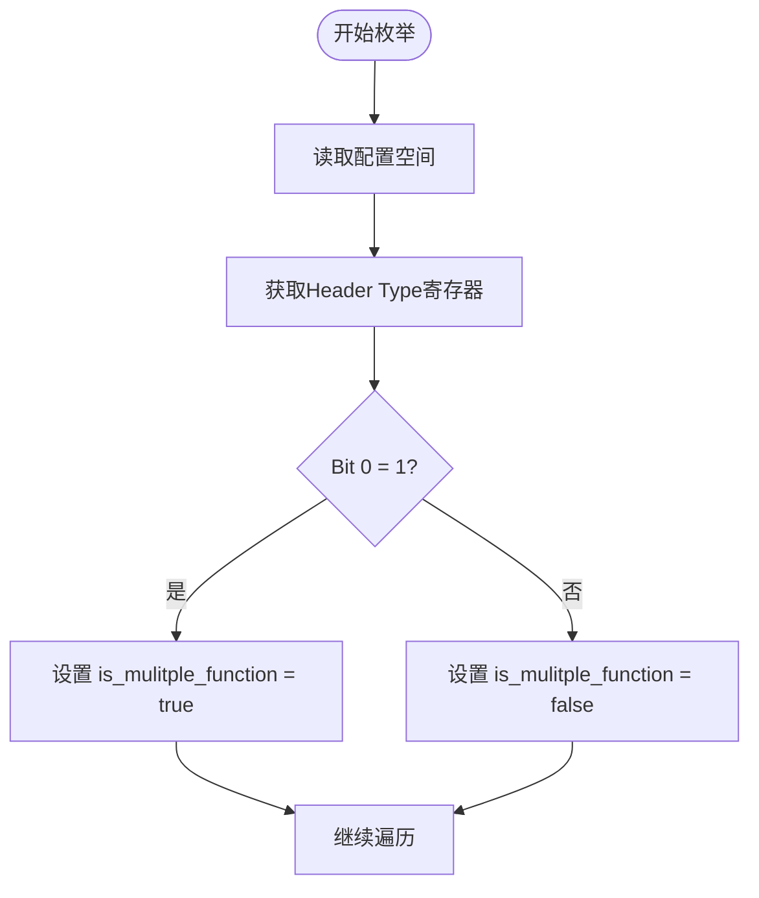
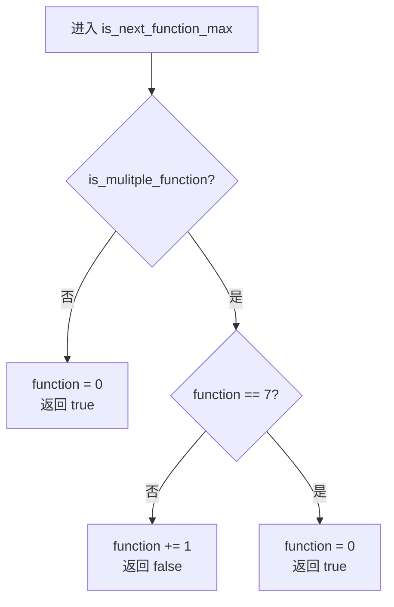
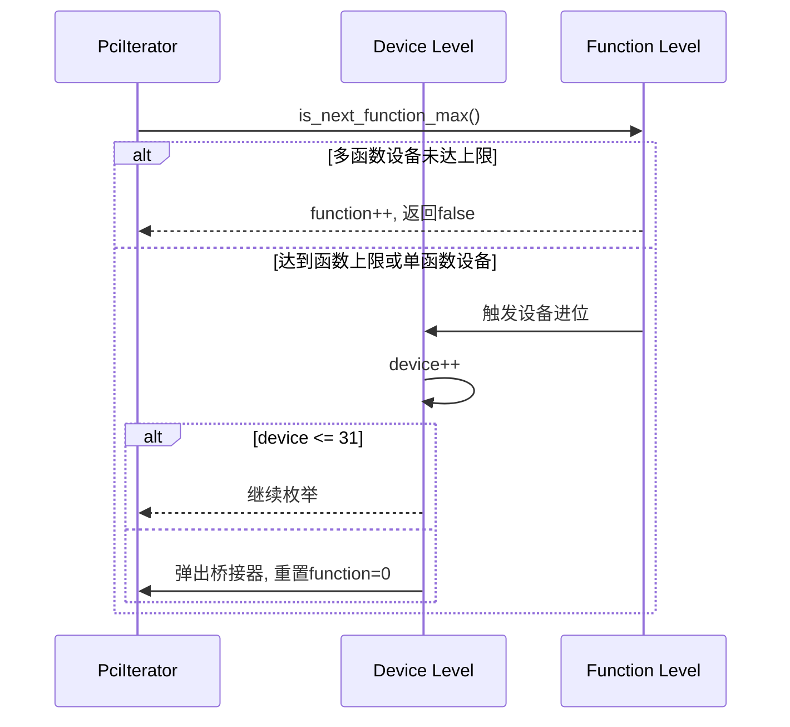

# 多函数设备支持机制

<cite>
**本文档引用的文件**
- [root.rs](file://src/root.rs)
- [mod.rs](file://src/types/config/mod.rs)
</cite>

## 目录
1. [引言](#引言)
2. [多函数标志判断机制](#多函数标志判断机制)
3. [函数级遍历逻辑](#函数级遍历逻辑)
4. [设备与函数层级协同递增](#设备与函数层级协同递增)
5. [实际枚举案例分析](#实际枚举案例分析)
6. [设计意图与高级调试建议](#设计意图与高级调试建议)

## 引言
PCIe设备支持单函数（Single Function）和多函数（Multiple Function）两种模式。多函数设备在同一个设备号下可包含多个独立功能单元，如网卡、存储控制器等常采用此设计以提高资源利用率。本文档深入解析`is_mulitple_function`标志的判定逻辑及函数级遍历机制，阐明`PciHeaderBase::has_multiple_functions()`如何通过配置空间判断设备类型，并详细描述`is_next_function_max()`方法在不同模式下的行为差异。

**Section sources**
- [root.rs](file://src/root.rs#L0-L192)
- [mod.rs](file://src/types/config/mod.rs#L0-L131)

## 多函数标志判断机制
`PciHeaderBase::has_multiple_functions()`方法用于判断当前PCIe设备是否为多函数设备。该方法通过读取设备配置空间中的Header Type寄存器来获取相关信息。根据PCI规范，Header Type寄存器的最低位（bit 0）指示设备是否支持多个函数：若该位为1，则表示设备具有多函数能力；否则为单函数设备。

此判断发生在设备枚举过程中，当调用`PciHeaderBase::new()`成功创建实例后，立即更新迭代器状态`is_mulitple_function`字段，作为后续遍历策略的依据。

**Diagram sources**
- [mod.rs](file://src/types/config/mod.rs#L63-L64)
- [root.rs](file://src/root.rs#L69)

**Section sources**
- [mod.rs](file://src/types/config/mod.rs#L63-L64)
- [root.rs](file://src/root.rs#L69)

## 函数级遍历逻辑
`is_next_function_max()`方法控制函数编号的递增与进位逻辑，其行为依赖于`is_mulitple_function`标志的状态：

- **单函数设备**：无论当前`function`值为何，均将其重置为0，并返回true触发设备进位（即切换到下一个设备）。这确保每个单函数设备仅在Function 0上被枚举一次。
- **多函数设备**：当`function < MAX_FUNCTION(7)`时，递增`function`并返回false，继续在同一设备上扫描下一函数；当`function == 7`时，重置为0并返回true，触发设备进位。

这种设计严格遵循PCIe规范中对函数编号范围（0-7）的要求，保证了枚举过程的完整性与正确性。

**Diagram sources**
- [root.rs](file://src/root.rs#L151-L168)

**Section sources**
- [root.rs](file://src/root.rs#L151-L168)

## 设备与函数层级协同递增
设备与函数的递增由`next_device_not_ok()`方法协同管理。该方法负责处理设备层级的进位逻辑：

- 当前设备号达到最大值（31）时，从栈中弹出当前桥接器，表示完成该总线下的所有设备枚举；
- 若存在父级桥接器，则递增其子总线号，并将`function`重置为0；
- 若无更多设备可枚举，则设置`is_finish = true`终止迭代。

结合`is_next_function_max()`的行为，形成“函数内循环 + 设备外循环”的嵌套结构，实现完整的PCIe拓扑遍历。

**Diagram sources**
- [root.rs](file://src/root.rs#L169-L191)

**Section sources**
- [root.rs](file://src/root.rs#L169-L191)

## 实际枚举案例分析
以一个典型的多函数网卡为例，其设备地址为`Bus 2, Device 0`，包含两个函数（Function 0 和 Function 1）：

1. 枚举至 `Bus 2, Dev 0, Func 0` → 检测到`has_multiple_functions=true`
2. 处理 Function 0 后，`is_next_function_max()`使`function=1`，返回false
3. 枚举 `Bus 2, Dev 0, Func 1`
4. 再次调用`is_next_function_max()`，因`function==1<7`，仍返回false
5. 尝试访问 `Func 2` 发现无效，随后`function`递增至7后归零并进位
6. 切换至 `Dev 1, Func 0` 继续扫描

对于单函数存储控制器，每次函数遍历后立即进位至下一设备，避免无效扫描。

**Section sources**
- [root.rs](file://src/root.rs#L69)
- [mod.rs](file://src/types/config/mod.rs#L63-L64)

## 设计意图与高级调试建议
`self.function`在桥接器创建或设备切换时被重置为0的设计意图在于：
- 确保每个新设备或新总线从Function 0开始枚举；
- 避免跨设备/总线的函数编号污染；
- 符合PCIe总线枚举协议的初始化要求。

建议高级用户通过日志跟踪`function`字段的变化轨迹，验证枚举顺序的完整性。例如，在`next()`方法中添加调试输出，观察`address()`生成的完整PCI地址序列，有助于诊断潜在的枚举遗漏或重复问题。

**Section sources**
- [root.rs](file://src/root.rs#L151-L191)