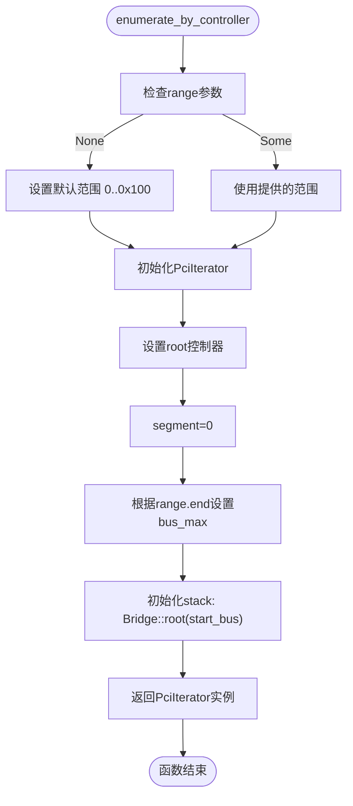
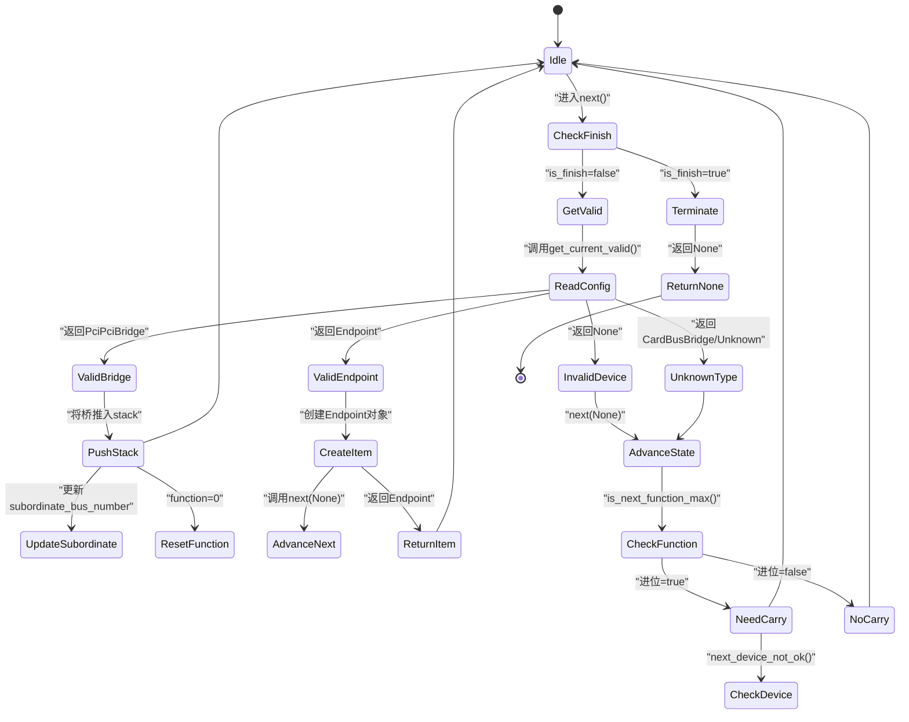

<cite>
**本文档引用文件**
- [root.rs](file://src/root.rs#L1-L193)
- [lib.rs](file://src/lib.rs#L1-L23)
- [config/mod.rs](file://src/types/config/mod.rs#L1-L132)
- [endpoint.rs](file://src/types/config/endpoint.rs#L1-L238)
- [pci_bridge.rs](file://src/types/config/pci_bridge.rs#L1-L111)
</cite>

## 目录
1. [引言](#引言)
2. [PCIe设备枚举流程概述](#pcie设备枚举流程概述)
3. [PciIterator结构体字段解析](#pciiterator结构体字段解析)
4. [enumerate_by_controller函数分析](#enumerate_by_controller函数分析)
5. [next()方法状态转移机制](#next方法状态转移机制)
6. [get_current_valid()设备识别逻辑](#get_current_valid设备识别逻辑)
7. [空闲设备跳过与VID/DID验证](#空闲设备跳过与viddid验证)
8. [is_finish标志位的终止作用](#is_finish标志位的终止作用)
9. [调试建议与日志观察](#调试建议与日志观察)

## 引言
本文档深入解析PCIe设备枚举流程中的核心组件`PciIterator`，重点阐述其状态机设计与控制流。通过分析`enumerate_by_controller`函数的初始化过程、`PciIterator`各字段的作用、`next()`方法的状态转移逻辑以及`get_current_valid()`的设备识别机制，为开发者提供全面的技术指导。

## PCIe设备枚举流程概述
PCIe总线枚举是系统启动时发现和配置所有连接设备的关键过程。该流程采用深度优先搜索策略遍历总线拓扑结构，从根桥开始逐级探测下游设备。`PciIterator`作为核心迭代器，封装了整个遍历逻辑，通过实现`Iterator` trait提供统一的访问接口。

**Section sources**
- [root.rs](file://src/root.rs#L1-L193)
- [lib.rs](file://src/lib.rs#L1-L23)

## PciIterator结构体字段解析
`PciIterator`结构体维护了当前遍历状态所需的所有上下文信息：

- **root**: 指向`PcieController`的可变引用，用于执行底层配置空间读写操作。
- **segment**: PCI段选择器，支持多段PCI拓扑。
- **stack**: `Bridge`类型栈，记录当前路径上的PCI桥设备及其关联设备号，实现深度优先遍历。
- **bus_max**: 扫描范围的最大总线号，由调用者指定或默认设置。
- **function**: 当前正在检查的功能号（0-7），支持多功能设备。
- **is_mulitple_function**: 布尔标志，指示当前设备是否具有多个功能。
- **is_finish**: 终止标志，当设置为true时表示遍历完成。

这些字段协同工作，确保能够准确跟踪当前扫描位置并正确处理复杂的PCI拓扑结构。

**Section sources**
- [root.rs](file://src/root.rs#L45-L52)

## enumerate_by_controller函数分析
`enumerate_by_controller`函数是设备枚举的入口点，负责初始化`PciIterator`实例并设置扫描参数：

1. 接收`PcieController`引用和可选的总线范围参数。
2. 若未指定范围，则使用默认值`0..0x100`覆盖全部256条总线。
3. 构造`PciIterator`实例：
   - 将`segment`设为0（单段系统）。
   - 根据输入范围计算`bus_max`。
   - 初始化`stack`栈，压入根桥占位符`Bridge::root(range.start as _)`。
   - 其余字段初始化为默认值。

此函数返回一个实现了`Iterator<Item = Endpoint>`的`PciIterator`实例，允许使用者以拉取模式逐个获取发现的终端设备。



**Diagram sources**
- [root.rs](file://src/root.rs#L10-L25)

**Section sources**
- [root.rs](file://src/root.rs#L10-L25)
- [lib.rs](file://src/lib.rs#L15)

## next()方法状态转移机制
`next()`方法驱动`PciIterator`的状态机向前推进，其实现包含以下关键步骤：

1. **循环检查**: 在`while !self.is_finish`循环中持续尝试获取有效设备。
2. **当前设备验证**: 调用`get_current_valid()`尝试读取当前地址的配置头并解析设备类型。
3. **设备类型分支处理**:
   - 若为`PciPciBridge`，将该桥设备信息推入`stack`，更新各级桥的次属总线号，并重置`function`为0。
   - 若为`Endpoint`，构造`Endpoint`对象，推进到下一设备，然后返回当前终端设备。
   - 对于`CardBusBridge`或`Unknown`类型，直接跳过。
4. **无效设备处理**: 如果`get_current_valid()`返回`None`（如VID为0xFFFF），同样调用`next(None)`推进状态。
5. **遍历终止**: 当`is_finish`被置位后，退出循环并返回`None`，表示迭代结束。

该方法巧妙地结合了递归式拓扑探索与迭代器模式，实现了简洁高效的设备遍历。



**Diagram sources**
- [root.rs](file://src/root.rs#L55-L193)

**Section sources**
- [root.rs](file://src/root.rs#L55-L193)

## get_current_valid()设备识别逻辑
`get_current_valid()`方法负责在当前地址执行设备识别：

1. **地址计算**: 通过`self.address()`结合`stack`顶部的桥信息计算出当前待探测的`PciAddress`。
2. **配置头读取**: 调用`PciHeaderBase::new()`尝试读取该地址的配置空间前几个双字。
3. **VID有效性检查**: 如果读取的厂商ID（VID）为`0xFFFF`，立即返回`None`，表示该设备不存在。
4. **多重功能检测**: 调用`has_multiple_functions()`确定当前设备是否为多功能设备。
5. **头部类型判断**: 根据`header_type()`返回值决定后续处理路径：
   - **Endpoint**: 创建`Endpoint`实例并包装为`PciConfigSpace::Endpoint`返回。
   - **PciPciBridge**: 构造`PciPciBridge`对象，设置正确的总线编号（主总线为当前总线，次总线为父桥次属总线+1），然后包装返回。
   - **其他类型**: 返回`None`或触发`todo!()`宏（当前未完全实现）。

此方法是设备发现的核心，它不仅验证设备存在性，还决定了遍历的方向——是深入子总线还是继续同级扫描。

```mermaid
flowchart TD
Start([get_current_valid]) --> CalcAddr["计算当前PciAddress"]
CalcAddr --> ReadHeader["调用PciHeaderBase::new()"]
ReadHeader --> CheckVID["检查VID != 0xFFFF?"]
CheckVID --> |否| ReturnNone["返回None"]
CheckVID --> |是| DetectMF["检测has_multiple_functions"]
DetectMF --> GetHeaderType["获取header_type"]
GetHeaderType --> IsEndpoint["类型==Endpoint?"]
GetHeaderType --> IsBridge["类型==PciPciBridge?"]
GetHeaderType --> IsOther["其他类型"]
IsEndpoint --> CreateEP["创建Endpoint实例"]
CreateEP --> WrapEP["包装为PciConfigSpace::Endpoint"]
WrapEP --> ReturnEP["返回结果"]
IsBridge --> CheckParent["检查stack.last()是否存在"]
CheckParent --> |否| Panic["panic!(\"no parent\")"]
CheckParent --> |是| CheckSubMax["检查subordinate == bus_max?"]
CheckSubMax --> |是| ReturnNone
CheckSubMax --> |否| SetBusNum["设置primary/secondary/subordinate"]
SetBusNum --> CreateBridge["创建PciPciBridge"]
CreateBridge --> WrapBridge["包装为PciConfigSpace::PciPciBridge"]
WrapBridge --> ReturnBridge["返回结果"]
IsOther --> HandleOther["处理CardBusBridge/Unknown"]
HandleOther --> ReturnNone
ReturnEP --> End
ReturnBridge --> End
ReturnNone --> End
```

**Diagram sources**
- [root.rs](file://src/root.rs#L78-L148)
- [config/mod.rs](file://src/types/config/mod.rs#L45-L132)

**Section sources**
- [root.rs](file://src/root.rs#L78-L148)
- [config/mod.rs](file://src/types/config/mod.rs#L45-L132)

## 空闲设备跳过与VID/DID验证
当探测到某个设备地址时，系统首先读取其配置空间的厂商ID（VID）。如果VID为`0xFFFF`，这通常表示该设备槽位为空或设备未响应，此时`PciHeaderBase::new()`会直接返回`None`。`get_current_valid()`接收到`None`后也会随之返回`None`，导致`next()`方法调用`next(None)`来推进到下一个可能的设备地址。

这种机制有效地跳过了所有无效或未安装的设备，避免了对不存在硬件的进一步操作。对于有效的终端