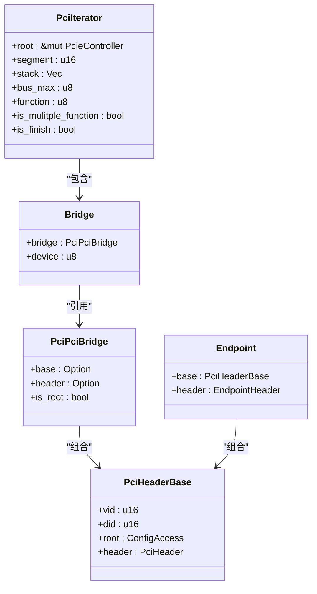
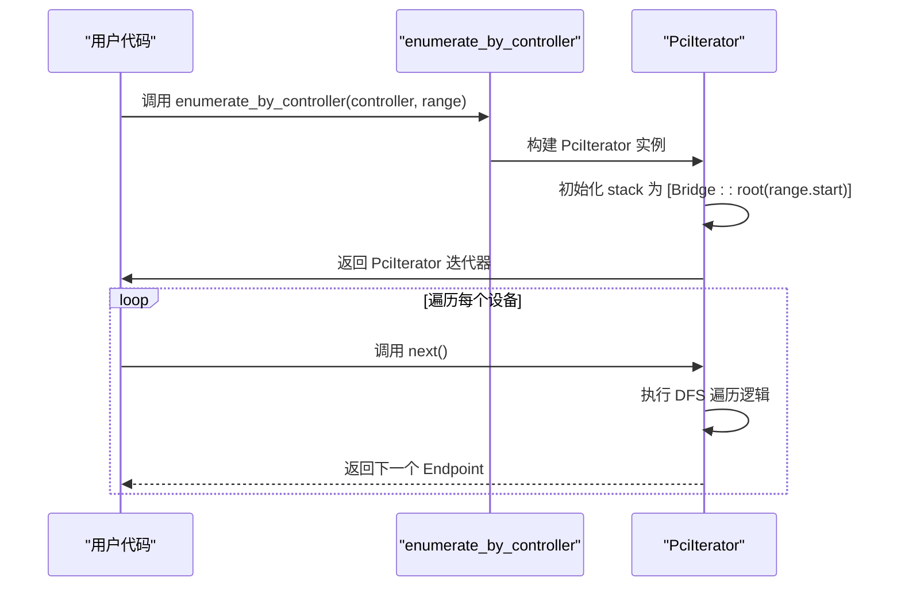

<cite>
**本文档引用文件**
- [root.rs](file://src/root.rs#L1-L193)
- [lib.rs](file://src/lib.rs#L1-L23)
- [types/config/mod.rs](file://src/types/config/mod.rs#L1-L132)
- [types/config/endpoint.rs](file://src/types/config/endpoint.rs#L1-L238)
- [types/config/pci_bridge.rs](file://src/types/config/pci_bridge.rs#L1-L111)
</cite>

## 目录
1. [设备枚举机制](#设备枚举机制)
2. [PciIterator 核心结构](#pciiiterator-核心结构)
3. [总线遍历与深度优先搜索](#总线遍历与深度优先搜索)
4. [enumerate_by_controller 函数分析](#enumerate_by_controller-函数分析)
5. [next() 方法控制流解析](#next--方法控制流解析)
6. [辅助方法协同逻辑](#辅助方法协同逻辑)
7. [自旋等待与总线同步](#自旋等待与总线同步)
8. [多函数设备处理](#多函数设备处理)
9. [未实现类型说明](#未实现类型说明)
10. [性能优化建议](#性能优化建议)

## 设备枚举机制

本文档详细阐述了PCIe设备枚举的核心机制，重点分析`PciIterator`迭代器的设计原理与实现细节。该机制通过深度优先搜索（DFS）策略，利用栈结构递归遍历PCI-PCI桥接器下的次级总线，从而发现并初始化所有连接的PCIe设备。

**Section sources**
- [root.rs](file://src/root.rs#L1-L193)

## PciIterator 核心结构

`PciIterator`是设备枚举的核心迭代器，实现了`Iterator<Item = Endpoint>` trait。其内部维护着一个`Vec<Bridge>`栈结构，用于跟踪当前正在遍历的桥接器及其关联的设备信息。迭代器状态包括当前段号、最大总线号、当前功能号以及是否为多功能设备等标志位。

**Diagram sources**
- [root.rs](file://src/root.rs#L50-L80)
- [types/config/pci_bridge.rs](file://src/types/config/pci_bridge.rs#L1-L111)
- [types/config/mod.rs](file://src/types/config/mod.rs#L1-L132)

**Section sources**
- [root.rs](file://src/root.rs#L50-L80)

## 总线遍历与深度优先搜索

`PciIterator`采用深度优先搜索（DFS）策略遍历PCI拓扑结构。当检测到一个PCI-PCI桥接器时，迭代器会将新的`Bridge`实例压入栈中，并立即开始遍历其下游的次级总线，而不是继续扫描当前总线上的后续设备。这种策略确保了在返回同一层级的其他设备之前，先完全探索由桥接器创建的整个子树。

**Section sources**
- [root.rs](file://src/root.rs#L100-L150)

## enumerate_by_controller 函数分析

`enumerate_by_controller`函数是设备枚举的入口点。它接收一个`PcieController`控制器和一个可选的总线范围参数。该函数根据输入的总线范围构建初始迭代状态：创建一个根`Bridge`实例，其起始设备号为范围的起始值，并将其压入栈中。随后返回一个`PciIterator`实例，该实例将从指定的总线范围开始进行枚举。

**Diagram sources**
- [root.rs](file://src/root.rs#L10-L25)
- [root.rs](file://src/root.rs#L50-L80)

**Section sources**
- [root.rs](file://src/root.rs#L10-L25)

## next() 方法控制流解析

`next()`方法是迭代器的核心，其控制流如下：
1.  调用`get_current_valid()`获取当前地址的配置空间。
2.  如果成功读取，则根据`HeaderType`进行分支处理：
    *   **Endpoint**: 创建`Endpoint`实例，调用`next(None)`推进到下一个设备，并返回当前端点。
    *   **PciPciBridge**: 创建`PciPciBridge`实例，更新其总线编号，并将新`Bridge`压入栈中。然后调用`next(Some(bridge))`以准备遍历新总线。
    *   **CardBusBridge/Unknown**: 跳过这些未处理的类型。
3.  如果无法读取有效数据，则调用`next(None)`跳过当前地址。
4.  当所有设备都遍历完毕后，返回`None`。

**Section sources**
- [root.rs](file://src/root.rs#L82-L150)

## 辅助方法协同逻辑

`is_next_function_max`和`next_device_not_ok`两个辅助方法共同管理Function、Device、Bus三级递增逻辑：
*   `is_next_function_max`: 负责功能号（Function）的递增。如果当前设备是多功能设备，则在0-7之间循环；否则直接重置为0并返回true，表示需要进位到下一个设备。
*   `next_device_not_ok`: 负责设备号（Device）的递增。如果设备号达到最大值31，则弹出栈顶的`Bridge`，表示完成对该桥接器下游总线的遍历，并检查是否已到达最大总线号。若否，则返回true，表示需要继续向更高层进位。

这两个方法的返回值（是否进位）被`next()`方法用来决定何时执行`spin_loop`等待。

**Section sources**
- [root.rs](file://src/root.rs#L152-L185)

## 自旋等待与总线同步

在`next()`方法中，当`is_next_function_max`和`next_device_not_ok`的调用链导致总线切换时，会执行`spin_loop()`。这是一个空操作的CPU指令，用于在总线切换期间提供短暂的延迟，确保硬件有足够的时间稳定下来，避免因过快访问而导致的配置空间读取错误。

**Section sources**
- [root.rs](file://src/root.rs#L186-L190)

## 多函数设备处理

当`PciHeaderBase::has_multiple_functions()`返回true时，`PciIterator`会遍历该设备的所有功能（Function 0-7）。`is_next_function_max`方法会依次递增功能号，直到7，然后才重置为0并尝试递增设备号。这确保了所有功能都被正确枚举。

**Section sources**
- [root.rs](file://src/root.rs#L152-L160)
- [types/config/mod.rs](file://src/types/config/mod.rs#L100-L110)

## 未实现类型说明

目前，`PciConfigSpace`枚举中的`CardBusBridge`和`Unknown`类型在`next()`方法中通过`todo!()`宏标记为未实现。这意味着当枚举过程遇到这类设备时，它们会被简单地跳过，不会被纳入最终的设备列表中。

**Section sources**
- [root.rs](file://src/root.rs#L95-L98)

## 性能优化建议

为了提高枚举效率，建议合理设置`enumerate_by_controller`函数的`range`参数。避免使用全范围扫描（如0..256），因为这会导致对大量空闲总线地址进行不必要的探测，耗时过长。应根据实际硬件拓扑，尽可能缩小扫描范围，例如只扫描已知存在设备的总线段。