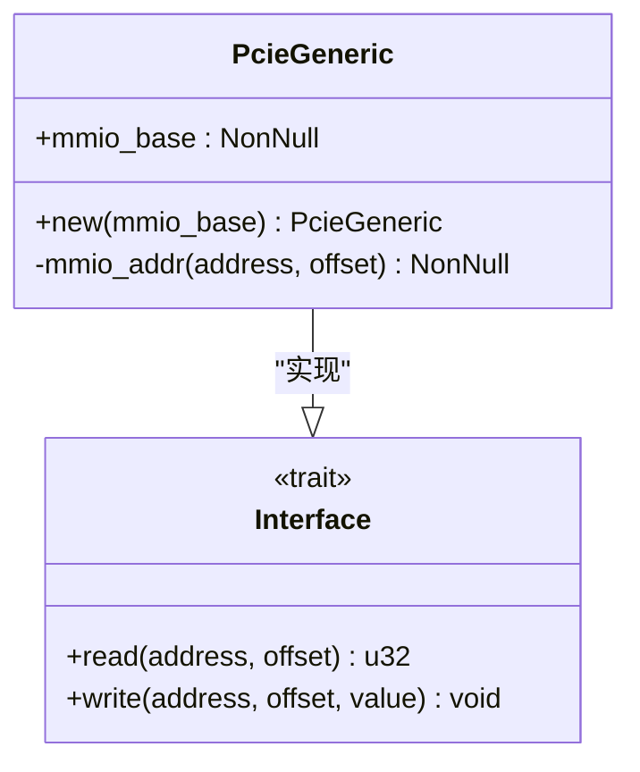
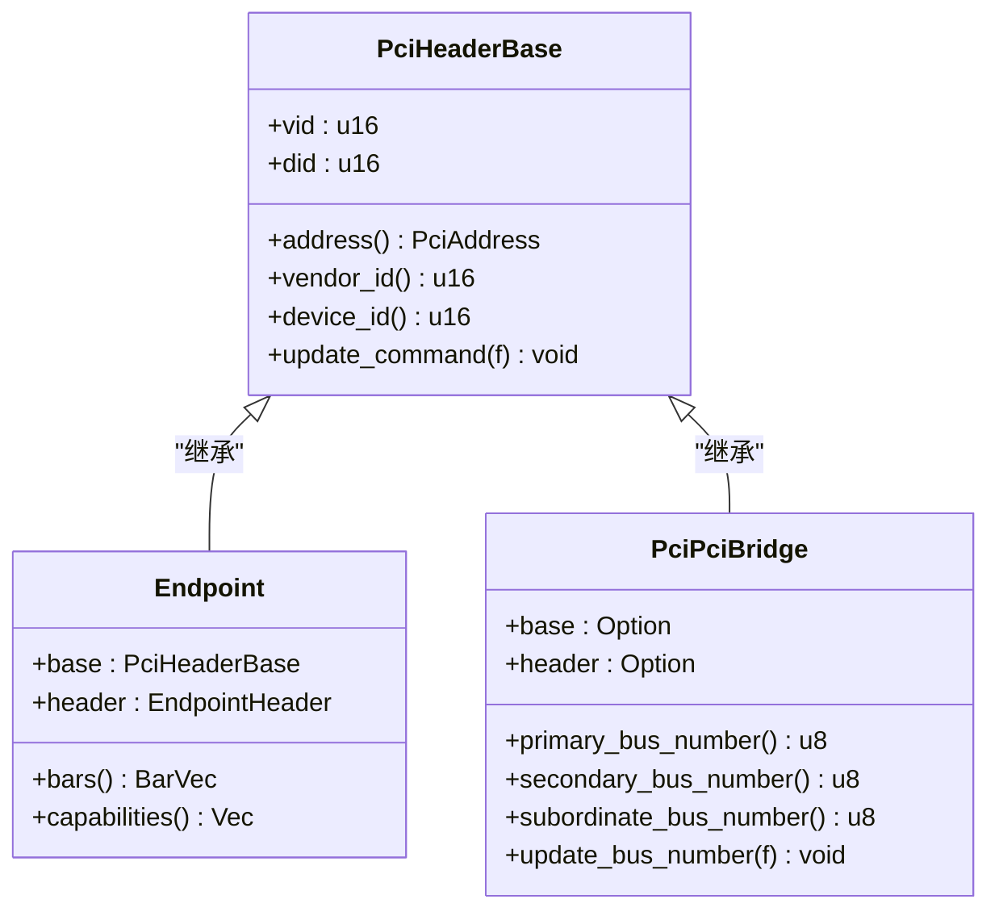
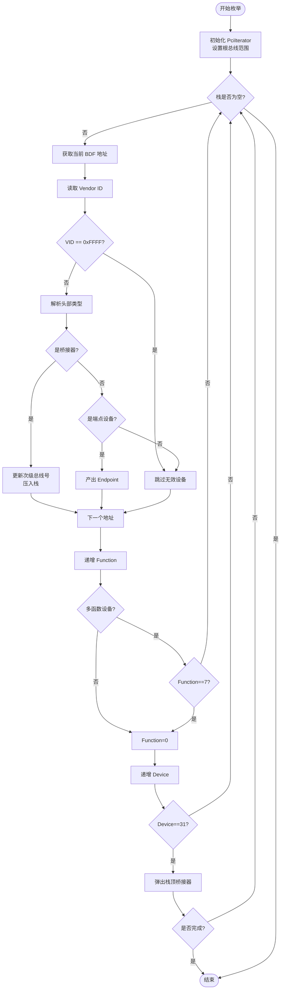

<cite>
**本文档引用文件**
- [lib.rs](file://src/lib.rs)
- [root.rs](file://src/root.rs)
- [chip/mod.rs](file://src/chip/mod.rs)
- [types/config/mod.rs](file://src/types/config/mod.rs)
- [types/config/endpoint.rs](file://src/types/config/endpoint.rs)
- [types/config/pci_bridge.rs](file://src/types/config/pci_bridge.rs)
- [types/bar.rs](file://src/types/bar.rs)
- [bar_alloc.rs](file://src/bar_alloc.rs)
</cite>

## 目录
1. [项目概述](#项目概述)
2. [核心目标与应用场景](#核心目标与应用场景)
3. [架构层级划分](#架构层级划分)
4. [PCIe基础概念简述](#pcie基础概念简述)
5. [设备枚举流程分析](#设备枚举流程分析)
6. [关键实现细节](#关键实现细节)
7. [常见问题指引](#常见问题指引)

## 项目概述

`pcie` 是一个专为 `no-std` 环境设计的轻量级 PCIe 驱动库，其核心功能是实现对系统中 PCIe 设备的自动发现（枚举）和资源配置。该库作为硬件抽象层（HAL），向上层操作系统或嵌入式应用提供了一套简洁、安全的接口，用于探索和管理复杂的 PCIe 总线拓扑结构。

**Section sources**
- [lib.rs](file://src/lib.rs#L1-L22)
- [Cargo.toml](file://Cargo.toml#L1-L30)

## 核心目标与应用场景

本项目的首要目标是提供一个在无标准库（`no-std`）环境下稳定运行的 PCIe 设备枚举解决方案。它通过扫描整个 PCIe 总线，识别出所有连接的设备（包括端点设备 Endpoint 和桥接器 Bridge），并解析其配置空间信息，从而构建出完整的硬件视图。

该库特别适用于以下场景：
- **操作系统内核开发**：在 OS 启动早期，需要探测和初始化硬件设备。
- **嵌入式系统**：资源受限的环境中，需要一个不依赖标准库的精简驱动。
- **固件开发**：如 UEFI 或 BIOS 替代品，需要直接与硬件交互。

库的设计强调了模块化和可集成性，通过依赖 `rdif-pcie` crate 来定义控制器接口（`Controller`），实现了与底层 MMIO 访问机制的解耦，使得上层可以灵活地适配不同的硬件平台。

**Section sources**
- [README.md](file://README.md#L1-L14)
- [lib.rs](file://src/lib.rs#L1-L22)
- [Cargo.toml](file://Cargo.toml#L1-L30)

## 架构层级划分

该项目采用清晰的分层架构设计，从底层硬件访问到高层逻辑处理，各司其职。

### 底层：MMIO 访问 (chip 模块)
位于 `src/chip/mod.rs` 的 `PcieGeneric` 结构体是整个库的基石。它实现了 `rdif_pcie::Interface` trait，负责将 PCI 地址转换为物理内存映射 I/O (MMIO) 地址，并执行实际的 volatile 读写操作。`mmio_addr` 函数根据 PCIe 的 BDF（总线-设备-功能）地址计算出对应的 MMIO 偏移量，确保了对配置空间的安全访问。

**Diagram sources**
- [chip/mod.rs](file://src/chip/mod.rs#L1-L51)

**Section sources**
- [chip/mod.rs](file://src/chip/mod.rs#L1-L51)

### 中层：配置解析 (types 模块)
`src/types` 目录下的模块负责解析从硬件读取的原始数据。`PciHeaderBase` 是所有设备类型的基础，它封装了通用的配置寄存器（如 Vendor ID, Device ID, Command, Status）。在此基础上，`Endpoint` 和 `PciPciBridge` 结构体分别代表端点设备和 PCI-to-PCI 桥接器，它们利用 `pci_types` 库提供的类型安全 API 来解析特定于设备类型的头部信息。

**Diagram sources**
- [types/config/mod.rs](file://src/types/config/mod.rs#L1-L131)
- [types/config/endpoint.rs](file://src/types/config/endpoint.rs#L1-L237)
- [types/config/pci_bridge.rs](file://src/types/config/pci_bridge.rs#L1-L110)

**Section sources**
- [types/config/mod.rs](file://src/types/config/mod.rs#L1-L131)
- [types/bar.rs](file://src/types/bar.rs#L1-L248)

### 上层：设备枚举逻辑 (root 模块)
`src/root.rs` 中的 `enumerate_by_controller` 函数是用户的主要入口点。它接收一个实现了 `PcieController` trait 的实例，并返回一个 `PciIterator` 迭代器。该迭代器采用深度优先搜索（DFS）算法遍历整个 PCIe 树状拓扑，逐个发现并生成 `Endpoint` 对象。

**Diagram sources**
- [root.rs](file://src/root.rs#L1-L192)

**Section sources**
- [root.rs](file://src/root.rs#L1-L192)
- [lib.rs](file://src/lib.rs#L1-L22)

## PCIe基础概念简述

为了便于理解，以下是几个关键术语的解释：

- **配置空间 (Configuration Space)**：每个 PCIe 设备都有一段 256 字节（或扩展至 4KB）的特殊内存区域，用于存储设备的身份信息（如 VID/DID）、能力列表和控制寄存器。本库通过 MMIO 访问此空间。
- **BAR (Base Address Register)**：配置空间中的一组寄存器，用于声明设备所需的内存或 I/O 地址范围。`BarVec` 结构体负责解析这些寄存器。
- **Header Type**：配置空间中的一个字段，指示设备的类型（如普通端点、PCI 桥、CardBus 桥等）。代码通过 `header_type()` 方法来区分不同设备。

## 设备枚举流程分析

一个典型的调用流程如下：

1.  用户创建一个 `PcieGeneric` 实例，并传入 MMIO 基地址。
2.  调用 `enumerate_by_controller` 函数，传入 `PcieGeneric` 的可变引用。
3.  该函数返回一个 `PciIterator` 迭代器。
4.  在循环中调用迭代器的 `next()` 方法，每次调用都会触发一次设备探测。
5.  `PciIterator` 内部会遍历所有可能的 BDF 组合，对于每个有效的设备地址，它会：
    - 创建 `PciHeaderBase` 实例以读取基础信息。
    - 根据 `header_type` 判断设备类型。
    - 若为端点设备，则构造并返回一个 `Endpoint` 对象。
    - 若为桥接器，则将其压入内部栈，并开始探索其下游总线。
6.  当所有设备都被枚举完毕后，迭代器返回 `None`。

**Section sources**
- [root.rs](file://src/root.rs#L1-L192)
- [types/config/mod.rs](file://src/types/config/mod.rs#L1-L131)

## 关键实现细节

### volatile 读写
在 `chip/mod.rs` 中，所有的 MMIO 读写操作都使用了 `read_volatile` 和 `write_volatile`。这是至关重要的，因为它告诉编译器不要优化掉这些看似“无用”的内存访问，确保每一次读写都真实地发生，这对于与硬件通信是必需的。

### 栈式 DFS 遍历
`PciIterator` 使用一个 `Vec<Bridge>` 作为栈来管理桥接器的遍历。每当发现一个桥接器时，就将其 `subordinate_bus_number` 加一，并将该桥接器及其关联的起始设备号压入栈。当探索完一个子树后，再从栈中弹出，回到上一级总线。这种设计高效地处理了树状的 PCIe 拓扑。

### BAR 资源分配
虽然本库的核心是枚举，但它也集成了 `SimpleBarAllocator`（来自 `rdif-pcie`），允许在发现设备后为其重新分配 BAR 地址。`Endpoint::realloc_bar` 方法会先禁用设备的内存/IO使能位，然后请求新的地址，并写回配置空间，最后重新启用设备。

## 常见问题指引

### 为何 VID 为 0xFFFF 表示设备不存在？
在 PCIe 规范中，如果向一个不存在的设备地址发起配置读取，返回的 Vendor ID (VID) 会被强制设为 `0xFFFF`。因此，在 `PciHeaderBase::new` 函数中，一旦检测到 VID 为 `0xFFFF`，就会立即返回 `None`，表示该 BDF 位置没有有效设备。

### 如何处理多函数设备？
PCIe 设备可以包含多个独立的功能单元（Function）。`PciHeaderBase` 提供了 `has_multiple_functions()` 方法来查询设备是否为多函数设备。在 `PciIterator` 的遍历逻辑中，`is_mulitple_function` 标志被用来决定是否需要遍历 `function` 从 0 到 7 的所有可能值。对于单函数设备，只需检查 `function=0` 即可。

**Section sources**
- [types/config/mod.rs](file://src/types/config/mod.rs#L1-L131)
- [root.rs](file://src/root.rs#L1-L192)