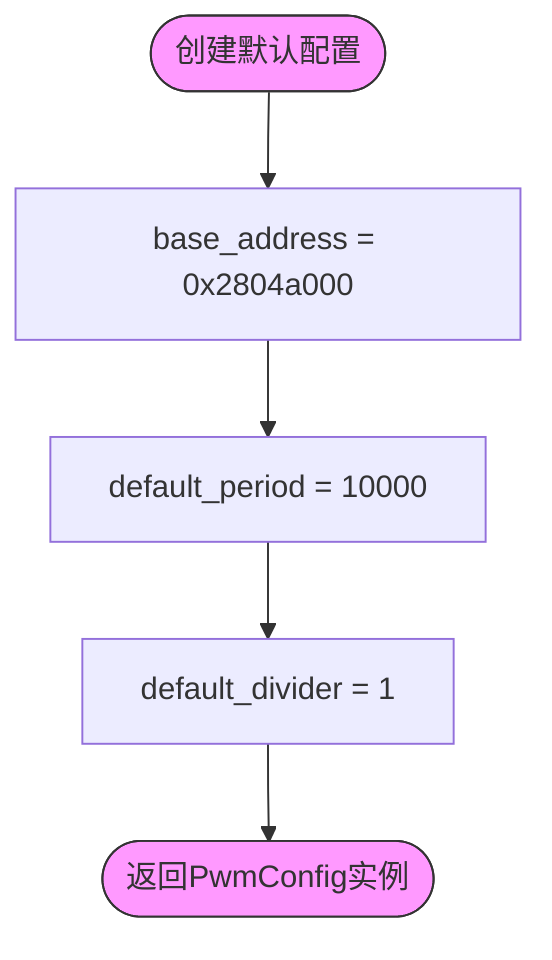
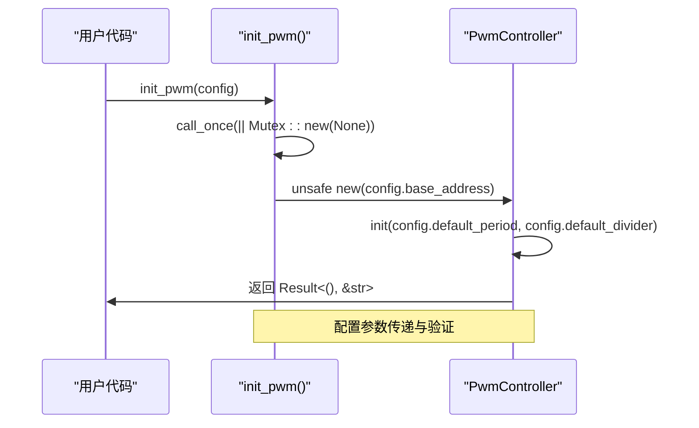

<cite>
**本文档引用文件**
- [lib.rs](file://src/lib.rs)
</cite>

## 目录
1. [引言](#引言)
2. [PwmConfig结构体设计目的](#pwmconfig结构体设计目的)
3. [字段详细说明](#字段详细说明)
4. [Default trait实现分析](#default-trait实现分析)
5. [自定义配置实例](#自定义配置实例)
6. [初始化流程中的角色](#初始化流程中的角色)
7. [Copy与Clone特性优势](#copy与clone特性优势)

## 引言

本文档全面阐述`PwmConfig`结构体的设计理念、核心功能及使用方法。该结构体是Phytium Pi平台PWM驱动的核心配置组件，旨在为开发者提供一种类型安全、易于使用的硬件配置方式。

**Section sources**
- [lib.rs](file://src/lib.rs#L1-L315)

## PwmConfig结构体设计目的

`PwmConfig`结构体的设计目的是封装PWM控制器的所有可配置参数，为驱动的初始化过程提供一个统一且清晰的接口。通过将硬件相关的配置信息集中管理，该结构体实现了以下目标：

1. **抽象硬件细节**：将底层寄存器地址和默认值等平台特定信息封装在结构体内，向上层应用屏蔽复杂性。
2. **提高代码可读性**：使用具名字段替代分散的常量或魔法数字，使配置意图更加明确。
3. **增强可维护性**：当硬件布局发生变化时，只需修改结构体的默认实现，无需改动调用代码。
4. **支持灵活配置**：允许用户根据具体应用场景覆盖默认值，实现定制化配置。

该设计遵循了嵌入式系统开发中"配置与代码分离"的最佳实践，使得驱动既能在大多数情况下开箱即用，又能满足特殊需求下的定制要求。

**Section sources**
- [lib.rs](file://src/lib.rs#L180-L190)

## 字段详细说明

### base_address 字段

`base_address`字段用于指定PWM控制器寄存器的内存映射起始地址。该地址是访问和控制硬件外设的基础，所有寄存器操作都基于此基地址进行偏移计算。

- **用途**：作为`PwmController::new`方法的输入参数，建立对物理寄存器的内存映射访问。
- **默认值**：`0x2804a000`，对应Phytium Pi平台PWM控制器的具体硬件布局。
- **注意事项**：此值必须与平台的设备树或硬件手册保持一致，错误的地址会导致未定义行为。

**Section sources**
- [lib.rs](file://src/lib.rs#L182-L183)

### default_period 字段

`default_period`字段定义PWM信号的初始周期计数值，直接决定了输出波形的基本频率特性。

- **用途**：在`init_pwm`函数调用时传递给`PwmController::init`方法，设置PWM计数器的溢出周期。
- **默认值**：`10000`，适用于常见的电机控制、LED调光等场景，能提供平滑的控制效果。
- **影响**：周期值越大，PWM分辨率越高，但最大输出频率越低；反之亦然。

**Section sources**
- [lib.rs](file://src/lib.rs#L184-L185)

### default_divider 字段

`default_divider`字段设置时钟分频系数，用于调节PWM模块的输入时钟频率。

- **用途**：与`default_period`配合，在`PwmController::init`中共同决定最终的PWM输出频率。
- **默认值**：`1`，表示2分频（根据硬件寄存器定义，实际分频系数为值+1）。
- **灵活性**：通过调整分频系数，可以在不改变周期计数精度的前提下，大幅调整输出频率范围。

**Section sources**
- [lib.rs](file://src/lib.rs#L186-L187)

## Default trait实现分析

`PwmConfig`结构体实现了`Default` trait，提供了合理的默认配置，极大简化了常见场景下的初始化工作。



**Diagram sources**
- [lib.rs](file://src/lib.rs#L192-L198)

该实现逻辑具有以下特点：

1. **平台适配性**：默认值针对Phytium Pi平台进行了优化，确保在标准环境下无需额外配置即可正常工作。
2. **实用性考量**：选择10000作为默认周期值，在保证足够分辨率的同时避免了过高的计数频率。
3. **最小化配置**：通过提供完整的默认配置，用户可以仅用一行代码完成初始化：
   ```rust
   init_pwm(PwmConfig::default())?;
   ```

这种设计体现了Rust语言"零成本抽象"的理念——既提供了高级别的便利性，又不会引入运行时开销。

**Section sources**
- [lib.rs](file://src/lib.rs#L192-L198)

## 自定义配置实例

尽管默认配置适用于大多数情况，但`PwmConfig`也支持根据具体硬件需求进行定制。以下是几个典型的使用场景：

### 调整PWM频率

当需要更高或更低的PWM频率时，可以通过修改周期和分频系数来实现：

```rust
let config = PwmConfig {
    default_period: 5000,      // 缩短周期以提高频率
    default_divider: 3,        // 增加分频以降低频率
    ..PwmConfig::default()     // 其余字段保持默认
};
init_pwm(config)?;
```

### 多个PWM实例配置

利用`Copy`和`Clone`特性，可以轻松创建并微调多个相似配置：

```rust
let mut config1 = PwmConfig::default();
config1.base_address = 0x2804a000;
config1.default_period = 8000;

let mut config2 = config1;  // 复制配置
config2.base_address = 0x2804b000;  // 修改基地址以适应第二个PWM控制器
```

这些实例展示了如何在保持代码简洁的同时，实现灵活的硬件适配。

**Section sources**
- [lib.rs](file://src/lib.rs#L180-L190)

## 初始化流程中的角色

`PwmConfig`在整个PWM初始化流程中扮演着关键的角色，连接了高层配置与底层硬件操作。



**Diagram sources**
- [lib.rs](file://src/lib.rs#L200-L220)

其主要职责包括：

1. **参数传递**：作为`init_pwm`函数的唯一参数，集中传递所有必要的配置信息。
2. **配置验证**：虽然当前实现较为简单，但该结构体为未来添加配置验证逻辑提供了良好的扩展点。
3. **生命周期管理**：与`Once<Mutex<Option<PwmController>>>`配合，确保PWM控制器只被初始化一次。

通过这种设计，初始化接口保持了简洁性，同时保留了足够的灵活性以应对复杂的配置需求。

**Section sources**
- [lib.rs](file://src/lib.rs#L200-L220)

## Copy与Clone特性优势

`PwmConfig`派生了`Copy`和`Clone` trait，这一设计带来了显著的使用便利性：

1. **值语义传递**：结构体可以在函数间自由传递而无需考虑所有权问题，简化了API设计。
2. **高效复制**：由于所有字段都是`Copy`类型，整个结构体的复制是零成本的按位拷贝。
3. **灵活构造**：支持"结构体更新语法"（`..PwmConfig::default()`），可以方便地基于默认配置创建变体。
4. **无堆分配**：避免了动态内存分配，符合嵌入式系统对确定性和性能的要求。

这些特性使得`PwmConfig`既安全又高效，完美契合了Rust在系统编程领域的优势。

**Section sources**
- [lib.rs](file://src/lib.rs#L180)