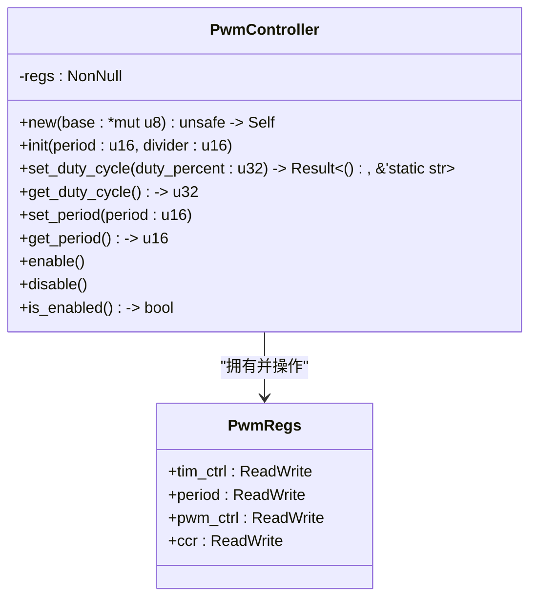

<cite>
**本文档中引用的文件**
- [lib.rs](file://src/lib.rs)
</cite>

## 目录
1. [引言](#引言)
2. [核心组件](#核心组件)
3. [方法详细说明](#方法详细说明)
4. [线程安全与调用上下文](#线程安全与调用上下文)
5. [使用示例](#使用示例)

## 引言

本技术文档旨在为 `PwmController` 结构体的所有公共方法提供详尽的参考说明。该结构体是 Phytium Pi 平台 PWM（脉宽调制）驱动的核心，用于控制硬件 PWM 信号的生成。文档将深入解析每个方法的功能、实现细节、参数含义、错误处理以及底层硬件交互机制。

**Section sources**
- [lib.rs](file://src/lib.rs#L60-L315)

## 核心组件

`PwmController` 是一个封装了对特定内存映射寄存器进行读写操作的结构体。它通过 `NonNull<PwmRegs>` 智能指针安全地持有指向硬件寄存器基地址的指针，并利用 `tock-registers` 库提供的类型安全接口来访问这些寄存器。其主要功能包括初始化 PWM 控制器、设置和获取占空比与周期、以及控制 PWM 输出的使能状态。



**Diagram sources**
- [lib.rs](file://src/lib.rs#L10-L57)

**Section sources**
- [lib.rs](file://src/lib.rs#L60-L90)

## 方法详细说明

### new 方法

`new` 方法是一个不安全的构造函数，用于创建 `PwmController` 的新实例。

- **安全性**: 此方法被标记为 `unsafe`，因为调用者必须保证传入的 `base` 指针指向一个有效的、可访问的 PWM 寄存器内存区域。如果指针无效，后续的寄存器读写操作将导致未定义行为。
- **安全封装建议**: 建议在更高层的初始化代码中（如 `init_pwm` 函数）调用此方法，并确保基地址来自可靠的配置源，从而避免直接暴露给最终用户。

**Section sources**
- [lib.rs](file://src/lib.rs#L92-L98)

### init 方法

`init` 方法负责对 PWM 控制器进行完整的初始化配置。

- **参数含义**:
  - `period`: 设置 PWM 波形的计数周期值，决定了 PWM 信号的基本频率。
  - `divider`: 设置时钟分频系数，用于从系统时钟分频得到 PWM 计数器的时钟源。
- **内部执行流程**:
  1. 执行软件复位 (`SW_RST`)，将控制器恢复到初始状态。
  2. 等待复位完成。
  3. 配置分频系数 (`DIV`) 并禁用 PWM 输出。
  4. 使用 `period` 参数设置周期寄存器 (`PERIOD::CCR`)。
  5. 配置 PWM 工作模式为比较模式 (`MODE::compare`) 和匹配模式 `MATCH_1_00`。
  6. 将占空比寄存器 (`CCR::CCR`) 初始化为周期值的一半，即默认 50% 占空比。
  7. 最后，使能 PWM 输出。

**Section sources**
- [lib.rs](file://src/lib.rs#L108-L140)

### set_duty_cycle 方法

`set_duty_cycle` 方法用于设置 PWM 信号的占空比。

- **输入验证**: 严格检查输入的 `duty_percent` 是否在 1 到 100 的有效范围内。若超出范围，则返回错误信息 `"Duty cycle must be between 1-100"`。
- **转换算法**: 该驱动采用反向映射逻辑。计算公式为 `duty_count = (100 - duty_percent) * period / 100`。这意味着当占空比为 100% 时，`duty_count` 为 0；当占空比为 0% 时，`duty_count` 等于周期值。这个值随后被写入 `ccr` 寄存器。
- **错误返回**: 返回 `Result` 类型，成功时为 `Ok(())`，失败时为包含静态字符串的 `Err`。

**Section sources**
- [lib.rs](file://src/lib.rs#L142-L155)

### get_duty_cycle 方法

`get_duty_cycle` 方法用于获取当前的占空比百分比。

- **读取与还原**: 从 `ccr` 寄存器读取原始的 `duty_count` 值，并结合当前的周期值，使用公式 `100 - (duty_count * 100) / period` 进行数学运算，将其还原为标准的百分比表示。此过程考虑了 `set_duty_cycle` 中使用的反向映射。

**Section sources**
- [lib.rs](file://src/lib.rs#L157-L170)

### set_period 方法

`set_period` 方法用于更改 PWM 信号的周期。

- **保持占空比**: 为了在改变周期时保持原有的占空比不变，该方法首先调用 `get_duty_cycle` 获取当前的占空比百分比，然后更新周期寄存器，最后调用 `set_duty_cycle` 将之前保存的占空比重新应用。

**Section sources**
- [lib.rs](file://src/lib.rs#L172-L180)

### get_period 方法

`get_period` 方法从 `period` 寄存器中读取当前的周期计数值，并将其作为 `u16` 类型返回。

**Section sources**
- [lib.rs](file://src/lib.rs#L182-L185)

### enable, disable 和 is_enabled 方法

这三个方法直接操作 `tim_ctrl` 寄存器中的 `ENABLE` 位。
- `enable`: 将 `ENABLE` 位置 1，启动 PWM 信号输出。
- `disable`: 将 `ENABLE` 位清零，停止 PWM 信号输出。
- `is_enabled`: 读取 `ENABLE` 位的值，若为非零则返回 `true`，否则返回 `false`。

**Section sources**
- [lib.rs](file://src/lib.rs#L187-L205)

## 线程安全与调用上下文

- **线程安全性**: `PwmController` 实例本身不是线程安全的。然而，在全局单例模式下，通过 `GLOBAL_PWM` 静态变量和 `spin::Mutex` 的组合，可以确保对 PWM 资源的安全并发访问。`api` 模块中的便捷函数（如 `set_duty_cycle`）正是利用了这种机制。
- **可重入性**: 在单个线程内，只要不违反借用规则，这些方法是可重入的。但在多线程环境下，必须依赖外部同步原语（如 `Mutex`）。
- **调用上下文**: 由于模块使用了 `#![no_std]` 属性，该驱动适用于无操作系统或资源受限的嵌入式环境，不依赖于标准库。

**Section sources**
- [lib.rs](file://src/lib.rs#L207-L250)

## 使用示例

以下代码展示了如何使用 `api` 模块中的便捷函数来操作 PWM：

```rust
// 1. 首先初始化 PWM 控制器
let config = PwmConfig::default();
init_pwm(config).expect("Failed to initialize PWM");

// 2. 设置占空比为 75%
set_duty_cycle(75).expect("Failed to set duty cycle");

// 3. 获取当前占空比
let current_duty = get_duty_cycle().unwrap();
println!("Current duty cycle: {}%", current_duty);

// 4. 更改周期
set_period(8000).expect("Failed to set period");

// 5. 禁用 PWM 输出
disable();

// 6. 检查 PWM 状态
if !is_enabled() {
    println!("PWM is disabled");
}
```

**Section sources**
- [lib.rs](file://src/lib.rs#L207-L315)