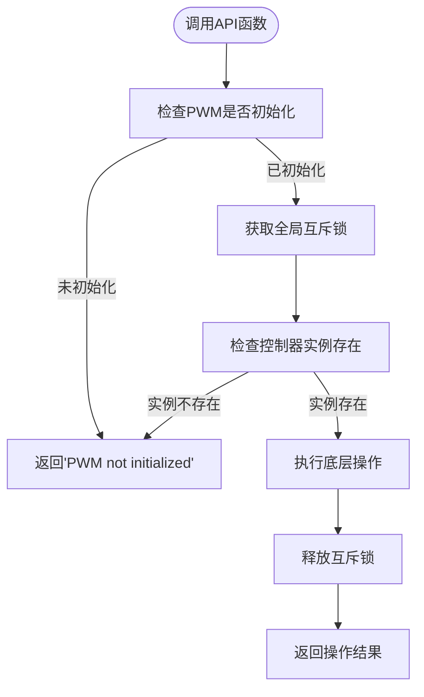

# api模块函数文档

<cite>
**Referenced Files in This Document**  
- [lib.rs](file://src/lib.rs)
</cite>

## 目录
1. [引言](#引言)
2. [API函数功能语义与映射关系](#api函数功能语义与映射关系)
3. [全局实例管理机制](#全局实例管理机制)
4. [错误处理设计](#错误处理设计)
5. [调用同步性说明](#调用同步性说明)
6. [完整调用示例链](#完整调用示例链)
7. [模块导出机制](#模块导出机制)

## 引言
`api` 模块为 Phytium Pi 平台的 PWM（脉宽调制）驱动提供了高层级的便捷函数接口。该模块封装了底层 `PwmController` 的复杂操作，通过统一的 API 设计简化了嵌入式系统中 PWM 功能的配置与控制。所有函数均以阻塞同步方式执行，适用于对实时性要求较高的应用场景。

## API函数功能语义与映射关系
`api` 模块导出了七个核心函数，分别对应 PWM 控制器的关键操作，并通过宏机制自动映射到底层 `PwmController` 方法：

### set_duty_cycle
设置 PWM 输出的占空比百分比值（1-100）。此函数映射到底层 `PwmController::set_duty_cycle` 方法，用于调节输出信号的有效电平持续时间。

[SPEC SYMBOL](file://src/lib.rs#L270-L272)

### get_duty_cycle
获取当前 PWM 信号的占空比百分比值。此函数映射到底层 `PwmController::get_duty_cycle` 方法，返回一个表示当前占空比的无符号整数。

[SPEC SYMBOL](file://src/lib.rs#L275-L277)

### set_period
设置 PWM 波形的周期计数值。此函数映射到底层 `PwmController::set_period` 方法，在更新周期的同时会自动保持原有占空比不变。

[SPEC SYMBOL](file://src/lib.rs#L280-L286)

### get_period
获取当前 PWM 波形的周期计数值。此函数映射到底层 `PwmController::get_period` 方法，返回当前配置的周期长度。

[SPEC SYMBOL](file://src/lib.rs#L288-L291)

### enable
启用 PWM 输出通道。此函数映射到底层 `PwmController::enable` 方法，激活硬件 PWM 信号输出。

[SPEC SYMBOL](file://src/lib.rs#L293-L298)

### disable
禁用 PWM 输出通道。此函数映射到底层 `PwmController::disable` 方法，停止硬件 PWM 信号输出。

[SPEC SYMBOL](file://src/lib.rs#L301-L305)

### is_enabled
检查 PWM 输出是否处于启用状态。此函数映射到底层 `PwmController::is_enabled` 方法，返回布尔值指示当前使能状态。

[SPEC SYMBOL](file://src/lib.rs#L309-L312)

**Section sources**
- [lib.rs](file://src/lib.rs#L270-L312)

## 全局实例管理机制
所有 `api` 函数通过 `with_pwm!` 宏实现对全局 `PwmController` 实例的安全访问。该宏自动处理以下关键逻辑：
- 检查全局单例 `GLOBAL_PWM` 是否已初始化
- 获取互斥锁以确保线程安全
- 验证控制器实例是否存在
- 在作用域内安全地调用底层方法

这种设计使得用户无需手动管理 `PwmController` 的生命周期或同步访问，显著降低了使用复杂度和出错风险。

**Diagram sources**
- [lib.rs](file://src/lib.rs#L247-L258)

**Section sources**
- [lib.rs](file://src/lib.rs#L247-L258)
- [lib.rs](file://src/lib.rs#L215-L215)

## 错误处理设计
所有 `api` 函数采用 `Result<T, &str>` 类型作为返回值，实现了统一的错误传播机制：
- 成功时返回 `Ok(T)`，其中 T 为具体返回值类型
- 失败时返回 `Err(&'static str)`，携带描述性的错误信息字符串

这种设计便于上层应用进行模式匹配和错误处理，例如在初始化未完成或参数越界时提供清晰的诊断信息。

**Section sources**
- [lib.rs](file://src/lib.rs#L270-L312)

## 调用同步性说明
`api` 模块的所有函数均为**阻塞同步调用**。这意味着函数调用将一直等待直到对应的硬件操作完成后再返回控制权。这一特性特别适用于需要精确时序控制的嵌入式场景，确保了操作的确定性和可预测性。

**Section sources**
- [lib.rs](file://src/lib.rs#L270-L312)

## 完整调用示例链
以下是一个典型的 PWM 参数动态调节流程示例：

1. 初始化 PWM 控制器并设置默认参数
2. 使用 `set_period(5000)` 将周期调整为 5000 计数单位
3. 调用 `get_period()` 验证新周期已生效
4. 使用 `set_duty_cycle(75)` 设置 75% 占空比
5. 调用 `get_duty_cycle()` 确认占空比设置正确
6. 执行 `enable()` 启动 PWM 输出
7. 在需要时调用 `is_enabled()` 检查输出状态
8. 最终通过 `disable()` 停止 PWM 输出

该流程展示了如何通过高层 API 实现完整的 PWM 控制而无需接触底层细节。

**Section sources**
- [lib.rs](file://src/lib.rs#L270-L312)

## 模块导出机制
`api` 模块通过 `pub use api::*;` 语句将所有公共函数重新导出到 crate 根命名空间。这一设计简化了外部依赖的导入路径，开发者可以直接通过 `pwm_driver::set_duty_cycle(...)` 等形式调用函数，而无需写明完整的模块路径 `pwm_driver::api::set_duty_cycle(...)`，从而提升了开发体验和代码可读性。

**Section sources**
- [lib.rs](file://src/lib.rs#L315-L315)