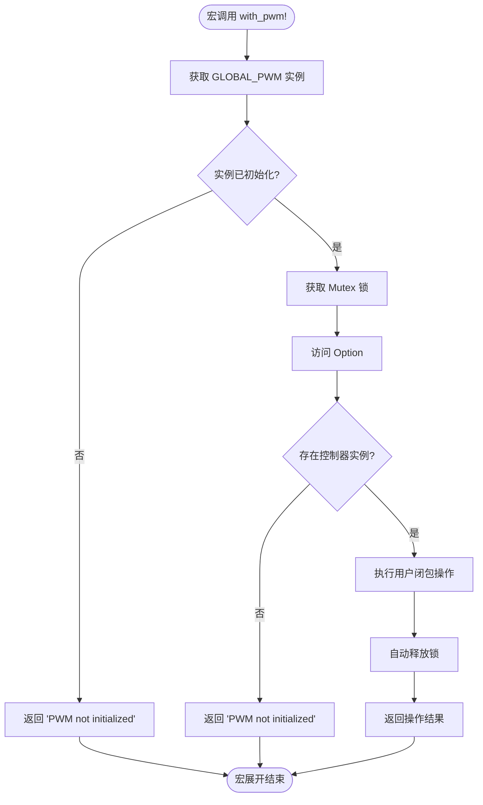
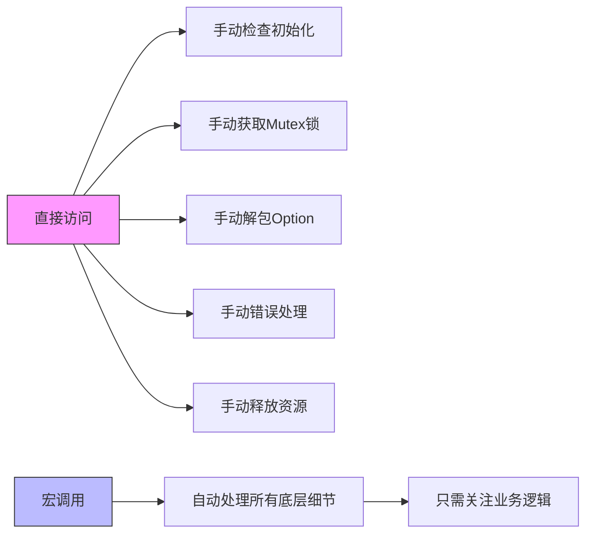
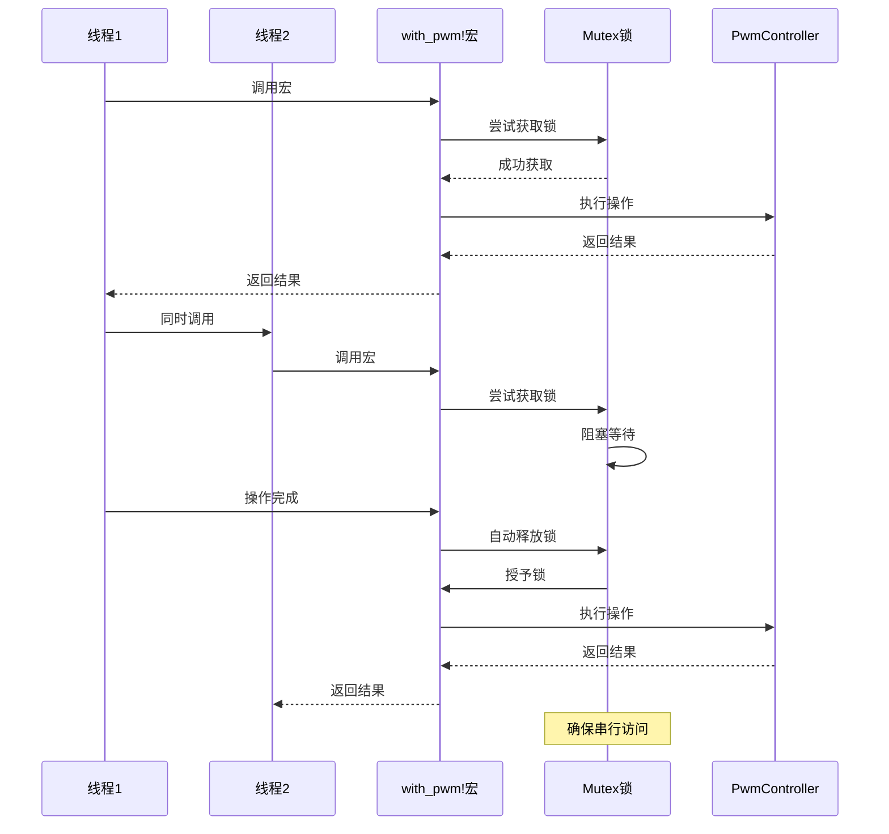

# with_pwm!宏文档

<cite>
**Referenced Files in This Document **  
- [lib.rs](file://src/lib.rs)
</cite>

## 目录
1. [引言](#引言)  
2. [核心组件](#核心组件)  
3. [with_pwm!宏设计原理](#with_pwm宏设计原理)  
4. [运行时行为分析](#运行时行为分析)  
5. [使用示例](#使用示例)  
6. [直接访问与宏调用对比](#直接访问与宏调用对比)  
7. [错误处理机制](#错误处理机制)  
8. [并发安全性分析](#并发安全性分析)  
9. [结论](#结论)

## 引言

`with_pwm!`宏是Phytium Pi平台PWM驱动中的核心抽象工具，旨在简化对全局PWM控制器的访问。该宏封装了复杂的全局状态管理、初始化检查和并发控制逻辑，为用户提供了一个安全、简洁的接口来执行PWM操作。本文档深入解析该宏的设计原理与运行时行为，详细说明其如何解决嵌入式系统中常见的资源管理和线程安全问题。

## 核心组件

`with_pwm!`宏依赖于几个关键组件协同工作：

- `GLOBAL_PWM`：一个静态的`Once<Mutex<Option<PwmController>>>`实例，确保PWM控制器的单例性和线程安全初始化。
- `PwmController`：代表PWM硬件控制器的核心结构体，提供对寄存器的类型安全访问。
- `init_pwm`函数：负责在首次调用时初始化全局PWM实例。

这些组件共同构成了一个健壮的资源管理框架，而`with_pwm!`宏则是用户与这个框架交互的主要方式。

**Section sources**
- [lib.rs](file://src/lib.rs#L214-L220)
- [lib.rs](file://src/lib.rs#L86-L212)

## with_pwm!宏设计原理

### 语法结构

`with_pwm!`宏接受一个闭包表达式作为参数（表示为`$op:expr`）。该闭包接收一个可变引用`&mut PwmController`，允许执行任何修改控制器状态的操作。宏的返回值类型由闭包决定，通常为`Result<T, &'static str>`以支持错误传播。

### 展开逻辑

当宏被调用时，它会展开为一系列安全的全局状态访问代码：

1. 首先获取`GLOBAL_PWM`静态实例的引用。
2. 检查该实例是否已完成初始化（通过`Once`的`get()`方法）。
3. 若已初始化，则通过`Mutex::lock()`获得互斥锁，安全地访问内部的`Option<PwmController>`。
4. 检查`Option`是否包含有效值（即PWM是否已成功初始化）。
5. 如果存在有效实例，则将`&mut PwmController`传递给用户提供的闭包执行操作。
6. 如果任一检查失败，则返回`"PWM not initialized"`错误。

这种设计将复杂的错误处理和同步原语完全封装在宏内部，极大地降低了用户代码的认知负担。



**Diagram sources **
- [lib.rs](file://src/lib.rs#L248-L267)

## 运行时行为分析

`with_pwm!`宏的运行时行为可以分为以下几个阶段：

1. **初始化检查阶段**：通过`Once::get()`方法快速判断全局实例是否已经完成初始化。这是一个无锁操作，性能开销极小。
2. **锁获取阶段**：只有在实例已初始化的情况下才会尝试获取`Mutex`锁。这减少了不必要的锁竞争，提高了并发性能。
3. **状态验证阶段**：在持有锁的情况下检查`Option`是否为`Some`。这是必要的，因为即使`Once`已完成，`Option`仍可能因初始化失败而为空。
4. **操作执行阶段**：将解引用后的`PwmController`引用传递给闭包，执行用户定义的操作。
5. **资源清理阶段**：`MutexGuard`的析构函数会自动释放锁，确保不会发生死锁。

整个流程严格遵循"先检查，后操作"的原则，在保证安全性的同时尽可能减少性能开销。

**Section sources**
- [lib.rs](file://src/lib.rs#L248-L267)

## 使用示例

### 单条命令调用

设置PWM占空比：
```rust
let result = with_pwm!(|controller| controller.set_duty_cycle(75));
```

获取当前占空比：
```rust
let duty_cycle = with_pwm!(|controller| Ok(controller.get_duty_cycle()));
```

### 连续操作组合

在一个原子操作中执行多个PWM配置：
```rust
let result = with_pwm!(|controller| {
    controller.set_period(5000);
    controller.set_duty_cycle(30)?;
    controller.enable();
    Ok(())
});
```

### 便捷API调用

通过导出的API函数间接使用宏：
```rust
// 使用便捷API
set_duty_cycle(50)?;
let current = get_duty_cycle()?;
enable()?;
```

这些示例展示了宏的灵活性和表达力，允许用户以接近直接调用方法的自然语法执行复杂操作。

**Section sources**
- [lib.rs](file://src/lib.rs#L265-L315)

## 直接访问与宏调用对比

### 直接访问GLOBAL_PWM（不推荐）

```rust
// 用户需要手动处理所有复杂性
if let Some(global_pwm) = GLOBAL_PWM.get() {
    let mut pwm_opt = global_pwm.lock();
    if let Some(ref mut controller) = pwm_opt.as_mut() {
        // 安全地执行操作
        controller.set_duty_cycle(50)?;
    } else {
        return Err("PWM not initialized");
    }
} else {
    return Err("PWM not initialized");
}
```

### 通过with_pwm!宏调用（推荐）

```rust
// 简洁明了，关注业务逻辑
with_pwm!(|controller| controller.set_duty_cycle(50))
```

对比可见，宏调用将原本冗长、易错的10+行代码简化为一行，同时保证了相同的安全性。用户无需关心`Option`的解包、`Mutex`的管理或错误处理的细节，可以专注于PWM操作本身。



**Diagram sources **
- [lib.rs](file://src/lib.rs#L248-L267)

## 错误处理机制

`with_pwm!`宏采用统一的错误处理策略：

- **未初始化错误**：当`GLOBAL_PWM`尚未通过`call_once`初始化，或`Once::get()`返回`None`时，宏立即返回`Err("PWM not initialized")`。
- **空实例错误**：即使`Once`已完成初始化，如果内部的`Option<PwmController>`为`None`（可能由于初始化过程失败），宏同样返回`"PWM not initialized"`错误。
- **操作错误**：用户闭包内部可能返回其他特定错误（如`set_duty_cycle`对无效参数的检查），这些错误会直接向上传播。

这种设计保持了错误类型的简单性，避免了引入复杂的错误枚举，同时提供了足够的信息帮助调试。

**Section sources**
- [lib.rs](file://src/lib.rs#L248-L267)

## 并发安全性分析

`with_pwm!`宏在并发环境下的表现得益于其精心设计的类型系统和同步原语：

- `GLOBAL_PWM`的`Once`类型保证了初始化的线程安全性，防止竞态条件。
- `Mutex`确保了对`PwmController`的独占访问，防止数据竞争。
- `PwmController`实现了`Send`和`Sync` trait，表明它可以安全地在线程间传递和共享。
- 宏的展开代码遵循RAII原则，利用`MutexGuard`的析构函数自动释放锁，避免死锁。

因此，多个线程可以安全地同时调用`with_pwm!`宏，操作系统会正确序列化对PWM硬件的访问，确保数据一致性和操作的原子性。



**Diagram sources **
- [lib.rs](file://src/lib.rs#L214-L220)
- [lib.rs](file://src/lib.rs#L86-L90)

## 结论

`with_pwm!`宏是一个优秀的系统编程抽象范例。它成功地将复杂的全局状态管理、并发控制和错误处理封装在一个简洁的接口背后，为用户提供了安全、高效且易于使用的API。通过深入理解其设计原理和运行时行为，开发者可以更好地利用这一工具，同时借鉴其设计理念应用于其他类似的资源管理场景。