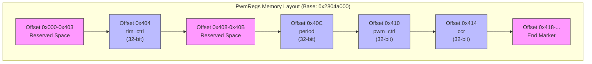

<cite>
**本文档中引用的文件**
- [lib.rs](file://src/lib.rs)
- [Cargo.toml](file://Cargo.toml)
</cite>

# 寄存器映射与内存布局

## 目录
1. [PwmRegs结构体定义](#pwmregs结构体定义)
2. [寄存器偏移量与物理地址映射](#寄存器偏移量与物理地址映射)
3. [各寄存器字段详解](#各寄存器字段详解)
4. [内存布局图示](#内存布局图示)
5. _non_reserve字段的作用
6. 精确内存偏移的重要性

## PwmRegs结构体定义

`PwmRegs`结构体通过`register_structs!`宏将硬件寄存器映射到内存空间。该宏来自`tock-registers`库，用于在Rust中安全地定义和访问硬件寄存器。

```rust
register_structs! {
    pub PwmRegs {
        (0x0 => _reserve),
        (0x404 => tim_ctrl: ReadWrite<u32, CTRL::Register>),
        (0x408 => _reserve2),
        (0x40c => period: ReadWrite<u32, PERIOD::Register>),
        (0x410 => pwm_ctrl: ReadWrite<u32, PWM_CTRL::Register>),
        (0x414 => ccr: ReadWrite<u32, CCR::Register>),
        (0x418 => @END),
    }
}
```

此定义创建了一个类型安全的寄存器结构体，其中每个字段都精确对应于特定的内存偏移位置。`ReadWrite<u32, ...>`表示这些是可读写的32位寄存器，并关联了相应的位字段定义。

**Section sources**
- [lib.rs](file://src/lib.rs#L13-L21)

## 寄存器偏移量与物理地址映射

`PwmRegs`结构体从基地址`0x2804a000`开始映射其寄存器。这个基地址是在`PwmConfig`结构体的默认实现中定义的：

```rust
impl Default for PwmConfig {
    fn default() -> Self {
        Self {
            base_address: 0x2804a000,
            default_period: 10000,
            default_divider: 1,
        }
    }
}
```

各寄存器的实际物理地址计算如下：
- `tim_ctrl`: `0x2804a000 + 0x404 = 0x2804a404`
- `period`: `0x2804a000 + 0x40c = 0x2804a40c`
- `pwm_ctrl`: `0x2804a000 + 0x410 = 0x2804a410`
- `ccr`: `0x2804a000 + 0x414 = 0x2804a414`

当调用`PwmController::new()`时，传入的基地址指针被转换为`NonNull<PwmRegs>`，从而建立了软件与硬件寄存器之间的直接映射关系。

**Section sources**
- [lib.rs](file://src/lib.rs#L207-L211)
- [lib.rs](file://src/lib.rs#L235)

## 各寄存器字段详解

### tim_ctrl@0x404 - 定时器控制寄存器

`tim_ctrl`寄存器位于偏移量`0x404`处，用于控制PWM使能和分频。其位域定义如下：

```rust
CTRL [
    SW_RST OFFSET(0) NUMBITS(1) [],
    ENABLE OFFSET(1) NUMBITS(1) [],
    DIV OFFSET(27) NUMBITS(12) [],
]
```

- **SW_RST (位0)**：软件复位位。置1时触发控制器复位，初始化后必须等待该位自动清零。
- **ENABLE (位1)**：PWM使能位。置1时启动PWM输出，置0时停止输出。
- **DIV (位27-38)**：12位分频系数，用于调节PWM时钟频率。

### period@0x40c - 周期寄存器

```rust
PERIOD [
    CCR OFFSET(0) NUMBITS(16) []
]
```

- **CCR (位0-15)**：16位计数周期值，决定了PWM波形的基本周期长度。计数器从0递增到此值后重置。

### pwm_ctrl@0x410 - PWM控制寄存器

```rust
PWM_CTRL [
    MODE OFFSET(2) NUMBITS(1) [compare = 1],
    ICOV OFFSET(7) NUMBITS(1) [],
    CMP OFFSET(4) NUMBITS(3) [
        MATCH_1 = 0b000,
        MATCH_0 = 0b001,
        MATCH_REVERSE = 0b010,
        MATCH_1_00 = 0b011,
        MATCH_0_01 = 0b100,
    ]
]
```

- **MODE (位2)**：工作模式选择，设置为1进入比较模式。
- **ICOV (位7)**：溢出中断控制位。
- **CMP (位4-6)**：3位比较模式配置，支持多种输出极性组合。

### ccr@0x414 - 比较/占空比控制寄存器

```rust
CCR [
    CCR OFFSET(0) NUMBITS(16) [],
    GPIO OFFSET(16) NUMBITS(1) [],
]
```

- **CCR (位0-15)**：16位比较值，与`period`寄存器共同决定占空比。
- **GPIO (位16)**：GPIO输出控制位，直接控制引脚状态。

**Section sources**
- [lib.rs](file://src/lib.rs#L24-L83)

## 内存布局图示



**Diagram sources**
- [lib.rs](file://src/lib.rs#L13-L21)

## _non_reserve字段的作用

在`register_structs!`宏中，`_reserve`字段具有特殊作用：

1. **占位符功能**：`(0x0 => _reserve)`和`(0x408 => _reserve2)`作为填充占位符，确保后续寄存器位于正确的偏移位置。
2. **内存对齐保证**：通过预留未使用区域，保证了寄存器布局与硬件规格完全一致。
3. **编译时验证**：`@END`标记（位于`0x418`）用于验证整个结构体的大小，防止意外的内存越界访问。

这些保留字段不会生成实际的存储空间，但参与编译时的偏移计算，确保类型系统能够正确验证内存访问的安全性。

**Section sources**
- [lib.rs](file://src/lib.rs#L14-L16)
- [lib.rs](file://src/lib.rs#L20)

## 精确内存偏移的重要性

精确的内存偏移定义对于正确的硬件访问至关重要，原因包括：

1. **硬件兼容性**：ARM架构的外设寄存器布局是固定的，任何偏移错误都会导致访问错误的硬件模块。
2. **原子性保证**：32位寄存器需要按字对齐访问，不正确的偏移可能导致非原子操作。
3. **性能优化**：直接内存映射避免了系统调用开销，但要求绝对精确的地址计算。
4. **安全性**：`tock-registers`库利用Rust类型系统，在编译时验证所有寄存器访问的正确性。

通过`register_structs!`宏，开发者可以获得类型安全、零成本抽象的硬件寄存器访问能力，同时保持与硬件规格的严格一致性。

**Section sources**
- [lib.rs](file://src/lib.rs#L13-L21)
- [Cargo.toml](file://Cargo.toml#L15)