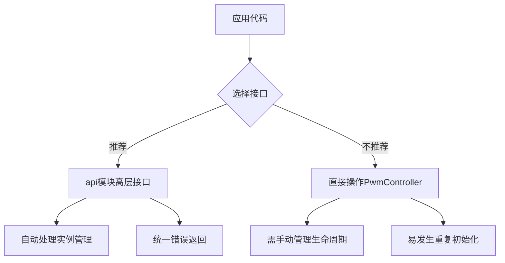

# 性能优化与安全使用指南

<cite>
**Referenced Files in This Document**   
- [lib.rs](file://src/lib.rs)
</cite>

## 目录
1. [引言](#引言)
2. [避免频繁轮询占空比](#避免频繁轮询占空比)
3. [正确配置基地址防止内存访问错误](#正确配置基地址防止内存访问错误)
4. [no_std环境下的内存管理建议](#no_std环境下的内存管理建议)
5. [set_period操作的注意事项](#set_period操作的注意事项)
6. [推荐使用高层API接口](#推荐使用高层api接口)

## 引言
本文档旨在为Phytium Pi平台PWM驱动的开发者提供最佳实践建议。基于对`phytium-pi-pwm`驱动库的深入分析，重点阐述性能优化、安全性保障和正确使用模式等关键方面。本指南特别针对嵌入式系统开发中的常见陷阱提出具体解决方案，帮助开发者构建高效、稳定且安全的PWM控制应用。

## 避免频繁轮询占空比

在实时系统中，频繁调用`get_duty_cycle`方法进行状态轮询会导致显著的性能开销。该方法每次调用都需要读取硬件寄存器并执行数学运算来计算占空比百分比，这不仅消耗CPU周期，还可能引入不必要的延迟。

推荐采用事件驱动或状态缓存机制替代轮询：

- **事件驱动架构**：通过中断或其他通知机制响应PWM状态变化，而非主动查询
- **状态缓存机制**：在本地维护一个最新的占空比状态副本，在需要时直接读取缓存值
- **条件触发检查**：仅在特定条件满足时（如定时器到期）才进行一次性的状态检查

这种设计模式能够大幅降低CPU负载，提高系统的响应性和整体效率。

**Section sources**
- [lib.rs](file://src/lib.rs#L180-L195)

## 正确配置基地址防止内存访问错误

`PwmConfig`结构体中的`base_address`字段用于指定PWM控制器寄存器的物理内存映射地址。此配置至关重要，错误的地址设置将导致非法内存访问，可能引发系统崩溃或不可预测的行为。

关键要点：
- 默认基地址为`0x2804a000`，应根据实际硬件布局验证其准确性
- 修改基地址前必须确认目标地址空间未被其他设备占用
- 在多核或多设备环境中，需确保地址分配的唯一性

不正确的基地址配置可能导致总线错误、页面故障或硬件损坏，因此必须严格验证配置参数。

**Section sources**
- [lib.rs](file://src/lib.rs#L240-L250)

## no_std环境下的内存管理建议

由于驱动运行于`no_std`环境，无法使用标准库的动态内存分配功能。在这种约束下，合理使用静态分配是保证系统稳定性的关键策略。

实施建议：
- 利用`Once<Mutex<Option<T>>>`模式实现单例资源的安全初始化
- 所有数据结构应在编译期确定大小，避免运行时堆分配
- 使用固定大小的数组和栈分配对象替代Vec等动态容器
- 通过`static`变量预分配必要的缓冲区和控制结构

这种静态内存管理模式消除了内存碎片化风险，确保了确定性的内存访问行为，非常适合实时和嵌入式应用场景。

**Section sources**
- [lib.rs](file://src/lib.rs#L252-L270)

## set_period操作的注意事项

调用`set_period`方法会短暂中断PWM输出信号。这是因为该操作涉及保存当前占空比、更新周期寄存器、然后恢复占空比的一系列步骤，在此期间PWM波形可能会出现异常或中断。

使用建议：
- 选择系统空闲时段或非关键操作窗口执行周期调整
- 对于对连续性要求极高的应用（如电机控制），应尽量减少周期变更频率
- 考虑预先计算好所有可能需要的周期值，并在初始化阶段完成配置
- 若必须在运行时更改，建议添加同步机制以协调相关外设的状态

理解这一行为特征有助于避免在敏感应用中产生意外的控制抖动或性能下降。

**Section sources**
- [lib.rs](file://src/lib.rs#L197-L208)

## 推荐使用高层API接口

驱动提供了位于`api`模块中的高层接口，相比直接操作底层`PwmController`实例具有更高的安全性和易用性。

优势包括：
- 封装了全局实例的访问逻辑，避免重复初始化
- 提供统一的错误处理机制
- 简化了常见的操作模式
- 减少了直接操作裸指针的风险

建议开发者优先使用`api::set_duty_cycle`、`api::set_period`等高层函数，而不是直接调用`PwmController`的方法。这样不仅能提高代码可读性，还能有效防止资源管理错误。

**Diagram sources**
- [lib.rs](file://src/lib.rs#L272-L315)

**Section sources**
- [lib.rs](file://src/lib.rs#L272-L315)