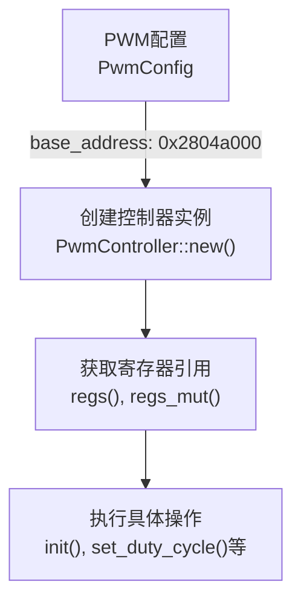
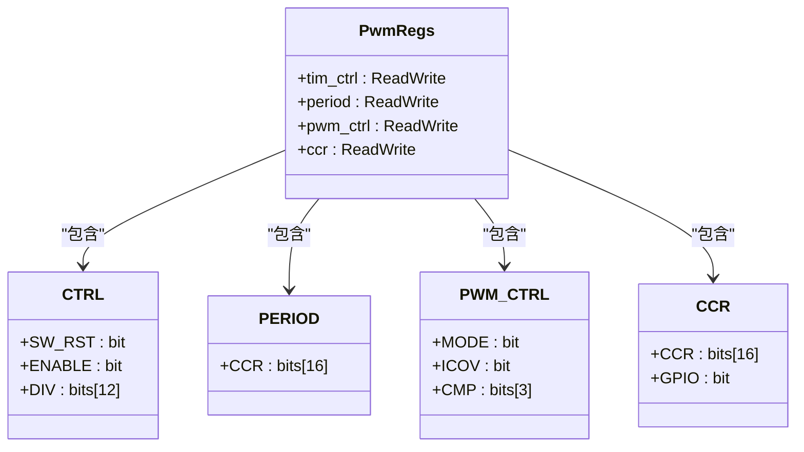

# 技术细节与最佳实践

<cite>
**本文档引用的文件**
- [lib.rs](file://src/lib.rs)
</cite>

## 目录
1. [寄存器内存布局解析](#寄存器内存布局解析)
2. [关键寄存器位字段详解](#关键寄存器位字段详解)
3. [单例模式与全局状态管理](#单例模式与全局状态管理)
4. [no_std环境下的资源管理](#nostd环境下的资源管理)
5. [性能优化建议](#性能优化建议)
6. [安全使用指南](#安全使用指南)
7. [常见问题排查](#常见问题排查)

## 寄存器内存布局解析

`PwmRegs`结构体通过`register_structs!`宏定义，精确映射到从物理地址0x2804a000起始的内存空间。该宏为每个寄存器成员指定了相对于基地址的偏移量，确保了对硬件寄存器的直接、类型安全的访问。

在初始化过程中，`PwmConfig`结构体的`base_address`字段（默认值为0x2804a000）被用作基地址。`PwmController::new`方法接收此地址并将其转换为指向`PwmRegs`结构体的非空指针（`NonNull<PwmRegs>`），从而建立软件与硬件之间的桥梁。后续所有对寄存器的读写操作都基于这个指针进行。



**Diagram sources**
- [lib.rs](file://src/lib.rs#L12-L22)
- [lib.rs](file://src/lib.rs#L149-L155)

**Section sources**
- [lib.rs](file://src/lib.rs#L12-L22)
- [lib.rs](file://src/lib.rs#L149-L155)

## 关键寄存器位字段详解

### CTRL 寄存器 (偏移量 0x404)
`CTRL`寄存器是控制核心，其位字段定义如下：
- **SW_RST (位0)**：软件复位位。置1时触发内部逻辑复位，复位完成后硬件自动清零。代码中通过先写入SET再轮询等待其变为0来完成复位流程。
- **ENABLE (位1)**：PWM使能位。控制PWM输出信号的开启与关闭。`enable()`和`disable()`方法通过修改此位实现功能。
- **DIV (位27-38)**：时钟分频系数。用于调整输入时钟频率，影响PWM波形的最终周期。`init()`函数在初始化时配置此值。

### PERIOD 寄存器 (偏移量 0x40c)
- **CCR (位0-15)**：计数周期值。定义了PWM计数器的溢出点，直接决定了PWM波形的周期长度。`set_period()`方法会更新此寄存器，并自动调整占空比以保持相对比例。

### PWM_CTRL 寄存器 (偏移量 0x410)
- **MODE (位2)**：工作模式选择。代码中固定设置为`compare`（比较模式），这是生成标准PWM波形的基础。
- **CMP (位4-6)**：比较模式配置。决定计数器与CCRx寄存器比较后的行为。代码中使用`MATCH_1_00`模式，即计数值小于CCRx时输出高电平，大于等于时输出低电平，从而产生正向PWM波形。

### CCR 寄存器 (偏移量 0x414)
- **CCR (位0-15)**：比较值/占空比控制。此值与PERIOD寄存器的值共同决定占空比。当计数器值小于CCRx时，输出一种电平；反之则输出另一种电平。
- **GPIO (位16)**：GPIO输出控制。虽然在当前代码中未直接使用，但此位可能用于控制PWM信号是否驱动对应的GPIO引脚。



**Diagram sources**
- [lib.rs](file://src/lib.rs#L24-L83)
- [lib.rs](file://src/lib.rs#L12-L22)

**Section sources**
- [lib.rs](file://src/lib.rs#L24-L83)

## 单例模式与全局状态管理

本驱动通过`spin::Once`和`Mutex<Option<PwmController>>`实现了线程安全的单例模式，确保PWM控制器在整个系统中仅被初始化一次。

`static GLOBAL_PWM: Once<Mutex<Option<PwmController>>> = Once::new();` 定义了一个静态的、惰性初始化的全局实例。`Once`保证`call_once`中的闭包只会被执行一次，即使在多核或多线程环境下也是如此。这有效防止了重复初始化。

`Mutex<Option<PwmController>>`提供了运行时的互斥访问机制。`Option`类型允许表示“未初始化”（None）和“已初始化”（Some(controller)）两种状态。`init_pwm`函数首先检查`pwm_opt.is_some()`，若为真则返回错误，阻止二次初始化。

`with_pwm!`宏封装了安全访问全局实例的复杂逻辑。它首先获取`Once`的引用，然后锁定`Mutex`，最后在持有锁的情况下调用传入的操作闭包。这一系列操作确保了对`PwmController`的任何访问都是原子且安全的。

```mermaid
sequenceDiagram
participant User as "用户代码"
participant Init as "init_pwm()"
participant Global as "GLOBAL_PWM"
participant Mutex as "Mutex&lt;Option&gt;"
User->>Init : init_pwm(config)
Init->>Global : call_once(|| ...)
Global->>Global : 确保只执行一次
Global->>Mutex : 创建并存储Mutex : : new(None)
Init->>Mutex : lock()
Mutex-->>Init : 获取锁
Init->>Init : 检查是否已初始化
Init->>Init : 创建PwmController实例
Init->>Mutex : *pwm_opt = Some(controller)
Mutex->>Init : 释放锁
Init-->>User : 返回Ok(())
User->>User : 调用api : : set_duty_cycle()
User->>with_pwm : with_pwm!(...)
with_pwm->>Global : get()
Global-->>with_pwm : 返回Some(global_pwm)
with_pwm->>Mutex : lock()
Mutex-->>with_pwm : 获取锁
with_pwm->>PwmController : $op(controller)
with_pwm->>Mutex : 释放锁
with_pwm-->>User : 返回结果
```

**Diagram sources**
- [lib.rs](file://src/lib.rs#L214-L267)
- [lib.rs](file://src/lib.rs#L247-L267)

**Section sources**
- [lib.rs](file://src/lib.rs#L214-L267)

## no_std环境下的资源管理

在`#![no_std]`环境下，该驱动展示了典型的RAII（Resource Acquisition Is Initialization）模式应用。

`PwmController`结构体自身就代表了对PWM硬件资源的所有权。其生命周期与资源的占用期严格绑定。当`PwmController`实例被创建时（通过`new`），它获得了对指定基地址处硬件的控制权。虽然当前代码没有显式的析构函数（Drop trait），但在一个更完整的系统中，可以在`impl Drop for PwmController`中添加`disable()`调用或复位逻辑，确保在对象销毁时自动释放资源（如关闭PWM输出），防止资源泄漏。

`NonNull<PwmRegs>`的使用是`no_std`编程的关键。它提供了一个可空的、不可变的裸指针包装，避免了`Box`等需要堆分配的智能指针，完全在栈上操作，符合嵌入式系统对确定性和低开销的要求。`unsafe`块的使用是必要的，因为直接操作硬件寄存器本质上是不安全的操作，开发者必须承担确保地址有效的责任。

## 性能优化建议

1.  **避免频繁调用 `get_duty_cycle`**：`get_duty_cycle`方法不仅需要读取`ccr`和`period`寄存器，还需要进行除法运算 `(duty_count * 100) / period` 来计算百分比。在实时性要求高的循环中频繁调用此函数会带来不必要的性能开销。建议应用程序缓存占空比值，仅在必要时才进行查询。

2.  **批量配置**：如果需要同时修改周期和占空比，应考虑将相关操作合并。例如，在`set_period`方法中，它已经聪明地保存了当前占空比并重新设置，避免了用户手动操作可能导致的中间状态。对于更复杂的配置，可以设计一个`configure(period, duty_percent)`方法，在一次锁操作内完成所有寄存器的修改，减少`Mutex`的争用时间。

3.  **利用硬件特性**：深入研究Phytium Pi平台的PWM硬件手册，看是否支持DMA传输或硬件自动重载等功能，以进一步减轻CPU负担。

## 安全使用指南

1.  **正确配置 `base_address`**：`PwmConfig`中的`base_address`必须准确无误地指向目标PWM控制器的物理地址。错误的地址可能导致系统崩溃、数据损坏或其他外设行为异常。务必查阅硬件手册确认正确的地址。

2.  **并发访问的自动保护**：驱动通过`Mutex`提供了内置的并发访问保护。所有通过`api`模块暴露的便捷函数（如`set_duty_cycle`, `enable`等）都通过`with_pwm!`宏间接加锁，因此可以直接在中断服务程序（ISR）或不同任务中安全调用，无需担心竞态条件。

3.  **遵循初始化顺序**：必须先成功调用`init_pwm`完成初始化，才能使用其他API。尝试在初始化前操作PWM会导致`Err("PWM not initialized")`。

4.  **处理返回错误**：`set_duty_cycle`等方法可能返回`Err`，应用程序应妥善处理这些错误，而不是忽略它们。

## 常见问题排查

1.  **初始化失败 (`PWM already initialized`)**：
    - **原因**：`init_pwm`被多次调用。
    - **解决**：检查代码逻辑，确保`init_pwm`在整个程序生命周期内只被调用一次。通常应在系统初始化阶段集中完成。

2.  **无PWM输出信号**：
    - **检查步骤**：
        a.  **确认初始化**：确保`init_pwm`已成功返回`Ok(())`。
        b.  **检查使能状态**：调用`api::is_enabled()`确认PWM是否已使能。若未使能，调用`api::enable()`。
        c.  **验证基地址**：确认`PwmConfig.base_address`的值是否与硬件手册一致。
        d.  **测量引脚**：使用示波器或万用表直接测量预期的GPIO引脚，排除接线问题。
        e.  **检查占空比**：调用`api::get_duty_cycle()`，确认占空比不是0%或100%（后者可能表现为恒定高电平）。

3.  **占空比计算不准确**：
    - **原因**：注意代码中的注释“// 计算占空比 (注意：寄存器值是反向的)”。`ccr`寄存器的值越大，实际占空比越小。确保理解这种反向关系。
    - **验证**：通过`api::set_duty_cycle(50)`设置50%占空比，用示波器观察波形是否为理想的方波。

4.  **编译错误或链接问题**：
    - **检查依赖**：确保`Cargo.toml`中正确声明了`tock-registers`, `log`, 和 `spin`等依赖项及其版本。