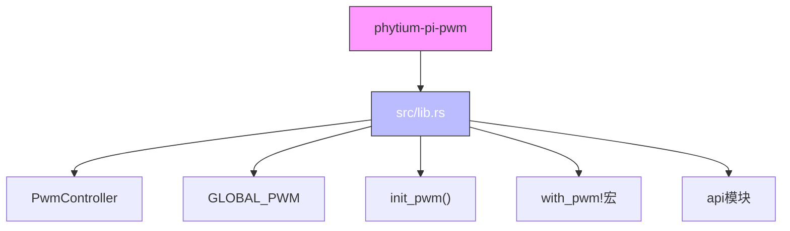
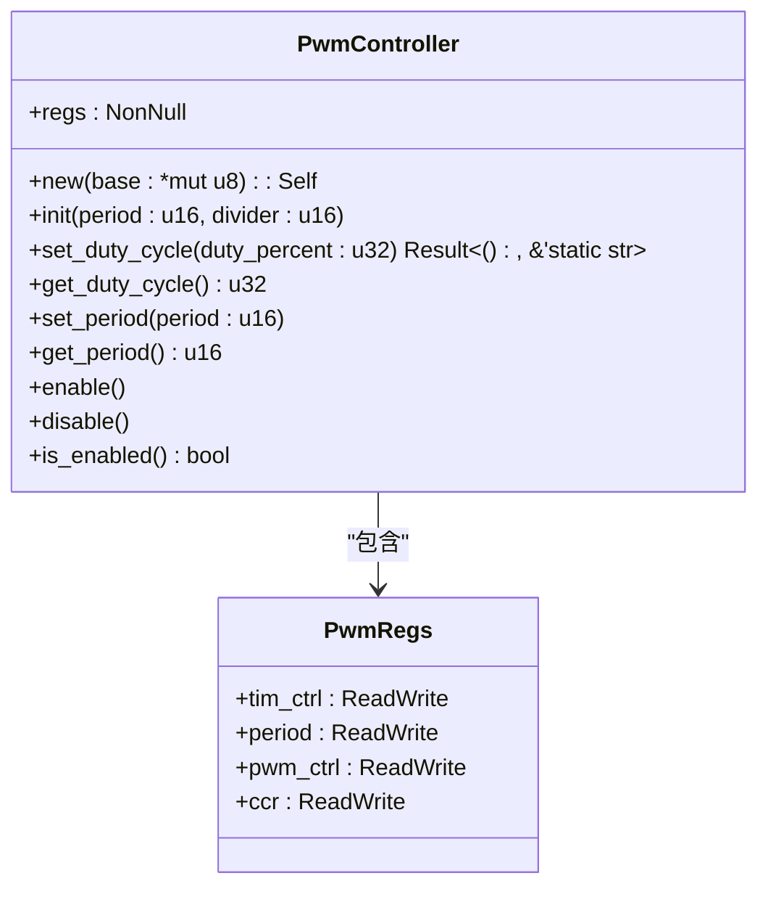
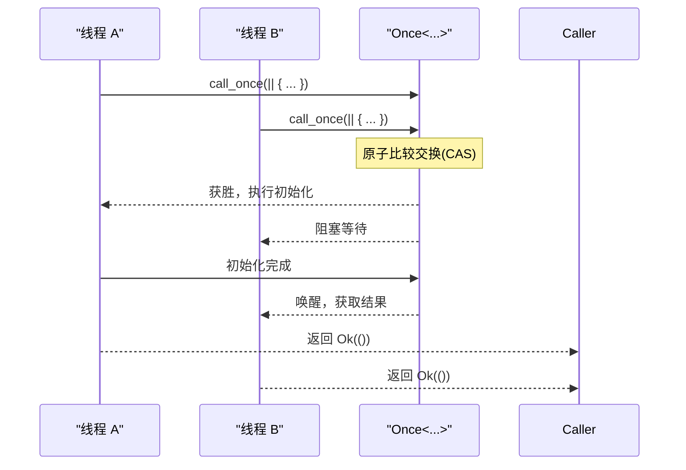
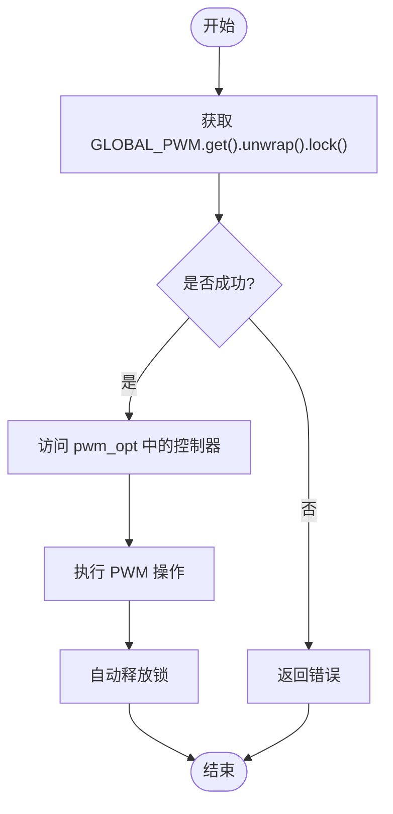
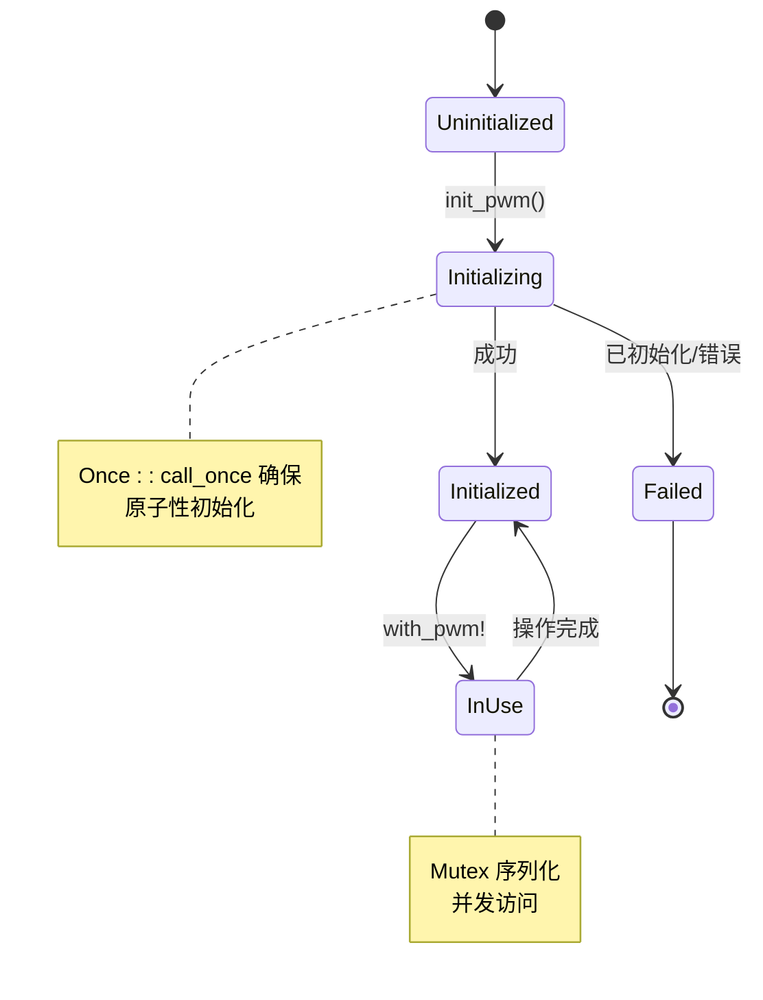

# 线程安全与全局状态管理

<cite>
**Referenced Files in This Document**  
- [lib.rs](file://src/lib.rs)
</cite>

## 目录
1. [引言](#引言)
2. [项目结构](#项目结构)
3. [核心组件分析](#核心组件分析)
4. [全局状态初始化机制](#全局状态初始化机制)
5. [运行时互斥访问控制](#运行时互斥访问控制)
6. [并发安全性保障](#并发安全性保障)
7. [生命周期管理流程](#生命周期管理流程)
8. [设计优势总结](#设计优势总结)

## 引言

本文档深入分析 `GLOBAL_PWM` 单例如何通过 `spin::Once` 和 `Mutex<Option<PwmController>>` 实现线程安全的全局状态管理。重点解析 `Once::call_once` 在初始化阶段提供的原子性保证，以及 `Mutex` 在运行时对共享资源的互斥访问控制机制。同时探讨 `unsafe impl Send/Sync for PwmController` 的必要性及其在多线程环境下的作用，并结合 `init_pwm` 函数和 `with_pwm!` 宏的实现，展示从初始化到并发访问的完整生命周期管理流程。

## 项目结构

该驱动库采用简洁的模块化结构，核心功能集中于 `src/lib.rs` 文件中。整体架构围绕 PWM 控制器的硬件抽象、全局状态管理和便捷 API 封装三个层次构建。



**Diagram sources**  
- [lib.rs](file://src/lib.rs#L1-L315)

**Section sources**  
- [lib.rs](file://src/lib.rs#L1-L315)

## 核心组件分析

### PWM控制器抽象（PwmController）

`PwmController` 结构体封装了对 Phytium Pi 平台 PWM 硬件寄存器的低级访问，提供类型安全的读写接口。



**Diagram sources**  
- [lib.rs](file://src/lib.rs#L40-L250)

**Section sources**  
- [lib.rs](file://src/lib.rs#L40-L250)

### 全局单例状态（GLOBAL_PWM）

`GLOBAL_PWM` 静态变量是整个系统的核心，采用双重包装确保线程安全：

- 外层：`Once<Mutex<Option<PwmController>>>` —— 保证一次性初始化
- 内层：`Mutex<Option<PwmController>>` —— 提供运行时互斥访问

这种设计模式有效分离了“初始化”与“使用”两个阶段的关注点。

**Section sources**  
- [lib.rs](file://src/lib.rs#L253-L254)

## 全局状态初始化机制

### Once::call_once 的原子性保证

`Once::call_once` 是实现安全单例初始化的关键。其核心特性包括：

- **原子性执行**：无论多少线程同时调用，内部闭包仅执行一次
- **内存屏障同步**：确保初始化完成后所有 CPU 缓存可见
- **阻塞等待**：未获胜的线程会阻塞直到初始化完成

在 `init_pwm` 函数中，这一机制防止了多个线程尝试重复初始化硬件导致的状态冲突。



**Diagram sources**  
- [lib.rs](file://src/lib.rs#L256-L270)

**Section sources**  
- [lib.rs](file://src/lib.rs#L256-L270)

## 运行时互斥访问控制

### Mutex 对共享资源的保护

一旦初始化完成，后续所有对 PWM 控制器的访问都必须通过 `Mutex` 锁定：

- **排他性访问**：同一时间只有一个线程能持有锁
- **自旋等待**：在无操作系统调度的环境下使用忙等策略
- **RAII 语义**：锁的释放由 `Drop` 特性自动完成，避免死锁

`with_pwm!` 宏封装了完整的锁定-操作-释放流程，简化了安全访问模式。



**Diagram sources**  
- [lib.rs](file://src/lib.rs#L272-L288)

**Section sources**  
- [lib.rs](file://src/lib.rs#L272-L288)

## 并发安全性保障

### Send/Sync 的必要性

`PwmController` 显式实现了 `Send` 和 `Sync` trait，这是跨线程安全共享的前提：

```rust
unsafe impl Send for PwmController {}
unsafe impl Sync for PwmController {}
```

- **Send**：允许实例在线程间转移所有权
- **Sync**：允许多个线程持有其引用（需配合 `Mutex` 使用）

虽然标记为 `unsafe`，但由于实际访问受 `Mutex` 严格保护，因此此实现是安全的。

**Section sources**  
- [lib.rs](file://src/lib.rs#L38-L39)

### 防止数据竞争的设计

本设计通过以下机制彻底消除数据竞争风险：

1. **初始化阶段**：`Once` 确保硬件只被配置一次
2. **运行阶段**：`Mutex` 序列化所有寄存器访问
3. **内存模型**：`spin` 原语内置适当的内存屏障
4. **API 封装**：`with_pwm!` 宏强制遵循正确的访问协议

## 生命周期管理流程

### 从初始化到并发访问的完整流程



**Diagram sources**  
- [lib.rs](file://src/lib.rs#L253-L288)

**Section sources**  
- [lib.rs](file://src/lib.rs#L253-L288)

## 设计优势总结

该全局状态管理模式具备以下显著优势：

| 特性 | 说明 |
|------|------|
| **防重复初始化** | `Once` 保证 `init_pwm` 多次调用仅生效一次 |
| **线程安全访问** | `Mutex` 防止并发修改寄存器状态 |
| **零运行时开销** | `spin` 原语适合裸机环境，无系统调用开销 |
| **清晰的错误处理** | 显式返回 `"PWM already initialized"` 等错误信息 |
| **易用性高** | `with_pwm!` 宏隐藏复杂同步逻辑 |

此外，`api` 模块进一步封装了常用操作，使用户无需直接处理底层同步细节，提升了开发效率和代码安全性。

**Section sources**  
- [lib.rs](file://src/lib.rs#L290-L315)