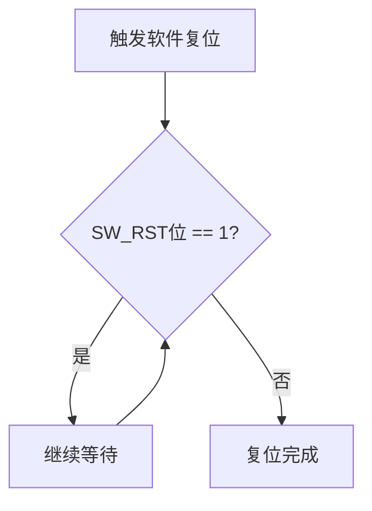

<cite>
**本文档引用的文件**
- [lib.rs](file://src/lib.rs)
</cite>

## 目录
1. [引言](#引言)
2. [错误处理策略](#错误处理策略)
3. [常见故障与排查](#常见故障与排查)
4. [调试建议](#调试建议)
5. [结论](#结论)

## 引言
本文档系统梳理了飞腾平台PWM驱动中的错误处理机制与常见问题排查方法。基于对驱动代码的深入分析，重点阐述了初始化保护、输入校验、硬件复位同步等关键设计，并提供了针对典型故障的系统性排查流程。

## 错误处理策略

### 初始化保护机制
驱动通过全局单例模式防止重复初始化。当`init_pwm`函数被多次调用时，会检查全局PWM实例是否已存在，若已初始化则返回错误信息`"PWM already initialized"`。

此机制确保了硬件资源的独占访问，避免因并发初始化导致的状态冲突或硬件损坏。

**Section sources**
- [lib.rs](file://src/lib.rs#L225-L235)

### 占空比输入校验
`set_duty_cycle`方法对输入参数实施严格范围校验。要求占空比百分比必须在1至100之间（含），若输入值为0或超过100，则立即返回错误`"Duty cycle must be between 1-100"`。

该校验防止了非法配置导致的输出异常或硬件不稳定。

**Section sources**
- [lib.rs](file://src/lib.rs#L129-L132)

### 硬件复位同步
在`PwmController::init`方法中，执行软件复位后，驱动会轮询`CTRL::SW_RST`寄存器位，直到其值变为0，表示硬件复位操作已完成。



**Diagram sources**
- [lib.rs](file://src/lib.rs#L85-L90)

**Section sources**
- [lib.rs](file://src/lib.rs#L80-L95)

## 常见故障与排查

### 无PWM输出
**可能原因：**
- PWM未使能
- 基地址配置错误
- 时钟源未启动
- 分频系数设置不当

**排查步骤：**
1. 检查`base_address`配置是否与硬件规格一致
2. 确认系统时钟已正确提供给PWM模块
3. 验证分频系数设置是否合理
4. 使用日志工具检测`CTRL::ENABLE`寄存器状态

### 初始化失败
**现象：** `init_pwm`返回`"PWM already initialized"`

**解决方案：**
- 检查是否已有其他模块调用了初始化
- 确保系统生命周期内仅进行一次初始化调用
- 若需重新配置，应先禁用并清理现有实例

### 占空比异常
**可能原因：**
- 输入值超出有效范围(1-100)
- 周期值被意外修改
- 寄存器写入未生效

**排查步骤：**
1. 验证输入参数合法性
2. 检查`period`寄存器当前值是否符合预期
3. 确认`ccr`寄存器写入操作成功完成

## 调试建议

### 日志输出关键寄存器
建议在关键操作前后添加日志输出，监控以下寄存器状态：
- `tim_ctrl`: 查看使能和复位状态
- `period`: 验证周期设置
- `ccr`: 确认占空比配置

例如，在`set_duty_cycle`成功后可添加：
```rust
log::debug!("Duty set: ccr={}, period={}", 
    self.regs().ccr.get(), 
    self.regs().period.get());
```

### 利用宏简化调试
使用`with_pwm!`宏安全地访问控制器状态，便于在运行时查询当前配置：

```rust
with_pwm!(|controller| {
    log::info!("Current duty: {}%", controller.get_duty_cycle());
    Ok(())
});
```

**Section sources**
- [lib.rs](file://src/lib.rs#L240-L270)

## 结论
本驱动通过多层次的错误处理机制保障了PWM控制的可靠性。开发者应遵循正确的初始化流程，严格校验输入参数，并利用提供的API进行状态监控。遇到问题时，按照基地址、时钟、分频、复位的顺序系统排查，可快速定位并解决大多数故障。