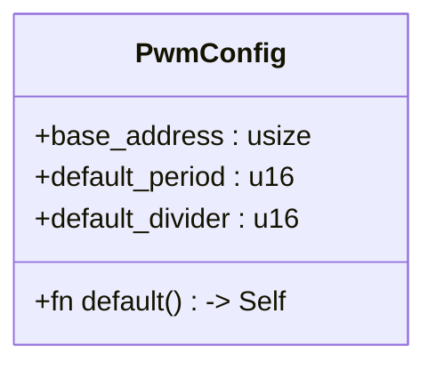
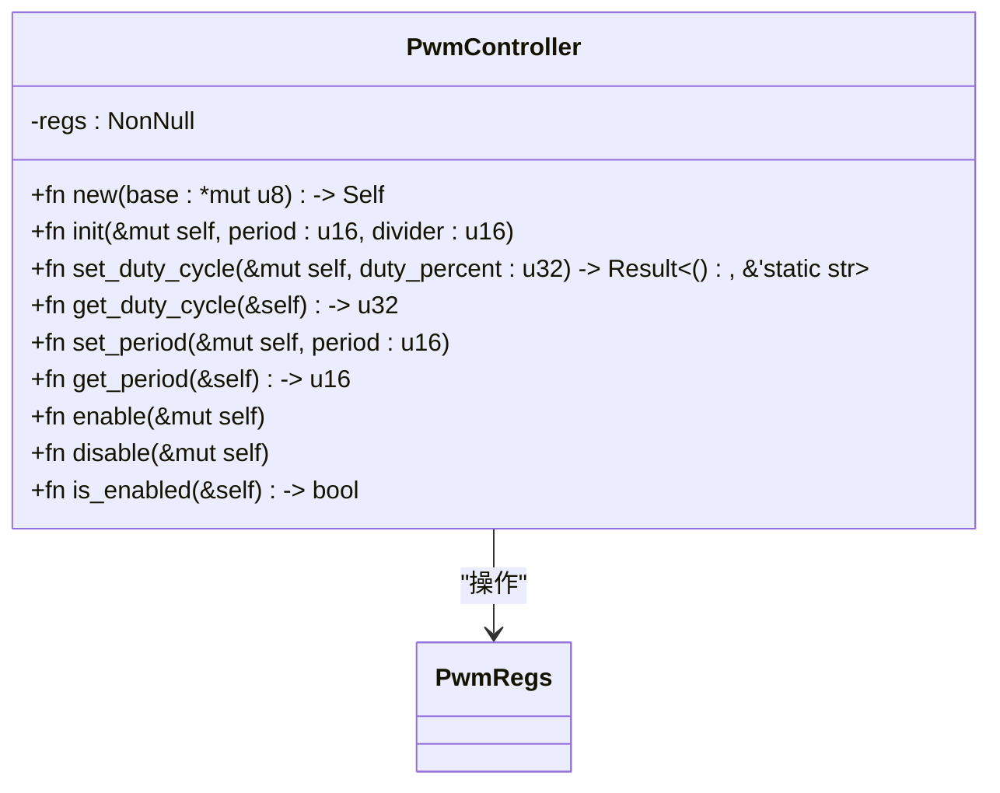
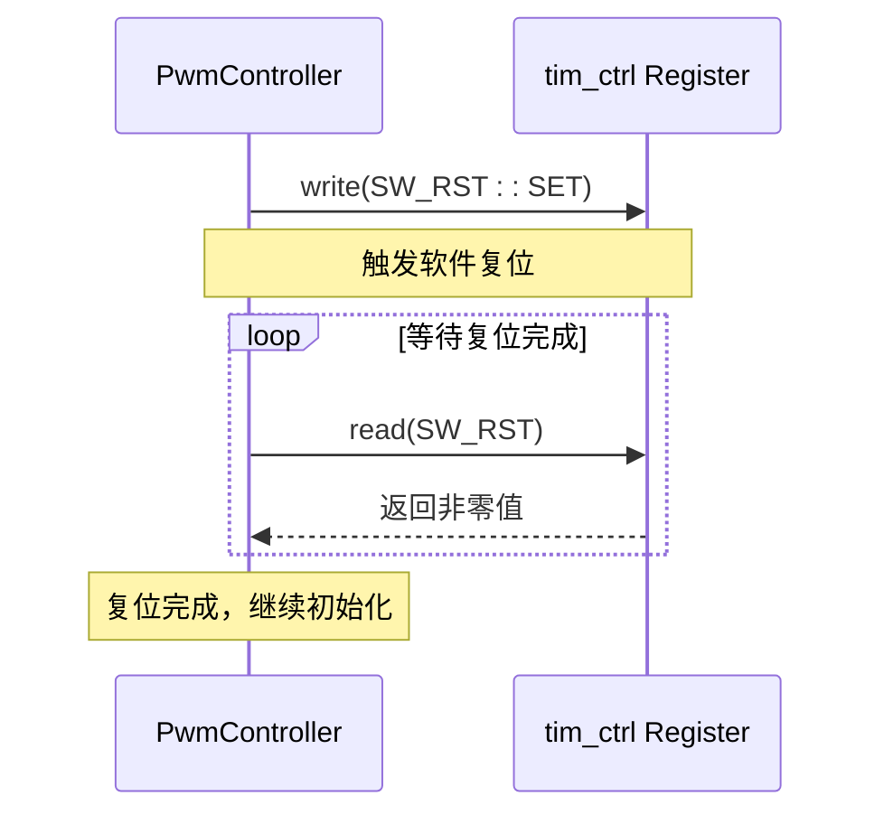
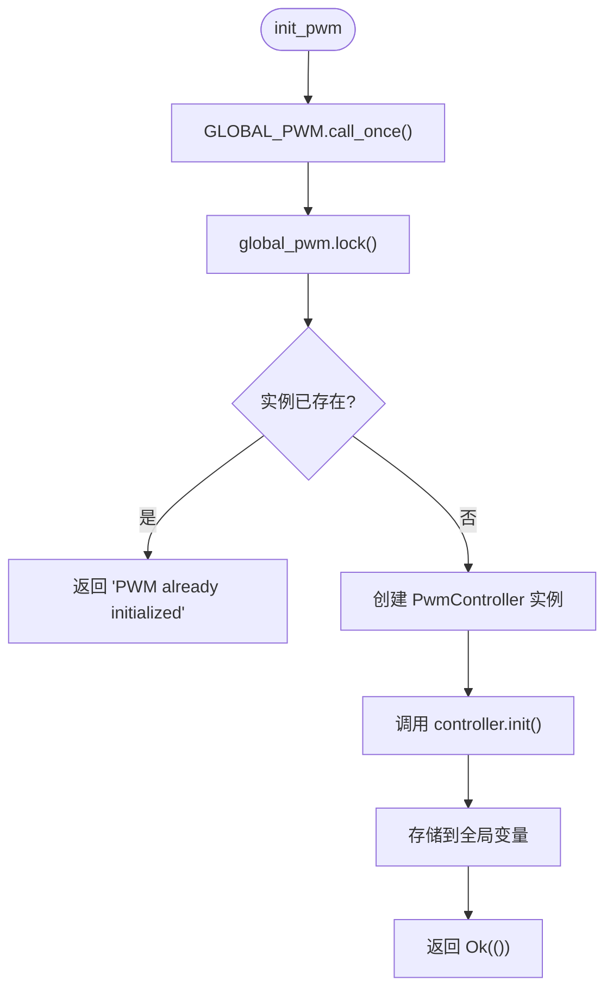
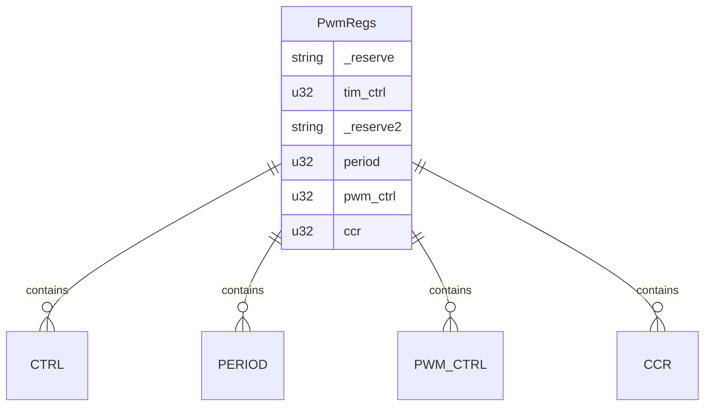

# PWM初始化

<cite>
**Referenced Files in This Document**   
- [lib.rs](file://src/lib.rs)
</cite>

## 目录
1. [引言](#引言)
2. [核心组件分析](#核心组件分析)
3. [PwmController::init 方法详解](#pwmcontrollerinit-方法详解)
4. [init_pwm 函数实现细节](#init_pwm-函数实现细节)
5. [寄存器配置与内存映射](#寄存器配置与内存映射)
6. [完整初始化示例](#完整初始化示例)
7. [常见错误处理](#常见错误处理)
8. [结论](#结论)

## 引言

脉宽调制（PWM）是一种广泛应用于电机控制、LED亮度调节和电源管理的技术。本文档深入剖析了基于飞腾平台的PWM驱动程序中`init_pwm`函数和`PwmController::init`方法的实现机制。重点阐述如何通过`PwmConfig`结构体传入基地址、默认周期和分频系数，并调用不安全的`new`方法创建`PwmController`实例的过程。

文档详细说明了初始化过程中执行软件复位（SW_RST）的时序控制、等待复位完成的自旋循环机制，以及对关键寄存器（如CTRL、PERIOD、PWM_CTRL）的配置流程。结合`register_structs!`宏生成的内存布局，验证了对0x2804a000基地址映射的正确性。最后提供了一个从零开始调用`init_pwm`进行初始化的完整代码示例，并指出重复初始化等常见错误的处理方式。

## 核心组件分析

本节分析PWM驱动中的核心数据结构与类型定义。

### PwmConfig 配置结构体

`PwmConfig`结构体封装了PWM控制器初始化所需的基本参数：

- **base_address**: 指定PWM寄存器块的物理基地址，默认为`0x2804a000`
- **default_period**: 定义计数周期的默认值，默认为`10000`
- **default_divider**: 设置时钟分频系数，默认为`1`（表示2分频）

该结构体实现了`Default` trait，提供了合理的默认配置，简化了用户使用。



**Diagram sources**
- [lib.rs](file://src/lib.rs#L150-L165)

### PwmController 控制器结构体

`PwmController`是PWM功能的核心实现类，通过裸指针`NonNull<PwmRegs>`访问硬件寄存器。



**Diagram sources**
- [lib.rs](file://src/lib.rs#L45-L148)

**Section sources**
- [lib.rs](file://src/lib.rs#L45-L148)

## PwmController::init 方法详解

`PwmController::init`方法负责执行PWM控制器的底层硬件初始化流程，其执行步骤如下：

### 软件复位与时序控制

初始化的第一步是触发软件复位（SW_RST），确保控制器处于已知的初始状态。



**Diagram sources**
- [lib.rs](file://src/lib.rs#L79-L85)

#### 自旋循环等待机制

在触发复位后，代码进入一个忙等待循环，持续读取`SW_RST`位直到其被硬件自动清除：

```rust
while self.regs().tim_ctrl.read(CTRL::SW_RST) != 0 {
    core::hint::spin_loop();
}
```

此机制保证了后续配置操作不会在控制器仍处于复位状态时执行，确保了时序的正确性。

### 寄存器配置流程

复位完成后，依次配置以下寄存器：

#### CTRL 寄存器配置

设置分频系数并禁用PWM输出：
- `DIV`字段写入`divider`值
- `ENABLE`位清零以确保初始化期间无输出

#### PERIOD 寄存器设置

通过`period`寄存器定义计数周期长度，决定PWM信号的基本频率。

#### PWM_CTRL 寄存器配置

将工作模式设为比较模式（`MODE=compare`），并选择`MATCH_1_00`输出行为，即匹配时输出高电平，不匹配时输出低电平。

#### 占空比初始化与使能

最后阶段将占空比设为50%，并通过设置`ENABLE`位正式启用PWM输出。

**Section sources**
- [lib.rs](file://src/lib.rs#L87-L115)

## init_pwm 函数实现细节

`init_pwm`是用户级初始化入口函数，封装了全局实例管理和安全性检查。

### 全局实例管理

使用`Once<Mutex<Option<PwmController>>>`确保PWM控制器只能被初始化一次：



**Diagram sources**
- [lib.rs](file://src/lib.rs#L170-L190)

### 初始化流程

1. 获取或创建全局单例对象
2. 尝试获取互斥锁
3. 检查是否已有PWM实例存在
4. 若未初始化，则使用`PwmConfig`中的参数创建新实例
5. 调用`PwmController::init`完成硬件配置
6. 存储实例并返回成功状态

**Section sources**
- [lib.rs](file://src/lib.rs#L170-L190)

## 寄存器配置与内存映射

### register_structs! 宏的作用

`register_structs!`宏用于声明`PwmRegs`结构体，它根据指定的偏移量将内存地址映射到具体的寄存器字段：

```rust
pub PwmRegs {
    (0x0 => _reserve),
    (0x404 => tim_ctrl: ReadWrite<u32, CTRL::Register>),
    (0x408 => _reserve2),
    (0x40c => period: ReadWrite<u32, PERIOD::Register>),
    (0x410 => pwm_ctrl: ReadWrite<u32, PWM_CTRL::Register>),
    (0x414 => ccr: ReadWrite<u32, CCR::Register>),
    (0x418 => @END),
}
```

这种声明方式确保了对`0x2804a000`基地址的访问能够正确映射到各个寄存器，避免了手动计算偏移量可能带来的错误。

### 内存布局验证

假设基地址为`0x2804a000`，则各寄存器的实际物理地址为：
- `tim_ctrl`: `0x2804a000 + 0x404 = 0x2804a404`
- `period`: `0x2804a000 + 0x40c = 0x2804a40c`
- `pwm_ctrl`: `0x2804a000 + 0x410 = 0x2804a410`

这些地址与硬件规格书一致，证明了内存映射的正确性。



**Diagram sources**
- [lib.rs](file://src/lib.rs#L8-L25)

**Section sources**
- [lib.rs](file://src/lib.rs#L8-L25)

## 完整初始化示例

以下是从零开始调用`init_pwm`进行PWM初始化的完整代码示例：

```rust
use phytium_pi_pwm::{init_pwm, PwmConfig, api};

fn main() {
    // 使用默认配置
    let config = PwmConfig::default();
    
    // 或者自定义配置
    let custom_config = PwmConfig {
        base_address: 0x2804a000,
        default_period: 10000,
        default_divider: 1,
    };
    
    // 执行初始化
    match init_pwm(custom_config) {
        Ok(()) => println!("PWM 初始化成功"),
        Err(e) => println!("PWM 初始化失败: {}", e),
    }
    
    // 设置占空比为 75%
    if let Err(e) = api::set_duty_cycle(75) {
        println!("设置占空比失败: {}", e);
    }
    
    // 启用 PWM 输出
    let _ = api::enable();
}
```

此示例展示了如何正确地配置、初始化并使用PWM驱动。

**Section sources**
- [lib.rs](file://src/lib.rs#L170-L190)

## 常见错误处理

### 重复初始化保护

驱动程序通过全局单例机制防止重复初始化：

```rust
if pwm_opt.is_some() {
    return Err("PWM already initialized");
}
```

当尝试多次调用`init_pwm`时，函数会立即返回错误信息`"PWM already initialized"`，避免了潜在的硬件冲突和资源竞争问题。

### 参数验证

虽然`init_pwm`本身没有显式的参数验证，但`PwmController::init`方法在`set_duty_cycle`中包含了严格的输入检查，确保占空比百分比在有效范围内（1-100）。

**Section sources**
- [lib.rs](file://src/lib.rs#L180-L182)

## 结论

本文档全面解析了飞腾平台PWM驱动的初始化机制。`init_pwm`函数作为安全的高层接口，结合`PwmController::init`方法完成了从软件复位到最终使能的完整初始化流程。通过`register_structs!`宏实现的精确内存映射，确保了对`0x2804a000`基地址的访问能够正确操控各个寄存器。全局单例设计有效防止了重复初始化，而详细的寄存器配置逻辑保证了PWM信号的稳定生成。开发者可依据提供的示例代码快速集成并使用该PWM驱动。