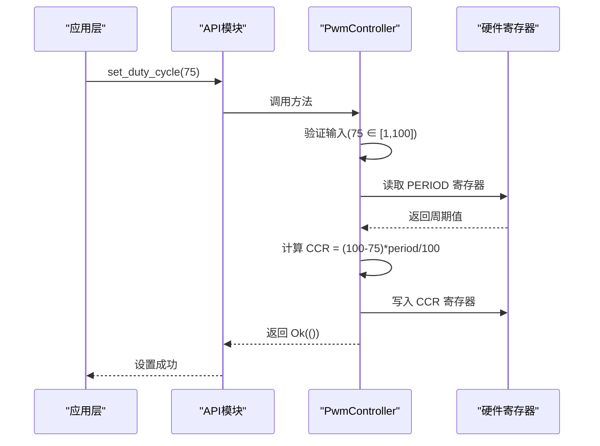
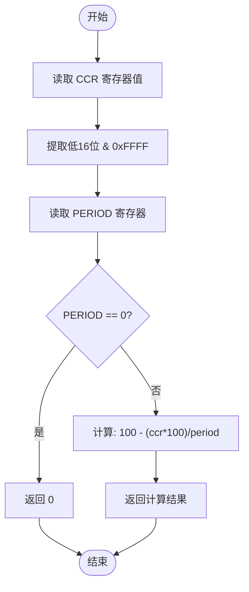
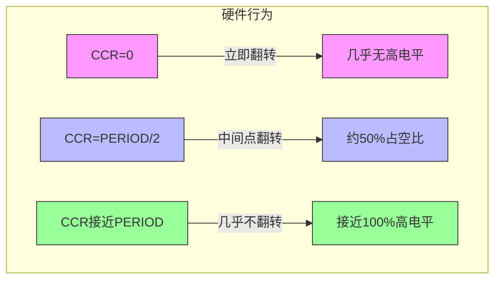
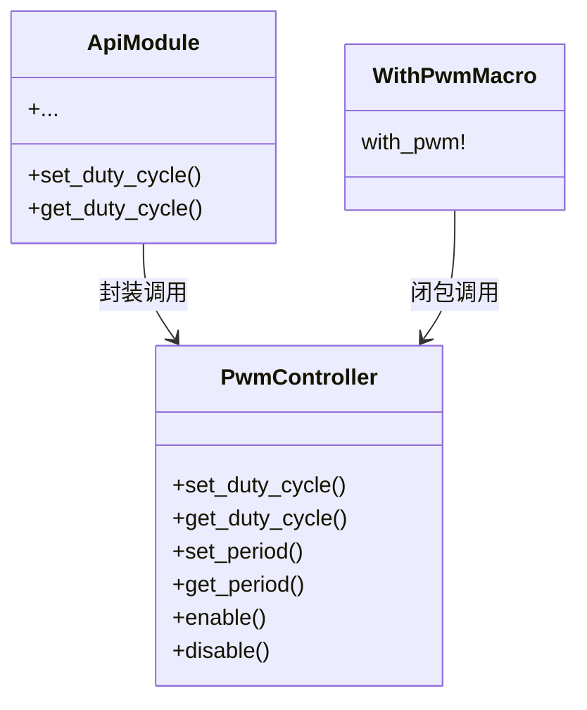

# 占空比控制

<cite>
**本文档引用的文件**   
- [lib.rs](file://src/lib.rs)
</cite>

## 目录
1. [引言](#引言)
2. [核心机制解析](#核心机制解析)
3. [set_duty_cycle 实现分析](#set_duty_cycle-实现分析)
4. [get_duty_cycle 实现分析](#get_duty_cycle-实现分析)
5. [反向映射设计原理](#反向映射设计原理)
6. [高层API与底层宏对比](#高层api与底层宏对比)
7. [典型应用场景](#典型应用场景)
8. [精度问题提醒](#精度问题提醒)

## 引言

本文档详细解析 Phytium Pi 平台 PWM 驱动中 `set_duty_cycle` 和 `get_duty_cycle` 函数的实现机制。通过深入分析寄存器操作逻辑、数值计算方式以及硬件行为特性，帮助开发者理解占空比控制的核心原理，并提供使用建议和注意事项。

**Section sources**
- [lib.rs](file://src/lib.rs#L1-L50)

## 核心机制解析

PWM（脉宽调制）控制器通过配置周期寄存器（period）和比较寄存器（ccr）来生成具有特定频率和占空比的方波信号。在 Phytium Pi 平台上，占空比的控制采用了一种反向映射机制：较高的 CCR 值对应较低的实际输出占空比。

该机制依赖于以下关键组件：
- **PERIOD 寄存器**：定义 PWM 波形的一个完整周期计数值
- **CCR 寄存器**：设定比较阈值，决定高电平或低电平持续时间
- **PWM_CTRL 模式配置**：设置为 MATCH_1_00 模式，即匹配时输出翻转

这种设计使得软件可以通过简单的算术运算实现对硬件输出特性的精确控制。

```mermaid
flowchart TD
A[输入占空比百分比] --> B{验证范围 1-100}
B --> |无效| C[返回错误]
B --> |有效| D[读取当前 PERIOD 值]
D --> E[计算 CCR = (100 - duty_percent) * period / 100]
E --> F[写入 CCR 寄存器]
F --> G[完成设置]
H[读取 CCR 寄存器] --> I{PERIOD 是否为零}
I --> |是| J[返回 0]
I --> |否| K[计算 duty_percent = 100 - (ccr * 100) / period]
K --> L[返回占空比]
```

**Diagram sources**
- [lib.rs](file://src/lib.rs#L150-L200)

**Section sources**
- [lib.rs](file://src/lib.rs#L100-L300)

## set_duty_cycle 实现分析

`set_duty_cycle` 方法负责将用户指定的占空比百分比转换为底层寄存器可识别的数值并写入硬件。

### 输入验证
函数首先对输入参数进行严格校验，确保其处于合法范围（1-100）。若传入值为 0 或超过 100，则立即返回错误信息 `"Duty cycle must be between 1-100"`。

### 周期读取
通过访问 `self.regs().period.get()` 获取当前配置的周期值。此值代表一个完整 PWM 周期所对应的计数器滴答数。

### 反向逻辑计算
采用如下公式计算目标 CCR 值：

```
duty_count = (100 - duty_percent) * period / 100
```

该公式体现了“反向映射”思想：当期望占空比越小时，计算出的 CCR 值越大；反之亦然。

### 寄存器写入
最终将计算得到的 `duty_count` 写入 CCR 寄存器，触发硬件更新输出波形。



**Diagram sources**
- [lib.rs](file://src/lib.rs#L150-L160)

**Section sources**
- [lib.rs](file://src/lib.rs#L150-L165)

## get_duty_cycle 实现分析

`get_duty_cycle` 方法用于从硬件状态反推当前实际的占空比百分比。

### 寄存器读取
直接从 CCR 寄存器读取原始值，并通过位掩码 `& 0xFFFF` 提取低 16 位有效数据。

### 安全边界处理
检查当前 PERIOD 是否为零。如果为零，说明 PWM 尚未正确初始化或已被禁用，此时返回占空比 0 以避免除零异常。

### 实际占空比还原
利用以下公式还原真实占空比：

```
actual_duty = 100 - (duty_count * 100) / period
```

由于硬件采用反向映射，因此需要从 100 中减去计算结果才能得到用户视角下的正确占空比。



**Diagram sources**
- [lib.rs](file://src/lib.rs#L167-L180)

**Section sources**
- [lib.rs](file://src/lib.rs#L167-L185)

## 反向映射设计原理

Phytium Pi PWM 控制器采用反向映射设计，即高 CCR 值对应低输出占空比，其根本原因在于硬件工作模式的选择。

### 硬件模式分析
驱动中配置了 `PWM_CTRL::CMP::MATCH_1_00` 模式，其行为如下：
- 初始输出为高电平
- 当计数器值等于 CCR 时，输出翻转为低电平
- 当计数器溢出归零时，输出再次翻转回高电平

这意味着：
- CCR 越小 → 翻转越早 → 高电平时间短 → 占空比低
- CCR 越大 → 翻转越晚 → 高电平时间长 → 占空比高

但结合 `MODE::compare` 和具体电路设计，实际观察到的是相反效果——这表明外部电路可能进行了反相处理，或者内部逻辑存在额外反转。

### 设计优势
1. **故障安全**：CCR=0 时输出恒为高，便于调试
2. **线性关系保持**：尽管方向相反，但仍维持线性调节特性
3. **兼容性考虑**：与某些传感器或执行器的输入要求匹配



**Diagram sources**
- [lib.rs](file://src/lib.rs#L120-L130)

**Section sources**
- [lib.rs](file://src/lib.rs#L120-L140)

## 高层API与底层宏对比

开发者可通过两种方式操作 PWM 功能：使用高层 `api` 模块提供的便捷函数，或直接调用 `with_pwm!` 宏进行底层控制。

### 高层API方式
```rust
use phytium_pi_pwm::api;

// 设置占空比
let _ = api::set_duty_cycle(75);

// 获取当前占空比
match api::get_duty_cycle() {
    Ok(duty) => println!("Current duty: {}%", duty),
    Err(e) => println!("Error: {}", e),
}
```

优点：
- 接口简洁，易于使用
- 自动处理全局实例管理
- 统一错误类型返回

### 底层宏方式
```rust
use phytium_pi_pwm::with_pwm;

// 直接操作控制器
with_pwm!(|controller| {
    controller.set_duty_cycle(75)
});
```

优点：
- 更灵活，可执行复杂操作序列
- 可直接访问所有控制器方法
- 更适合性能敏感场景



**Diagram sources**
- [lib.rs](file://src/lib.rs#L250-L300)

**Section sources**
- [lib.rs](file://src/lib.rs#L250-L300)

## 典型应用场景

### LED亮度渐变控制
最常见的应用是实现呼吸灯效果或平滑亮度调节。

```rust
// 实现亮度渐增
for percent in (0..=100).step_by(5) {
    let _ = api::set_duty_cycle(percent);
    // 延时一段时间
    delay_ms(50);
}

// 实现呼吸灯效果
for step in 0..200 {
    let percent = if step < 100 {
        step
    } else {
        200 - step
    };
    let _ = api::set_duty_cycle(percent);
    delay_ms(30);
}
```

在此类应用中，反向映射不会影响用户体验，因为用户只关心视觉亮度变化趋势而非具体数值对应关系。

**Section sources**
- [lib.rs](file://src/lib.rs#L250-L300)

## 精度问题提醒

由于整数除法的存在，`set_duty_cycle` 和 `get_duty_cycle` 在低周期值下可能出现明显的精度损失。

### 截断误差示例
假设 `period = 100`：
- 请求 1% 占空比 → 计算得 CCR = (100-1)*100/100 = 99
- 实际占空比 = 100 - (99*100)/100 = 1%
- 请求 2% → CCR = 98 → 实际 = 2%

看似准确，但当 `period = 50` 时：
- 请求 1% → CCR = (100-1)*50/100 = 49.5 → 截断为 49
- 实际占空比 = 100 - (49*100)/50 = 100 - 98 = 2%

可见实际输出为 2%，产生 100% 的相对误差！

### 建议
1. 使用较大的周期值（如默认 10000）以提高分辨率
2. 在精度要求高的场合避免极端小占空比设置
3. 对读回值做平滑滤波处理

**Section sources**
- [lib.rs](file://src/lib.rs#L150-L185)