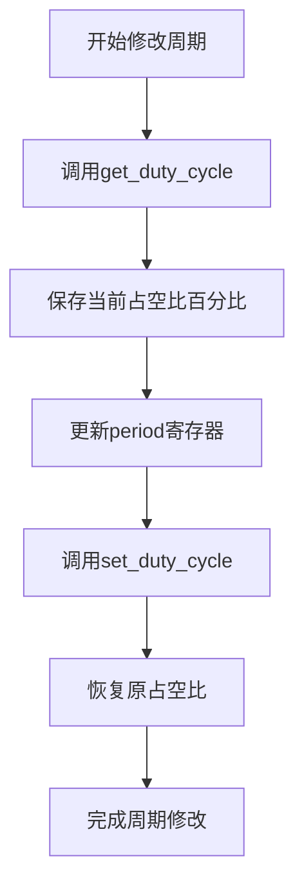
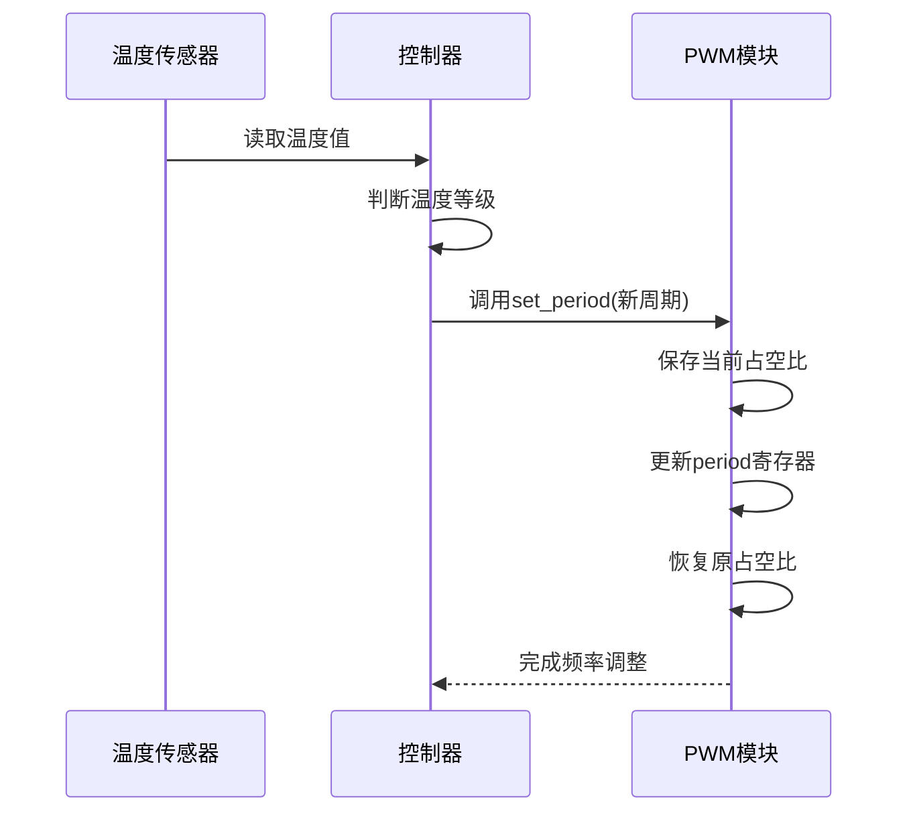

# 周期控制

<cite>
**Referenced Files in This Document**   
- [lib.rs](file://src/lib.rs)
</cite>

## 目录
1. [set_period与get_period功能实现](#set_period与get_period功能实现)
2. [占空比一致性维护策略](#占空比一致性维护策略)
3. [电机控制应用重要性](#电机控制应用重要性)
4. [周期值安全提取机制](#周期值安全提取机制)
5. [动态频率调整使用示例](#动态频率调整使用示例)
6. [输出中断与稳定间隔](#输出中断与稳定间隔)

## set_period与get_period功能实现

`set_period`和`get_period`是PWM控制器中用于管理脉冲宽度调制信号周期的核心方法。`set_period`函数负责更新PWM信号的计数周期，通过直接写入硬件寄存器来改变PWM波形的频率特性。该函数接收一个16位无符号整数作为新周期值，并将其写入PERIOD寄存器。`get_period`函数则用于读取当前配置的周期值，为上层应用提供实时的周期信息反馈。

这两个函数共同构成了PWM频率动态调节的基础接口，使得系统能够在运行时根据需求灵活调整输出信号的频率。这种能力对于需要自适应调节的应用场景至关重要，例如根据负载变化调整电机转速或根据环境条件调节风扇转速。

**Section sources**
- [lib.rs](file://src/lib.rs#L161-L173)

## 占空比一致性维护策略

在更改PWM周期时保持原有占空比一致性的策略是通过三步操作实现的：首先调用`get_duty_cycle`获取当前占空比百分比，然后更新period寄存器设置新的周期值，最后调用`set_duty_cycle`恢复原有的占空比。这种设计确保了在频率调整过程中，PWM信号的平均功率输出保持恒定。

具体实现中，`set_period`函数会先保存当前的占空比值，这个值是通过计算ccr寄存器与period寄存器的比值得到的百分比数值。在更新period寄存器后，系统会重新计算对应的ccr寄存器值以维持相同的占空比比例。这种原子性的操作序列避免了因频率变化导致的意外动力输出波动，保证了控制系统的稳定性。

**Diagram sources**
- [lib.rs](file://src/lib.rs#L161-L169)

**Section sources**
- [lib.rs](file://src/lib.rs#L161-L169)

## 电机控制应用重要性

上述设计对电机控制等需要频率调节但维持动力输出稳定的应用具有重要意义。在电机控制系统中，频率通常用于调节转速，而占空比则直接影响扭矩和功率输出。当需要调整电机转速时，如果不能保持占空比的一致性，会导致电机在加速或减速过程中出现不必要的扭矩波动，影响运行平稳性和控制精度。

例如，在伺服控制系统中，快速调整PWM频率可以实现精确的速度响应，而保持恒定的占空比则确保了加速度的平滑过渡。这种分离控制策略允许独立优化速度响应特性和动力输出特性，提高了系统的整体性能。此外，在多电机协同控制场景下，统一的占空比基准有助于保持各电机之间的动力平衡，避免因参数不一致导致的机械应力集中。

**Section sources**
- [lib.rs](file://src/lib.rs#L161-L169)

## 周期值安全提取机制

`get_period`函数通过从period寄存器提取低16位有效值并转换为u16类型返回来实现安全的数据访问。该函数首先读取完整的32位寄存器值，然后使用按位与操作（& 0xFFFF）屏蔽高16位，确保只获取有效的周期计数值。最后将结果强制转换为u16类型，符合API的返回要求。

这种设计考虑到了硬件寄存器可能存在的保留位或状态位干扰，通过显式的位掩码操作保证了数据的纯净性。同时，类型转换确保了返回值的范围限制在u16的有效区间内，防止了潜在的溢出问题。这种方法既保证了数据读取的安全性，又保持了接口的简洁性，为上层应用提供了可靠的周期信息。

**Section sources**
- [lib.rs](file://src/lib.rs#L173-L175)

## 动态频率调整使用示例

动态调整PWM频率的典型应用场景是根据温度反馈改变风扇驱动频率。在这种应用中，系统会持续监测设备温度，并根据预设的温度-频率映射关系动态调整风扇的PWM驱动信号。当温度升高时，系统调用`set_period`减小周期值以提高风扇转速；当温度降低时，则增大周期值以降低转速。

这种闭环控制策略能够实现精确的热管理，在保证散热效果的同时最大限度地降低噪音和能耗。例如，可以设置多个温度阈值，每个阈值对应不同的PWM周期配置。通过周期性地读取温度传感器数据并相应地调用`set_period`，系统能够实现平滑的风扇转速调节，避免了传统开关式控制带来的温度波动和机械冲击。

**Diagram sources**
- [lib.rs](file://src/lib.rs#L161-L169)

**Section sources**
- [lib.rs](file://src/lib.rs#L161-L169)

## 输出中断与稳定间隔

周期修改可能引起短暂的输出中断，这是由于硬件寄存器更新过程中的同步延迟所致。当新的周期值写入寄存器时，PWM计数器需要重新初始化，这可能导致当前周期的不完整或丢失，从而在输出波形上产生毛刺或间隙。虽然这种中断通常非常短暂，但在对时序敏感的应用中仍需注意。

建议的最小稳定间隔应考虑硬件响应时间和软件执行开销。频繁的周期修改不仅可能增加输出不稳定的风险，还可能加重处理器负担。一般建议在连续两次周期修改之间留出足够的间隔时间，让系统有足够的时间完成寄存器更新和状态同步。具体的最小间隔时间取决于硬件平台的性能特征，通常在毫秒量级即可满足大多数应用的需求。