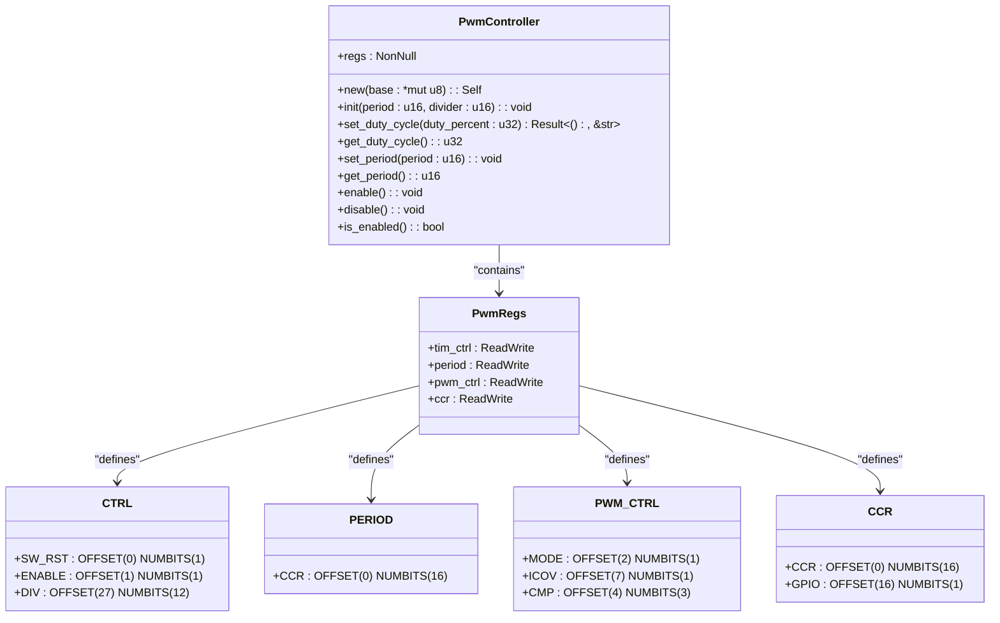

# 核心功能详解

<cite>
**Referenced Files in This Document**   
- [lib.rs](file://src/lib.rs)
</cite>

## 目录
1. [PWM初始化过程](#pwm初始化过程)
2. [占空比控制机制](#占空比控制机制)
3. [周期动态调整策略](#周期动态调整策略)
4. [使能状态管理](#使能状态管理)
5. [类型安全寄存器访问原理](#类型安全寄存器访问原理)

## PWM初始化过程

`init_pwm`函数通过`PwmConfig`结构体接收基地址、默认周期和分频系数等配置参数，进而调用`PwmController`的`init`方法完成PWM控制器的初始化。该过程包含多个关键步骤：

首先执行软件复位操作，通过向`tim_ctrl`寄存器的`SW_RST`位写入1来触发复位，并持续轮询等待复位完成标志清零，确保控制器处于已知的初始状态。

随后配置时钟分频器，将传入的分频参数写入`tim_ctrl`寄存器的`DIV`字段（位于第27-38位），同时保持PWM输出禁用状态以防止意外信号输出。

接下来设置PWM周期，将`period`参数值写入`period`寄存器的`CCR`字段（第0-15位），该值决定了PWM波形的基本计数周期长度。

然后设定比较模式，通过配置`pwm_ctrl`寄存器实现：将`MODE`位设置为1以启用比较模式，并将`CMP`字段设置为`MATCH_1_00`（0b011）模式，该模式定义了特定的比较输出行为。

最后，在设置默认占空比为50%后，通过置位`tim_ctrl`寄存器的`ENABLE`位正式启用PWM输出通道。

**Section sources**
- [lib.rs](file://src/lib.rs#L136-L169)
- [lib.rs](file://src/lib.rs#L278-L295)

## 占空比控制机制

占空比控制通过`set_duty_cycle`和`get_duty_cycle`两个核心方法实现，其设计体现了对硬件特性的精确适配。

`set_duty_cycle`方法接收1-100范围内的百分比值作为输入参数。在内部实现中，系统首先读取当前周期寄存器的值，然后应用反向逻辑计算CCR寄存器的目标值：`duty_count = (100 - duty_percent) * period / 100`。这种反向映射关系源于硬件设计，即CCR寄存器值越大，实际输出的高电平时间越短。例如，当设置50%占空比时，系统会计算出相当于半个周期的CCR值并写入寄存器。

`get_duty_cycle`方法则执行逆向转换过程：从`ccr`寄存器读取原始值后，同样应用反向公式`100 - (duty_count * 100) / period`将其转换回标准的百分比表示。这种方法确保了用户接口的直观性，同时准确反映了底层硬件的行为特征。

**Section sources**
- [lib.rs](file://src/lib.rs#L172-L195)
- [lib.rs](file://src/lib.rs#L198-L214)

## 周期动态调整策略

`set_period`方法实现了在不改变视觉或功能效果的前提下动态调整PWM周期的能力，这对于需要在不同分辨率或频率下工作的应用场景至关重要。

该策略的核心在于保持相对占空比的一致性。当调用`set_period`设置新周期值时，方法首先通过`get_duty_cycle`获取当前的占空比百分比，然后更新`period`寄存器为新值，最后调用`set_duty_cycle`恢复先前记录的占空比百分比。

这种两阶段的更新流程确保了即使在周期发生显著变化的情况下，输出信号的相对宽度比例也能保持恒定，避免了因直接修改周期而导致的亮度突变或电机速度跳变等问题。

**Section sources**
- [lib.rs](file://src/lib.rs#L217-L230)

## 使能状态管理

PWM输出的使能状态通过`enable`、`disable`和`is_enabled`三个方法进行管理，这些操作均作用于`tim_ctrl`寄存器的`ENABLE`位（第1位）。

`enable`方法通过`modify`操作将`ENABLE`位置1，激活PWM输出通道；`disable`方法则将其清除为0，立即停止PWM信号输出。`is_enabled`方法提供查询功能，通过读取`ENABLE`位的当前状态返回布尔值，便于应用程序判断PWM是否处于活动状态。

这三个方法的设计遵循了原子操作原则，确保状态切换的可靠性，同时提供了简洁的API接口供上层应用使用。

**Section sources**
- [lib.rs](file://src/lib.rs#L233-L251)

## 类型安全寄存器访问原理

本驱动通过`register_structs!`和`register_bitfields!`宏实现了类型安全的寄存器访问机制，这是现代嵌入式Rust开发的关键特性。

`register_structs!`宏定义了`PwmRegs`结构体，将物理内存地址映射为具名字段，每个字段对应一个或一组寄存器。这种抽象不仅提高了代码可读性，还通过编译时检查防止了越界访问。

`register_bitfields!`宏进一步细化了寄存器内部的位域结构，为每个控制位或位段定义了类型安全的访问接口。例如，`CTRL`寄存器的`SW_RST`、`ENABLE`和`DIV`字段都被赋予了明确的偏移量和宽度，允许开发者使用`CTRL::ENABLE::SET`这样的语义化表达式进行操作，而非易错的裸位操作。

这种双重宏系统结合`ReadWriteable`、`Readable`和`Writeable`特质，提供了既高效又安全的底层硬件访问方式，有效防止了常见的寄存器操作错误，同时保持了接近汇编语言的执行效率。

**Diagram sources**
- [lib.rs](file://src/lib.rs#L10-L17)
- [lib.rs](file://src/lib.rs#L20-L65)

**Section sources**
- [lib.rs](file://src/lib.rs#L10-L65)
- [lib.rs](file://src/lib.rs#L70-L133)