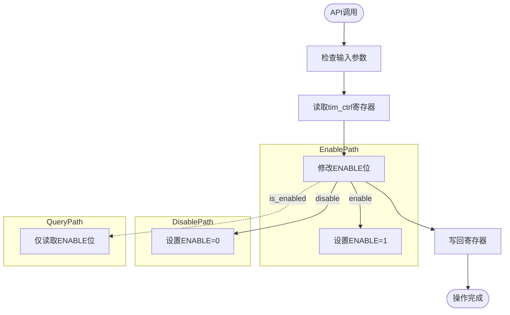
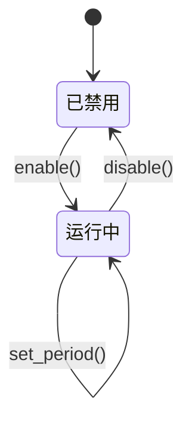

# 输出使能控制

<cite>
**Referenced Files in This Document**  
- [lib.rs](file://src/lib.rs)
</cite>

## 目录
1. [引言](#引言)
2. [核心接口工作原理](#核心接口工作原理)
3. [寄存器操作机制](#寄存器操作机制)
4. [原子性与实时响应特性](#原子性与实时响应特性)
5. [状态切换逻辑实现](#状态切换逻辑实现)
6. [使用注意事项](#使用注意事项)

## 引言
本文档系统性描述 `enable`、`disable` 和 `is_enabled` 三个接口的工作原理。这些方法通过操作 `tim_ctrl` 寄存器的 `ENABLE` 位（偏移量 OFFSET=1）来控制 PWM 信号的物理输出状态，适用于需要精确控制脉冲宽度调制信号的应用场景。

## 核心接口工作原理

### enable 方法
`enable` 方法通过置位 `tim_ctrl` 寄存器中的 `ENABLE` 位来启动 PWM 计数器和波形输出。当该位被设置后，PWM 控制器开始根据配置的周期和占空比生成相应的方波信号。

[SPEC SYMBOL](file://src/lib.rs#L178-L180)

### disable 方法
`disable` 方法清除 `tim_ctrl` 寄存器中的 `ENABLE` 位，从而立即停止 PWM 输出。此操作具有即时效应，能够快速切断 PWM 信号输出，适合用于紧急停机等安全关键场景。

[SPEC SYMBOL](file://src/lib.rs#L183-L185)

### is_enabled 方法
`is_enabled` 方法读取当前 `ENABLE` 位的状态并返回布尔值，用于查询 PWM 是否处于激活状态。该方法不改变任何硬件状态，仅提供状态反馈信息。

[SPEC SYMBOL](file://src/lib.rs#L188-L190)

**Section sources**
- [lib.rs](file://src/lib.rs#L178-L190)

## 寄存器操作机制

### tim_ctrl 寄存器结构
`tim_ctrl` 寄存器位于偏移地址 0x404 处，其中包含多个控制字段：
- **SW_RST (OFFSET=0)**: 软件复位位
- **ENABLE (OFFSET=1)**: PWM 使能位
- **DIV (OFFSET=27)**: 分频系数设置

```mermaid
bitDiagram
bitfield ENABLE {
bits 1
text "ENABLE"
}
bitfield SW_RST {
bits 1
text "SW_RST"
}
bitfield DIV {
bits 12
text "DIV"
}
bitfield RESERVED {
bits 18
text "Reserved"
}
```

**Diagram sources**
- [lib.rs](file://src/lib.rs#L15-L30)

### 操作流程
所有对 `ENABLE` 位的操作均通过 `modify` 方法完成，确保不会影响寄存器中其他位的状态。这种设计保证了操作的原子性和安全性。



**Diagram sources**
- [lib.rs](file://src/lib.rs#L178-L189)

## 原子性与实时响应特性

### 原子性保障
由于所有操作都基于底层硬件寄存器的直接访问，并且使用了原子性的 `modify` 操作，因此这三个接口具有高度的原子性。在单次函数调用内完成全部操作，避免中间状态暴露。

### 实时响应能力
- **enable/disable**: 操作结果几乎立即反映到物理输出端口
- **is_enabled**: 查询延迟极低，适合高频状态检测
- 适用于需要毫秒级甚至微秒级响应的工业控制场景

**Section sources**
- [lib.rs](file://src/lib.rs#L178-L189)

## 状态切换逻辑实现

### toggle_pwm 函数示例
结合 `is_enabled` 方法可以轻松实现状态切换逻辑：

```rust
fn toggle_pwm() -> Result<(), &'static str> {
    if api::is_enabled()? {
        api::disable()
    } else {
        api::enable()
    }
}
```

该模式可用于用户界面中的开关按钮或自动控制算法中的条件切换。

### 高级控制策略


**Diagram sources**
- [lib.rs](file://src/lib.rs#L178-L189)

## 使用注意事项

### 参数修改时机
- 在 `disable` 状态下修改周期或占空比参数不会影响输出
- 重新 `enable` 后，新配置将立即生效
- 建议在禁用状态下进行批量参数调整以避免中途波动

### 安全考虑
- `disable` 方法特别适用于紧急停机场景，因其能立即终止输出
- 应定期使用 `is_enabled` 进行状态验证，特别是在恢复操作前
- 避免在中断服务程序中频繁调用这些方法，以防影响系统稳定性

**Section sources**
- [lib.rs](file://src/lib.rs#L178-L189)