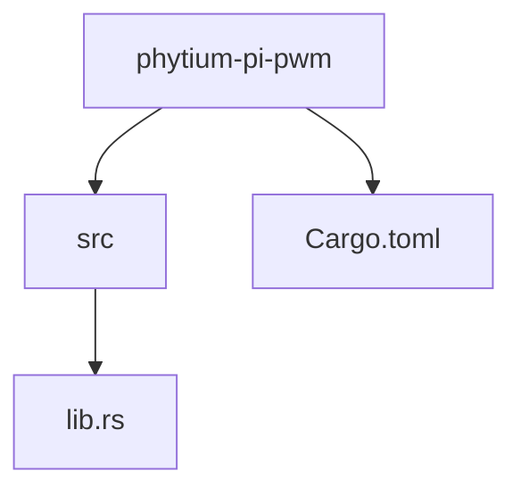
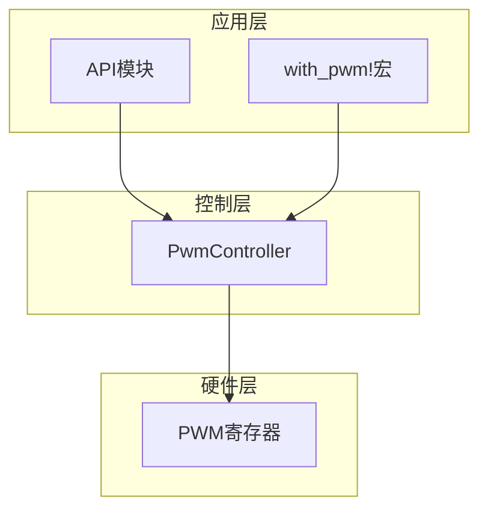
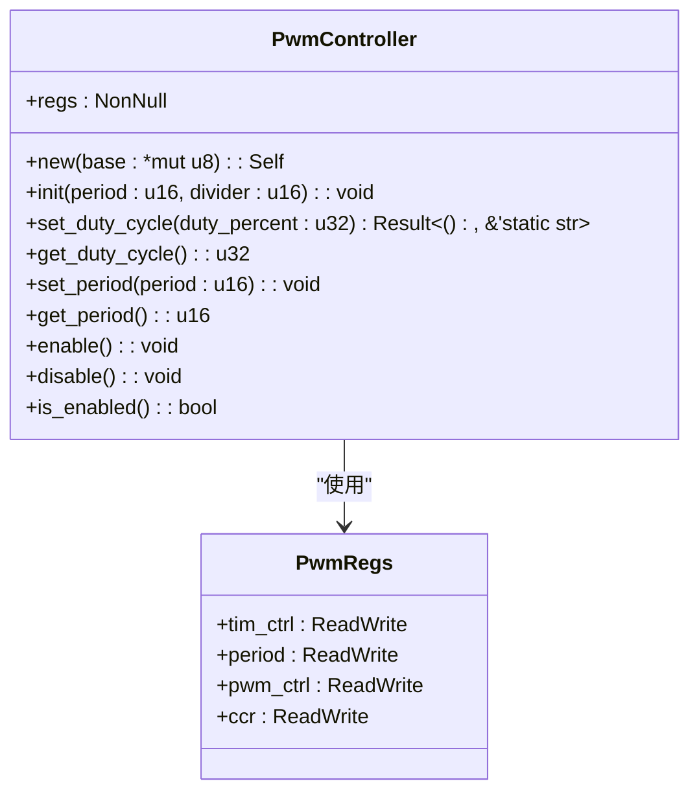
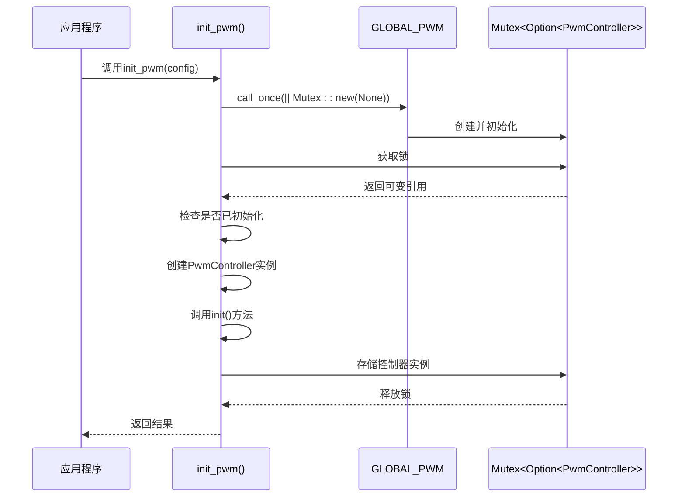
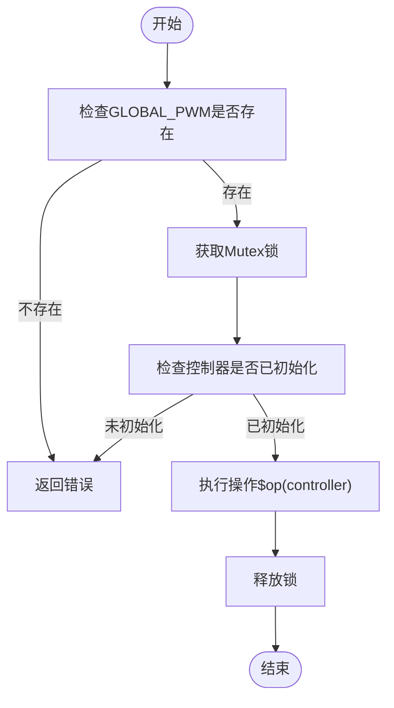
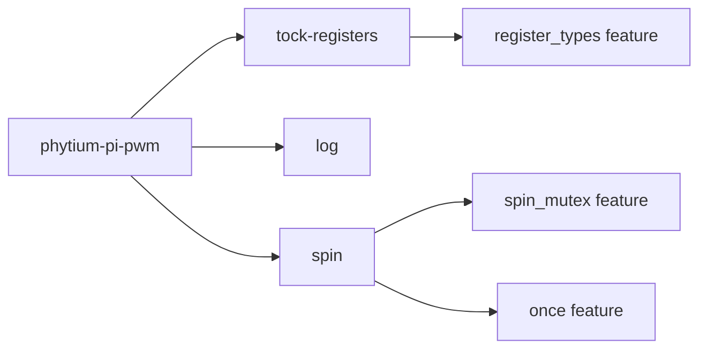

# 项目概述

<cite>
**Referenced Files in This Document**   
- [lib.rs](file://src/lib.rs)
- [Cargo.toml](file://Cargo.toml)
</cite>

## 目录
1. [简介](#简介)
2. [项目结构](#项目结构)
3. [核心组件](#核心组件)
4. [架构概览](#架构概览)
5. [详细组件分析](#详细组件分析)
6. [依赖关系分析](#依赖关系分析)
7. [性能考量](#性能考量)
8. [故障排除指南](#故障排除指南)
9. [结论](#结论)

## 简介
本项目为Phytium Pi平台提供了一个PWM（脉宽调制）控制器驱动程序，旨在实现对硬件PWM模块的精确控制。该驱动程序采用Rust语言编写，运行于`no_std`环境，适用于嵌入式系统开发。通过类型安全的寄存器操作、线程安全机制和单例模式设计，确保了代码的安全性和可靠性。主要应用场景包括电机速度控制、LED亮度调节等需要精确时序控制的领域。

## 项目结构
该项目采用典型的Rust库项目结构，包含一个源文件目录和一个构建配置文件。整体结构简洁明了，专注于PWM功能的实现。

**Diagram sources**
- [Cargo.toml](file://Cargo.toml#L1-L22)
- [lib.rs](file://src/lib.rs#L0-L315)

**Section sources**
- [Cargo.toml](file://Cargo.toml#L1-L22)
- [lib.rs](file://src/lib.rs#L0-L315)

## 核心组件
本项目的核心组件包括：`PwmController`结构体用于直接操作硬件寄存器；`GLOBAL_PWM`静态变量确保全局唯一实例；`api`模块提供高层便捷接口；`with_pwm!`宏简化对全局实例的操作。这些组件共同构成了一个安全、高效的PWM控制解决方案。

**Section sources**
- [lib.rs](file://src/lib.rs#L62-L69)
- [lib.rs](file://src/lib.rs#L215-L247)
- [lib.rs](file://src/lib.rs#L266-L315)

## 架构概览
整个驱动程序采用分层架构设计，底层通过`tock-registers`库进行类型安全的寄存器访问，中间层由`PwmController`封装具体的硬件操作逻辑，顶层通过`api`模块和`with_pwm!`宏提供用户友好的接口。这种设计既保证了底层操作的安全性，又提供了上层使用的便利性。

**Diagram sources**
- [lib.rs](file://src/lib.rs#L62-L69)
- [lib.rs](file://src/lib.rs#L266-L315)
- [lib.rs](file://src/lib.rs#L247-L265)

## 详细组件分析

### PWM控制器分析
`PwmController`是驱动程序的核心，负责直接与硬件寄存器交互。它通过`NonNull<PwmRegs>`指针安全地访问内存映射的寄存器区域，并提供了一系列方法来初始化、配置和控制PWM输出。

#### 对象导向组件：

**Diagram sources**
- [lib.rs](file://src/lib.rs#L62-L198)

**Section sources**
- [lib.rs](file://src/lib.rs#L62-L198)

### 全局实例管理
`GLOBAL_PWM`静态变量结合`spin`库的`Once`和`Mutex`类型，实现了线程安全的单例模式。这确保了在整个系统中只有一个PWM控制器实例存在，避免了资源冲突。

**Diagram sources**
- [lib.rs](file://src/lib.rs#L215-L246)

**Section sources**
- [lib.rs](file://src/lib.rs#L215-L246)

### 高层API与宏
`api`模块和`with_pwm!`宏为用户提供了一套简单易用的接口。用户无需关心底层细节，只需调用相应的函数即可完成PWM控制操作。

#### 复杂逻辑组件：

**Diagram sources**
- [lib.rs](file://src/lib.rs#L247-L265)
- [lib.rs](file://src/lib.rs#L266-L315)

**Section sources**
- [lib.rs](file://src/lib.rs#L247-L315)

## 依赖关系分析
项目依赖关系清晰明确，主要依赖三个外部crate：`tock-registers`用于类型安全的寄存器操作，`log`用于日志记录，`spin`用于线程同步原语。所有依赖都针对`no_std`环境进行了优化，不启用默认特性以减少代码体积。

**Diagram sources**
- [Cargo.toml](file://Cargo.toml#L13-L15)

**Section sources**
- [Cargo.toml](file://Cargo.toml#L13-L15)

## 性能考量
由于运行在`no_std`环境中，本驱动程序具有极小的运行时开销。所有操作都是零成本抽象，编译后生成的机器码接近手写汇编的效率。使用`spin`库的`Mutex`而非操作系统提供的互斥锁，避免了系统调用开销，在实时性要求高的场景下表现更佳。

## 故障排除指南
常见问题包括PWM无法初始化（可能因为重复初始化）、占空比设置无效（输入参数超出范围）等。建议首先检查`init_pwm`是否被多次调用，其次验证传入的配置参数是否符合规范。调试时可启用日志功能观察初始化过程。

**Section sources**
- [lib.rs](file://src/lib.rs#L215-L246)
- [lib.rs](file://src/lib.rs#L120-L130)

## 结论
Phytium Pi平台的PWM驱动程序通过精心设计的架构和Rust语言的安全特性，为嵌入式开发提供了可靠的基础支持。其模块化的设计使得代码易于维护和扩展，而类型安全和内存安全的保障则大大降低了出错的可能性。对于需要精确时序控制的应用场景，这是一个理想的选择。