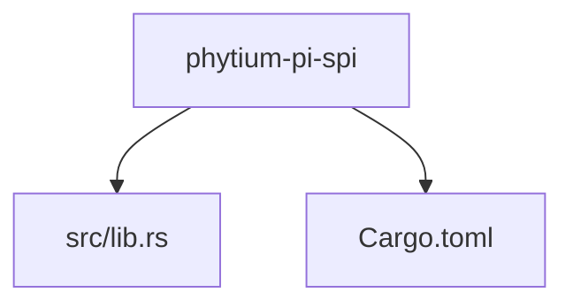
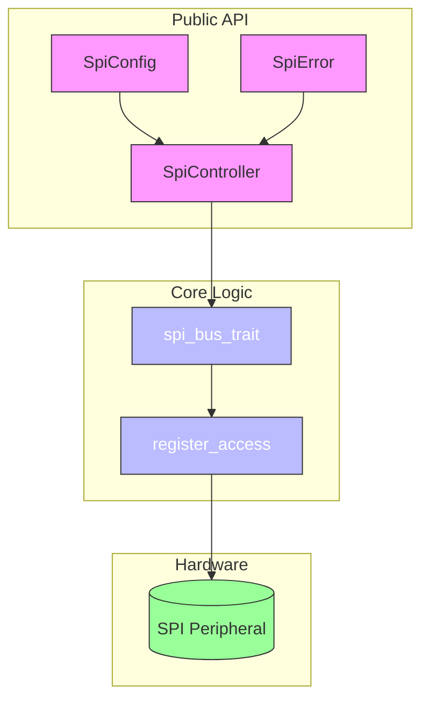
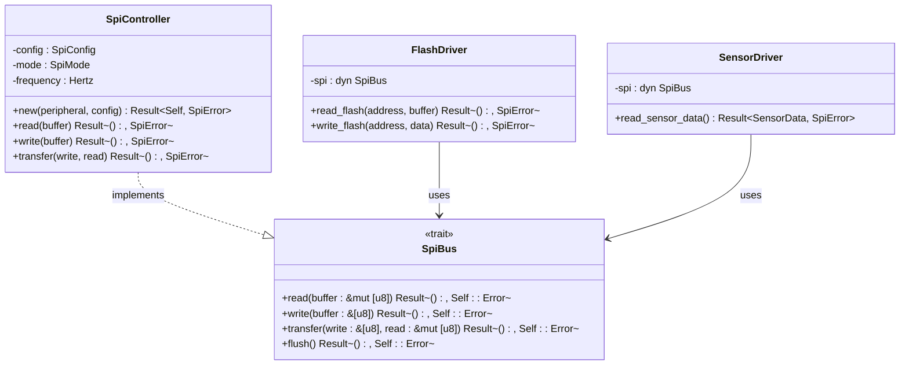
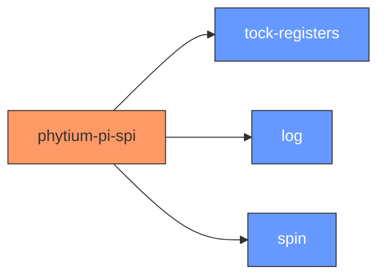

# API设计规划

<cite>
**Referenced Files in This Document**   
- [lib.rs](file://src/lib.rs)
- [Cargo.toml](file://Cargo.toml)
</cite>

## 目录
1. [引言](#引言)
2. [项目结构](#项目结构)
3. [核心组件](#核心组件)
4. [架构概述](#架构概述)
5. [详细组件分析](#详细组件分析)
6. [依赖分析](#依赖分析)
7. [性能考虑](#性能考虑)
8. [故障排除指南](#故障排除指南)
9. [结论](#结论)

## 引言

本文档旨在为飞腾派（Phytium Pi）平台的SPI驱动程序进行前瞻性的API设计规划。尽管当前代码库尚处于初始阶段，仅包含基本框架和待办事项注释，但本规划将基于嵌入式系统开发的最佳实践，定义一套完整、可扩展且类型安全的公共接口。

该设计目标是构建一个高效、可靠且易于使用的SPI驱动，支持多种外设设备，并为未来功能扩展提供坚实基础。设计重点包括：清晰的初始化流程、灵活的数据读写方法、健壮的错误处理机制以及通过trait实现的高度可复用性。

## 项目结构

当前项目遵循典型的Rust嵌入式驱动结构，简洁明了：

```
.
├── src
│   └── lib.rs          # 驱动核心逻辑入口
└── Cargo.toml          # 项目元数据与依赖管理
```

`src/lib.rs` 是整个驱动的单一源文件入口，目前仅声明了 `#![no_std]` 属性并提供了简要的文档说明，表明这是一个针对飞腾派平台的SPI驱动，其具体功能实现尚待完成。`Cargo.toml` 文件则定义了项目的名称、版本、许可证及关键依赖项。



**Diagram sources**
- [lib.rs](file://src/lib.rs)
- [Cargo.toml](file://Cargo.toml)

**Section sources**
- [lib.rs](file://src/lib.rs)
- [Cargo.toml](file://Cargo.toml)

## 核心组件

根据现有代码框架和设计目标，本SPI驱动的核心组件将围绕以下几个关键抽象展开：
1.  **SPI控制器 (`SpiController`)**: 作为主控实体，负责管理硬件资源和执行具体的通信操作。
2.  **SPI配置 (`SpiConfig`)**: 用于封装所有可配置的SPI参数，确保初始化过程的类型安全和灵活性。
3.  **错误类型 (`SpiError`)**: 定义驱动可能遇到的所有错误情况，提供精确的错误反馈。
4.  **通用接口 (`SpiBus` trait)**: 抽象出SPI总线的基本行为，提高代码的可复用性和可测试性。

这些组件虽尚未在代码中实现，但它们是构建一个现代化、符合Rust风格的驱动所必需的基石。

**Section sources**
- [lib.rs](file://src/lib.rs)

## 架构概述

本驱动的设计采用分层架构，强调关注点分离和模块化。上层为用户友好的公共API，下层为直接与硬件寄存器交互的底层操作。



**Diagram sources**
- [lib.rs](file://src/lib.rs)

## 详细组件分析

### SPI控制器与配置分析

#### 预期的公共接口设计
SPI控制器的公共接口应提供以下核心方法：
- **`new(hardware_peripheral, config) -> Result<Self, SpiError>`**: 构造函数，接收硬件外设实例和配置对象，返回一个初始化后的控制器实例或错误。
- **`read(&mut self, buffer: &mut [u8]) -> Result<(), SpiError>`**: 从SPI总线读取指定长度的数据到缓冲区。
- **`write(&mut self, buffer: &[u8]) -> Result<(), SpiError>`**: 向SPI总线写入指定的数据。
- **`transfer(&mut self, write_buf: &[u8], read_buf: &mut [u8]) -> Result<(), SpiError>`**: 执行全双工传输，同时发送和接收数据。

#### 关键数据结构定义
预期的关键数据结构如下：

```rust
/// SPI工作模式 (CPOL, CPHA)
#[derive(Debug, Clone, Copy, PartialEq)]
pub enum SpiMode {
    Mode0, // CPOL=0, CPHA=0
    Mode1, // CPOL=0, CPHA=1
    Mode2, // CPOL=1, CPHA=0
    Mode3, // CPOL=1, CPHA=1
}

/// SPI配置参数
#[derive(Debug, Clone)]
pub struct SpiConfig {
    pub mode: SpiMode,
    pub frequency: Hertz,
    pub data_frame_size: u8, // 通常为8或16位
    pub bit_order: BitOrder, // 大端或小端
    // ... 其他可能的配置项
}
```

**Section sources**
- [lib.rs](file://src/lib.rs)

### 错误处理策略

#### 设计思路
错误处理将采用Rust惯用的 `Result<T, E>` 模式，确保所有潜在的失败操作都得到显式处理。这能有效防止运行时崩溃，并迫使调用者考虑错误情况。

#### 自定义错误枚举
计划定义一个自定义的 `SpiError` 枚举，以涵盖驱动特有的错误场景：

```rust
#[derive(Debug)]
pub enum SpiError {
    /// 时钟频率超出硬件支持范围
    InvalidFrequency(Hertz),
    /// 数据帧大小不被支持
    UnsupportedDataFrameSize(u8),
    /// 硬件忙，无法执行操作
    Busy,
    /// 传输过程中发生超时
    Timeout,
    /// 物理层通信错误（如CRC校验失败）
    CommunicationFault,
    /// 配置无效
    InvalidConfig(SpiConfig),
    /// 未知的内部错误
    Internal,
}
```

此设计提供了比简单的字符串错误更丰富的上下文信息，便于调试和恢复。

**Section sources**
- [lib.rs](file://src/lib.rs)

### Trait设计与可扩展性

#### 提高复用性的Trait设计
为了最大化代码的可复用性和灵活性，将引入 `SpiBus` trait 来抽象SPI总线的操作：

```rust
pub trait SpiBus {
    type Error;
    
    fn read(&mut self, buffer: &mut [u8]) -> Result<(), Self::Error>;
    fn write(&mut self, buffer: &[u8]) -> Result<(), Self::Error>;
    fn transfer(&mut self, write: &[u8], read: &mut [u8]) -> Result<(), Self::Error>;
    fn flush(&mut self) -> Result<(), Self::Error>;
}
```

通过实现此trait，`SpiController` 可以轻松地与其他期望SPI总线的库集成。更重要的是，可以为不同的SPI外设（如Flash、传感器）创建专用的驱动，这些驱动只需接受一个实现了 `SpiBus` 的实例即可工作，而无需关心底层是哪个具体的控制器。

这种设计极大地提高了代码的模块化程度，使得单元测试也更加容易（可以通过mock一个 `SpiBus` 实现来测试外设驱动）。



**Diagram sources**
- [lib.rs](file://src/lib.rs)

**Section sources**
- [lib.rs](file://src/lib.rs)

## 依赖分析

当前项目的依赖关系清晰，主要依赖于几个成熟的无标准库（`no-std`）兼容的crate：
- **`tock-registers`**: 用于安全、高效地访问内存映射的硬件寄存器，这是编写嵌入式驱动的基础。
- **`log`**: 提供日志记录功能，便于在开发和调试阶段输出诊断信息。
- **`spin`**: 提供了 `SpinMutex` 和 `Once` 等同步原语，对于在单核或多核环境中安全地共享和初始化资源至关重要。

这些依赖的选择表明项目旨在构建一个可在裸机环境下运行的生产级驱动。



**Diagram sources**
- [Cargo.toml](file://Cargo.toml)

**Section sources**
- [Cargo.toml](file://Cargo.toml)

## 性能考虑

作为一个底层硬件驱动，性能是核心考量之一。本设计通过以下方式优化性能：
1.  **零成本抽象**: Rust的trait和泛型在编译时会被内联和优化，几乎不会产生运行时开销。
2.  **最小化动态分配**: 在 `no-std` 环境下，避免使用堆分配，所有数据结构均在栈上或静态分配。
3.  **高效的寄存器访问**: 利用 `tock-registers` crate提供的宏，生成直接、高效的内存访问指令。
4.  **批处理操作**: `read`