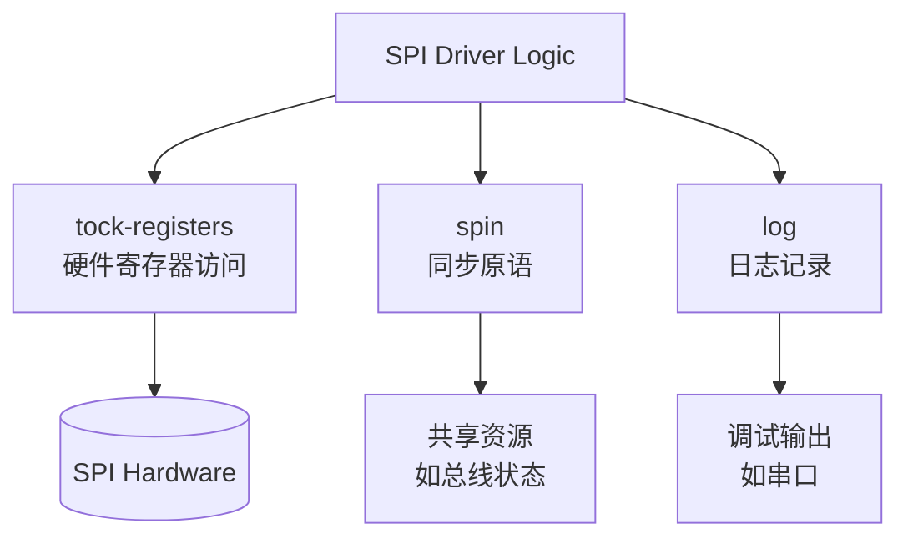

# 技术栈与依赖

<cite>
**本文档引用的文件**
- [Cargo.toml](file://Cargo.toml)
- [src/lib.rs](file://src/lib.rs)
</cite>

## 目录
1. [项目概述](#项目概述)
2. [Rust在no_std环境下的应用特点](#rust在no_std环境下的应用特点)
3. [核心依赖库详解](#核心依赖库详解)
   - [tock-registers：安全的硬件寄存器访问](#tock-registers安全的硬件寄存器访问)
   - [log：日志记录功能](#log日志记录功能)
   - [spin：无锁同步原语](#spin无锁同步原语)
4. [依赖协同工作机制](#依赖协同工作机制)
5. [依赖配置最佳实践](#依赖配置最佳实践)
6. [结论](#结论)

## 项目概述

本项目为飞腾派（Phytium Pi）平台的SPI驱动程序，采用Rust语言开发。项目明确标识为`no_std`环境，表明其运行于无标准库的嵌入式系统中。作为嵌入式设备驱动，该项目专注于提供对SPI外设的底层控制能力。

**Section sources**
- [src/lib.rs](file://src/lib.rs#L0-L3)
- [Cargo.toml](file://Cargo.toml#L0-L14)

## Rust在no_std环境下的应用特点

Rust的`no_std`特性是其在嵌入式和操作系统开发领域的重要优势。通过在`lib.rs`文件顶部声明`#![no_std]`，项目脱离了对`std`标准库的依赖，转而使用更轻量级的`core`库。这使得代码可以在资源受限、没有完整操作系统的环境中运行，如微控制器或内核空间。

`no_std`环境的主要特点包括：
- **内存管理自主性**：不依赖标准库的堆分配器，开发者需自行管理内存或使用静态分配。
- **最小化运行时**：避免引入不必要的运行时开销，生成的二进制文件更小，启动更快。
- **确定性行为**：减少了因标准库内部实现导致的不可预测行为，更适合实时系统。

这种模式要求所有外部依赖也必须兼容`no_std`，这也是本项目中所有依赖都显式禁用默认功能的原因。

**Section sources**
- [src/lib.rs](file://src/lib.rs#L0)

## 核心依赖库详解

### tock-registers：安全的硬件寄存器访问

`tock-registers`库提供了类型安全的方式来访问硬件寄存器。在嵌入式编程中，直接读写内存地址来控制外设是常见操作，但极易出错。该库通过Rust的类型系统将寄存器的读写操作封装起来，防止非法访问。

- **版本选择**：采用`0.8`版本，这是一个稳定且广泛使用的版本，被Tock OS等知名嵌入式项目所采纳。
- **功能启用**：启用了`register_types`功能，它提供了基础的寄存器类型定义，如只读(ReadOnly)、只写(WriteOnly)和读写(ReadWrite)，确保了对寄存器的操作符合其硬件规格。
- **重要性**：`default-features = false`确保了不引入任何可能依赖`std`的功能，保持了`no_std`的兼容性。

**Section sources**
- [Cargo.toml](file://Cargo.toml#L12)

### log：日志记录功能

`log`库是Rust生态系统中的日志门面(facade)库，它本身不提供具体的日志实现，而是定义了一套统一的日志接口，允许用户在运行时选择不同的日志后端。

- **版本选择**：`0.4`版本是目前最广泛支持的版本，具有良好的向后兼容性。
- **功能配置**：`default-features = false`是关键配置。`log`库的默认功能可能包含动态内存分配或浮点数格式化等`std`依赖，禁用它们是`no_std`环境的必要条件。
- **工作方式**：在实际部署时，需要另一个实现了`log`门面的crate（如`defmt`或`uformat`）来处理日志输出，通常通过串口或调试接口。

**Section sources**
- [Cargo.toml](file://Cargo.toml#L13)

### spin：无锁同步原语

`spin`库为`no_std`环境提供了基本的同步机制，特别是自旋锁(spinlock)和一次性初始化(`Once`)。

- **版本选择**：`0.9`版本是一个成熟稳定的版本，专为嵌入式场景优化。
- **功能启用**：
  - `spin_mutex`：提供了一个简单的互斥锁实现，适用于中断禁用或单核环境下的临界区保护。
  - `once`：确保一段代码在整个程序生命周期中只执行一次，常用于全局资源的延迟初始化。
- **`no_std`适配**：`default-features = false`避免了对`std::sync`的依赖，其内部实现完全基于原子操作和自旋等待，非常适合裸机或内核环境。

**Section sources**
- [Cargo.toml](file://Cargo.toml#L14)

## 依赖协同工作机制

这三个核心依赖库共同构建了一个安全、可靠且高效的嵌入式驱动开发基础：

1.  **硬件交互层**：`tock-registers`负责与SPI控制器的物理寄存器进行精确、安全的通信，执行数据传输和状态查询。
2.  **并发控制层**：`spin`库提供的`Mutex`可以保护共享的SPI总线状态，防止多个任务同时访问导致的数据竞争；`Once`可用于确保SPI控制器的初始化代码仅执行一次。
3.  **诊断与调试层**：`log`库贯穿整个驱动逻辑，在关键操作（如发送/接收数据、错误处理）时输出日志，帮助开发者在开发和调试阶段理解驱动的行为。

它们通过`no_std`这一共同约束紧密耦合，形成了一个去中心化、低开销的软件栈，完美契合嵌入式系统的需求。

**Diagram sources**
- [Cargo.toml](file://Cargo.toml#L12-L14)

## 依赖配置最佳实践

根据本项目的配置，可以总结出以下针对`no_std`项目的依赖管理最佳实践：

1.  **始终禁用默认功能**：对于任何第三方库，只要存在`default-features`选项，都应设置为`false`。这是保证`no_std`兼容性的第一道防线。
2.  **按需启用特定功能**：仔细阅读库的文档，只启用项目真正需要的功能。例如，`tock-registers`的`register_types`是核心功能，而`spin`的`spin_mutex`和`once`是本项目所需的同步工具。
3.  **选择经过验证的版本**：优先选择在嵌入式社区（如Tock OS, RTIC, Embassy）中广泛使用的稳定版本，这些版本通常经过了严格的`no_std`兼容性测试。
4.  **明确依赖意图**：在`Cargo.toml`中清晰地列出每个依赖及其配置，便于团队成员理解和维护。

`default-features = false`的重要性在于，它强制开发者显式地声明所需功能，避免了隐式的、可能破坏`no_std`环境的依赖被悄悄引入，从而保证了构建的可预测性和可靠性。

**Section sources**
- [Cargo.toml](file://Cargo.toml#L12-L14)

## 结论

本项目的技术栈体现了现代嵌入式Rust开发的典型范式：以`no_std`为基础，选用经过精心设计的、模块化的第三方库来解决特定问题。`tock-registers`、`log`和`spin`这三个库各司其职，共同为SPI驱动提供了安全的硬件访问、灵活的日志记录和必要的同步机制。通过严格遵循`default-features = false`的最佳实践，项目确保了在资源受限环境下的纯净性和高效性，为构建健壮的嵌入式系统奠定了坚实的基础。