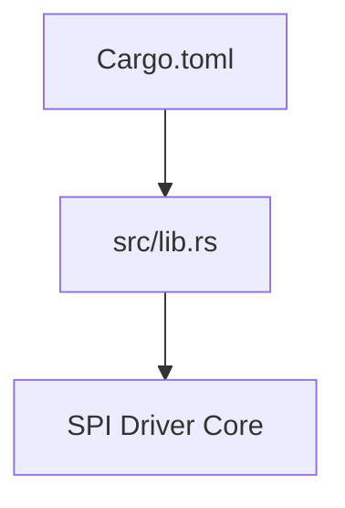
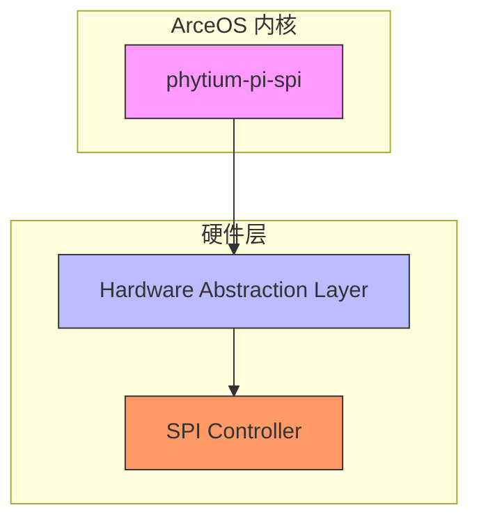
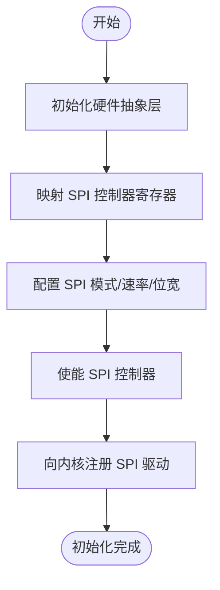
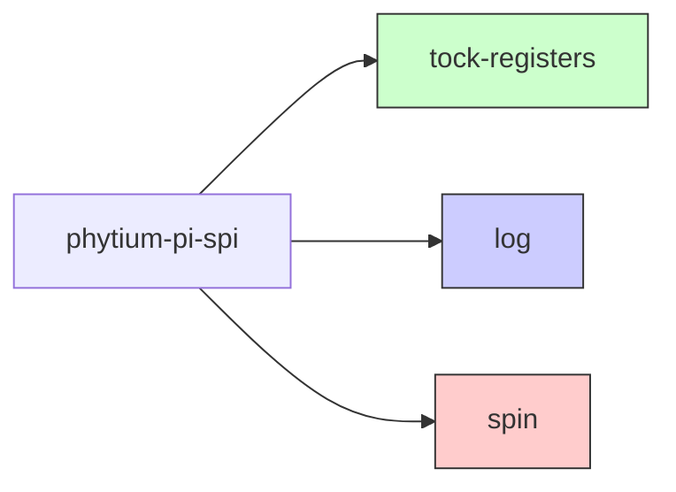

# 项目概述

<cite>
**本文档引用的文件**  
- [lib.rs](file://src/lib.rs)
- [Cargo.toml](file://Cargo.toml)
</cite>

## 目录
1. [简介](#简介)
2. [项目结构](#项目结构)
3. [核心特性分析](#核心特性分析)
4. [架构概览](#架构概览)
5. [详细组件分析](#详细组件分析)
6. [依赖关系分析](#依赖关系分析)
7. [性能考量](#性能考量)
8. [故障排除指南](#故障排除指南)
9. [结论](#结论)

## 简介
`phytium-pi-spi` 是 ArceOS 操作系统的一部分，专为 Phytium Pi 平台设计的 SPI（串行外设接口）驱动程序。该项目基于 Rust 语言开发，面向资源受限的嵌入式环境，强调安全性与可靠性。该驱动通过硬件抽象层（HAL）与底层 SPI 控制器交互，实现对 SPI 总线设备的控制和数据传输。

本项目采用 `no_std` 环境构建，适用于无操作系统或轻量级运行时的场景，确保在内存和计算资源有限的设备上高效运行。其主要目标是为 Phytium Pi 平台提供稳定、高效的 SPI 通信能力，支持各类外设如传感器、存储器等的接入。

项目遵循双重开源许可证：GPL-2.0 或 Apache-2.0，由 Phytium Pi 驱动团队维护，当前版本为 0.1.0。

## 项目结构
该项目结构简洁明了，包含一个源码目录和一个 Cargo 配置文件：
- `src/lib.rs`：主源文件，定义了整个 SPI 驱动的核心模块。
- `Cargo.toml`：Rust 项目的配置文件，声明了项目元信息、依赖项及编译选项。

此结构体现了典型的 Rust 嵌入式驱动组织方式，便于集成到更大的 ArceOS 系统中。

**Diagram sources**
- [Cargo.toml](file://Cargo.toml#L1-L15)
- [lib.rs](file://src/lib.rs#L1-L4)

**Section sources**
- [Cargo.toml](file://Cargo.toml#L1-L15)
- [lib.rs](file://src/lib.rs#L1-L4)

## 核心特性分析
`phytium-pi-spi` 驱动具备以下关键特性：

- **`no_std` 支持**：通过 `#![no_std]` 属性禁用标准库依赖，仅使用核心库（core），适合运行在没有完整操作系统的嵌入式环境中。
- **硬件抽象层（HAL）集成**：虽然具体实现尚未完成，但设计意图是通过 HAL 接口与 SPI 控制器进行低级寄存器访问，从而屏蔽硬件差异，提升可移植性。
- **异步与并发安全**：依赖 `spin` 库提供的自旋锁和一次性初始化机制，在中断上下文或裸机环境中保证线程安全。
- **寄存器操作支持**：使用 `tock-registers` 库进行类型安全的寄存器读写，避免直接指针操作带来的安全隐患。
- **日志记录**：集成 `log` crate，支持在调试阶段输出运行时信息，便于问题排查。

这些特性共同构成了一个现代、安全且高效的嵌入式驱动基础框架。

**Section sources**
- [lib.rs](file://src/lib.rs#L1-L4)
- [Cargo.toml](file://Cargo.toml#L10-L14)

## 架构概览
该驱动的整体架构围绕 SPI 控制器展开，位于 ArceOS 的设备驱动层。它向上为操作系统提供统一的 SPI 接口，向下通过 HAL 访问具体的 SPI 硬件控制器。由于目前代码尚处于待实现状态，整体架构仍以概念模型为主。

**Diagram sources**
- [lib.rs](file://src/lib.rs#L1-L4)
- [Cargo.toml](file://Cargo.toml#L10-L14)

## 详细组件分析
### 主模块分析
`lib.rs` 是项目的入口文件，目前仅包含基本属性和文档注释。`#![no_std]` 表明该项目不依赖于标准库，这是嵌入式 Rust 开发的标准实践。未来将在此文件中实现 SPI 驱动的具体逻辑，包括控制器初始化、数据收发、中断处理等功能。

尽管当前功能尚未实现，但从依赖项可以推断出未来的实现路径：利用 `tock-registers` 安全地操作 SPI 寄存器，通过 `spin` 实现临界区保护，并借助 `log` 输出调试信息。

#### 概念性初始化流程
以下是一个预期的 SPI 驱动初始化过程的概念性示例：

该流程展示了从 HAL 初始化到驱动注册的典型步骤，符合嵌入式系统驱动开发的一般模式。

**Section sources**
- [lib.rs](file://src/lib.rs#L1-L4)

## 依赖关系分析
该项目依赖以下几个关键外部 crate：

- `tock-registers`：提供类型安全的寄存器访问接口，防止误操作硬件寄存器。
- `log`：轻量级日志接口，用于调试信息输出。
- `spin`：提供 `Mutex` 和 `Once` 类型，适用于 `no_std` 环境下的同步原语。

这些依赖均针对嵌入式场景进行了优化，关闭了默认功能以减少体积，并启用了必要的特性以支持并发与初始化控制。

**Diagram sources**
- [Cargo.toml](file://Cargo.toml#L10-L14)

**Section sources**
- [Cargo.toml](file://Cargo.toml#L10-L14)

## 性能考量
由于项目目前处于初始阶段，尚无实际性能数据。但在设计上已考虑以下性能相关因素：

- 使用 `no_std` 减少运行时开销；
- 依赖轻量级同步原语（`spin`）而非重量级操作系统服务；
- 通过 HAL 分离硬件细节，便于后续优化特定平台的性能表现。

未来可通过 DMA 支持、中断驱动传输等方式进一步提升数据吞吐效率。

## 故障排除指南
目前项目尚未实现具体功能，因此暂无运行时错误或异常处理逻辑。建议开发者关注以下潜在问题：

- 硬件地址映射是否正确；
- 寄存器配置是否符合 SPI 设备规格；
- 中断向量设置是否准确；
- 多线程访问时的锁竞争情况。

可通过启用日志功能并结合调试器逐步排查。

**Section sources**
- [lib.rs](file://src/lib.rs#L1-L4)
- [Cargo.toml](file://Cargo.toml#L13)

## 结论
`phytium-pi-spi` 是一个为 Phytium Pi 平台量身打造的 SPI 驱动项目，作为 ArceOS 生态的一部分，展现了现代嵌入式 Rust 驱动的设计理念。尽管当前代码尚未实现具体功能，但其清晰的结构、合理的依赖选择以及对 `no_std` 和 HAL 的支持，为后续开发奠定了坚实基础。随着功能的逐步完善，该驱动将成为连接 ArceOS 与外部 SPI 设备的重要桥梁。