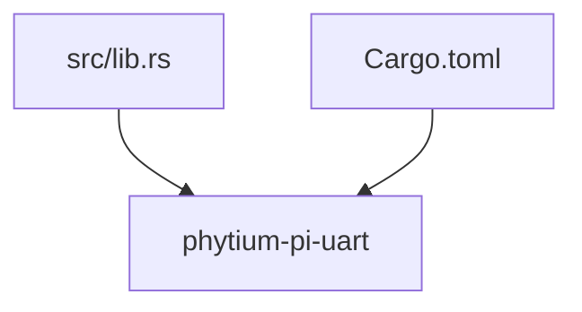

<cite>
**本文档中引用的文件**
- [lib.rs](file://src/lib.rs)
</cite>

## 目录
1. [引言](#引言)
2. [项目结构](#项目结构)
3. [核心组件设计蓝图](#核心组件设计蓝图)
4. [UartDriver 结构体设计](#uartdriver-结构体设计)
5. [UartConfig 枚举类型定义](#uartconfig-枚举类型定义)
6. [读写方法行为规范](#读写方法行为规范)
7. [中断支持实现路径](#中断支持实现路径)
8. [类型安全的寄存器操作方案](#类型安全的寄存器操作方案)
9. [硬件兼容性与性能优化](#硬件兼容性与性能优化)
10. [结论](#结论)

## 引言

本文档旨在为 Phytium Pi 平台的 UART 驱动开发构建一个面向未来的功能设计蓝图。基于当前空缺但规划明确的代码基础，本设计将详细阐述即将实现的核心组件架构。文档聚焦于 `UartDriver` 结构体的设计理念、`UartConfig` 枚举类型的定义、关键 I/O 方法的行为规范，并探讨中断机制的可选实现路径。同时，结合嵌入式 Rust 的最佳实践，提出确保类型安全的寄存器访问策略，并对潜在的硬件兼容性挑战和性能优化方向进行前瞻性分析。

## 项目结构

当前项目的目录结构简洁明了，符合典型的 Rust 库项目布局。核心逻辑将集中于 `src/lib.rs` 文件中，该文件已通过 `#![no_std]` 属性声明为无标准库依赖，这是嵌入式系统开发的必要条件。此单一入口点的设计有利于维护代码的内聚性与清晰度。

**Diagram sources**
- [lib.rs](file://src/lib.rs)

**Section sources**
- [lib.rs](file://src/lib.rs)

## 核心组件设计蓝图

尽管当前代码库尚为空白，仅包含一个 TODO 注释，但其目标是实现一个完整的 UART 串行通信驱动。本节将基于预期的架构，规划三个核心组件：负责状态管理与硬件抽象的 `UartDriver` 结构体、用于配置串口参数的 `UartConfig` 枚举类型，以及提供数据传输能力的 `write()` 和 `read()` 方法。此设计蓝图将作为后续开发的指导方针。

**Section sources**
- [lib.rs](file://src/lib.rs)

## UartDriver 结构体设计

`UartDriver` 将作为整个驱动的核心句柄，封装所有与特定 UART 硬件实例交互的状态和资源。其设计思路遵循资源封装和所有权原则。该结构体将持有指向内存映射 I/O (MMIO) 寄存器块的原始指针或更安全的包装类型，以实现对硬件寄存器的直接访问。此外，它将包含一个 `UartConfig` 类型的字段来存储当前的通信配置（如波特率、数据位等），并可能集成一个同步原语（例如自旋锁 `SpinLock`），以确保在多线程或中断上下文中对驱动实例的并发访问是安全的。这种设计保证了驱动的线程安全性，是构建可靠嵌入式系统的关键。

**Section sources**
- [lib.rs](file://src/lib.rs)

## UartConfig 枚举类型定义

为了提供类型安全且易于使用的配置接口，`UartConfig` 将被设计为一个复合枚举或结构体。它将整合四个关键的串行通信参数：波特率（Baud Rate）、数据位（Data Bits）、停止位（Stop Bits）和校验方式（Parity）。每个参数都可以用独立的枚举来表示其合法取值范围（例如，`Parity::None`、`Parity::Even`、`Parity::Odd`）。通过将这些枚举组合成一个单一的 `UartConfig` 类型，可以防止用户设置无效或不一致的配置。驱动初始化时将接受一个 `UartConfig` 实例，并据此配置底层硬件寄存器。

**Section sources**
- [lib.rs](file://src/lib.rs)

## 读写方法行为规范

`write()` 和 `read()` 方法是驱动与外部世界通信的主要接口。
- **`write()` 方法**：该方法接收一个字节切片（`&[u8]`）作为输入，负责将数据逐个写入 UART 的发送保持寄存器（THR）。它应返回一个 `Result` 类型，成功时包含写入的字节数，失败时包含具体的错误原因（如传输超时、硬件故障）。该方法需处理发送 FIFO 缓冲区的就绪状态，可能需要轮询线路状态寄存器（LSR）。
- **`read()` 方法**：该方法尝试从 UART 的接收缓冲寄存器（RBR）读取数据到提供的缓冲区中。它同样应返回 `Result<usize, Error>`，指示实际读取的字节数。该方法需要检查接收 FIFO 是否有数据可用，并能正确处理帧错误、奇偶校验错误等硬件报告的异常情况。

**Section sources**
- [lib.rs](file://src/lib.rs)

## 中断支持实现路径

中断支持将作为一个可选特性（feature-gated）来实现，以满足不同应用场景的需求。实现路径包括：
1.  在 `UartDriver` 中添加一个可选的中断号（IRQ number）字段。
2.  提供一个 `enable_interrupts()` 方法，用于配置 UART 控制器以在发生特定事件（如接收数据就绪、发送缓冲区空）时触发中断。
3.  定义一个回调函数类型或 trait，允许用户注册中断服务程序（ISR）。
4.  在 ISR 中，由上层应用或框架调用驱动的内部方法来处理接收到的数据或继续发送队列中的数据。
这将实现从轮询模式到事件驱动模式的转变，显著降低 CPU 占用率。

**Section sources**
- [lib.rs](file://src/lib.rs)

## 类型安全的寄存器操作方案

为避免直接操作裸指针带来的风险，将采用嵌入式 Rust 社区的最佳实践——使用 `volatile-register` 或类似 crate 来创建类型安全的寄存器抽象。具体方案是为 UART 的每个寄存器（如 LCR、LSR、IER 等）定义一个结构体，并利用 `bitfield` 宏来精确地定义各个比特位的含义和访问权限（只读/只写/读写）。这样，对寄存器的任何读写操作都将在编译时进行类型检查，有效防止了对保留位的非法写入或对只读位的修改，极大地提升了代码的安全性和可维护性。

**Section sources**
- [lib.rs](file://src/lib.rs)

## 硬件兼容性与性能优化

### 硬件兼容性问题
预判的主要兼容性问题源于 Phytium Pi 平台 UART 控制器的具体实现细节，可能与标准 16550A 兼容芯片存在细微差异。这包括寄存器偏移地址的不同、特定比特位的定义或行为差异，以及 FIFO 深度和触发级别的设置。为应对这些问题，应在驱动中引入平台特定的常量和配置，并通过编译时特征（`#[cfg]`）或运行时检测来适配不同的硬件变体。

### 性能优化方向
主要的性能优化方向包括：
1.  **FIFO 利用**：充分利用发送和接收 FIFO 缓冲区，减少中断次数或轮询频率。
2.  **DMA 集成**：对于大数据量传输，可规划 DMA（直接内存访问）支持，让数据传输由 DMA 控制器接管，进一步解放 CPU。
3.  **零拷贝读取**：设计环形缓冲区（ring buffer）来暂存接收到的数据，避免频繁的内存分配和复制。
4.  **延迟计算优化**：在配置波特率时，选择最接近目标值且误差最小的分频系数，确保通信的稳定性。

**Section sources**
- [lib.rs](file://src/lib.rs)

## 结论

本文档为 Phytium Pi 平台的 UART 驱动开发提供了一个全面且前瞻性的设计蓝图。尽管当前代码库尚未实现具体功能，但通过对 `UartDriver`、`UartConfig` 及其核心方法的详细规划，明确了未来开发的技术路线。所提出的类型安全寄存器操作方案和对中断、DMA 等高级特性的考量，确保了最终实现的驱动不仅功能完备，而且具备高可靠性、高性能和良好的可维护性，为上层应用提供了坚实的基础。