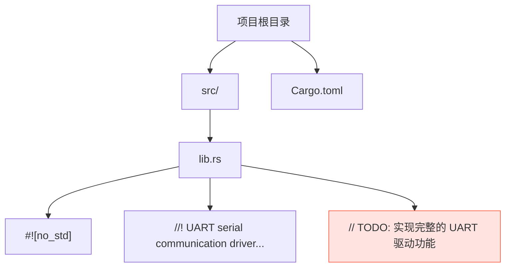

# 当前开发状态与TODO清单

<cite>
**Referenced Files in This Document**   
- [lib.rs](file://src/lib.rs)
- [Cargo.toml](file://Cargo.toml)
</cite>

## 目录
1. [项目概述](#项目概述)
2. [当前实现状态](#当前实现状态)
3. [待完成核心任务](#待完成核心任务)
4. [下一步开发路径](#下一步开发路径)
5. [安全边界与硬件参考](#安全边界与硬件参考)

## 项目概述

本项目旨在为 Phytium Pi 平台开发一个无标准库（`no_std`）环境下的 UART 串行通信驱动。该驱动将作为嵌入式系统中关键的外设组件，支持设备间的异步串行数据传输。项目依赖 `tock-registers` 库进行底层寄存器操作，使用 `log` 进行日志输出，并通过 `spin` 提供的自旋锁和一次性初始化机制保证并发安全。

**Section sources**
- [Cargo.toml](file://Cargo.toml#L1-L23)

## 当前实现状态

目前，项目的实现处于初始阶段。`src/lib.rs` 文件仅完成了基本的模块声明和属性标注，包括 `#![no_std]` 属性以适应嵌入式环境，以及一个简要的文档注释说明其功能目标。代码中明确包含一条 TODO 注释：“实现完整的 UART 驱动功能”，这表明所有实质性的驱动逻辑均未实现。

具体而言，当前代码库中：
- **无任何结构体或枚举定义**：尚未定义用于表示 UART 控制器、配置参数或错误类型的 Rust 类型。
- **无函数实现**：缺少初始化、配置、发送、接收等核心功能函数。
- **无寄存器映射**：未根据硬件手册定义 UART 外设的内存映射寄存器。
- **无外部接口**：没有提供任何可供上层应用调用的公共 API。

**Diagram sources**
- [lib.rs](file://src/lib.rs#L0-L3)

**Section sources**
- [lib.rs](file://src/lib.rs#L0-L3)

## 待完成核心任务

为了将此驱动从概念推进到可用状态，必须完成以下一系列核心开发任务：

### 1. UART 寄存器映射定义
根据 Phytium Pi 平台的硬件参考手册，定义 UART 控制器的所有相关寄存器。这应利用 `tock-registers` 库来创建类型安全的寄存器访问接口。需要映射的典型寄存器包括但不限于：
- 数据寄存器 (Data Register)
- 波特率除数寄存器 (Baud Rate Divisor Registers)
- 线路控制寄存器 (Line Control Register)
- 中断使能寄存器 (Interrupt Enable Register)
- 中断标识寄存器 (Interrupt Identification Register)
- FIFO 控制寄存器 (FIFO Control Register)
- 状态寄存器 (Status Register)

### 2. 初始化流程实现
编写初始化函数，负责在系统启动时正确配置 UART 硬件。该流程应包括：
- 检查并获取 UART 设备的内存映射地址。
- 重置 UART 控制器。
- 设置默认的通信参数（如 8N1 格式）。
- 清除任何待处理的中断。

### 3. 波特率配置
实现一个可配置的波特率设置函数。该函数需要根据给定的目标波特率和系统时钟频率，计算出正确的分频系数，并将其写入相应的波特率寄存器。

### 4. 数据收发接口设计
设计并实现同步和/或异步的数据发送与接收接口。这包括：
- `send_byte(&self, byte: u8)`：阻塞式发送单个字节。
- `receive_byte(&self) -> Option<u8>`：非阻塞式读取一个字节，若无数据则返回 `None`。
- 考虑实现基于缓冲区的批量收发方法。

### 5. 中断处理机制
集成中断处理逻辑，允许驱动在接收到数据或发送缓冲区为空时得到通知。这需要：
- 在初始化时注册中断服务程序 (ISR)。
- 在 ISR 中检查中断源，并执行相应的处理逻辑（如将接收到的字节存入缓冲区，或从发送队列取出下一个字节）。

### 6. 错误状态检测
实现对 UART 状态寄存器的轮询或中断响应，以检测并报告常见的通信错误，例如：
- 奇偶校验错误 (Parity Error)
- 帧错误 (Framing Error)
- 溢出错误 (Overrun Error)
- 断线指示 (Break Interrupt)

**Section sources**
- [lib.rs](file://src/lib.rs#L3)

## 下一步开发路径

建议的开发顺序如下，以确保基础稳固且逐步构建复杂性：

1.  **研究硬件手册**：首要任务是获取并仔细阅读 Phytium Pi 的 UART 外设技术文档，这是所有后续工作的基础。
2.  **定义寄存器接口**：使用 `tock-registers` 宏（如 `register_bitfields!`, `register_structs!`）精确地定义寄存器布局和位域。
3.  **创建驱动结构体**：定义一个 `UartDriver` 结构体，持有寄存器映射实例、配置信息和必要的同步原语（如 `spin::Mutex`）。
4.  **实现基础 I/O**：先实现不依赖中断的轮询模式下的 `send_byte` 和 `receive_byte` 方法，验证基本的硬件通信能力。
5.  **添加配置功能**：实现波特率设置和其他线路参数的配置方法。
6.  **集成中断支持**：最后，扩展驱动以支持中断驱动的 I/O，提高效率并释放 CPU 资源。

遵循此路径可以最小化早期开发中的不确定性，并为更高级的功能提供一个可靠的测试平台。

## 安全边界与硬件参考

由于此驱动直接与硬件交互，不可避免地会使用 `unsafe` 代码块。开发者必须严格遵守以下原则：

- **`unsafe` 的使用范围**：`unsafe` 代码应被严格限制在绝对必要的地方，主要是用于将原始内存地址转换为寄存器映射实例。所有 `unsafe` 块都必须附有详细的注释，解释为何此处是安全的（例如，“此地址由 SoC 手册固定分配，且已确认无其他设备共享”）。
- **抽象泄漏**：驱动的公共 API 应尽可能封装 `unsafe` 细节，向上层提供安全的抽象。
- **硬件手册权威性**：所有关于寄存器偏移、位定义、时序要求和初始化序列的信息，都必须以官方硬件参考手册为准。任何假设都可能导致硬件行为异常甚至损坏。

**Section sources**
- [lib.rs](file://src/lib.rs#L0-L3)
- [Cargo.toml](file://Cargo.toml#L15-L18)