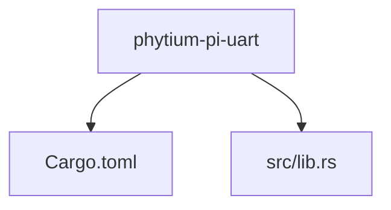
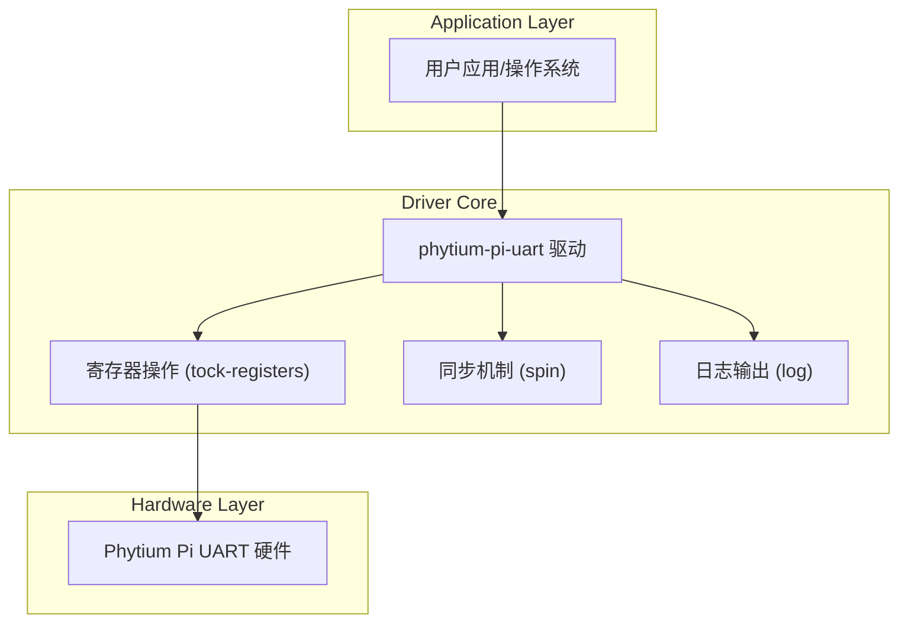

<cite>
**本文档中引用的文件**
- [lib.rs](file://src/lib.rs)
- [Cargo.toml](file://Cargo.toml)
</cite>

## 目录
1. [引言](#引言)
2. [项目结构](#项目结构)
3. [核心组件](#核心组件)
4. [架构概述](#架构概述)
5. [详细组件分析](#详细组件分析)
6. [依赖分析](#依赖分析)
7. [性能考量](#性能考量)
8. [故障排除指南](#故障排除指南)
9. [结论](#结论)

## 引言

本项目 `phytium-pi-uart` 是为 Phytium Pi 嵌入式平台开发的通用异步收发传输器（UART）串行通信驱动程序。其主要功能是为该硬件平台提供底层串行接口支持，使操作系统或固件能够通过标准串行协议进行调试输出、设备控制和数据交换。

该项目特别针对无标准库（no-std）的嵌入式环境设计，利用 Rust 语言的安全性和零成本抽象特性，在资源受限的系统中实现高效且可靠的硬件访问。当前版本处于初期开发阶段，仅包含基础配置和占位符代码，尚未实现具体的 UART 寄存器操作逻辑与数据收发功能。

尽管功能尚未完成，但项目已明确其设计目标：作为 ArceOS 操作系统设备驱动框架的一部分，未来将集成到模块化、可组合的驱动生态系统中。通过遵循现代 Rust 嵌入式开发实践，该项目旨在提供一个类型安全、线程安全且易于维护的硬件抽象层（HAL），服务于 Phytium 架构的物联网与边缘计算设备。

## 项目结构

项目采用典型的 Rust 库结构，简洁明了：

```
.
├── src
│   └── lib.rs
└── Cargo.toml
```

根目录下包含两个核心文件：`Cargo.toml` 定义了项目的元信息、依赖项和构建配置；`src/lib.rs` 是唯一的源码文件，目前仅声明了 `#![no_std]` 属性并包含简要文档注释。

这种极简结构反映了项目当前的初始状态——重点在于确立正确的技术方向和依赖关系，而非实现复杂逻辑。随着开发推进，预计 `src` 目录将扩展为包含多个模块，如寄存器定义、初始化流程、读写操作、中断处理等。



**Diagram sources**
- [Cargo.toml](file://Cargo.toml#L1-L23)
- [lib.rs](file://src/lib.rs#L1-L5)

**Section sources**
- [Cargo.toml](file://Cargo.toml#L1-L23)
- [lib.rs](file://src/lib.rs#L1-L5)

## 核心组件

项目的核心组件目前集中在单一源文件 `lib.rs` 中，其最显著的特征是使用了 `#![no_std]` 属性，表明这是一个不依赖于 Rust 标准库的裸机（bare-metal）环境驱动。这一选择对于嵌入式系统至关重要，因为它消除了对操作系统运行时的依赖，使得代码可以直接在硬件上执行。

此外，`Cargo.toml` 文件中声明的依赖项构成了项目的基础支撑体系：
- `tock-registers`：用于安全地访问内存映射 I/O 寄存器
- `log`：提供日志输出能力，便于调试
- `spin`：提供无阻塞的同步原语，适用于中断上下文

这些组件共同构建了一个适合嵌入式设备驱动开发的最小化、高性能运行环境。

**Section sources**
- [lib.rs](file://src/lib.rs#L1-L5)
- [Cargo.toml](file://Cargo.toml#L10-L15)

## 架构概述

从架构角度看，`phytium-pi-uart` 遵循典型的嵌入式 Rust 驱动模式：以 `no-std` 为基础，结合硬件抽象层（HAL）理念，通过类型安全的方式封装底层寄存器操作。虽然当前代码未展示具体实现，但可以从依赖项推断出预期架构。

驱动预计将基于 `tock-registers` 创建一组寄存器映射结构体，用于表示 UART 控制器的各个配置与数据寄存器。通过这些结构体，开发者可以以安全且直观的方式读写寄存器字段，避免直接进行指针操作带来的风险。

同时，`spin` 提供的互斥锁将确保多线程或中断环境下对 UART 资源的独占访问，而 `log` 宏则可用于记录关键事件，辅助调试与监控。



**Diagram sources**
- [Cargo.toml](file://Cargo.toml#L10-L15)
- [lib.rs](file://src/lib.rs#L1-L5)

## 详细组件分析

### 组件 A 分析

#### 对象导向组件
由于当前代码尚未定义任何结构体或实现方法，无法生成实际的类图。但根据命名惯例和项目目标，未来可能包含如下结构：

```mermaid
classDiagram
    class UartDriver {
        +base_address: usize
        +init() Result<(), Error>
        +write(bytes: &[u8]) Result<(), Error>
        +read(buffer: &mut [u8]) Result<usize, Error>
        -read_register(offset: u32) u32
        -write_register(offset: u32, value: u32)
    }

    class RegisterBlock {
        +data: ReadWrite<u32>
        +status: ReadOnly<u32>
        +control: Read