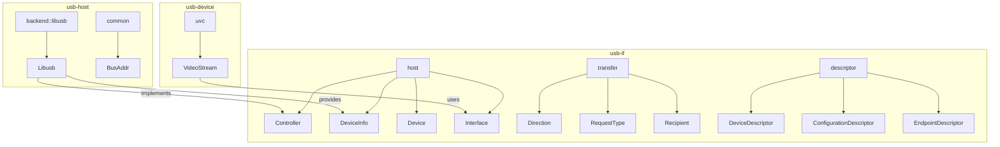
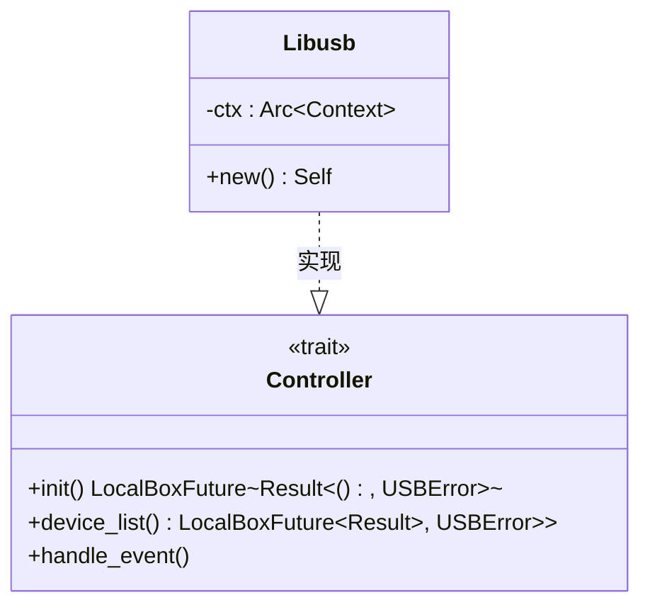
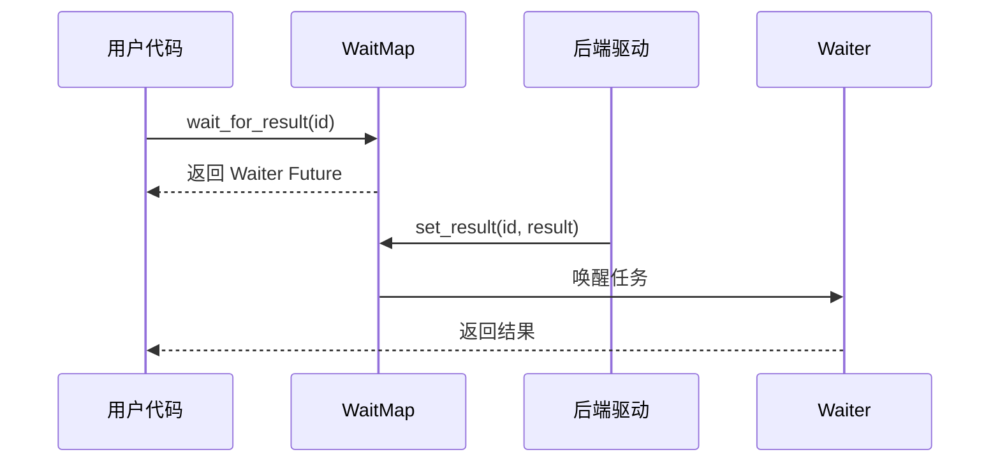

# API 参考

<cite>
**本文档中引用的文件**
- [lib.rs](file://usb-if/src/lib.rs)
- [host/mod.rs](file://usb-if/src/host/mod.rs)
- [transfer/mod.rs](file://usb-if/src/transfer/mod.rs)
- [err.rs](file://usb-if/src/err.rs)
- [descriptor/mod.rs](file://usb-if/src/descriptor/mod.rs)
- [lib.rs](file://usb-host/src/lib.rs)
- [mod.rs](file://usb-host/src/backend/libusb/mod.rs)
- [device.rs](file://usb-host/src/backend/libusb/device.rs)
- [endpoint.rs](file://usb-host/src/backend/libusb/endpoint.rs)
- [wait.rs](file://usb-if/src/transfer/wait.rs)
- [stream.rs](file://usb-device/uvc/src/stream.rs)
</cite>

## 目录
1. [简介](#简介)
2. [核心模块概览](#核心模块概览)
3. [usb-if 模块接口](#usb-if-模块接口)
4. [usb-host 模块实现](#usb-host-模块实现)
5. [关键 Trait 实现指南](#关键-trait-实现指南)
6. [异步方法生命周期与 Send/Sync 边界](#异步方法生命周期与-sendsync-边界)
7. [错误码与异常处理](#错误码与异常处理)
8. [版本兼容性与稳定性标记](#版本兼容性与稳定性标记)
9. [使用注意事项](#使用注意事项)

## 简介
本API参考文档旨在全面描述CrabUSB项目中`usb-if`、`usb-host`和`usb-device`三大模块所暴露的所有公共接口。文档通过解析代码注释自动生成基础文档字符串，并辅以人工撰写的详细说明，确保开发者能够准确理解每个函数的作用、参数含义、返回值类型以及可能抛出的错误。特别关注异步方法的生命周期约束与Send/Sync边界条件，为构建安全可靠的USB驱动程序提供指导。

**Section sources**
- [lib.rs](file://usb-if/src/lib.rs#L0-L8)
- [lib.rs](file://usb-host/src/lib.rs#L0-L28)

## 核心模块概览
CrabUSB项目由三个主要模块构成：`usb-if`定义了通用的USB接口抽象；`usb-host`实现了主机端的具体功能；`usb-device`则专注于设备端的行为。这些模块共同构成了一个完整的USB通信框架，支持从底层控制传输到高层流式数据交换的各种操作。

**Diagram sources**
- [lib.rs](file://usb-if/src/lib.rs#L0-L8)
- [mod.rs](file://usb-host/src/backend/libusb/mod.rs#L0-L64)
- [stream.rs](file://usb-device/uvc/src/stream.rs#L0-L79)

**Section sources**
- [lib.rs](file://usb-if/src/lib.rs#L0-L8)
- [lib.rs](file://usb-host/src/lib.rs#L0-L28)
- [stream.rs](file://usb-device/uvc/src/stream.rs#L0-L79)

## usb-if 模块接口
`usb-if`模块作为整个项目的接口层，定义了一系列用于描述USB设备、配置、端点等信息的数据结构及核心trait。

### 描述符相关接口
该部分提供了对USB标准描述符的解析与表示能力。

#### DeviceDescriptor
代表USB设备描述符，包含设备的基本信息如厂商ID、产品ID、协议版本等。

**Section sources**
- [descriptor/mod.rs](file://usb-if/src/descriptor/mod.rs#L0-L241)

#### ConfigurationDescriptor
表示设备的配置描述符，包括接口数量、最大功率、属性标志等。

**Section sources**
- [descriptor/mod.rs](file://usb-if/src/descriptor/mod.rs#L0-L241)

#### EndpointDescriptor
描述单个端点的特性，包括地址、最大包大小、传输类型和方向。

**Section sources**
- [descriptor/mod.rs](file://usb-if/src/descriptor/mod.rs#L0-L241)

### 传输相关接口
定义了USB传输过程中涉及的方向、请求类型、接收者等枚举类型。

#### Direction
表示数据传输方向，分为`Out`（写入）和`In`（读取）。

**Section sources**
- [transfer/mod.rs](file://usb-if/src/transfer/mod.rs#L0-L110)

#### RequestType
指定请求的类型，包括标准、类、厂商等。

**Section sources**
- [transfer/mod.rs](file://usb-if/src/transfer/mod.rs#L0-L110)

#### Recipient
指明请求的目标实体，可以是设备、接口、端点或其他。

**Section sources**
- [transfer/mod.rs](file://usb-if/src/transfer/mod.rs#L0-L110)

## usb-host 模块实现
`usb-host`模块基于`usb-if`定义的接口，利用libusb后端实现了具体的主机控制器逻辑。

### Libusb 控制器实现
`Libusb`结构体实现了`Controller` trait，负责初始化上下文、管理设备列表并处理事件循环。

**Diagram sources**
- [mod.rs](file://usb-host/src/backend/libusb/mod.rs#L0-L64)

**Section sources**
- [mod.rs](file://usb-host/src/backend/libusb/mod.rs#L0-L64)

### 设备与接口管理
通过`DeviceInfo`和`Device`结构体，提供了打开设备、获取描述符、设置配置等功能。

#### DeviceInfo::open
异步方法，用于打开一个USB设备并返回`Device`实例。

**Section sources**
- [device.rs](file://usb-host/src/backend/libusb/device.rs#L0-L412)

#### Device::claim_interface
声明指定接口的所有权，可同时设置备用设置。

**Section sources**
- [device.rs](file://usb-host/src/backend/libusb/device.rs#L0-L412)

### 端点操作
各种类型的端点（批量、中断、等时）均通过`EndpointImpl`统一实现提交传输的功能。

#### EndpointBulkIn::submit
向IN方向的批量端点提交接收请求。

**Section sources**
- [endpoint.rs](file://usb-host/src/backend/libusb/endpoint.rs#L0-L190)

#### EndpintIsoIn::submit
向IN方向的等时端点提交接收请求，需指定ISO包的数量。

**Section sources**
- [endpoint.rs](file://usb-host/src/backend/libusb/endpoint.rs#L0-L190)

## 关键 Trait 实现指南
为了正确实现`usb-if`中定义的关键trait，必须遵循特定的安全契约和并发模型。

### Controller 安全契约
实现`Controller` trait时，必须保证`init`、`device_list`和`handle_event`方法在多线程环境下的安全性。特别是`handle_event`可能在中断上下文中调用，因此不能执行阻塞操作。

**Section sources**
- [host/mod.rs](file://usb-if/src/host/mod.rs#L0-L123)

### Transfer 生命周期管理
所有传输操作都通过`Waiter`机制进行异步等待。实现者需要确保在传输完成前保持相关资源的有效性，并在回调中正确更新状态。

**Diagram sources**
- [wait.rs](file://usb-if/src/transfer/wait.rs#L0-L178)

**Section sources**
- [wait.rs](file://usb-if/src/transfer/wait.rs#L0-L178)

## 异步方法生命周期与 Send/Sync 边界
所有异步方法返回的`LocalBoxFuture`要求其实现在`Send`边界上安全，以便能够在不同的执行上下文中迁移。

### Send 和 Sync 约束
- `Controller`及其衍生对象必须实现`Send`。
- 共享资源（如`EPControl::queue`）需使用`Arc<Mutex<T>>`包装以满足`Sync`要求。
- 所有future内部捕获的变量也必须是`Send`的。

**Section sources**
- [device.rs](file://usb-host/src/backend/libusb/device.rs#L0-L412)
- [endpoint.rs](file://usb-host/src/backend/libusb/endpoint.rs#L0