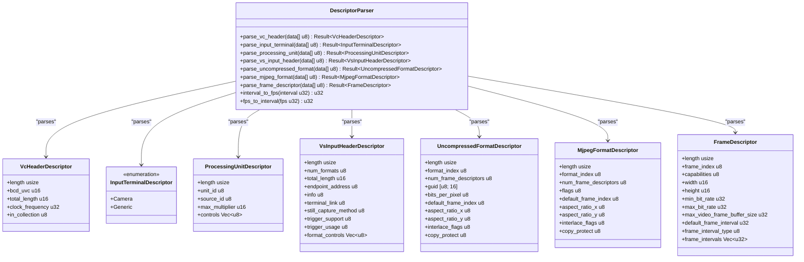
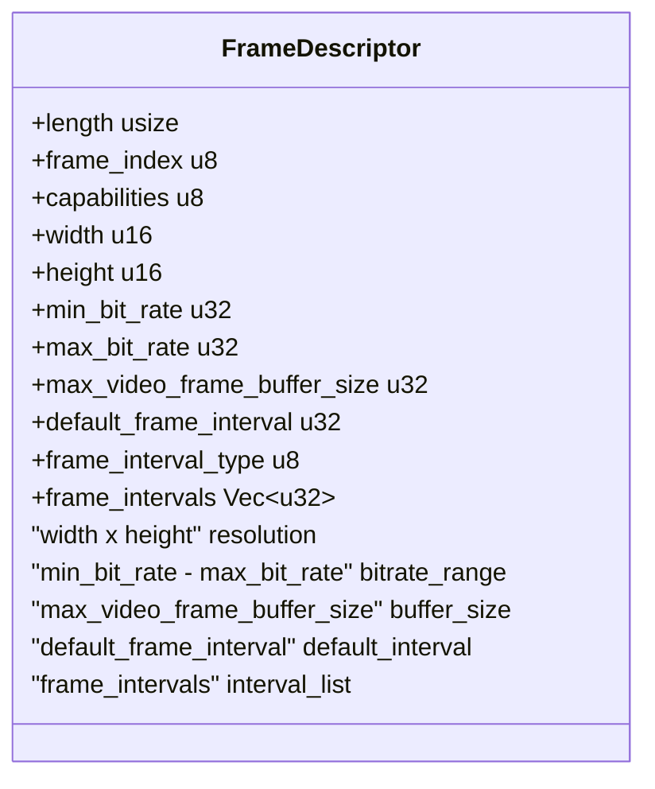
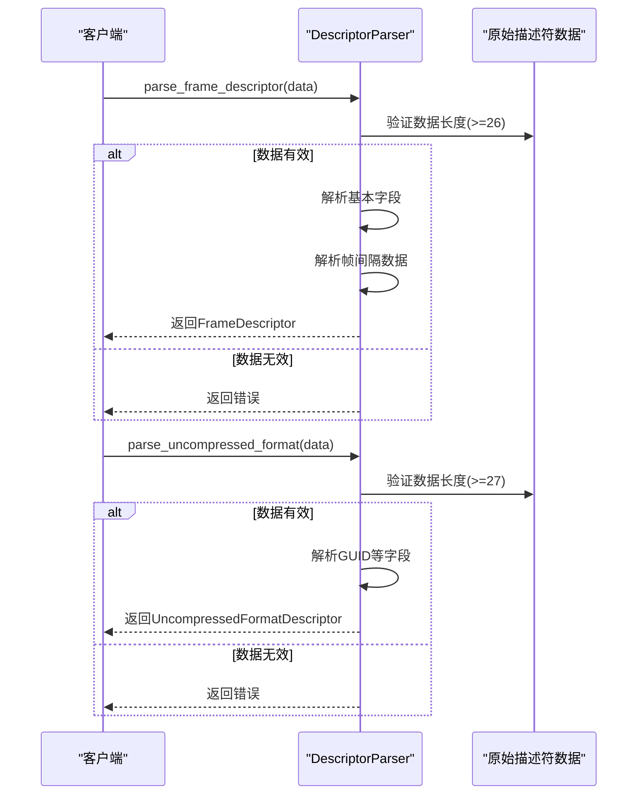
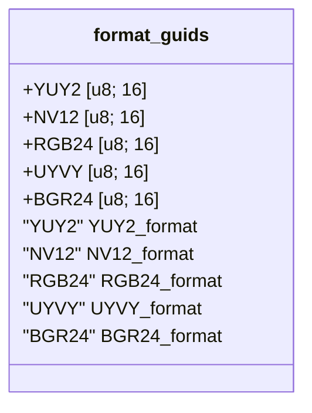

# UVC描述符解析模块

<cite>
**Referenced Files in This Document**
- [descriptors.rs](file://usb-device/uvc/src/descriptors.rs)
- [parser.rs](file://usb-if/src/descriptor/parser.rs)
</cite>

## 目录
1. [简介](#简介)
2. [核心组件](#核心组件)
3. [VideoControl接口描述符](#videcontrol接口描述符)
4. [VideoStreaming接口描述符](#videostreaming接口描述符)
5. [帧描述符结构](#帧描述符结构)
6. [描述符解析器](#描述符解析器)
7. [格式GUID常量](#格式guid常量)

## 简介
UVC（USB Video Class）描述符解析模块负责解析USB视频设备的标准描述符，以获取摄像头的功能、格式和配置信息。该模块实现了对UVC标准中定义的各类描述符的完整支持，包括VideoControl和VideoStreaming接口的描述符。

**Section sources**
- [descriptors.rs](file://usb-device/uvc/src/descriptors.rs#L1-L50)

## 核心组件
本模块的核心是`DescriptorParser`工具类，它提供了对各种UVC描述符的解析方法。同时，模块定义了多个结构体来表示不同类型的描述符，如`VcHeaderDescriptor`、`InputTerminalDescriptor`等。

**Diagram sources**
- [descriptors.rs](file://usb-device/uvc/src/descriptors.rs#L574-L659)

**Section sources**
- [descriptors.rs](file://usb-device/uvc/src/descriptors.rs#L574-L659)

## VideoControl接口描述符
VideoControl接口描述符用于描述视频控制功能，包括头描述符、输入终端和处理单元等。

### VcHeaderDescriptor
`VcHeaderDescriptor`表示VideoControl接口的头描述符，包含UVC版本、总长度、时钟频率等基本信息。

**Section sources**
- [descriptors.rs](file://usb-device/uvc/src/descriptors.rs#L574-L580)

### InputTerminalDescriptor
`InputTerminalDescriptor`表示输入终端描述符，分为摄像头终端和其他通用终端两种类型。摄像头终端包含焦距等特定信息。

**Section sources**
- [descriptors.rs](file://usb-device/uvc/src/descriptors.rs#L582-L604)

### ProcessingUnitDescriptor
`ProcessingUnitDescriptor`表示处理单元描述符，用于描述图像处理功能，如亮度、对比度调节等。

**Section sources**
- [descriptors.rs](file://usb-device/uvc/src/descriptors.rs#L605-L614)

## VideoStreaming接口描述符
VideoStreaming接口描述符用于描述视频流的格式和传输特性。

### VsInputHeaderDescriptor
`VsInputHeaderDescriptor`表示VideoStreaming输入头描述符，包含格式数量、端点地址、终端链接等信息。

**Section sources**
- [descriptors.rs](file://usb-device/uvc/src/descriptors.rs#L615-L629)

### UncompressedFormatDescriptor/MjpegFormatDescriptor
`UncompressedFormatDescriptor`和`MjpegFormatDescriptor`分别表示未压缩格式和MJPEG格式的描述符，定义了视频流的编码格式和参数。

**Section sources**
- [descriptors.rs](file://usb-device/uvc/src/descriptors.rs#L630-L644)

## 帧描述符结构
`FrameDescriptor`结构体表示视频帧的详细参数，包括分辨率、比特率范围、缓冲区大小和帧率等关键信息。

**Diagram sources**
- [descriptors.rs](file://usb-device/uvc/src/descriptors.rs#L659-L675)

**Section sources**
- [descriptors.rs](file://usb-device/uvc/src/descriptors.rs#L659-L675)

## 描述符解析器
`DescriptorParser`工具类提供了核心的解析方法，用于将原始字节数据转换为相应的描述符结构。

### 解析方法调用流程

**Diagram sources**
- [descriptors.rs](file://usb-device/uvc/src/descriptors.rs#L400-L450)

**Section sources**
- [descriptors.rs](file://usb-device/uvc/src/descriptors.rs#L300-L500)

## 格式GUID常量
`format_guids`模块定义了YUY2、NV12等视频格式的GUID常量，用于识别视频流的编码类型。

**Diagram sources**
- [descriptors.rs](file://usb-device/uvc/src/descriptors.rs#L160-L180)

**Section sources**
- [descriptors.rs](file://usb-device/uvc/src/descriptors.rs#L160-L180)