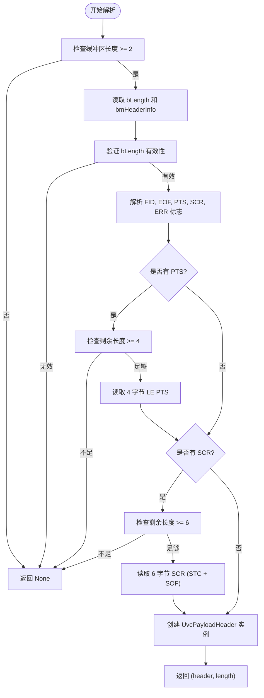

# 视频帧解析与组装模块

<cite>
**本文档引用的文件**
- [frame.rs](file://usb-device/uvc/src/frame.rs)
- [descriptors.rs](file://usb-device/uvc/src/descriptors.rs)
- [stream.rs](file://usb-device/uvc/src/stream.rs)
</cite>

## 目录
1. [简介](#简介)
2. [UVC载荷头解析](#uvc载荷头解析)
3. [视频帧事件封装](#视频帧事件封装)
4. [帧解析器状态机](#帧解析器状态机)
5. [数据包组装流程](#数据包组装流程)
6. [使用示例](#使用示例)

## 简介
本模块负责处理UVC（USB Video Class）设备传输的原始数据包，将其解析并重组为完整的视频帧。核心功能包括：从每个USB数据包中提取UVC载荷头信息、根据FID（帧ID）和EOF（帧结束）标志判断帧边界、处理传输错误以及最终生成可供上层应用使用的`FrameEvent`结构体。

**Section sources**
- [frame.rs](file://usb-device/uvc/src/frame.rs#L0-L247)

## UVC载荷头解析
UVC载荷头是每个视频数据包的前缀，包含了控制和元数据信息。该模块通过`UvcPayloadHeader::parse`方法从字节流中解析出这些信息。

### 载荷头字段含义
`UvcPayloadHeader`结构体包含以下字段：

- **length**: `bLength`字段，表示整个载荷头的长度（以字节为单位）
- **info**: `bmHeaderInfo`位图，包含多个标志位
- **fid**: 帧ID标志，用于区分连续的视频帧
- **eof**: 帧结束标志，指示当前数据包是否为帧的最后一部分
- **pts**: 呈现时间戳（Presentation Time Stamp），可选的90kHz时钟基准下的时间值
- **scr**: 源时钟参考（Source Clock Reference），由SOF时间戳和SOF计数构成
- **has_err**: 错误标志，对应`bmHeaderInfo`中的ERR位

### 解析过程
解析过程遵循UVC规范2.4.3.3节的要求：
1. 验证输入缓冲区至少有2个字节
2. 读取`bLength`和`bmHeaderInfo`字段
3. 根据`bmHeaderInfo`中的标志位确定是否存在PTS和SCR字段
4. 按顺序解析可选字段（PTS在SCR之前）
5. 返回解析后的`UvcPayloadHeader`实例及实际解析的头部长度

**Diagram sources**
- [frame.rs](file://usb-device/uvc/src/frame.rs#L15-L80)
- [descriptors.rs](file://usb-device/uvc/src/descriptors.rs#L195-L201)

**Section sources**
- [frame.rs](file://usb-device/uvc/src/frame.rs#L15-L80)

## 视频帧事件封装
当一个完整的视频帧被成功组装后，系统会生成一个`FrameEvent`实例，将视频数据及其元信息传递给上层应用。

### FrameEvent 结构体
`FrameEvent`包含以下字段：

- **data**: `Vec<u8>`类型，存储完整的视频帧原始数据
- **pts_90khz**: 可选的呈现时间戳，