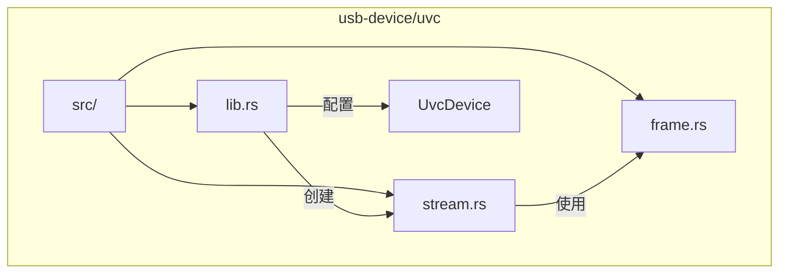
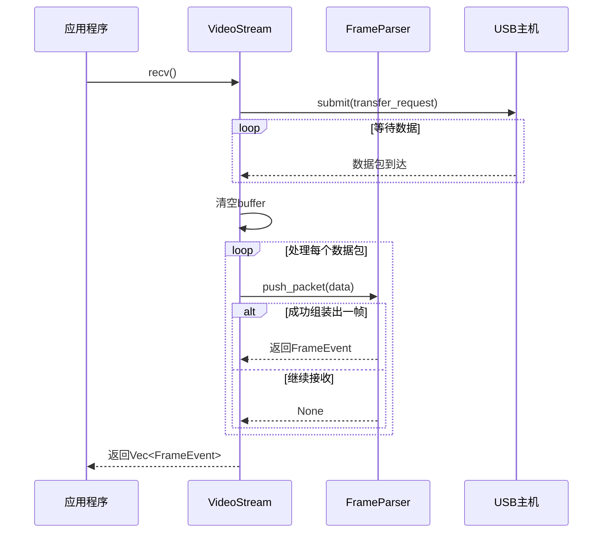
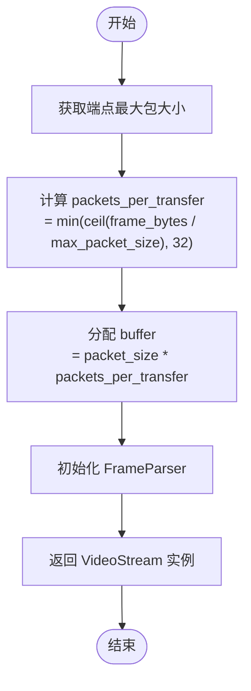

# 视频流管理模块

<cite>
**本文档引用的文件**
- [stream.rs](file://usb-device/uvc/src/stream.rs)
- [frame.rs](file://usb-device/uvc/src/frame.rs)
- [lib.rs](file://usb-device/uvc/src/lib.rs)
</cite>

## 目录
1. [简介](#简介)
2. [项目结构](#项目结构)
3. [核心组件](#核心组件)
4. [架构概述](#架构概述)
5. [详细组件分析](#详细组件分析)
6. [依赖分析](#依赖分析)
7. [性能考量](#性能考量)
8. [故障排除指南](#故障排除指南)
9. [结论](#结论)

## 简介
本文档系统化地阐述了`CrabUSB`驱动库中UVC设备的视频流管理模块，重点聚焦于`VideoStream`结构体的设计与异步数据接收机制。该模块负责从USB摄像头设备高效、可靠地接收等时（isochronous）视频数据流，并将其组装成完整的视频帧。

`VideoStream`是此模块的核心，它封装了底层USB等时传输的复杂性，为上层应用提供了一个简洁的异步API来持续获取视频帧事件。其设计借鉴了`libuvc`等成熟库的实现理念，确保了在高带宽、低延迟要求下的稳定性和兼容性。文档将深入解析其初始化过程、缓冲区管理策略、数据包处理流程以及错误监控机制。

## 项目结构
视频流管理功能主要位于`usb-device/uvc`子模块中，遵循清晰的分层设计。`src/`目录下包含三个关键源文件：`stream.rs`定义了`VideoStream`主结构体和其公共接口；`frame.rs`实现了`FrameParser`，负责解析UVC协议载荷头并组装完整视频帧；`lib.rs`则作为模块入口，协调`UvcDevice`与`VideoStream`之间的交互。



**图示来源**
- [stream.rs](file://usb-device/uvc/src/stream.rs#L0-L79)
- [frame.rs](file://usb-device/uvc/src/frame.rs#L0-L247)
- [lib.rs](file://usb-device/uvc/src/lib.rs#L0-L1317)

**本节来源**
- [stream.rs](file://usb-device/uvc/src/stream.rs#L0-L79)
- [frame.rs](file://usb-device/uvc/src/frame.rs#L0-L247)
- [lib.rs](file://usb-device/uvc/src/lib.rs#L0-L1317)

## 核心组件
`VideoStream`结构体是视频流管理的核心，它直接与USB主机控制器交互，通过等时端点接收原始数据包。其内部集成了一个`FrameParser`实例，用于处理接收到的数据包，识别帧边界，并将分散的数据包重新组合成完整的视频帧。该结构体提供了`recv`异步方法，这是用户获取视频数据的主要入口。

**本节来源**
- [stream.rs](file://usb-device/uvc/src/stream.rs#L0-L79)

## 架构概述
整个视频流管理流程始于`UvcDevice`调用`start_streaming`方法。该方法会根据当前设置的视频格式，选择合适的接口备用设置（alternate setting），并获取对应的等时输入端点（`EndpointIsoIn`）。随后，它利用这些参数调用`VideoStream::new`构造函数来创建一个新的`VideoStream`实例。

一旦`VideoStream`被创建，用户即可循环调用其`recv`方法。该方法会提交一个等时传输请求，等待数据返回。当数据到达后，`recv`方法会遍历每个数据包，利用`FrameParser`进行解析。`FrameParser`根据UVC协议规范检查载荷头中的FID（帧ID）和EOF（帧结束）标志位，以判断是否构成一帧完整的图像。如果成功组装出一帧，`recv`方法将返回一个包含该帧数据及相关元信息的`FrameEvent`向量。



**图示来源**
- [stream.rs](file://usb-device/uvc/src/stream.rs#L0-L79)
- [frame.rs](file://usb-device/uvc/src/frame.rs#L0-L247)
- [lib.rs](file://usb-device/uvc/src/lib.rs#L0-L1317)

## 详细组件分析

### VideoStream 结构体分析
`VideoStream`结构体的设计旨在高效地管理等时传输的资源和状态。它不仅持有对USB端点的引用，还预分配了用于接收数据的缓冲区，并计算了每次传输所需的数据包数量，从而避免了运行时的动态计算开销。

#### 结构体字段说明
`VideoStream`的关键字段及其作用如下表所示：

| 字段 | 类型 | 描述 |
| :--- | :--- | :--- |
| `ep` | `EndpointIsoIn` | 指向用于接收视频数据的等时输入端点。 |
| `_iface` | `Interface` | 对视频流接口的引用，确保接口在`VideoStream`生命周期内保持有效。 |
| `frame_parser` | `FrameParser` | 负责解析UVC载荷头并组装完整视频帧的核心组件。 |
| `vedio_format` | `VideoFormat` | 记录当前流使用的视频格式（分辨率、帧率等）。 |
| `packets_per_transfer` | `usize` | 每次等时传输请求中包含的数据包数量。 |
| `packet_size` | `usize` | 每个数据包的最大大小（字节）。 |
| `buffer` | `Vec<u8>` | 预分配的缓冲区，用于存放一次传输中所有数据包的原始数据。 |

**本节来源**
- [stream.rs](file://usb-device/uvc/src/stream.rs#L0-L79)

#### 构造函数 new 分析
`new`方法是`VideoStream`的初始化入口，它根据传入的`EndpointIsoIn`和`VideoFormat`参数精确地计算和配置传输参数。

首先，它从端点描述符中获取`max_packet_size`，这决定了单个数据包能承载的最大数据量。接着，它计算`packets_per_transfer`，即每次传输需要多少个数据包。这个值的计算逻辑参考了`libusb`：
`packets_per_transfer = min(ceil(dwMaxVideoFrameSize / max_packet_size), 32)`
其中`dwMaxVideoFrameSize`由`VideoFormat`的`frame_bytes()`方法估算得出。这里取最小值32是为了防止因计算结果过大而导致内存浪费或性能下降。

最后，根据`max_packet_size`和`packets_per_transfer`，可以确定总缓冲区`buffer`的大小为`max_packet_size * packets_per_transfer`。这种预计算和预分配的策略极大地提升了运行时效率。



**图示来源**
- [stream.rs](file://usb-device/uvc/src/stream.rs#L15-L35)

**本节来源**
- [stream.rs](file://usb-device/uvc/src/stream.rs#L15-L35)
- [lib.rs](file://usb-device/uvc/src/lib.rs#L0-L1317)

#### 异步接收方法 recv 分析
`recv`方法是`VideoStream`的核心功能，它是一个异步函数，负责发起等时传输请求并处理返回的数据。

该方法的执行流程如下：
1.  **清空缓冲区**：在每次接收前，先将`buffer`填充为0，确保没有残留数据。
2.  **提交传输请求**：调用`self.ep.submit(&mut self.buffer, self.packets_per_transfer)?`，向USB主机提交一个等时传输请求。此操作是非阻塞的，它会立即返回一个`Future`。
3.  **等待数据**：通过`.await?`等待传输完成。如果传输失败（如超时、设备断开），将返回相应的错误。
4.  **处理数据包**：传输成功后，`buffer`中包含了`packets_per_transfer`个数据包。方法通过`chunks(self.packet_size)`迭代器将`buffer`分割成独立的数据包。
5.  **跳过空包**：对于全零的数据包，认为是无效的，直接跳过。
6.  **解析与组装**：将每个非空数据包传递给`frame_parser.push_packet(data)`。`FrameParser`会根据UVC载荷头的信息决定是否触发一个`FrameEvent`。
7.  **返回结果**：收集所有由`FrameParser`产生的`FrameEvent`，并将它们打包成一个`Vec`返回给调用者。

此设计将底层的等时传输细节与高层的帧组装逻辑解耦，使得代码职责清晰，易于维护。

```mermaid
sequenceDiagram
    participant App as 应用程序
    participant VS as VideoStream
    participant EP as EndpointIsoIn
    participant FP as FrameParser

    App->>VS: recv()
    VS->>VS: buffer.fill(0)
    VS->>EP: submit(buffer, n_packets)
    EP-->>VS: Future<TransferResult>
   