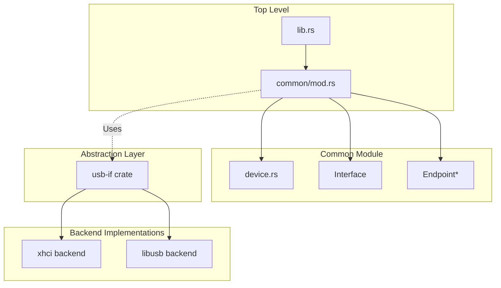
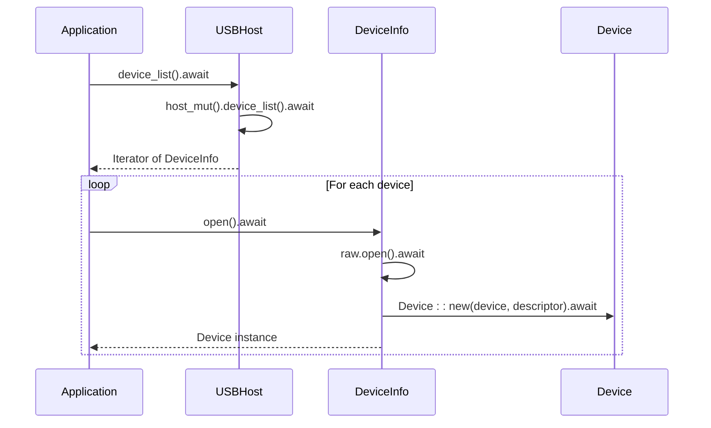

# common 模块 API

<cite>
**Referenced Files in This Document**  
- [device.rs](file://usb-host/src/common/device.rs)
- [mod.rs](file://usb-host/src/common/mod.rs)
- [lib.rs](file://usb-host/src/lib.rs)
- [host/mod.rs](file://usb-if/src/host/mod.rs)
- [descriptor/mod.rs](file://usb-if/src/descriptor/mod.rs)
</cite>

## 目录
1. [简介](#简介)
2. [模块结构与集成方式](#模块结构与集成方式)
3. [Device 结构体设计详解](#device-结构体设计详解)
4. [设备枚举流程核心操作](#设备枚举流程核心操作)
5. [异步通信与生命周期管理](#异步通信与生命周期管理)
6. [实际调用示例](#实际调用示例)
7. [错误处理与资源清理](#错误处理与资源清理)

## 简介

`common` 模块是 `CrabUSB` 项目中 USB 主机栈的核心抽象层，位于 `usb-host` 子系统内。该模块为上层应用提供统一、安全且高效的 USB 设备访问接口，屏蔽底层不同控制器（如 XHCI、Libusb）的实现差异。

本文档聚焦于 `common` 模块中的 `Device` 结构体，详细阐述其在设备枚举过程中的初始化、描述符获取、配置选择和接口声明等关键功能。同时，结合顶层模块集成机制，说明 `Device` 如何作为主机控制器对外暴露的设备实体参与异步数据传输，并提供最佳实践指导。

## 模块结构与集成方式

`common` 模块通过 `mod.rs` 文件进行组织和导出，其主要职责是定义面向用户的高层 API 抽象，包括 `Device`、`Interface`、`Endpoint` 等核心类型。这些类型封装了来自 `usb-if` 接口层的底层 trait 实现，向上层提供更易用的接口。



**Diagram sources**
- [lib.rs](file://usb-host/src/lib.rs#L1-L29)
- [mod.rs](file://usb-host/src/common/mod.rs#L1-L332)

**Section sources**
- [lib.rs](file://usb-host/src/lib.rs#L1-L29)
- [mod.rs](file://usb-host/src/common/mod.rs#L1-L332)

## Device 结构体设计详解

`Device` 结构体（定义于 `device.rs`）是 USB 设备在主机端的运行时抽象，代表一个已连接并完成基本枚举的物理设备实例。

### 核心字段

- **`descriptor`**: `DeviceDescriptor` 类型，存储从设备读取的基础描述符信息，包含厂商 ID、产品 ID、设备类、协议版本等静态属性。
- **`info`**: 私有 `Info` 结构体，缓存动态获取的配置描述符列表及字符串描述符（制造商、产品名、序列号），避免重复 I/O 操作。
- **`raw`**: 动态 trait 对象 `Box<dyn usb_if::host::Device>`，指向由具体后端（XHCI 或 Libusb）提供的设备驱动实现，所有控制传输均通过此对象代理。
- **`lang_id`**: 当前用于请求字符串描述符的语言 ID，默认为英语（美国）。

### 公共方法接口

#### 初始化与构造

- `pub(crate) async fn new(raw: Box<dyn usb_if::host::Device>, descriptor: DeviceDescriptor) -> Result<Self, USBError>`  
  构造函数，私有可见性（`pub(crate)`），由 `DeviceInfo::open()` 内部调用。负责：
  1. 设置默认语言 ID。
  2. 获取并缓存制造商、产品和序列号字符串。
  3. 调用 `init_configs()` 读取并解析所有配置描述符。

**Section sources**
- [device.rs](file://usb-host/src/common/device.rs#L15-L80)

#### 字符串与元数据访问

- `manufacturer_string()`, `product_string()`, `serial_number_string()`：返回缓存的字符串描述符引用。
- `lang_id()` / `set_lang_id()`：获取或设置用于后续字符串请求的语言环境。
- `vendor_id()`, `product_id()`, `class()`：便捷方法，直接从基础描述符中提取常用信息。

#### 配置管理

- `async fn set_configuration(&mut self, configuration: u8) -> Result<(), USBError>`：向设备发送 SET_CONFIGURATION 请求，激活指定配置。
- `async fn get_configuration(&mut self) -> Result<u8, USBError>`：查询当前激活的配置值。
- `configurations(&self) -> &[ConfigurationDescriptor]`：返回所有已缓存的配置描述符切片。

**Section sources**
- [device.rs](file://usb-host/src/common/device.rs#L82-L120)

## 设备枚举流程核心操作

设备枚举是主机识别和配置新连接 USB 设备的过程。`Device` 结构体的设计紧密围绕这一流程的关键阶段。

### 描述符获取

- `async fn string_descriptor(&mut self, index: u8) -> Result<String, USBError>`  
  通过标准控制传输（GET_DESCRIPTOR）获取指定索引的字符串描述符。内部使用 `get_descriptor()` 辅助函数构建 `ControlSetup` 并执行 `control_in` 调用。
- `async fn read_configuration_descriptor(&mut self, index: u8) -> Result<ConfigurationDescriptor, USBError>`  
  分两步读取完整配置描述符：首先读取头部以确定总长度，然后读取全部数据并解析成 `ConfigurationDescriptor` 结构。

### 配置选择

在成功打开设备后，必须通过 `set_configuration()` 明确选择一个配置值（非零），才能访问其下的接口和端点。`current_configuration_descriptor()` 方法可用于验证当前配置的有效性。

### 接口声明

- `async fn claim_interface(&mut self, interface: u8, alternate: u8) -> Result<Interface, USBError>`  
  这是访问设备功能接口的关键入口。该方法：
  1. 在缓存的配置描述符中查找匹配的 `InterfaceDescriptor`。
  2. 获取该接口的字符串描述符（如果存在）。
  3. 调用底层 `raw.claim_interface()` 占用接口。
  4. 返回一个包装了原始接口句柄和描述符的 `Interface` 实例。

**Section sources**
- [device.rs](file://usb-host/src/common/device.rs#L122-L280)
- [descriptor/mod.rs](file://usb-if/src/descriptor/mod.rs#L1-L242)

## 异步通信与生命周期管理

`Device` 及其派生的 `Interface` 和 `Endpoint` 类型均设计为在 `async` 上下文中使用，利用 `futures` 库实现非阻塞 I/O。

### 顶层集成

`USBHost` 结构体（`common/mod.rs` 中定义）是整个主机栈的入口点。它持有对底层控制器（`Controller` trait）的引用，并通过 `device_list()` 方法发现设备，进而通过 `DeviceInfo::open()` 创建 `Device` 实例。



**Diagram sources**
- [mod.rs](file://usb-host/src/common/mod.rs#L1-L332)
- [device.rs](file://usb-host/src/common/device.rs#L15-L80)

### 生命周期

`Device` 的生命周期由 Rust 的所有权系统自动管理。当 `Device` 实例超出作用域时，其内部的 `raw` 句柄也会被释放。对于 `Interface` 和 `Endpoint`，同样遵循 RAII 原则，在析构时会自动释放占用的资源。

**Section sources**
- [mod.rs](file://usb-host/src/common/mod.rs#L1-L332)

## 实际调用示例

以下代码片段展示了如何在 `async` 函数中安全地打开设备、声明接口并准备进行数据传输：

```rust
// 假设已有可用的 USBHost 实例
let mut host = USBHost::new_xhci(mmio_base);
host.init().await?;

// 枚举设备列表
let mut devices = host.device_list().await?;
if let Some(mut device_info) = devices.next() {
    // 打开设备，获得 Device 实例
    let mut device = device_info.open().await?;
    
    // 设置所需配置（例如配置值 1）
    device.set_configuration(1).await?;
    
    // 声明接口 0，