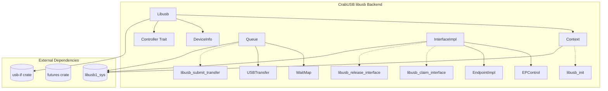
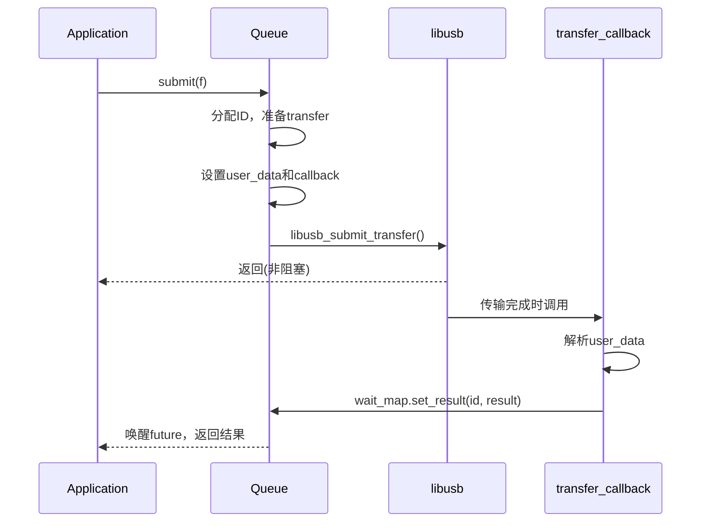

# libusb 后端 API

<cite>
**Referenced Files in This Document**  
- [mod.rs](file://usb-host/src/backend/libusb/mod.rs)
- [context.rs](file://usb-host/src/backend/libusb/context.rs)
- [queue.rs](file://usb-host/src/backend/libusb/queue.rs)
- [interface.rs](file://usb-host/src/backend/libusb/interface.rs)
- [err.rs](file://usb-host/src/backend/libusb/err.rs)
- [host/mod.rs](file://usb-if/src/host/mod.rs)
</cite>

## 目录
1. [简介](#简介)
2. [核心架构与模块设计](#核心架构与模块设计)
3. [LibUsbContext 生命周期管理](#libusbcontext-生命周期管理)
4. [异步传输队列机制](#异步传输队列机制)
5. [接口声明与释放封装](#接口声明与释放封装)
6. [错误处理与状态转换](#错误处理与状态转换)
7. [跨平台兼容性注意事项](#跨平台兼容性注意事项)
8. [开发与测试使用指南](#开发与测试使用指南)

## 简介

`libusb` 用户空间后端为 CrabUSB 框架提供了一种基于标准 `libusb` 库的 USB 主机控制器实现。该后端通过异步适配层将底层 `libusb` 的 C 接口封装为符合 `usb-if` 特质定义的 Rust 异步接口，适用于快速原型开发和功能验证场景。

本文档详细说明 `mod.rs` 中定义的异步适配层设计，分析 `context.rs` 对 `LibUsbContext` 的创建与生命周期管理，阐述 `queue.rs` 如何将异步传输请求转换为 `libusb` 的异步 I/O 调用，并解释 `interface.rs` 对 USB 接口操作的封装逻辑。同时讨论其在 `no_std` 环境下的局限性及跨平台使用建议。

**Section sources**
- [mod.rs](file://usb-host/src/backend/libusb/mod.rs#L1-L65)
- [host/mod.rs](file://usb-if/src/host/mod.rs#L1-L124)

## 核心架构与模块设计

`libusb` 后端采用模块化设计，各组件职责明确：

- **`mod.rs`**: 定义顶层 `Libusb` 结构体并实现 `Controller` 特质，作为外部调用入口。
- **`context.rs`**: 封装 `libusb_context` 的创建、设备枚举和事件处理。
- **`queue.rs`**: 实现异步传输队列，管理 `libusb_transfer` 提交与回调。
- **`interface.rs`**: 封装接口声明、释放及端点操作。
- **`err.rs`**: 提供错误码转换宏与工具函数。

系统整体遵循 RAII 原则，资源在作用域结束时自动清理。异步操作通过 `futures` 框架集成，确保与现代 Rust 异步生态兼容。

**Diagram sources**
- [mod.rs](file://usb-host/src/backend/libusb/mod.rs#L1-L65)
- [context.rs](file://usb-host/src/backend/libusb/context.rs#L1-L72)
- [queue.rs](file://usb-host/src/backend/libusb/queue.rs#L1-L162)
- [interface.rs](file://usb-host/src/backend/libusb/interface.rs#L1-L98)

**Section sources**
- [mod.rs](file://usb-host/src/backend/libusb/mod.rs#L1-L65)
- [context.rs](file://usb-host/src/backend/libusb/context.rs#L1-L72)
- [queue.rs](file://usb-host/src/backend/libusb/queue.rs#L1-L162)
- [interface.rs](file://usb-host/src/backend/libusb/interface.rs#L1-L98)

## LibUsbContext 生命周期管理

`LibUsbContext` 由 `context.rs` 中的 `Context` 结构体表示，负责管理 `libusb` 上下文的整个生命周期。

### 创建与初始化

`Context::new()` 方法通过调用 `libusb_init()` 创建新的上下文实例，并将其包裹在 `Arc<Mutex<>>` 中以支持多线程安全共享。返回值为 `Arc<Self>`，允许多个所有者安全地持有对同一上下文的引用。

### 设备枚举

`device_list()` 方法调用 `libusb_get_device_list()` 获取当前连接的所有设备句柄列表，并返回一个实现了 `Iterator` 的 `DeviceList` 包装器。迭代器在遍历时逐个返回设备指针，并在析构时自动调用 `libusb_free_device_list()` 释放内存。

### 事件处理

`handle_events()` 方法在循环中调用 `libusb_handle_events()` 处理来自内核的 USB 事件（如设备拔出、传输完成等）。此方法应在主事件循环中定期调用，以确保异步回调能被及时触发。

### 资源释放

尽管当前代码中 `Drop` 实现被注释，但正确的做法是在 `Drop` 中调用 `libusb_exit()` 释放上下文资源。实际运行时依赖 `libusb` 自身的全局清理机制。

**Section sources**
- [context.rs](file://usb-host/src/backend/libusb/context.rs#L1-L72)
- [mod.rs](file://usb-host/src/backend/libusb/mod.rs#L15-L20)

## 异步传输队列机制

`queue.rs` 实现了核心的异步传输调度机制，通过 `Queue` 结构体将高层异步请求映射到底层 `libusb` 异步 I/O。

### 队列结构

`Queue` 包含：
- `elems`: 预分配的 `USBTransfer` 向量，避免频繁内存分配。
- `wait_map`: `WaitMap<usize, Result<usize, TransferError>>`，用于跟踪每个传输 ID 的等待结果。
- `iter`: 循环计数器，实现固定大小队列的循环复用。

### 提交流程

1. 调用 `submit()` 或 `submit_iso()` 获取下一个可用 ID。
2. 构造 `UserData` 并绑定到 `libusb_transfer.user_data`。
3. 设置全局 `transfer_callback` 函数。
4. 调用 `libusb_submit_transfer()` 提交传输。
5. 返回 `Waiter` 类型的 `ResultTransfer`，供调用方 await。

### 回调处理

`transfer_callback` 是 `extern "system"` 函数，在 `libusb` 线程中执行：
1. 从 `user_data` 恢复 `id` 和 `wait_map` 引用。
2. 根据 `transfer.status` 转换为 `Result`。
3. 调用 `wait_map.set_result(id, result)` 唤醒等待的 future。

ISO 传输通过 `submit_iso()` 单独处理，支持指定等时包数量。

**Diagram sources**
- [queue.rs](file://usb-host/src/backend/libusb/queue.rs#L1-L162)

**Section sources**
- [queue.rs](file://usb-host/src/backend/libusb/queue.rs#L1-L162)

## 接口声明与释放封装

`interface.rs` 中的 `InterfaceImpl` 结构体封装了 USB 接口的操作，包括声明、释放和端点访问