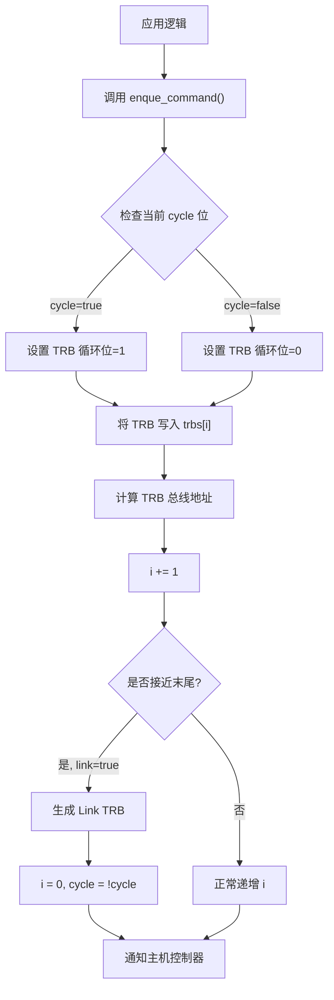

<cite>
**本文档中引用的文件**
- [device.rs](file://usb-host/src/common/device.rs)
- [ring/mod.rs](file://usb-host/src/backend/xhci/ring/mod.rs)
- [event.rs](file://usb-host/src/backend/xhci/event.rs)
- [reg.rs](file://usb-host/src/backend/xhci/reg.rs)
- [context.rs](file://usb-host/src/backend/libusb/context.rs)
- [osal.rs](file://usb-host/src/osal.rs)
- [lib.rs](file://usb-host/src/lib.rs)
</cite>

## 目录
1. [简介](#简介)
2. [设备管理 API](#设备管理-api)
3. [xHCI 后端实现](#xhci-后端实现)
4. [libusb 用户空间后端](#libusb-用户空间后端)
5. [操作系统抽象层 (OSAL)](#操作系统抽象层-osal)
6. [异步使用模式与资源管理](#异步使用模式与资源管理)

## 简介

`usb-host` 模块为 Rust 语言提供了一个跨平台的 USB 主机控制器驱动框架。该模块设计用于支持多种硬件后端（如 xHCI）和用户空间库（如 libusb），并通过一个内核抽象层（OSAL）来适应不同的运行环境，包括 `no_std` 的嵌入式系统。

本 API 文档旨在全面介绍模块的核心功能，重点涵盖设备生命周期管理、高性能 xHCI 控制器交互、用户空间兼容性接口以及底层系统调用的抽象机制。文档将详细说明关键数据结构的方法集合、后端的具体接口，并提供在异步上下文中安全使用这些 API 的指导原则。

## 设备管理 API

`Device` 结构体是与 USB 设备进行交互的核心入口点。它封装了原始的设备句柄、设备描述符以及从设备读取的附加信息（如字符串描述符），并提供了高级方法来管理设备状态。

### 设备枚举与初始化

当一个新的 USB 设备被检测到时，系统会通过 `Device::new` 方法创建一个 `Device` 实例。此过程不仅接收原始的设备句柄和基础设备描述符，还会自动执行一系列初始化步骤：
1.  **获取默认语言 ID**：通过控制传输读取语言 ID 描述符，以确定后续字符串描述符查询所使用的语言。
2.  **读取字符串描述符**：根据设备描述符中的索引，自动获取制造商、产品和序列号字符串。
3.  **初始化配置信息**：遍历所有可能的配置，读取并解析完整的配置描述符，构建内部缓存，以便后续快速访问。

这种惰性加载和缓存策略优化了启动性能，避免了在设备连接初期就进行所有耗时的描述符读取操作。

### 接口声明与配置

`Device` 提供了对设备配置和接口的直接控制。

**设置设备配置**
```rust
// 示例：将设备配置为配置值 1
if let Err(e) = device.set_configuration(1).await {
    log::error!("Failed to set configuration: {:?}", e);
}
```
`set_configuration` 方法用于激活设备的特定配置。这是一个异步操作，可能会因总线错误或设备拒绝而失败。

**声明接口**
```rust
// 示例：声明接口 0，备用设置 0
match device.claim_interface(0, 0).await {
    Ok(interface) => {
        // 成功获得接口所有权，可以开始数据传输
        log::info!("Interface claimed successfully");
    }
    Err(e) => {
        log::error!("Failed to claim interface: {:?}", e);
    }
}
```
`claim_interface` 方法用于获取对特定接口（及其备用设置）的独占访问权。成功调用后，它返回一个 `Interface` 对象，该对象包含了接口的完整描述符信息（包括已解析的字符串）和用于数据传输的底层句柄。

**Section sources**
- [device.rs](file://usb-host/src/common/device.rs#L45-L280)

## xHCI 后端实现

xHCI（eXtensible Host Controller Interface）后端实现了与现代 USB 3.0+ 主机控制器的高性能通信，其核心是基于环形队列（Ring）的命令和事件处理机制。

### TRB 环形队列

`Ring` 结构体代表一个物理上连续、DMA 可访问的内存区域，用于存放传输请求块（TRB）。每个 TRB 都是一个 16 字节的数据包，指示主机控制器执行特定操作。

**关键特性：**
- **循环位（Cycle Bit）**：这是 xHCI 协议的核心。`Ring` 内部维护一个 `cycle` 标志，每当队列循环回起点时翻转。每个写入的 TRB 都会根据当前的 `cycle` 值设置其循环位。主机控制器只处理与其事件环期望的循环位匹配的 TRB，从而区分“旧”和“新”的命令。
- **链接（Link）**：当 `link` 模式启用时，`Ring` 会在末尾自动生成一个 Link TRB，指向队列的起始地址。这允许硬件在到达末尾时自动跳转到开头，形成一个无限循环的环。
- **内存管理**：`trbs` 字段使用 `DVec<TrbData>`，确保了内存是 DMA 兼容的，并且可以在物理地址空间中被主机控制器直接访问。

**命令与传输队列**
`enque_command` 和 `enque_transfer` 方法分别用于向命令环和传输环提交新的 TRB。它们会自动设置正确的循环位，并记录 TRB 在总线上的物理地址，这对于调试和验证至关重要。



**Diagram sources**
- [ring/mod.rs](file://usb-host/src/backend/xhci/ring/mod.rs#L50-L157)

### 事件处理

`EventRing` 结构体管理着从主机控制器接收事件的环形队列。

**工作流程：**
1.  **轮询事件**：`next` 方法是主要的事件消费接口。它首先检查当前 TRB 的循环位是否与 `EventRing` 的期望值匹配。
2.  **内存屏障**：如果匹配，则在处理前插入一个内存屏障 (`mb()`)，确保 CPU 能看到主机控制器写入的最新数据。
3.  **递增指针**：成功处理一个事件后，通过 `inc_deque` 移动到下一个 TRB。如果到达末尾，则重置索引并翻转期望的循环位。

`erdp` 和 `erstba` 方法分别返回事件环的当前读指针（Event Ring Dequeue Pointer）和段表基地址（Event Ring Segment Table Base Address），这些值需要写入主机控制器的寄存器以完成初始化。

**Section sources**
- [ring/mod.rs](file://usb-host/src/backend/xhci/ring/mod.rs#L50-L157)
- [event.rs](file