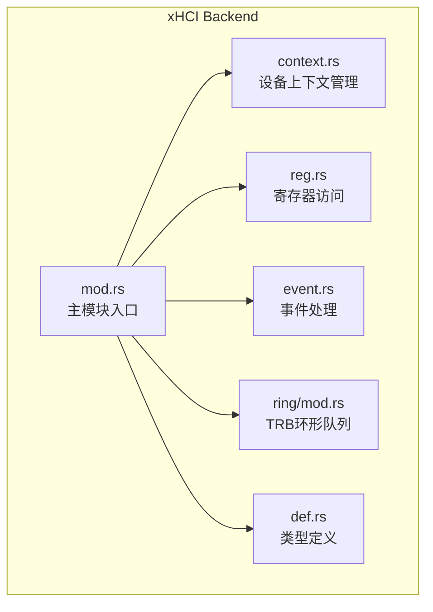
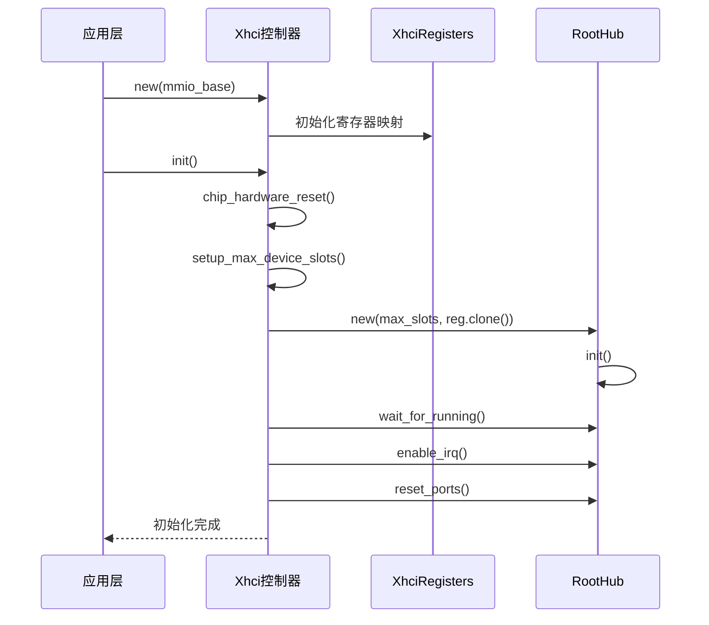
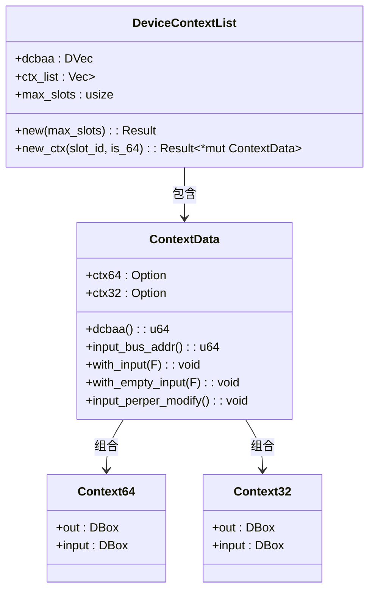
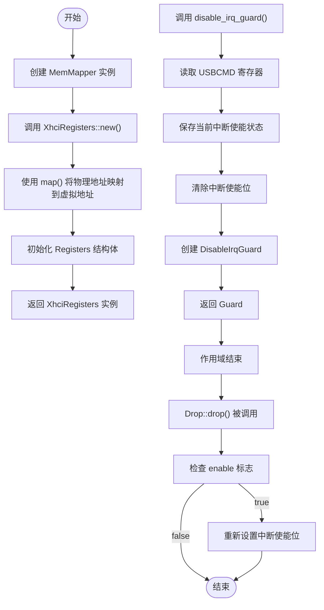
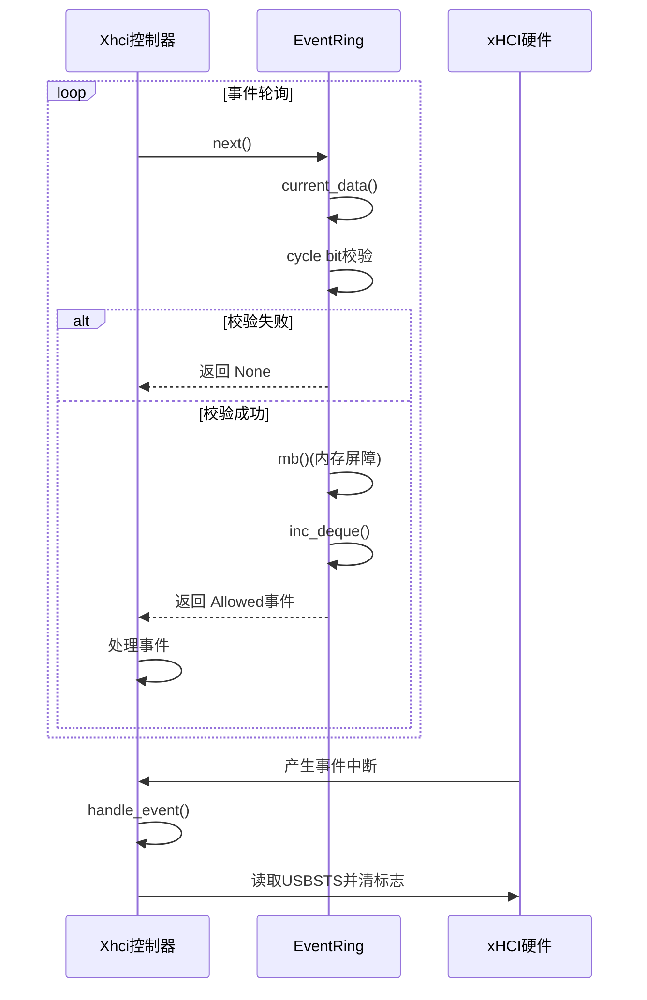

# xHCI 后端 API

<cite>
**本文档中引用的文件**
- [mod.rs](file://usb-host/src/backend/xhci/mod.rs)
- [context.rs](file://usb-host/src/backend/xhci/context.rs)
- [reg.rs](file://usb-host/src/backend/xhci/reg.rs)
- [event.rs](file://usb-host/src/backend/xhci/event.rs)
- [ring/mod.rs](file://usb-host/src/backend/xhci/ring/mod.rs)
- [def.rs](file://usb-host/src/backend/xhci/def.rs)
</cite>

## 目录
1. [简介](#简介)
2. [项目结构](#项目结构)
3. [核心组件](#核心组件)
4. [架构概述](#架构概述)
5. [详细组件分析](#详细组件分析)
6. [依赖关系分析](#依赖关系分析)
7. [性能考量](#性能考量)
8. [故障排除指南](#故障排除指南)
9. [结论](#结论)

## 简介
本文档为 xHCI 主机控制器后端实现提供详尽的 API 参考，涵盖上下文初始化、寄存器访问、事件处理机制和传输请求块（TRB）环形队列管理。文档深入解析了 `mod.rs` 中定义的核心 trait 和结构体，说明 `context.rs` 如何建立控制器运行环境，`reg.rs` 提供的硬件寄存器映射接口，`event.rs` 对异步事件中断的捕获与分发逻辑，以及 `ring/mod.rs` 实现的无锁 TRB 队列设计。

## 项目结构
xHCI 后端模块位于 `usb-host/src/backend/xhci/` 目录下，采用模块化设计，各功能单元职责分明。



**图示来源**
- [mod.rs](file://usb-host/src/backend/xhci/mod.rs)
- [context.rs](file://usb-host/src/backend/xhci/context.rs)
- [reg.rs](file://usb-host/src/backend/xhci/reg.rs)
- [event.rs](file://usb-host/src/backend/xhci/event.rs)
- [ring/mod.rs](file://usb-host/src/backend/xhci/ring/mod.rs)
- [def.rs](file://usb-host/src/backend/xhci/def.rs)

**本节来源**
- [mod.rs](file://usb-host/src/backend/xhci/mod.rs)
- [project_structure](file://project_structure)

## 核心组件
xHCI 后端的核心由 `Xhci` 结构体驱动，它通过 `XhciRegisters` 访问硬件，并利用 `DeviceContextList`、`EventRing` 和 `Ring` 等组件管理设备状态、事件和数据传输。

**本节来源**
- [mod.rs](file://usb-host/src/backend/xhci/mod.rs#L27-L33)
- [context.rs](file://usb-host/src/backend/xhci/context.rs#L1-L10)
- [reg.rs](file://usb-host/src/backend/xhci/reg.rs#L1-L10)
- [event.rs](file://usb-host/src/backend/xhci/event.rs#L1-L10)
- [ring/mod.rs](file://usb-host/src/backend/xhci/ring/mod.rs#L1-L10)

## 架构概述
xHCI 后端遵循标准的主机控制器初始化流程，通过内存映射 I/O (MMIO) 与硬件交互。系统启动时，`Xhci::new` 创建控制器实例，`init` 方法执行完整的初始化序列，包括芯片复位、扩展能力检测和根集线器配置。



**图示来源**
- [mod.rs](file://usb-host/src/backend/xhci/mod.rs#L60-L158)

## 详细组件分析

### 上下文管理分析
`context.rs` 模块负责管理 xHCI 规范中的设备上下文，这是控制器与 USB 设备通信的基础。

#### 类图：上下文数据结构


**图示来源**
- [context.rs](file://usb-host/src/backend/xhci/context.rs#L1-L194)

**本节来源**
- [context.rs](file://usb-host/src/backend/xhci/context.rs#L1-L194)

### 寄存器访问分析
`reg.rs` 模块提供了对 xHCI 控制器 MMIO 寄存器的安全、抽象化访问。

#### 流程图：寄存器访问与中断控制


**图示来源**
- [reg.rs](file://usb-host/src/backend/xhci/reg.rs#L1-L88)

**本节来源**
- [reg.rs](file://usb-host/src/backend/xhci/reg.rs#L1-L88)

### 事件处理分析
`event.rs` 模块实现了 xHCI 事件环（Event Ring）机制，用于接收和处理来自控制器的异步事件。

#### 序列图：事件处理流程


**图示来源**
- [event.rs](file://usb-host/src/backend/xhci/event.rs#L1-L65)
- [mod.rs](file://usb-host/src/backend/xhci/mod.rs#L107-L110)

**本节来源**
- [event.rs](file://usb-host/src/backend/xhci/event.rs#L1-L65)

### TRB环形队列分析
`ring/mod.rs` 模块实现了无锁的 TRB 环形队列，是命令和数据传输的核心。

#### 类图：环形队列设计
```mermaid
classDiagram
    class Ring {
        -link: bool
        +trbs: DVec<TrbData>
        +i: usize
        +cycle: bool
        +new(link, direction): Result
        +enque_command(trb): BusAddr
        +enque_transfer(trb): BusAddr
        +next_index(): usize
        +