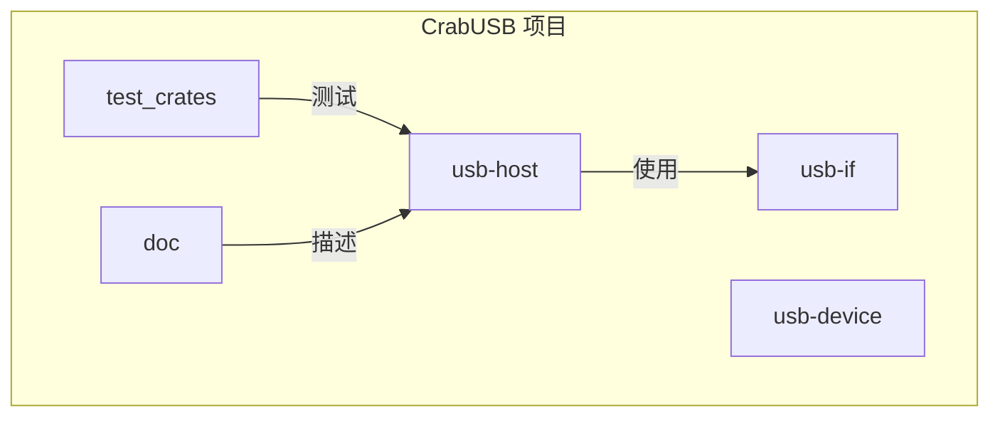
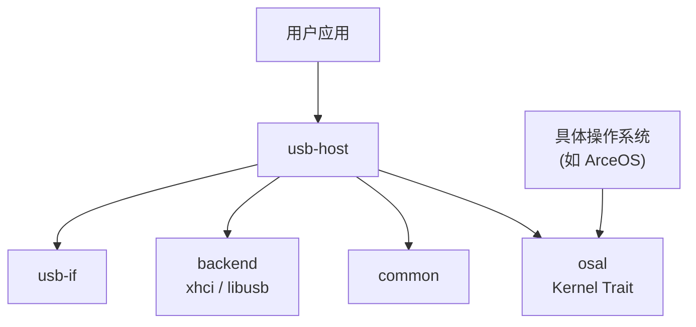
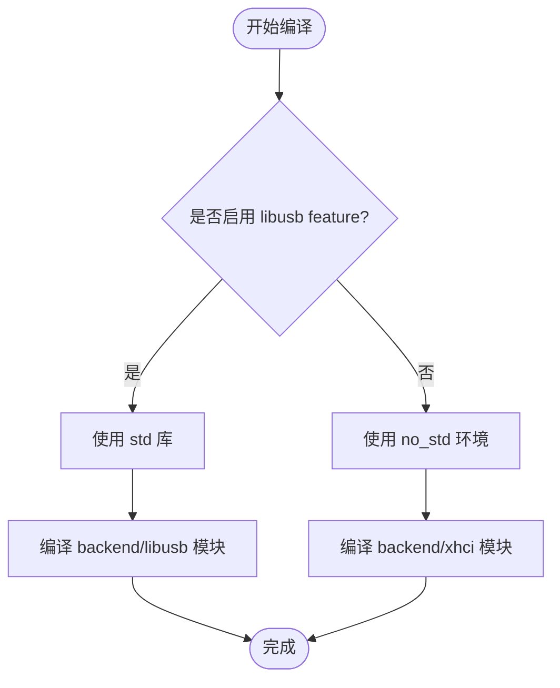
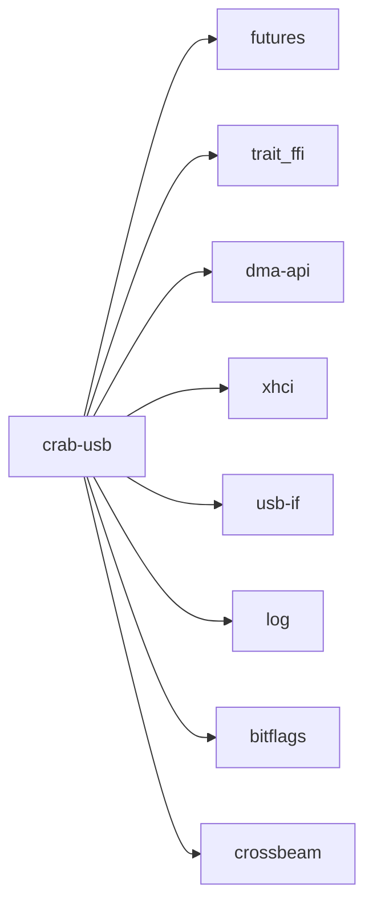

# 操作系统适配层 (OSAL) API

<cite>
**本文档引用的文件**
- [osal.rs](file://usb-host/src/osal.rs)
- [lib.rs](file://usb-host/src/lib.rs)
- [mod.rs](file://usb-host/src/backend/mod.rs)
- [design.md](file://doc/design.md)
- [Cargo.toml](file://usb-host/Cargo.toml)
</cite>

## 目录
1. [引言](#引言)
2. [项目结构](#项目结构)
3. [核心组件](#核心组件)
4. [架构概述](#架构概述)
5. [详细组件分析](#详细组件分析)
6. [依赖分析](#依赖分析)
7. [性能考量](#性能考量)
8. [故障排除指南](#故障排除指南)
9. [结论](#结论)

## 引言

操作系统适配层（OSAL）是 CrabUSB 项目中的关键抽象机制，旨在实现硬件驱动逻辑与具体操作系统内核之间的解耦。通过定义 `Kernel` trait，该层为 USB 主机栈提供了可移植的时间服务、内存管理、中断处理和日志接口，使其能够在不同的 `no_std` 嵌入式环境中运行，包括 ArceOS 等特定内核。

## 项目结构

CrabUSB 是一个为嵌入式系统设计的 Rust 编写的 USB 主机库。其项目结构清晰地分离了不同功能模块：
- `usb-host`: 核心主机栈，包含 `osal` 抽象层。
- `usb-device`: USB 设备相关实现。
- `usb-if`: USB 接口通用定义。
- `test_crates`: 各种测试用例。
- `doc`: 设计文档。

`osal.rs` 文件位于 `usb-host/src/` 目录下，是整个主机栈与底层操作系统交互的唯一入口点。



**Diagram sources**
- [project_structure](file://.)

**Section sources**
- [project_structure](file://.)

## 核心组件

操作系统适配层的核心是 `Kernel` trait 的定义。此 trait 规定了 USB 主机栈运行所必需的最低限度的内核服务，主要包括异步睡眠（延迟）和页面大小查询两个方法。通过此 trait，上层驱动代码无需关心具体的内核调度或内存管理细节。

**Section sources**
- [osal.rs](file://usb-host/src/osal.rs#L0-L9)

## 架构概述

CrabUSB 的整体架构采用分层设计。最上层是 `usb-host` 模块，它依赖于 `usb-if` 提供的通用 USB 接口。`usb-host` 内部又分为 `backend`（后端，如 xhci 或 libusb）和 `common`（通用逻辑）。`osal` 层作为 `usb-host` 的基础，向上提供 `Kernel` trait，向下则由具体的 OS 实现来填充。



**Diagram sources**
- [lib.rs](file://usb-host/src/lib.rs#L1-L28)
- [osal.rs](file://usb-host/src/osal.rs#L0-L9)
- [mod.rs](file://usb-host/src/backend/mod.rs#L0-L32)

## 详细组件分析

### OSAL 组件分析

#### Kernel Trait 定义
`Kernel` trait 是 OSAL 的核心，它使用 `trait_ffi::def_extern_trait` 宏进行定义，这表明其实现可能跨越 FFI 边界，允许在不同的执行上下文中被调用。

```mermaid
classDiagram
class Kernel {
<<trait>>
+sleep<'a>(duration : Duration) BoxFuture<'a, ()>
+page_size() usize
}
note right of Kernel
必须为 'static 生命周期，
所有方法必须是安全的且无副作用。
end note
```

**Diagram sources**
- [osal.rs](file://usb-host/src/osal.rs#L0-L9)

##### 时间服务
`sleep` 方法提供异步延迟功能，返回一个 `BoxFuture`。这使得 USB 操作可以等待指定时间，例如在设备枚举时进行必要的延时。该方法的设计要求任何 `Kernel` 的实现都必须提供一个可靠的异步等待机制。

##### 内存分配钩子
虽然 `Kernel` trait 中没有直接的内存分配方法，但 `page_size()` 方法为上层内存管理提供了关键信息。这通常用于指导 DMA 缓冲区的对齐和分配策略。

##### 中断注册机制
当前 `Kernel` trait 定义中未显式包含中断注册方法。这意味着中断处理的具体实现细节被推迟到更具体的后端（如 xhci）或由 `Kernel` 的实现者通过其他方式提供。

##### 日志输出接口
日志功能通过顶层的 `log` crate 提供，并非 `Kernel` trait 的一部分。`#[macro_use] extern crate log;` 在 `lib.rs` 中引入，允许整个 `usb-host` 模块使用标准的日志宏（如 `info!`, `error!`）。

#### 条件编译配置
`usb-host` 模块通过 Cargo feature 进行条件编译。`Cargo.toml` 文件中定义了 `libusb` feature，当启用时会编译 `backend/libusb` 模块。`lib.rs` 文件顶部的 `#![cfg_attr(not(feature = "libusb"), no_std)]` 指令确保在不使用 `libusb` 后端时，代码运行在 `no_std` 环境下，这对于嵌入式系统至关重要。



**Diagram sources**
- [lib.rs](file://usb-host/src/lib.rs#L1-L2)
- [Cargo.toml](file://usb-host/Cargo.toml#L1-L50)
- [mod.rs](file://usb-host/src/backend/mod.rs#L0-L32)

### 自定义 Kernel 实现模板

要为新的操作系统（如 ArceOS）创建自定义的 `Kernel` 实现，开发者需要遵循以下模板：

```rust
// 示例：为 ArceOS 实现 Kernel trait
use crab_usb::Kernel;
use core::time::Duration;

struct ArceOSKernel;

impl Kernel for ArceOSKernel {
    fn sleep<'a>(duration: Duration) -> BoxFuture<'a, ()> {
        // 此处应调用 ArceOS 特定的异步等待或轮询函数
        // 例如，使用 ArceOS 的定时器或任务调度器
        async {}.boxed()
    }

    fn page_size() -> usize {
        // 返回 ArceOS 的实际页面大小，例如 4096
        4096
    }
}

// 使用 impl_extern_trait 宏导出实现
crab_usb::impl_extern_trait!(ArceOSKernel);
```

**重要安全与并发保证**：
1. **线程安全**：`Kernel` trait 的所有方法都必须是线程安全的（`Send + Sync`），因为 USB 操作可能在任意上下文或中断中被调用。
2. **无恐慌**：实现不应引发 panic，尤其是在 `sleep` 方法中，以避免破坏系统的稳定性。
3. **资源管理**：`sleep` 返回的 `Future` 必须正确管理其生命周期，防止资源泄漏。
4. **确定性**：`page_size()` 必须返回一个恒定值，不能在运行时改变。

**Section sources**
- [osal.rs](file://usb-host/src/osal.rs#L0-L9)
- [lib.rs](file://usb-host/src/lib.rs#L25)
- [design.md](file://doc/design.md#L0-L15)

## 依赖分析

`usb-host` 模块依赖于多个外部 crate 和内部模块。`futures` 和 `trait_ffi` 是 `osal` 层的关键依赖，分别提供了异步编程模型和跨边界 trait 支持。`dma-api` 和 `xhci` 则是与硬件交互所必需的。



**Diagram sources**
- [Cargo.toml](file://usb-host/Cargo.toml#L1-L50)

**Section sources**
- [Cargo.toml](file://usb-host/Cargo.toml#L1-L50)

## 性能考量

`osal` 层的设计对性能有直接影响。`sleep` 方法的实现效率决定了延迟操作的开销。在同步内核上，可能需要使用 `spin_on` 进行轮询，这会消耗 CPU 周期；而在支持协作式多任务的内核上，则可以高效地挂起任务。`page_size()` 的准确性影响内存分配的效率和 DMA 传输的性能。

## 故障排除指南

如果遇到