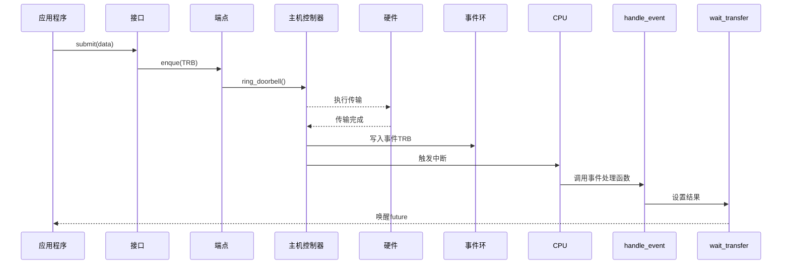
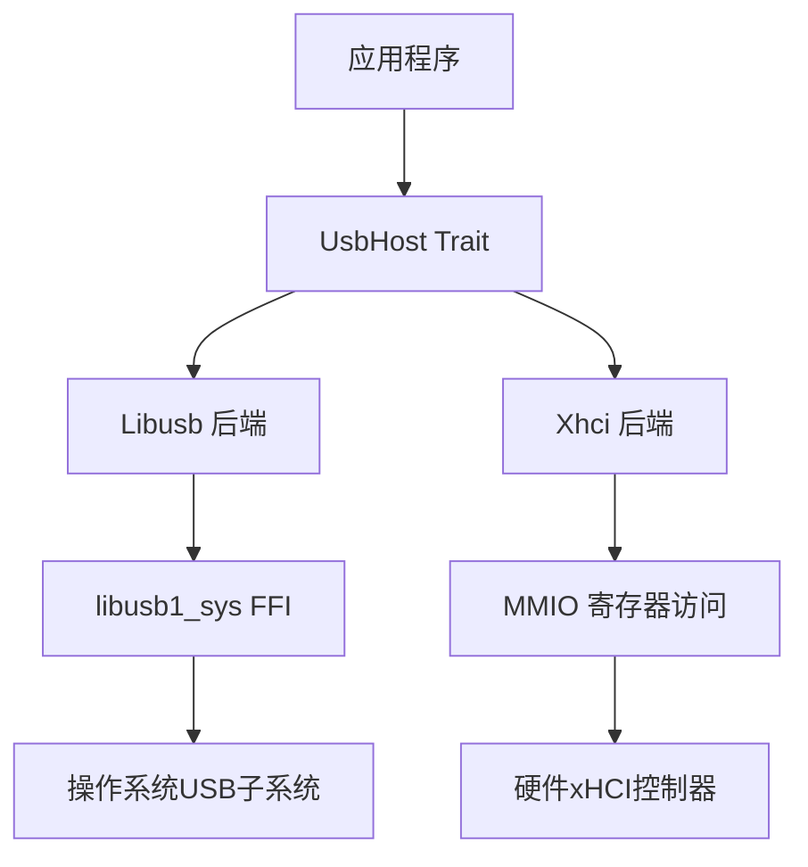

# 主机控制器抽象 API

<cite>
**本文档中引用的文件**
- [lib.rs](file://usb-host/src/lib.rs)
- [mod.rs](file://usb-if/src/host/mod.rs)
- [mod.rs](file://usb-host/src/backend/libusb/mod.rs)
- [mod.rs](file://usb-host/src/backend/xhci/mod.rs)
- [device.rs](file://usb-host/src/backend/libusb/device.rs)
- [endpoint.rs](file://usb-host/src/backend/libusb/endpoint.rs)
- [device.rs](file://usb-host/src/backend/xhci/device.rs)
- [endpoint.rs](file://usb-host/src/backend/xhci/endpoint.rs)
- [root.rs](file://usb-host/src/backend/xhci/root.rs)
- [interface.rs](file://usb-host/src/backend/libusb/interface.rs)
- [interface.rs](file://usb-host/src/backend/xhci/interface.rs)
</cite>

## 目录
1. [引言](#引言)
2. [核心组件分析](#核心组件分析)
3. [UsbHost Trait 方法详解](#usbhost-trait-方法详解)
4. [泛型约束与后端适配机制](#泛型约束与后端适配机制)
5. [事件轮询与异步运行时集成](#事件轮询与异步运行时集成)
6. [模拟后端实现示例](#模拟后端实现示例)
7. [对象安全性与动态调度限制](#对象安全性与动态调度限制)

## 引言
本项目通过定义一系列 trait 来抽象 USB 主机控制器的功能，实现了对不同硬件后端（如 xHCI、libusb）的统一接口。`Controller` trait 定义了主机控制器必须实现的核心能力，包括初始化、设备发现、事件处理等。系统通过分层设计将通用逻辑与特定后端实现分离，支持灵活的后端替换和扩展。

## 核心组件分析

### UsbHost Trait 结构

```mermaid
classDiagram
class Controller {
+init() LocalBoxFuture<Result<(), USBError>>
+device_list() LocalBoxFuture<Result<Vec<Box<dyn DeviceInfo>>, USBError>>
+handle_event()
}
class DeviceInfo {
+open() LocalBoxFuture<Result<Box<dyn Device>, USBError>>
+descriptor() LocalBoxFuture<Result<DeviceDescriptor, USBError>>
+configuration_descriptor(index : u8) LocalBoxFuture<Result<ConfigurationDescriptor, USBError>>
}
class Device {
+set_configuration(configuration : u8) LocalBoxFuture<Result<(), USBError>>
+get_configuration() LocalBoxFuture<Result<u8, USBError>>
+claim_interface(interface : u8, alternate : u8) LocalBoxFuture<Result<Box<dyn Interface>, USBError>>
+control_in(setup : ControlSetup, data : &mut [u8]) ResultTransfer<'a>
+control_out(setup : ControlSetup, data : &[u8]) ResultTransfer<'a>
}
class Interface {
+set_alt_setting(alt_setting : u8) Result<(), USBError>
+get_alt_setting() Result<u8, USBError>
+control_in(setup : ControlSetup, data : &mut [u8]) ResultTransfer<'a>
+control_out(setup : ControlSetup, data : &[u8]) ResultTransfer<'a>
+endpoint_bulk_in(endpoint : u8) Result<Box<dyn EndpointBulkIn>, USBError>
+endpoint_bulk_out(endpoint : u8) Result<Box<dyn EndpointBulkOut>, USBError>
+endpoint_interrupt_in(endpoint : u8) Result<Box<dyn EndpointInterruptIn>, USBError>
+endpoint_interrupt_out(endpoint : u8) Result<Box<dyn EndpointInterruptOut>, USBError>
+endpoint_iso_in(endpoint : u8) Result<Box<dyn EndpintIsoIn>, USBError>
+endpoint_iso_out(endpoint : u8) Result<Box<dyn EndpintIsoOut>, USBError>
}
class EndpointBulkIn {
+submit(data : &mut [u8]) ResultTransfer<'a>
}
class EndpointBulkOut {
+submit(data : &[u8]) ResultTransfer<'a>
}
class EndpointInterruptIn {
+submit(data : &mut [u8]) ResultTransfer<'a>
}
class EndpointInterruptOut {
+submit(data : &[u8]) ResultTransfer<'a>
}
class EndpintIsoIn {
+submit(data : &mut [u8], num_iso_packets : usize) ResultTransfer<'a>
}
class EndpintIsoOut {
+submit(data : &[u8], num_iso_packets : usize) ResultTransfer<'a>
}
Controller <|-- Libusb : "实现"
Controller <|-- Xhci : "实现"
DeviceInfo <|-- DeviceInfoImpl : "实现"
Device <|-- DeviceImpl : "实现"
Interface <|-- InterfaceImpl : "实现"
```

**图源**
- [mod.rs](file://usb-if/src/host/mod.rs#L10-L123)

**节源**
- [mod.rs](file://usb-if/src/host/mod.rs#L10-L123)

## UsbHost Trait 方法详解

### 设备发现与管理
`Controller` trait 提供了设备发现的核心方法 `device_list()`，该方法返回一个包含所有已连接设备信息的列表。每个 `DeviceInfo` 对象代表一个物理设备，可以通过 `open()` 方法获取对应的 `Device` 实例进行进一步操作。

对于 xHCI 后端，设备发现通过遍历根集线器的端口状态来实现。系统会检查每个端口的连接状态和使能状态，只有同时满足这两个条件的端口才会被识别为有效设备。这一过程在 `Xhci::device_list()` 方法中实现，通过读取端口寄存器集的状态位来确定设备的存在。

**节源**
- [mod.rs](file://usb-if/src/host/mod.rs#L12-L14)
- [mod.rs](file://usb-host/src/backend/xhci/mod.rs#L90-L109)

### 端点配置与传输提交
`Interface` trait 提供了多种端点类型的创建方法，包括批量传输、中断传输和等时传输。每种端点类型都有独立的 trait 定义，确保类型安全和接口清晰。例如，`EndpointBulkIn` 和 `EndpointBulkOut` 分别用于双向批量数据传输。

当调用 `claim_interface()` 方法时，系统会根据接口描述符中的端点信息配置相应的端点上下文。对于 xHCI 控制器，这涉及到设置端点上下文的多个字段，包括最大包大小、传输间隔、环形缓冲区指针等。这些配置通过命令环提交给主机控制器，并等待完成事件。

**节源**
- [mod.rs](file://usb-if/src/host/mod.rs#L47-L67)
- [device.rs](file://usb-host/src/backend/xhci/device.rs#L450-L580)

### 传输完成通知机制
传输完成通知通过事件环（Event Ring）机制实现。主机控制器在完成传输后会向事件环写入一个事件 TRB（Transfer Event），然后触发中断。驱动程序的 `handle_event()` 方法负责处理这些事件，更新相应的等待队列状态。

在 xHCI 实现中，`Root` 结构体维护了一个 `wait_transfer` 映射表，用于跟踪正在进行的传输。当收到传输完成事件时，系统会查找对应的 TRB 地址，并设置结果值，从而唤醒等待的 future。这种设计实现了高效的异步 I/O 模型。

**图源**
- [root.rs](file://usb-host/src/backend/xhci/root.rs#L200-L250)
- [endpoint.rs](file://usb-host/src/backend/xhci/endpoint.rs#L100-L150)

## 泛型约束与后端适配机制

### 后端抽象层设计
系统通过模块化设计实现了对不同后端的支持。`usb-host` crate 的 `backend` 目录下包含了 `libusb` 和 `xhci` 两个子模块，分别实现了各自的 `Controller` trait。这种设计允许用户根据目标平台选择合适的后端实现。

`Libusb` 结构体封装了 libusb 上下文，通过 FFI 调用底层库函数。而 `Xhci` 结构体则直接操作内存映射的寄存器，提供了更底层的控制能力。两者都实现了相同的 `Controller` 接口，保证了上层代码的兼容性。

**图源**
- [mod.rs](file://usb-host/src/backend/libusb/mod.rs#L20-L60)
- [mod.rs](file://usb-host/src/backend/xhci/mod.rs#L50-L80)

**节源**
- [mod.rs](file://usb-host/src/backend/libusb/mod.rs)
- [mod.rs](file://usb-host/src/backend/xhci/mod.rs)

### 类型安全的端点管理
系统使用泛型和标记 trait 来确保端点操作的类型安全。`Endpoint<T, D>` 结构体通过类型参数 `T` 和 `D` 分别表示传输类型（批量、中断、等时）和方向（输入、输出）。这种设计在编译时就能捕获错误的端点使用方式。

`kind` 和 `direction` 模块定义了密封 trait，防止外部代码实现这些类型标记。这保证了只有预定义的端点类型才能被创建和使用，增强了系统的安全性。

**节源**
- [endpoint.rs](file://usb-host/src/backend/xhci/endpoint.rs#L300-L450)

## 事件轮询与异步运行时集成

### 异步编程模型
系统采用基于 future 的异步编程模型，所有阻塞操作都返回 `LocalBoxFuture` 类型。这使得驱动程序能够很好地集成到现代异步运行时环境中。`futures` crate 提供了必要的工具来组合和等待这些 future。

`Waiter` 和 `WaitMap` 结构体实现了高效的等待机制。`WaitMap` 使用哈希表存储等待中的操作，通过 TRB 地址快速查找对应的等待者。当事件到达时，系统可以立即唤醒相应的 future，减少了不必要的轮询开销。

**节源**
- [mod.rs](file://usb-if/src/host/mod.rs#L70-L75)
- [root.rs](file://usb-host/src/backend/xhci/root.rs#L100-L150)

### 中断处理与事件驱动
`handle_event()`