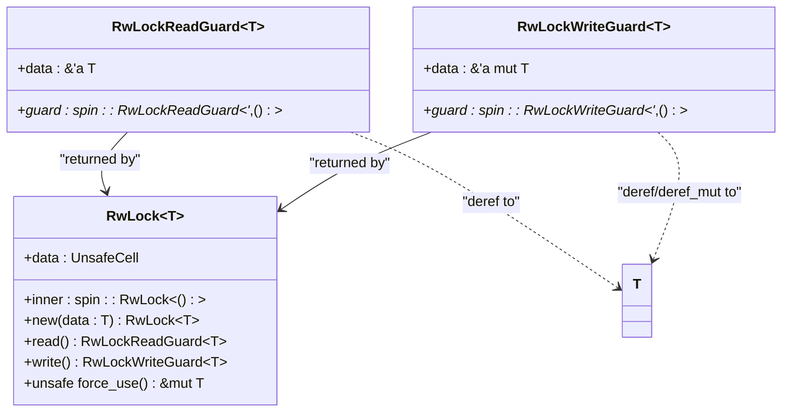
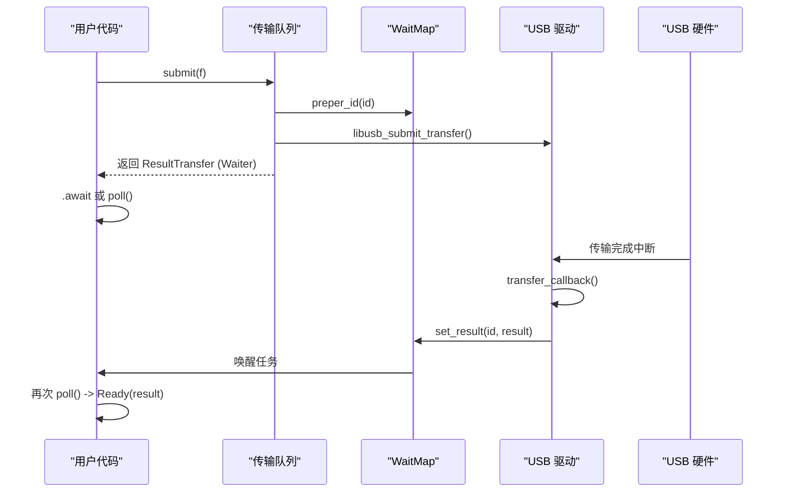

# 传输模块 API

<cite>
**Referenced Files in This Document**  
- [mod.rs](file://usb-if/src/transfer/mod.rs)
- [sync.rs](file://usb-if/src/transfer/sync.rs)
- [wait.rs](file://usb-if/src/transfer/wait.rs)
- [queue.rs](file://usb-host/src/backend/libusb/queue.rs)
</cite>

## 目录
1. [引言](#引言)
2. [核心抽象与类型定义](#核心抽象与类型定义)
3. [同步机制实现](#同步机制实现)
4. [等待机制与异步支持](#等待机制与异步支持)
5. [传输模式函数签名与约束](#传输模式函数签名与约束)
6. [no_std 环境下的 DMA 安全传输示例](#no_std-环境下的-dma-安全传输示例)
7. [跨线程安全性保证](#跨线程安全性保证)
8. [后端超时处理与取消语义](#后端超时处理与取消语义)

## 引言
本文档深入解析 `CrabUSB` 项目中 `transfer` 模块的核心设计，重点分析其在 `no_std` 环境下为 USB 主机驱动提供的通用传输操作抽象。该模块通过精心设计的 trait、类型和辅助结构，实现了对控制、批量、中断和等时四种 USB 传输模式的统一接口，并提供了同步、异步等待以及线程安全等关键功能。

## 核心抽象与类型定义

`transfer` 模块的核心位于 `mod.rs` 文件中，它定义了进行 USB 数据传输所需的基础数据结构和枚举类型。这些类型构成了所有传输操作的公共语言。

模块首先定义了 `Direction` 枚举，用于表示数据传输的方向（`Out` 表示主机到设备，`In` 表示设备到主机）。此外，还定义了 `BmRequestType` 结构体，该结构体封装了 USB 控制传输请求中的三个关键字段：方向、请求类型（标准、类、厂商）和接收者（设备、接口、端点），并实现了到原始字节的转换，这是构建控制传输请求包的基础。

尽管 `search_symbol` 工具未能找到名为 `Transfer` 的具体 trait 或结构体，但从 `wait.rs` 和 `queue.rs` 文件的使用情况来看，`ResultTransfer<'a>` 类型是模块对外暴露的关键返回类型之一，代表一个可等待的传输结果。这表明模块可能通过其他方式（如泛型或关联类型）来抽象具体的传输操作。

**Section sources**
- [mod.rs](file://usb-if/src/transfer/mod.rs#L0-L110)

## 同步机制实现

为了在 `no_std` 环境下提供线程安全的数据共享，`sync.rs` 文件实现了一个自定义的读写锁 `RwLock<T>`。这个锁的设计巧妙地结合了 `spin::RwLock<()>` 作为内部的互斥原语和 `UnsafeCell<T>` 来包裹实际数据。

`RwLock<T>` 提供了 `read()` 和 `write()` 方法，分别返回 `RwLockReadGuard` 和 `RwLockWriteGuard`。这两个守卫结构实现了 `Deref` 和 `DerefMut` 特性，允许用户像操作普通引用一样访问被保护的数据。这种设计确保了在持有读锁时可以有多个读者并发访问，在持有写锁时则保证了独占访问，从而实现了高效的并发控制。

值得注意的是，该实现还包含一个标记为 `unsafe` 的 `force_use()` 方法，它允许在不遵循正常锁协议的情况下获取对内部数据的可变引用。此方法的存在暗示了在某些底层或性能敏感的场景中，需要绕过常规的同步机制，但使用者必须自行保证内存安全。

**Diagram sources**
- [sync.rs](file://usb-if/src/transfer/sync.rs#L0-L71)

**Section sources**
- [sync.rs](file://usb-if/src/transfer/sync.rs#L0-L71)

## 等待机制与异步支持

`wait.rs` 文件是整个传输模块异步能力的核心，它实现了基于 `Future` 特性的非阻塞等待机制。其主要组件是 `WaitMap<K, T>` 和 `Waiter<'a, T>`。

`WaitMap<K, T>` 是一个以 `Arc<RwLock<WaitMapRaw<K, T>>>` 包裹的映射表，其中键 `K` 通常代表一个唯一的传输 ID（如队列索引），值 `T` 是传输完成后的结果。`WaitMapRaw` 内部使用 `BTreeMap` 存储 `Elem<T>` 实例。每个 `Elem<T>` 包含：
- `result`: `Option<T>`，用于存放最终的传输结果。
- `waker`: `AtomicWaker`，用于注册异步任务的唤醒器。
- `using`: `AtomicBool`，标记该槽位是否正在被使用。
- `result_ok`: `AtomicBool`，标记结果是否已就绪。

当用户调用 `submit` 提交一个传输请求时，`Queue` 会先调用 `preper_id(&id)` 来检查并锁定对应的 `Elem` 槽位。随后，它创建一个 `Waiter` 并返回给用户。`Waiter` 持有一个指向 `Elem<T>` 的原始指针和一个可选的 `CallbackOnReady` 回调。

`Waiter` 实现了 `Future` 特性。在 `poll` 方法中，它首先检查 `result_ok` 原子变量。如果为真，则取出结果，释放槽位，并立即返回 `Poll::Ready(result)`。如果为假，则调用 `elem.waker.register(cx.waker())` 将当前任务的唤醒器注册到 `AtomicWaker` 中，并返回 `Poll::Pending`。

当 USB 传输在底层硬件上完成后，会触发一个 C 语言编写的回调函数 `transfer_callback`。该回调函数从传输结构的 `user_data` 字段中提取出之前存储的 `UserData`，然后调用 `wait_map.set_result(id, result)`。`set_result` 方法会将结果存入 `Elem`，设置 `result_ok` 为 `true`，并调用 `waker.wake()` 唤醒之前挂起的任务。被唤醒的任务再次被调度执行时，其 `poll` 方法将能成功获取结果。

**Diagram sources**
- [wait.rs](file://usb-if/src/transfer/wait.rs#L0-L178)
- [queue.rs](file://usb-host/src/backend/libusb/queue.rs#L0-L161)

**Section sources**
- [wait.rs](file://usb-if/src/transfer/wait.rs#L0-L178)

## 传输模式函数签名与约束

虽然 `mod.rs` 文件本身没有直接导出针对不同传输模式的函数，但通过分析 `queue.rs` 文件中的 `Queue` 结构体，我们可以推断出这些操作的典型签名和约束。

`Queue` 提供了两个主要的提交方法：

1.  **`submit<F>(&mut self, f: F) -> ResultTransfer<'a>`**: 此方法用于提交控制、批量和中断传输。它接受一个闭包 `F`，该闭包负责配置一个 `USBTransfer` 结构体。`USBTransfer` 内部持有一个指向 `libusb_transfer` 的裸指针和一个数据缓冲区 `Vec<u8>`。生命周期 `'