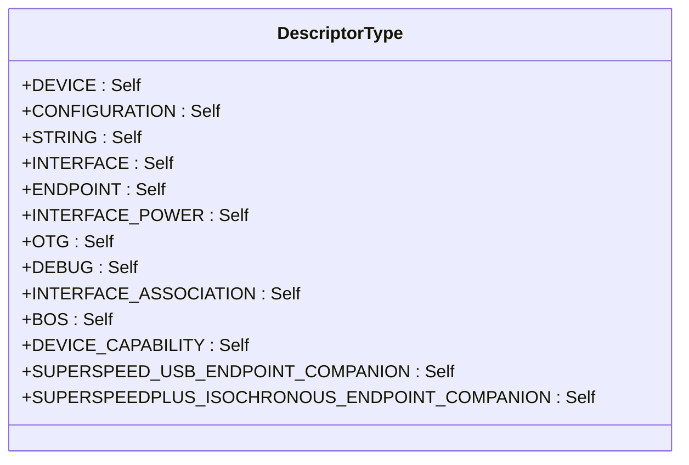
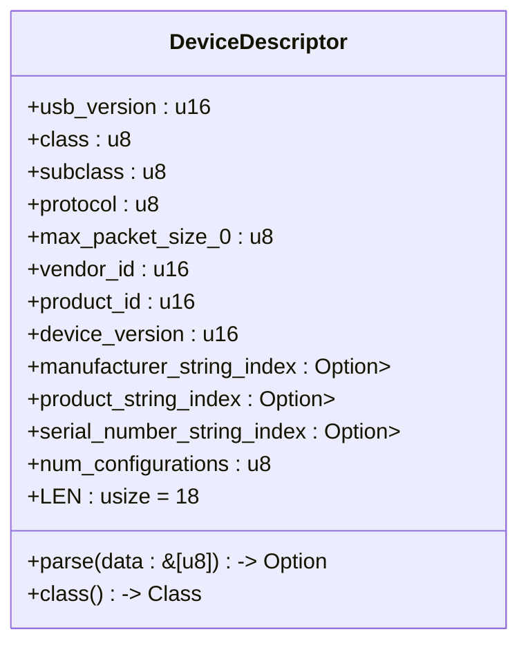
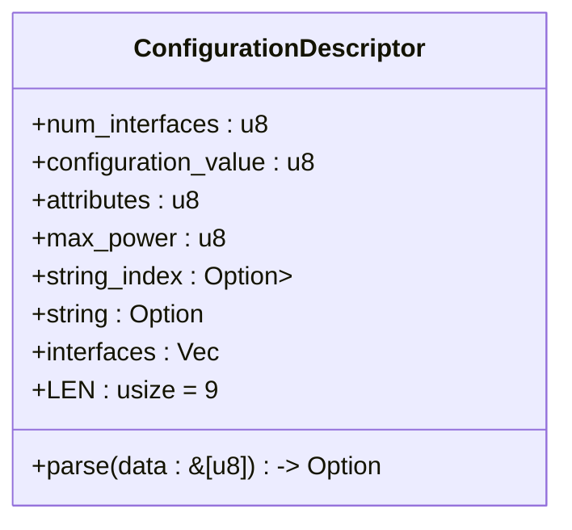
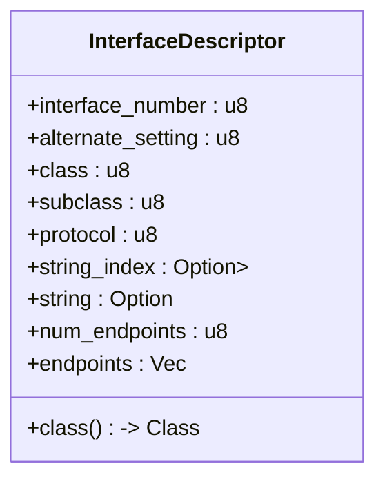
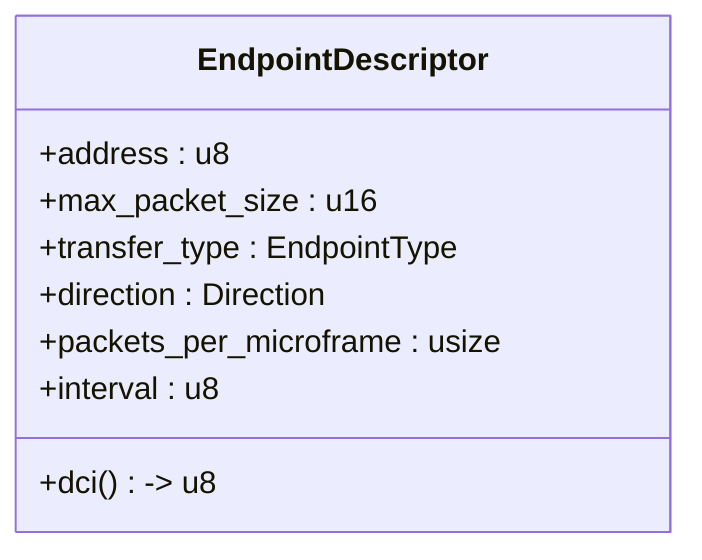
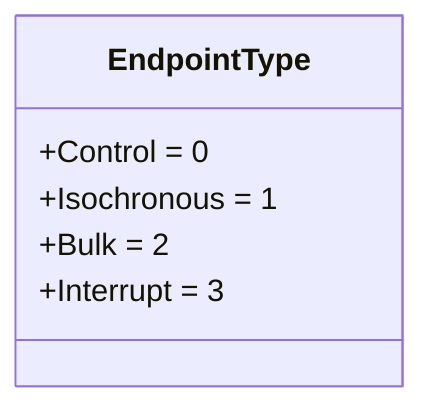
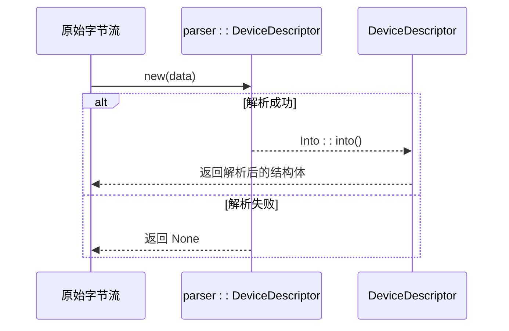
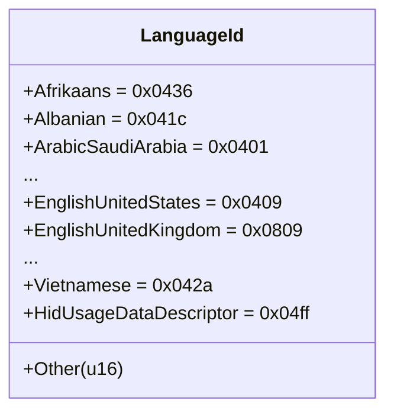
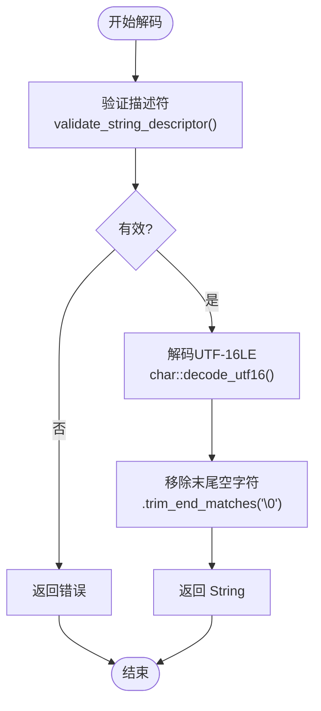

# 描述符模块 API

<cite>
**Referenced Files in This Document **   
- [mod.rs](file://usb-if/src/descriptor/mod.rs)
- [lang_id.rs](file://usb-if/src/descriptor/lang_id.rs)
- [parser.rs](file://usb-if/src/descriptor/parser.rs)
- [err.rs](file://usb-if/src/err.rs)
</cite>

## 目录
1. [简介](#简介)
2. [核心结构体与枚举](#核心结构体与枚举)
3. [描述符解析机制](#描述符解析机制)
4. [语言ID处理](#语言id处理)
5. [错误处理与边界检查](#错误处理与边界检查)
6. [使用示例](#使用示例)

## 简介

`descriptor` 模块是 CrabUSB 库的核心组件之一，负责解析和表示 USB 设备的各类标准描述符。该模块提供了类型安全、内存布局精确的 Rust 结构体来表示设备、配置、接口和端点等描述符，并通过 `parser` 子模块实现从原始字节流到高级结构的安全转换。本文档详细说明了这些类型的字段含义、内存布局以及在异步枚举过程中的安全传递机制。

**Section sources**
- [mod.rs](file://usb-if/src/descriptor/mod.rs#L1-L241)
- [parser.rs](file://usb-if/src/descriptor/parser.rs#L1-L799)

## 核心结构体与枚举

### DescriptorType 枚举

`DescriptorType` 枚举定义了所有标准 USB 描述符类型的常量值，用于标识描述符的种类。它通过 `#[repr(C)]` 保证了与 C ABI 的兼容性，并实现了 `From<u8>` 和 `Into<u8>` 以支持与原始字节的无缝转换。

**Diagram sources **
- [mod.rs](file://usb-if/src/descriptor/mod.rs#L10-L35)

### DeviceDescriptor 结构体

`DeviceDescriptor` 结构体表示 USB 设备描述符，包含了设备的基本信息，如厂商 ID、产品 ID、协议版本等。其字段严格按照 USB 规范定义，并提供了 `parse` 方法用于从字节流创建实例。

**Diagram sources **
- [mod.rs](file://usb-if/src/descriptor/mod.rs#L37-L65)

### ConfigurationDescriptor 结构体

`ConfigurationDescriptor` 表示 USB 配置描述符，包含配置的属性、最大功耗以及关联的接口列表。它通过 `interfaces` 字段管理多个 `InterfaceDescriptors` 实例。

**Diagram sources **
- [mod.rs](file://usb-if/src/descriptor/mod.rs#L140-L160)

### InterfaceDescriptor 结构体

`InterfaceDescriptor` 代表一个接口的特定备用设置，包含类代码、子类代码、协议代码以及关联的端点列表。

**Diagram sources **
- [mod.rs](file://usb-if/src/descriptor/mod.rs#L67-L85)

### EndpointDescriptor 结构体

`EndpointDescriptor` 表示一个端点描述符，包含地址、最大包大小、传输类型、方向等关键信息。其 `dci` 方法用于计算数据通道索引。

**Diagram sources **
- [mod.rs](file://usb-if/src/descriptor/mod.rs#L97-L118)

### EndpointType 枚举

`EndpointType` 枚举定义了四种标准的端点传输类型：控制、等时、批量和中断。

**Diagram sources **
- [mod.rs](file://usb-if/src/descriptor/mod.rs#L87-L95)

**Section sources**
- [mod.rs](file://usb-if/src/descriptor/mod.rs#L10-L241)

## 描述符解析机制

描述符的解析由 `parser` 模块中的专用解析器结构体完成，这些结构体（如 `parser::DeviceDescriptor`）直接操作原始字节并提供基于偏移量的字段访问方法。公共的 `DeviceDescriptor` 等结构体通过 `From` trait 从解析器实例转换而来，确保了内部状态的一致性和安全性。

**Diagram sources **
- [mod.rs](file://usb-if/src/descriptor/mod.rs#L162-L241)
- [parser.rs](file://usb-if/src/descriptor/parser.rs#L1-L799)

**Section sources**
- [mod.rs](file://usb-if/src/descriptor/mod.rs#L162-L241)
- [parser.rs](file://usb-if/src/descriptor/parser.rs#L1-L799)

## 语言ID处理

### LanguageId 枚举

`LanguageId` 枚举使用 `num_enum` 宏将 16 位的语言 ID 映射为可读的变体，例如 `EnglishUnitedStates` 对应 `0x0409`。它实现了 `FromPrimitive` 和 `IntoPrimitive`，允许在枚举值和原始 `u16` 之间进行转换。

**Diagram sources **
- [lang_id.rs](file://usb-if/src/descriptor/lang_id.rs#L1-L304)

### 字符串描述符解码

`decode_string_descriptor` 函数负责将 UTF-16LE 编码的字符串描述符字节流解码为 Rust 的 `String` 类型。它首先调用 `validate_string_descriptor` 进行严格的边界检查，然后使用 `char::decode_utf16` 进行解码，并移除末尾的空字符。

**Diagram sources **
- [parser.rs](file://usb-if/src/descriptor/parser.rs#L770-L799)

**Section sources**
- [lang_id.rs](file://usb-if/src/des