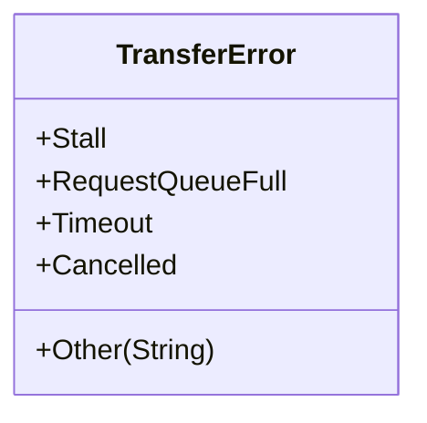
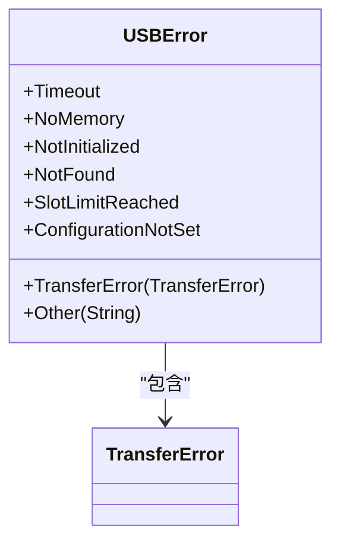
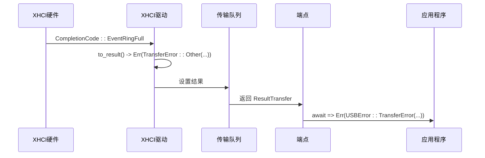

# 错误系统 API

<cite>
**本文档引用的文件**
- [err.rs](file://usb-host/src/backend/libusb/err.rs)
- [err.rs](file://usb-host/src/err.rs)
- [err.rs](file://usb-if/src/err.rs)
- [mod.rs](file://usb-if/src/host/mod.rs)
</cite>

## 目录
1. [引言](#引言)
2. [核心错误类型定义](#核心错误类型定义)
3. [TransferError 枚举成员详解](#transfererror-枚举成员详解)
4. [USBError 枚举成员详解](#usberror-枚举成员详解)
5. [错误传播链与调用栈示例](#错误传播链与调用栈示例)
6. [From 特性实现与错误转换机制](#from-特性实现与错误转换机制)
7. [特定错误匹配与恢复策略](#特定错误匹配与恢复策略)
8. [日志记录最佳实践](#日志记录最佳实践)
9. [结论](#结论)

## 引言
本项目构建了一个分层的 USB 错误处理系统，旨在为上层应用提供清晰、一致且可恢复的错误语义。该系统通过 `TransferError` 和 `USBError` 两个核心枚举进行建模，分别代表传输过程中的底层错误和主机控制器层面的高层错误。错误从硬件驱动（如 XHCI 或 LibUSB）产生，经过一系列转换和包装，最终以统一的 `USBError` 类型暴露给应用程序。理解这一系统的运作机制对于开发健壮的 USB 应用至关重要。

## 核心错误类型定义

本节系统化整理了在 `err.rs` 文件中定义的核心错误类型及其层次结构。

**Section sources**
- [err.rs](file://usb-if/src/err.rs#L0-L65)
- [err.rs](file://usb-host/src/err.rs#L0-L27)
- [err.rs](file://usb-if/src/host/mod.rs#L100-L123)

### TransferError (传输错误)
位于 `usb-if/src/err.rs`，此枚举表示单个 USB 传输操作（如批量、中断或等时传输）中可能发生的错误。它是最接近硬件操作的错误类型。

**Diagram sources**
- [err.rs](file://usb-if/src/err.rs#L3-L13)

### USBError (主机控制器错误)
位于 `usb-if/src/host/mod.rs`，此枚举是面向上层应用的顶层错误类型。它封装了 `TransferError` 并增加了主机控制器初始化、设备发现等更高层次的错误。

**Diagram sources**
- [mod.rs](file://usb-if/src/host/mod.rs#L100-L117)

## TransferError 枚举成员详解

本节详细说明 `TransferError` 枚举中每个成员的触发条件和语义含义。

**Section sources**
- [err.rs](file://usb-if/src/err.rs#L3-L13)

- **`Stall`**: 当 USB 设备无法完成请求并返回 STALL 握手包时触发。这通常表示设备端点处于错误状态或接收到无效命令。语义上，这是一个需要软件干预的明确错误，例如通过发送清除特征请求来复位端点。
- **`RequestQueueFull`**: 当底层驱动的传输请求队列已满，无法接受新的传输请求时触发。语义上，这表明系统负载过高或资源耗尽，建议稍后重试。
- **`Timeout`**: 当传输操作在预设的超时时间内未能完成时触发。语义上，这可能是由于物理连接不稳定、设备无响应或总线繁忙所致。通常可以通过重试来恢复。
- **`Cancelled`**: 当一个正在进行的传输被显式取消时触发（例如，用户关闭了应用程序）。语义上，这是预期的程序控制流，并非真正的故障。
- **`Other(String)`**: 捕获所有未在上述枚举中明确分类的错误。其内部字符串字段提供了具体的错误信息。语义上，这是一个兜底选项，用于处理未知或复杂的错误情况。

## USBError 枚举成员详解

本节详细说明 `USBError` 枚举中每个成员的触发条件和语义含义。

**Section sources**
- [mod.rs](file://usb-if/src/host/mod.rs#L100-L117)

- **`Timeout`**: 与 `TransferError::Timeout` 含义相同，但出现在更高层级的 API 调用中（如 `get_configuration`）。它由 `TransferError::Timeout` 通过 `From` 特性转换而来。
- **`NoMemory`**: 表示系统无法分配执行操作所需的内存（例如，分配 DMA 缓冲区失败）。语义上，这是一个严重的资源短缺问题，可能需要释放其他资源或等待内存可用。
- **`TransferError(TransferError)`**: 这是一个关键的“桥接”变体，它将底层的 `TransferError` 封装到 `USBError` 中。当任何传输操作失败时，都会通过此变体向上抛出具体原因。
- **`NotInitialized`**: 当尝试使用尚未成功初始化的主机控制器时触发。语义上，必须先调用 `init()` 方法。
- **`NotFound`**: 表示请求的实体不存在，例如尝试打开一个已被拔出的设备。语义上，应检查设备连接状态。
- **`SlotLimitReached`**: XHCI 控制器的设备槽位已满，无法注册新设备。语义上，需要释放现有设备槽位。
- **`ConfigurationNotSet`**: 在未设置设备配置的情况下尝试访问接口。语义上，必须先调用 `set_configuration`。
- **`Other(String)`**: 与 `TransferError::Other` 类似，用于封装无法归类的错误信息。

## 错误传播链与调用栈示例

本节展示一个典型的错误从底层硬件异常传播到高层应用的完整链条。

**Section sources**
- [err.rs](file://usb-host/src/backend/xhci/err.rs#L0-L27)
- [queue.rs](file://usb-host/src/backend/libusb/queue.rs#L113-L160)
- [endpoint.rs](file://usb-host/src/backend/libusb/endpoint.rs#L141-L177)

假设一个等时输入传输因设备无响应而超时：

1.  **XHCI 硬件层**: XHCI 主机控制器检测到超时，生成一个带有 `CompletionCode::EventRingFull` 的事件 TRB。
2.  **XHCI 驱动层**: `xhci` 后端的事件处理循环捕获此事件。`CompletionCode::EventRingFull` 通过 `ConvertXhciError` trait 被转换为 `TransferError::Other("XHCI error: EventRingFull")`。
3.  **LibUSB 兼容层**: 如果使用的是 `libusb` 后端，`transfer_status_to_result` 函数会将 LibUSB 的 `LIBUSB_TRANSFER_TIMED_OUT` 状态码直接映射为 `TransferError::Timeout`。
4.  **传输队列层**: 在 `submit_iso` 完成回调 (`transfer_callback`) 中，`transfer_status_to_result` 被调用，将底层状态转换为 `Result<usize, TransferError>`。
5.  **接口层**: `EndpointImpl` 的 `submit` 方法返回一个 `ResultTransfer`（即 `Result<Waiter, TransferError>`），如果提交本身失败，则立即返回 `Err`。
6.  **应用层**: 上层应用调用 `endpoint.submit(data).await`。`Waiter` 解析为 `Err(TransferError::Timeout)`。此 `TransferError` 被 `?` 操作符自动转换为 `USBError::Timeout`（得益于 `#[from]` 属性），最终被应用捕获。

**Diagram sources**
- [err.rs](file://usb-host/src/err.rs#