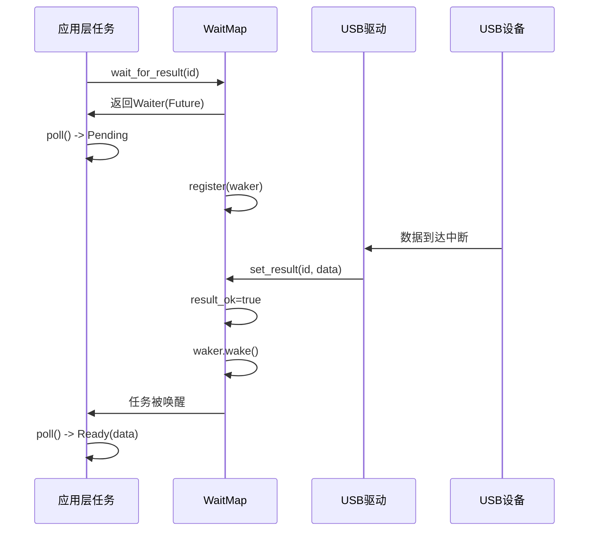
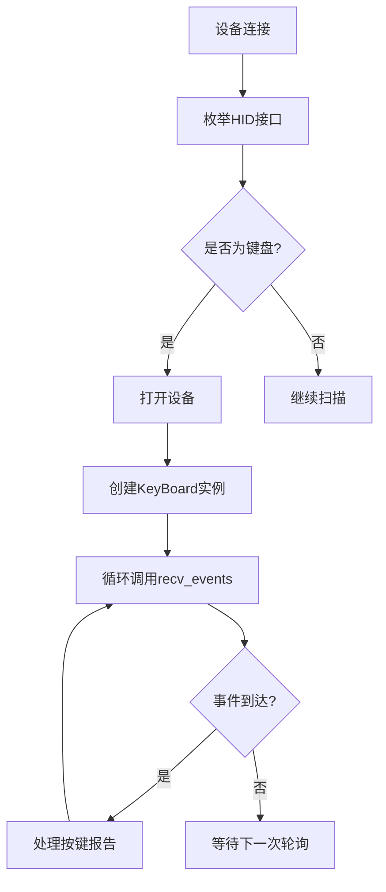
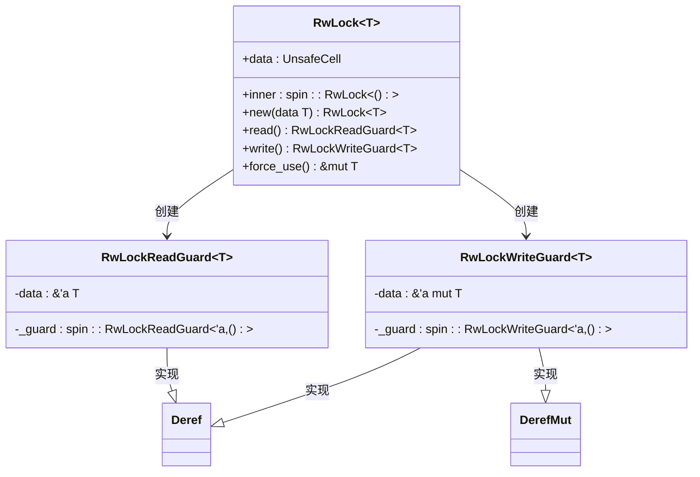

# 中断传输

<cite>
**Referenced Files in This Document **   
- [wait.rs](file://usb-if/src/transfer/wait.rs)
- [sync.rs](file://usb-if/src/transfer/sync.rs)
- [endpoint.rs](file://usb-host/src/backend/libusb/endpoint.rs)
- [keyboard.rs](file://usb-device/hid/keyboard/examples/keyboard.rs)
- [mod.rs](file://usb-if/src/transfer/mod.rs)
</cite>

## 目录
1. [中断传输低延迟响应机制](#中断传输低延迟响应机制)
2. [WaitMap与AtomicWaker事件驱动回调](#waitmap与atomicwaker事件驱动回调)
3. [HID设备工作场景分析](#hid设备工作场景分析)
4. [中断端点注册与数据监听](#中断端点注册与数据监听)
5. [RwLock共享状态保护机制](#rwlock共享状态保护机制)
6. [优先级处理与资源竞争规避](#优先级处理与资源竞争规避)

## 中断传输低延迟响应机制

CrabUSB中的中断传输机制专为高频率、小数据包的输入设备设计，确保键盘、鼠标等HID设备的数据能够以最低延迟上报。该机制基于周期性轮询模型，在固定间隔内主动查询设备是否有新数据到达，从而避免了传统轮询方式中可能出现的响应延迟。

中断传输通过专用的中断端点（Interrupt Endpoint）实现数据通信，每个端点都配置有预定义的轮询间隔（Polling Interval），该间隔由设备描述符中的`bInterval`字段指定。系统根据此间隔精确调度数据请求，保证了数据采集的实时性和确定性。

**Section sources**
- [endpoint.rs](file://usb-host/src/backend/libusb/endpoint.rs#L100-L120)
- [mod.rs](file://usb-if/src/transfer/mod.rs#L5-L25)

## WaitMap与AtomicWaker事件驱动回调

WaitMap是CrabUSB中实现异步等待的核心数据结构，它结合AtomicWaker实现了高效的事件驱动回调通知机制。WaitMap内部维护一个有序映射（BTreeMap），将每个传输请求的唯一标识符（ID）与对应的等待元素（Elem）关联。

每个Elem包含一个AtomicWaker实例，用于在结果就绪时唤醒等待的任务。当调用`wait_for_result`方法时，系统会创建一个实现了Future trait的Waiter对象，并将其与特定ID绑定。此时，AtomicWaker会注册当前任务的waker，以便在数据到达时触发唤醒。

一旦底层驱动完成数据传输并调用`set_result`方法，WaitMap将执行以下关键操作：
1. 存储传输结果到对应Elem的result字段
2. 将result_ok标志置为true
3. 调用waker.take()获取已注册的waker并执行wake()操作

这一机制实现了从硬件中断到用户任务的无缝通知链路，确保了事件驱动的高效性。

**Diagram sources **
- [wait.rs](file://usb-if/src/transfer/wait.rs#L80-L177)
- [sync.rs](file://usb-if/src/transfer/sync.rs#L5-L70)

**Section sources**
- [wait.rs](file://usb-if/src/transfer/wait.rs#L0-L178)

## HID设备工作场景分析

在键盘、鼠标等HID设备的工作场景中，中断传输发挥着至关重要的作用。这些设备通常以较高的频率产生小量数据（如按键事件、移动坐标），需要系统能够及时捕获并处理。

以键盘设备为例，当用户按下某个键时，设备会在下一个轮询周期将包含按键信息的报告描述符（Report Descriptor）发送给主机。CrabUSB通过中断输入端点定期轮询设备，确保按键事件能够在毫秒级时间内被检测到。

示例代码展示了如何使用CrabUSB处理键盘输入事件：

**Diagram sources **
- [keyboard.rs](file://usb-device/hid/keyboard/examples/keyboard.rs#L20-L55)

**Section sources**
- [keyboard.rs](file://usb-device/hid/keyboard/examples/keyboard.rs#L0-L57)

## 中断端点注册与数据监听

中断端点的注册和数据监听是实现可靠数据传输的关键步骤。在CrabUSB架构中，这一过程通过EndpointImpl类的submit方法完成，具体针对中断输入端点实现了EndpointInterruptIn trait。

注册流程如下：
1. 创建libusb_transfer结构体并填充必要参数
2. 调用libusb_fill_interrupt_transfer进行初始化
3. 设置超时时间为1000ms，确保不会无限期阻塞
4. 将传输请求提交到队列等待执行

数据监听机制依赖于底层libusb库的异步I/O能力。当submit方法被调用后，传输请求被放入Queue中，由独立的事件处理线程负责实际的USB通信。这种设计实现了非阻塞式API，允许应用程序继续执行其他任务。

**Section sources**
- [endpoint.rs](file://usb-host/src/backend/libusb/endpoint.rs#L100-L120)

## RwLock共享状态保护机制

在多线程环境下，WaitMap使用自定义的RwLock来保护其内部共享状态的安全性。该RwLock实现基于spin::RwLock原语，提供了读写锁的基本功能，允许多个读取者同时访问，但写入操作必须独占。

RwLock的设计考虑了嵌入式系统的特殊需求：
- 使用UnsafeCell包装数据，避免额外的运行时开销
- 提供read和write方法分别获取读锁和写锁
- 包含force_use方法用于unsafe上下文中的直接访问

这种设计确保了在高并发场景下对WaitMap的访问既安全又高效。例如，多个任务可以同时调用wait_for_result进行读操作，而set_result的写操作则会被正确序列化，防止数据竞争。

**Diagram sources **
- [sync.rs](file://usb-if/src/transfer/sync.rs#L5-L70)

**Section sources**
- [sync.rs](file://usb-if/src/transfer/sync.rs#L0-L71)

## 优先级处理与资源竞争规避

为了确保高频率小数据包的及时处理，CrabUSB采用了一系列优先级处理和资源竞争规避策略：

首先，通过preper_id方法实现了请求队列的流量控制。该方法使用AtomicBool的compare_exchange操作来原子性地检查和标记请求槽位的使用状态，有效防止了多个线程同时占用同一资源的情况。

其次，WaitMap的设计本身就支持优先级调度。由于其内部使用BTreeMap按ID排序，系统可以根据ID的数值大小隐式实现优先级管理——较小的ID可能代表更高优先级的传输请求。

此外，整个异步框架基于Future模式构建，允许任务在等待期间让出执行权，避免了忙等待造成的资源浪费。配合tokio等异步运行时，可以实现高效的多路复用和调度。

最后，通过分离提交（submit）和完成（completion）路径，系统实现了生产者-消费者模式的解耦。提交操作快速返回，而耗时的I/O操作在后台线程中执行，最大限度减少了主线程的阻塞时间。

**Section sources**
- [wait.rs](file://usb-if/src/transfer/wait.rs#L44-L85)
- [endpoint.rs](file://usb-host/src/backend/libusb/endpoint.rs#L100-L120)