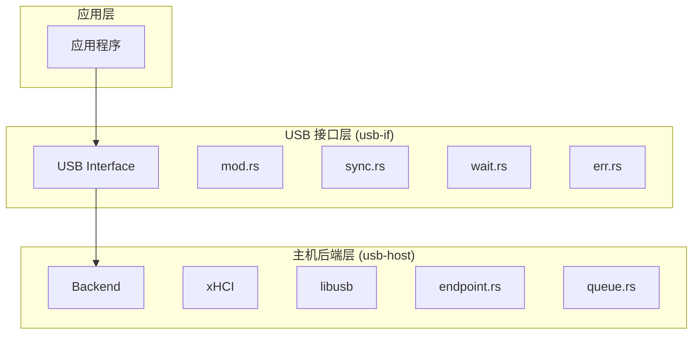
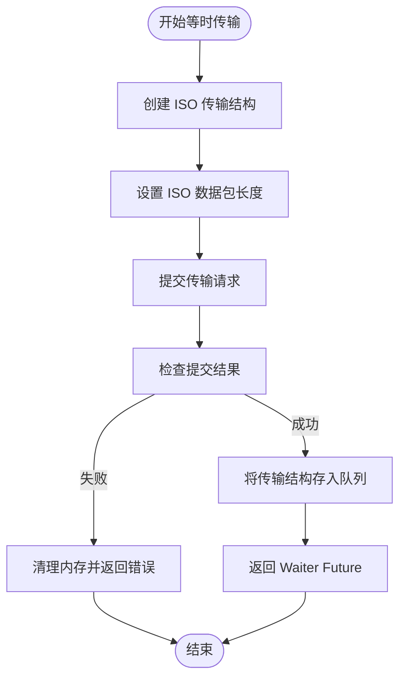
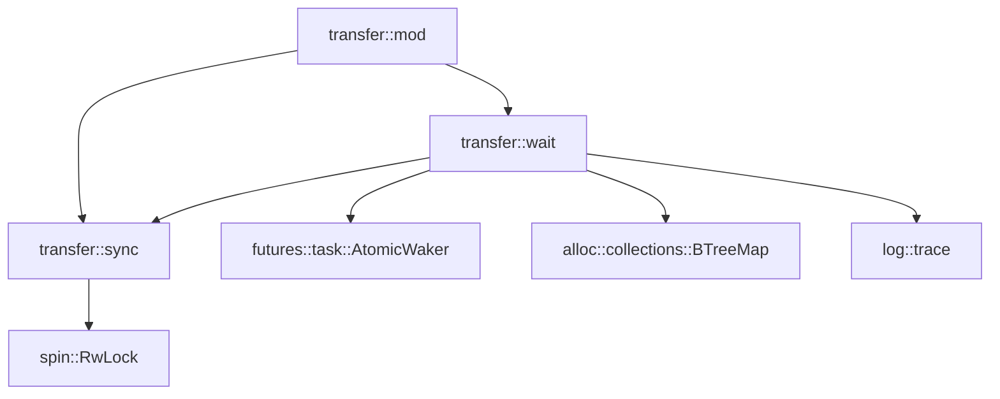

# 传输类型支持

<cite>
**本文档中引用的文件**  
- [mod.rs](file://usb-if/src/transfer/mod.rs)
- [sync.rs](file://usb-if/src/transfer/sync.rs)
- [wait.rs](file://usb-if/src/transfer/wait.rs)
- [err.rs](file://usb-if/src/err.rs)
- [endpoint.rs](file://usb-host/src/backend/libusb/endpoint.rs)
- [queue.rs](file://usb-host/src/backend/libusb/queue.rs)
</cite>

## 目录
1. [引言](#引言)  
2. [项目结构](#项目结构)  
3. [核心组件](#核心组件)  
4. [架构概述](#架构概述)  
5. [详细组件分析](#详细组件分析)  
6. [依赖分析](#依赖分析)  
7. [性能考虑](#性能考虑)  
8. [故障排除指南](#故障排除指南)  
9. [结论](#结论)

## 引言
CrabUSB 是一个高性能、异步的 USB 主机驱动程序，专为嵌入式系统和操作系统内核设计。本文档详尽描述了四种 USB 传输类型（控制、批量、中断、等时）在 CrabUSB 中的实现机制，重点分析 `transfer` 模块中同步与异步传输的内部调度逻辑，并解释 `sync.rs` 和 `wait.rs` 如何协调 Future 完成与回调通知。

每种传输类型均提供典型使用场景示例：控制传输用于设备配置、批量传输用于大容量数据交换、中断传输用于键盘鼠标输入、等时传输用于音视频流。同时说明传输请求的构造方法、超时设置、缓冲区管理及错误恢复策略，帮助开发者根据需求选择最优传输模式。

## 项目结构
CrabUSB 采用模块化设计，清晰分离主机控制器与 USB 接口层。其核心功能位于 `usb-if` 和 `usb-host` 两个主要模块中。`usb-if` 提供通用接口定义，而 `usb-host` 实现具体后端（xHCI 和 libusb）。`transfer` 子模块集中处理所有传输类型的调度与状态管理。



**图源**  
- [mod.rs](file://usb-if/src/transfer/mod.rs)
- [sync.rs](file://usb-if/src/transfer/sync.rs)
- [wait.rs](file://usb-if/src/transfer/wait.rs)
- [endpoint.rs](file://usb-host/src/backend/libusb/endpoint.rs)
- [queue.rs](file://usb-host/src/backend/libusb/queue.rs)

**节源**
- [mod.rs](file://usb-if/src/transfer/mod.rs)
- [README.md](file://README.md)

## 核心组件
`transfer` 模块是 CrabUSB 数据传输的核心，它通过 `WaitMap` 和 `RwLock` 等同步原语实现了无锁或低锁的高效异步操作。该模块支持控制、批量、中断和等时四种标准 USB 传输类型，并通过统一的 Future 接口暴露给上层应用。

**节源**
- [mod.rs](file://usb-if/src/transfer/mod.rs)
- [wait.rs](file://usb-if/src/transfer/wait.rs)

## 架构概述
CrabUSB 采用基于 TRB（传输请求块）环的创新**无锁设计**。每个 TRB 代表一个异步任务，Future 通过查询环来获取结果，无需依赖特定执行器，从而实现高度灵活和高性能。

```mermaid
graph LR
A[应用程序] --> B[USB 接口 (usb-if)]
B --> C[后端选择]
C --> D[xHCI 后端]
C --> E[libusb 后端]
B --> F[描述符与传输]
D --> G[硬件寄存器]
E --> H[用户空间库]
```

**图源**  
- [README.md](file://README.md)

## 详细组件分析

### 控制传输
控制传输用于设备配置和标准请求，如获取描述符、设置地址等。在 `mod.rs` 中，`BmRequestType` 结构体封装了请求的方向、类型和接收者，这些信息被编码为单个字节用于底层通信。

**节源**
- [mod.rs](file://usb-if/src/transfer/mod.rs)

### 批量传输
批量传输适用于高吞吐量的数据交换，如存储设备读写。其实现依赖于 `wait.rs` 中的 `WaitMap` 来跟踪传输完成状态，并通过 Future 机制实现非阻塞等待。

**节源**
- [wait.rs](file://usb-if/src/transfer/wait.rs)

### 中断传输
中断传输用于周期性数据采集，如键盘和鼠标输入。其特点是低延迟和固定轮询间隔。`WaitMap` 的 `preper_id` 方法确保了请求队列不会溢出，而 `wait_for_result` 则返回一个可等待的 Future。

**节源**
- [wait.rs](file://usb-if/src/transfer/wait.rs)

### 等时传输
等时传输用于实时音视频流，保证带宽但不保证数据完整性。在 `libusb` 后端中，`queue.rs` 文件负责创建 ISO 传输结构并提交到硬件队列，`on_ready` 回调用于通知传输完成。



**图源**  
- [queue.rs](file://usb-host/src/backend/libusb/queue.rs)
- [endpoint.rs](file://usb-host/src/backend/libusb/endpoint.rs)

**节源**
- [queue.rs](file://usb-host/src/backend/libusb/queue.rs)
- [endpoint.rs](file://usb-host/src/backend/libusb/endpoint.rs)

## 依赖分析
`transfer` 模块依赖于多个外部 crate，包括 `futures` 用于异步编程、`log` 用于日志记录、`spin` 用于轻量级锁。其内部模块间也存在明确依赖关系：`wait.rs` 依赖 `sync.rs` 提供的 `RwLock`，而 `mod.rs` 则整合两者对外提供统一接口。



**图源**  
- [mod.rs](file://usb-if/src/transfer/mod.rs)
- [sync.rs](file://usb-if/src/transfer/sync.rs)
- [wait.rs](file://usb-if/src/transfer/wait.rs)
- [Cargo.toml](file://usb-if/Cargo.toml)

**节源**
- [mod.rs](file://usb-if/src/transfer/mod.rs)
- [sync.rs](file://usb-if/src/transfer/sync.rs)
- [wait.rs](file://usb-if/src/transfer/wait.rs)
- [Cargo.toml](file://usb-if/Cargo.toml)

## 性能考虑
CrabUSB 的无锁 TRB 环设计最大限度地减少了 CPU 开销和上下文切换。`WaitMap` 使用原子操作和 `AtomicWaker` 实现高效的事件通知，避免了传统轮询的资源浪费。对于等时传输，预分配的 ISO 数据包描述符数组进一步降低了运行时开销。

## 故障排除指南
常见传输错误在 `err.rs` 中定义，包括 `Stall`（设备停滞）、`RequestQueueFull`（请求队列满）、`Timeout`（超时）和 `Cancelled`（已取消）。开发者应检查设备连接状态、确保正确配置端点参数，并合理设置超时值以应对不同场景。

**节源**
- [err.rs](file://usb-if/src/err.rs)

## 结论
CrabUSB 通过精心设计的 `transfer` 模块，为四种 USB 传输类型提供了高效、灵活且易于使用的异步接口。其核心在于 `WaitMap` 与 `RwLock` 的协同工作，实现了 Future 完成与回调通知的无缝集成。开发者可根据具体应用场景选择合适的传输模式，并利用丰富的错误处理机制构建健壮的 USB 应用。