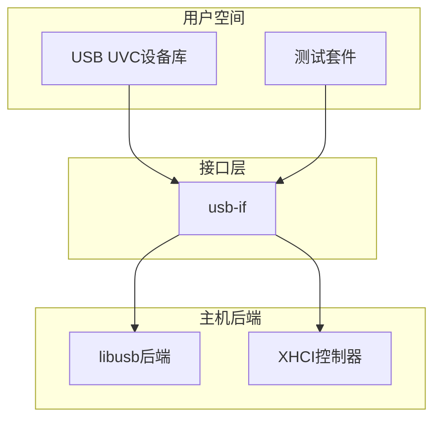
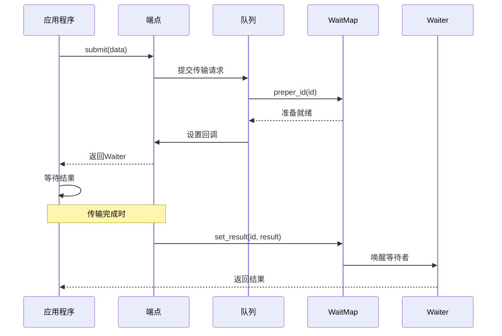
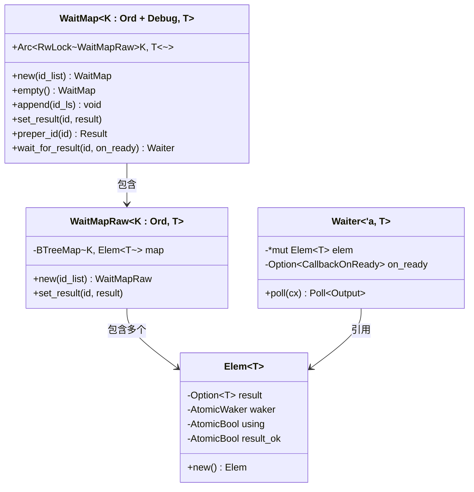
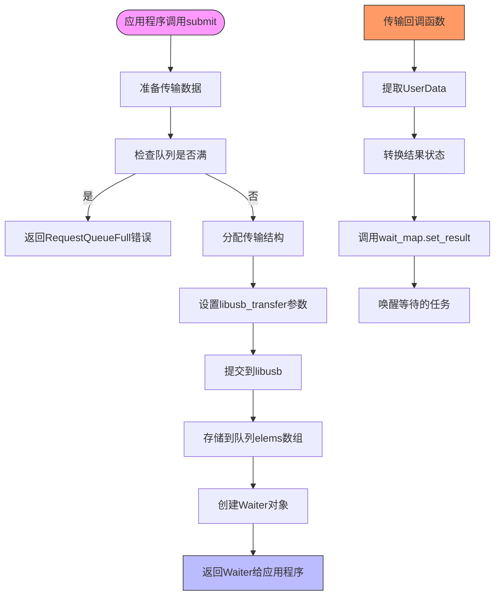

# 批量传输

<cite>
**本文档中引用的文件**
- [wait.rs](file://usb-if/src/transfer/wait.rs)
- [queue.rs](file://usb-host/src/backend/libusb/queue.rs)
- [endpoint.rs](file://usb-host/src/backend/libusb/endpoint.rs)
- [mod.rs](file://usb-host/src/common/mod.rs)
- [err.rs](file://usb-if/src/err.rs)
</cite>

## 目录
1. [简介](#简介)
2. [项目结构](#项目结构)
3. [核心组件](#核心组件)
4. [架构概述](#架构概述)
5. [详细组件分析](#详细组件分析)
6. [依赖关系分析](#依赖关系分析)
7. [性能考虑](#性能考虑)
8. [故障排除指南](#故障排除指南)
9. [结论](#结论)

## 简介
CrabUSB中的批量传输机制专为大容量、非实时数据交换场景设计，适用于UVC摄像头帧数据传输和大文件存储设备操作等应用。该机制基于WaitMap和Waiter结构体实现异步调度，确保数据包提交与完成通知的高效处理。文档深入解析了批量传输的可靠性保障机制，并对比了其与控制传输在性能和用途上的差异。

## 项目结构
CrabUSB项目采用分层架构，包含usb-device、usb-host和usb-if三个主要模块。usb-if提供统一的接口定义，usb-host实现主机端功能，usb-device支持设备端应用。批量传输的核心逻辑分布在usb-if的transfer模块和usb-host的backend模块中。



**图源**
- [mod.rs](file://usb-host/src/common/mod.rs#L205-L242)
- [interface.rs](file://usb-host/src/backend/libusb/interface.rs#L55-L96)

**节源**
- [mod.rs](file://usb-host/src/common/mod.rs#L0-L331)
- [interface.rs](file://usb-host/src/backend/libusb/interface.rs#L0-L53)

## 核心组件
批量传输的核心组件包括WaitMap用于管理等待中的传输请求，Queue负责调度传输任务，以及EndpointImpl处理具体的端点操作。这些组件协同工作，实现了高效的异步数据传输机制。

**节源**
- [wait.rs](file://usb-if/src/transfer/wait.rs#L0-L42)
- [queue.rs](file://usb-host/src/backend/libusb/queue.rs#L0-L41)
- [endpoint.rs](file://usb-host/src/backend/libusb/endpoint.rs#L0-L49)

## 架构概述
批量传输采用生产者-消费者模式，通过WaitMap跟踪未完成的传输请求。当数据包提交时，系统将其加入队列并返回一个Waiter对象。传输完成后，回调函数会更新WaitMap中的结果状态，唤醒等待的任务。



**图源**
- [queue.rs](file://usb-host/src/backend/libusb/queue.rs#L43-L76)
- [wait.rs](file://usb-if/src/transfer/wait.rs#L100-L130)

## 详细组件分析

### WaitMap与Waiter机制分析
WaitMap使用BTreeMap存储传输请求的状态信息，每个条目包含结果、唤醒器、使用标志和结果状态。Waiter作为Future实现，允许异步等待传输完成。



**图源**
- [wait.rs](file://usb-if/src/transfer/wait.rs#L0-L178)

**节源**
- [wait.rs](file://usb-if/src/transfer/wait.rs#L0-L178)

### 批量传输流程分析
批量传输从应用程序调用submit方法开始，经过队列管理和端点配置，最终由底层驱动执行。整个过程保持异步特性，不阻塞调用线程。



**图源**
- [queue.rs](file://usb-host/src/backend/libusb/queue.rs#L43-L116)
- [endpoint.rs](file://usb-host/src/backend/libusb/endpoint.rs#L51-L100)

**节源**
- [queue.rs](file://usb-host/src/backend/libusb/queue.rs#L0-L161)
- [endpoint.rs](file://usb-host/src/backend/libusb/endpoint.rs#L0-L190)

## 依赖关系分析
批量传输机制依赖于多个关键组件：usb-if提供抽象接口，libusb作为底层驱动，log用于调试输出，futures支持异步编程模型。这些依赖共同构建了一个稳定可靠的传输框架。

```