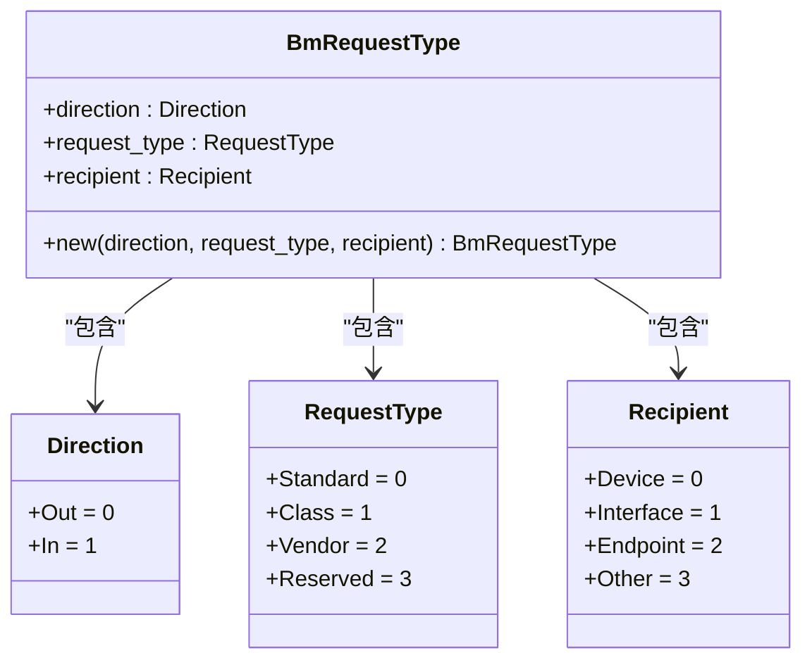
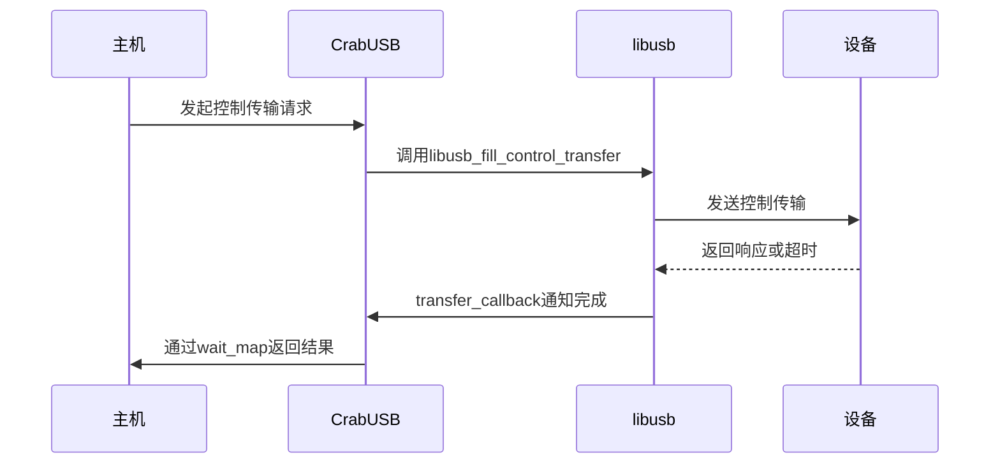

# 控制传输

<cite>
**本文档中引用的文件**
- [mod.rs](file://usb-if/src/transfer/mod.rs)
- [device.rs](file://usb-host/src/backend/libusb/device.rs)
- [endpoint.rs](file://usb-host/src/backend/libusb/endpoint.rs)
- [queue.rs](file://usb-host/src/backend/libusb/queue.rs)
- [err.rs](file://usb-if/src/err.rs)
</cite>

## 目录
1. [引言](#引言)
2. [BmRequestType结构体分析](#bmrequesttype结构体分析)
3. [控制传输在设备枚举中的作用](#控制传输在设备枚举中的作用)
4. [控制传输请求构造方法](#控制传输请求构造方法)
5. [双向特性与描述符读取应用](#双向特性与描述符读取应用)
6. [超时处理与错误恢复策略](#超时处理与错误恢复策略)

## 引言
控制传输是USB通信中最基础且最重要的传输类型，主要用于设备枚举、配置和状态查询等关键操作。CrabUSB通过抽象化的接口实现了标准USB控制传输机制，支持设备初始化阶段的核心功能。

**Section sources**
- [device.rs](file://usb-host/src/backend/libusb/device.rs#L0-L412)

## BmRequestType结构体分析
`BmRequestType`结构体封装了USB控制传输请求的关键属性，包括方向、请求类型和接收者信息。该结构体由三个字段组成：direction（方向）、request_type（请求类型）和recipient（接收者）。通过`From<BmRequestType> for u8`的实现，该结构体可转换为标准的8位bmRequestType值，其中最高位表示数据传输方向，第6-5位表示请求类型，低5位表示接收者。

**Diagram sources**
- [mod.rs](file://usb-if/src/transfer/mod.rs#L0-L110)

**Section sources**
- [mod.rs](file://usb-if/src/transfer/mod.rs#L0-L110)

## 控制传输在设备枚举中的作用
在设备枚举过程中，控制传输扮演着核心角色。通过标准USB设备请求如GetDescriptor、SetConfiguration等，主机能够获取设备描述符、设置设备地址并配置设备工作模式。例如，在`get_configuration_descriptor`函数中，使用libusb_get_config_descriptor发起控制传输来获取配置描述符；在`set_configuration`函数中，调用libusb_set_configuration完成设备配置设置。这些操作均依赖于控制端点0进行双向通信。

**Section sources**
- [device.rs](file://usb-host/src/backend/libusb/device.rs#L0-L412)

## 控制传输请求构造方法
构造控制传输请求需要正确设置五个关键字段：bmRequestType、bRequest、wValue、wIndex和wLength。在CrabUSB中，这些参数通过ControlSetup结构体进行封装，并在EPControl::control_in和EPControl::control_out方法中使用libusb_fill_control_setup填充控制传输设置。具体而言，bmRequestType由BmRequestType结构体转换而来，bRequest对应Request枚举值，wValue和wIndex根据具体请求含义设置，wLength指定数据阶段的长度。

**Section sources**
- [device.rs](file://usb-host/src/backend/libusb/device.rs#L0-L412)

## 双向特性与描述符读取应用
控制传输具有双向特性，既支持主机到设备的输出（OUT），也支持设备到主机的输入（IN）。这一特性在读取设备描述符和字符串描述符时尤为重要。例如，在control_in方法中，数据从设备传输到主机缓冲区，通过on_ready回调将实际接收到的数据复制到用户提供的缓冲区。这种机制确保了描述符信息能够可靠地从设备传递到主机系统。

**Section sources**
- [device.rs](file://usb-host/src/backend/libusb/device.rs#L0-L412)

## 超时处理与错误恢复策略
CrabUSB实现了完善的超时处理与错误恢复机制。在提交传输请求时，所有libusb_fill_*函数均设置1000ms的超时时间。当传输完成时，transfer_callback会检查传输状态并通过wait_map通知等待结果。对于ISO传输，iso_in_on_ready专门处理每个ISO包的状态，遇到错误时记录日志并将对应缓冲区清零。错误类型包括STALL、TIMEOUT、CANCELLED等，均映射到TransferError枚举中进行统一处理。

**Diagram sources**
- [device.rs](file://usb-host/src/backend/libusb/device.rs#L0-L412)
- [queue.rs](file://usb-host/src/backend/libusb/queue.rs#L0-L161)

**Section sources**
- [queue.rs](file://usb-host/src/backend/libusb/queue.rs#L0-L161)
- [err.rs](file://usb-if/src/err.rs#L0-L64)