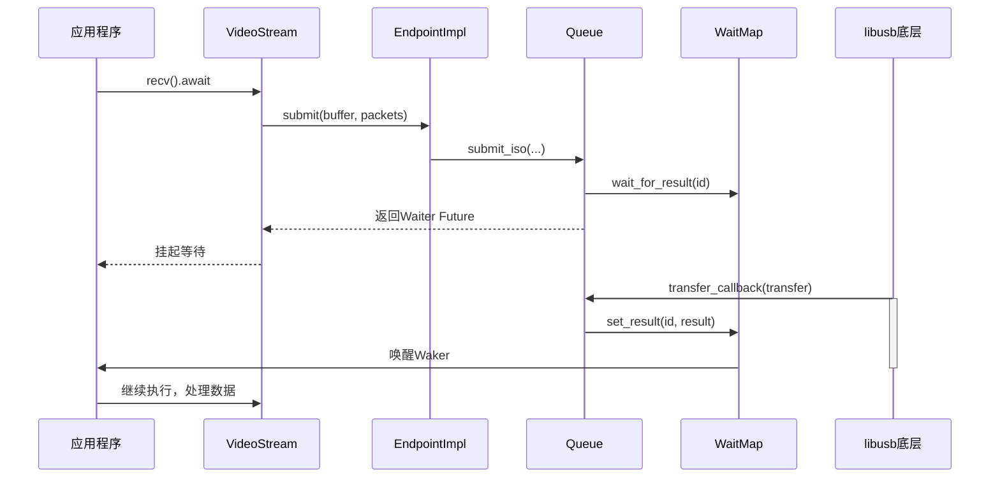

# 等时传输

<cite>
**本文档引用文件**  
- [simple_streaming_test.rs](file://usb-device/uvc/examples/simple_streaming_test.rs)
- [stream.rs](file://usb-device/uvc/src/stream.rs)
- [frame.rs](file://usb-device/uvc/src/frame.rs)
- [endpoint.rs](file://usb-host/src/backend/libusb/endpoint.rs)
- [queue.rs](file://usb-host/src/backend/libusb/queue.rs)
- [wait.rs](file://usb-if/src/transfer/wait.rs)
- [mod.rs](file://usb-if/src/transfer/mod.rs)
</cite>

## 目录
1. [引言](#引言)
2. [等时传输实时性保障机制](#等时传输实时性保障机制)
3. [UVC摄像头场景下的端点配置](#uvc摄像头场景下的端点配置)
4. [数据包调度与Waiter Future集成](#数据包调度与waiter-future集成)
5. [开发注意事项与性能调优](#开发注意事项与性能调优)
6. [结论](#结论)

## 引言
CrabUSB通过等时传输（Isochronous Transfer）为音视频流媒体应用提供低延迟、高带宽的实时数据通道。该机制在不保证无损传输的前提下，优先确保数据按时送达，适用于对时序敏感但可容忍少量丢包的场景，如UVC摄像头视频流。本文系统分析CrabUSB中等时传输的实现原理，涵盖其带宽与时序保障特性、端点参数配置方法、异步运行时集成策略及开发者需关注的关键问题。

## 等时传输实时性保障机制
等时传输在CrabUSB中通过硬件级时间槽分配和固定周期调度实现严格的时序保障。与中断或批量传输不同，等时传输在USB总线预留专用带宽，确保每个微帧（microframe）内定时发送数据包，从而满足音视频流的恒定速率需求。尽管该模式不支持错误重传（即发生错误时不会重发数据包），但通过前向纠错和上层协议恢复机制（如UVC载荷头中的FID帧标识和EOF结束标志）来维持流的连续性和完整性。

等时传输的实时性由底层驱动精确控制：`EndpointImpl`在提交传输请求时，通过`libusb_fill_iso_transfer`函数填充等时传输描述符，并预设每个数据包的长度。即使实际接收数据量不足，驱动也会将缓冲区剩余部分清零并标记为有效，避免阻塞后续传输，从而保证了数据流的时序稳定性。

**Section sources**
- [endpoint.rs](file://usb-host/src/backend/libusb/endpoint.rs#L100-L190)
- [queue.rs](file://usb-host/src/backend/libusb/queue.rs#L80-L160)

## UVC摄像头场景下的端点配置
在UVC摄像头应用中，等时端点的参数配置直接决定了可支持的分辨率和帧率。`VideoStream::new`函数根据目标视频格式（`VideoFormat`）自动计算关键参数：首先获取等时端点的最大包大小（`max_packet_size`），然后根据单帧图像字节数（`frame_bytes`）和最大包大小，计算每笔传输包含的数据包数量（`packets_per_transfer`），并限制其不超过32个以防止资源耗尽。

缓冲区大小则按公式 `(max_packet_size) * packets_per_transfer` 预先分配，确保能容纳一次完整传输的所有数据。例如，对于720p@30fps的MJPEG流，若端点最大包长为3072字节，则系统会动态计算所需的数据包数并初始化相应大小的环形缓冲区，从而满足特定视频流的带宽与时序要求。

**Section sources**
- [stream.rs](file://usb-device/uvc/src/stream.rs#L10-L40)
- [simple_streaming_test.rs](file://usb-device/uvc/examples/simple_streaming_test.rs#L30-L50)

## 数据包调度与Waiter Future集成
CrabUSB采用基于`WaitMap`的异步等待机制，将等时传输无缝集成到异步运行时中，实现连续帧捕获。核心组件`Queue`维护一个固定大小的传输队列和一个`WaitMap<usize, Result<usize, TransferError>>`，用于跟踪每笔传输的状态。当用户调用`submit_iso`提交一笔等时传输时，系统为其分配唯一ID，注册回调函数`transfer_callback`，并将对应的`Waiter`作为`Future`返回。

该`Waiter`实现了`Future` trait，在`poll`方法中检查结果是否就绪。一旦底层`libusb`触发回调，`transfer_callback`会通过`WaitMap::set_result`设置结果并唤醒关联的`Waker`，使`Future`状态转为`Ready`，从而通知上层任务数据已接收。此机制允许`recv_frame`等操作以`await`方式非阻塞执行，形成高效的生产者-消费者流水线。

**Diagram sources**
- [stream.rs](file://usb-device/uvc/src/stream.rs#L50-L70)
- [queue.rs](file://usb-host/src/backend/libusb/queue.rs#L50-L160)
- [wait.rs](file://usb-if/src/transfer/wait.rs#L100-L170)

**Section sources**
- [stream.rs](file://usb-device/uvc/src/stream.rs#L50-L79)
- [queue.rs](file://usb-host/src/backend/libusb/queue.rs#L80-L160)
- [wait.rs](file://usb-if/src/transfer/wait.rs#L100-L178)

## 开发注意事项与性能调优
开发者在使用等时传输时需重点关注以下问题：

1. **缓冲区大小规划**：缓冲区过小会导致频繁的内存分配和数据截断，过大则浪费内存。应根据视频分辨率、压缩格式和帧率精确计算，并参考`VideoStream`的自动计算逻辑进行预分配。

2. **时钟同步**：利用UVC载荷头中的PTS（Presentation Time Stamp）和SCR（Source Clock Reference）字段进行音视频同步。`FrameParser`会解析并传递PTS信息，供上层渲染器进行精确的时间戳对齐。

3. **丢包与错误处理**：等时传输可能因带宽不足或信号干扰导致丢包。`FrameParser`通过检测载荷头的ERR标志位统计错误包数量，并在发现错误时重置当前帧缓冲区，防止错误扩散。开发者应监控`error_packet_count`指标，若持续出现错误，需降低分辨率或帧率以减轻总线压力。

4. **性能调优建议**：
   - 优先使用USB 3.0及以上接口以获得充足带宽。
   - 合理设置`packets_per_transfer`，平衡延迟与吞吐量。
   - 在高负载系统中，确保事件处理线程（`event_handler.handle_event`）有足够的CPU时间片，避免传输超时。
   - 使用MJPEG等压缩格式减少数据量，相比未压缩格式（如YUY2）可显著降低带宽需求。

**Section sources**
- [frame.rs](file://usb-device/uvc/src/frame.rs#L100-L240)
- [stream.rs](file://usb-device/uvc/src/stream.rs#L60-L75)
- [endpoint.rs](file://usb-host/src/backend/libusb/endpoint.rs#L150-L170)

## 结